# Graph-Native Managed Repository Factory Implementation Plan

This phased plan turns the proposed
[Graph-Native Managed Repository Factory architecture](../docs/research/graph-native-managed-repository-factory.md)
into an executable JidoCode system. It establishes `TripleStore` as the sole
application-owned durable store, models repository-factory knowledge directly
as RDF, and delivers the control loop from repository enrollment through
observation, reconciliation, execution, evidence, decision, and learning.

This plan is execution structure, not architectural authority. The research
document is currently proposed, and Phase 1 must ratify or amend its decisions
before implementation proceeds. If an accepted ADR, specification, or tested
backend constraint later conflicts with this plan, update the plan explicitly
instead of treating a checklist as current truth.

## Goal

Deliver a managed repository factory whose durable state can be reconstructed
from one embedded quad dataset and whose actions are explainable through
connected intent, provenance, evidence, and decisions:

```text
ratified graph-first boundary
  -> compatible embedded TripleStore kernel
    -> versioned ontology, identity, topology, and validation
      -> atomic semantic commands and bounded queries
        -> repository enrollment, observations, and source snapshots
          -> desired-state reconciliation and eligible work
            -> leased execution with complete provenance
              -> governed evidence, decisions, and adopted knowledge
                -> graph-backed product surfaces and fleet operations
                  -> restart, recovery, security, and release acceptance
```

The completed product must answer, from the graph alone, what is managed, what
was observed, what should become true, why work was selected, what executed,
what evidence was produced, why a result was accepted, and what knowledge was
adopted for future work.

## Governing Input And Current State

The governing research input is:

- [Graph-Native Managed Repository Factory](../docs/research/graph-native-managed-repository-factory.md)

The repository currently provides a minimal Phoenix 1.8 application with a
LiveView-owned shell, SaladUI components, bounded LiveVue islands, Vite, and
Tailwind CSS. It does not yet declare `TripleStore`, SPARQL, RDF, RocksDB,
Jido runtime, source-analysis, authentication, or graph-domain dependencies.
Its only product route is the current root LiveView.

The older `mikehostetler/jido_code` implementation is a research and
compatibility reference only. Its route surface, Ash/record-shaped product
plane, record codecs, CRUD stores, and runtime topology are not implementation
authority for this plan.

## Scope

This plan owns implementation in the `jido_code` repository for:

- the embedded `TripleStore` lifecycle and one-store ownership boundary;
- ontology files, controlled vocabularies, validation shapes, graph topology,
  semantic identities, and schema evolution;
- semantic command, transaction, provenance, audit, idempotency, and
  authorization boundaries;
- reviewed query catalog entries, bounded projections, graph revisions, and
  change delivery;
- repository identities, locators, management enrollments, observations,
  source snapshots, and source-code semantic graphs;
- goals, policies, obligations, plans, task dependencies, reconciliation,
  scheduling, and leases;
- execution attempts, interaction sessions, durable messages, Jido and tool
  adapters, sandbox coordination, provenance, evidence, decisions, knowledge
  adoption, and reasoning;
- graph-backed LiveView and LiveVue product projections using the route
  surface defined by this repository; and
- backup, restore, export, integrity, security, resilience, performance, and
  release acceptance.

The following remain external boundaries rather than alternate JidoCode
stores:

- Git repositories and provider APIs are observed external systems of record;
- local clones and sandboxes are disposable working material;
- secret bytes remain in a secret provider while the graph stores only
  references, scope, fingerprints, policy, and lifecycle audit; and
- operational logs and metrics remain telemetry unless a bounded result is
  explicitly adopted as graph evidence.

An application-owned blob store, alternate database, durable queue, or
separate conversation-memory store is outside scope and requires a new ADR.

## Gate And Phase Mapping

Later phases cannot waive an earlier graph-integrity gate. Each phase closes
only after its final integration section passes against the merged candidate.

| Gate | Required result | Phase |
| --- | --- | --- |
| G0 - ratified boundary | Architecture decisions, source-of-truth scope, backend compatibility, and enforcement strategy are accepted | Phase 1 |
| G1 - durable substrate | One supervised quad store survives restart and supports atomic writes, backup, restore, and integrity checks | Phase 2 |
| G2 - semantic contract | Versioned ontology, identities, named graph families, shapes, temporal claims, and transition semantics are executable | Phase 3 |
| G3 - controlled mutation | Authorized, idempotent semantic change sets commit domain facts, provenance, and audit atomically | Phase 4 |
| G4 - bounded interpretation | Reviewed queries, temporal/current-state resolution, bounded projections, derived graphs, and change delivery are reliable | Phase 5 |
| G5 - repository knowledge | Enrollment, provider observations, Git snapshots, and revision-scoped source semantics are durable and reproducible | Phase 6 |
| G6 - factory control loop | Desired outcomes, policies, obligations, goals, dependencies, reconciliation, eligibility, and leases are explainable | Phase 7 |
| G7 - governed execution | Fenced attempts execute through bounded runtime/tool contracts and recover entirely from graph state | Phase 8 |
| G8 - accepted outcomes | Verification, evidence, decisions, adopted knowledge, contradiction, supersession, and inference preserve authority | Phase 9 |
| G9 - product acceptance | Current product surfaces, fleet operations, security, recovery, performance, and release checks pass end to end | Phase 10 |

```mermaid
flowchart LR
  P1["1. Contract and<br/>compatibility"] --> P2["2. Quad store<br/>foundation"]
  P2 --> P3["3. Ontology and<br/>validation"]
  P3 --> P4["4. Semantic<br/>change sets"]
  P4 --> P5["5. Queries and<br/>projections"]
  P5 --> P6["6. Enrollment and<br/>observation"]
  P6 --> P7["7. Policy and<br/>reconciliation"]
  P7 --> P8["8. Execution and<br/>recovery"]
  P8 --> P9["9. Evidence and<br/>learning"]
  P9 --> P10["10. Product and<br/>fleet acceptance"]
```



## Phase Plans

1. [Phase 1 - Architecture Contract, Compatibility, And Guardrails](./phase-01-architecture-contract-compatibility-and-guardrails.md)
2. [Phase 2 - Embedded Quad Store And Recovery Foundation](./phase-02-embedded-quad-store-and-recovery-foundation.md)
3. [Phase 3 - Ontology, Identity, Graph Topology, And Validation](./phase-03-ontology-identity-graph-topology-and-validation.md)
4. [Phase 4 - Semantic Change Sets, Authorization, And Audit](./phase-04-semantic-change-sets-authorization-and-audit.md)
5. [Phase 5 - Query Catalog, Temporal Projections, And Change Delivery](./phase-05-query-catalog-temporal-projections-and-change-delivery.md)
6. [Phase 6 - Repository Enrollment, Observation, And Source Semantics](./phase-06-repository-enrollment-observation-and-source-semantics.md)
7. [Phase 7 - Desired State, Policy, And Reconciliation](./phase-07-desired-state-policy-and-reconciliation.md)
8. [Phase 8 - Execution Leases, Runtime Provenance, And Recovery](./phase-08-execution-leases-runtime-provenance-and-recovery.md)
9. [Phase 9 - Evidence, Decision, Knowledge Adoption, And Reasoning](./phase-09-evidence-decision-knowledge-adoption-and-reasoning.md)
10. [Phase 10 - Product Surfaces, Fleet Operations, And Release Acceptance](./phase-10-product-surfaces-fleet-operations-and-release-acceptance.md)

## Planning Structure And Enforcement

Every phase follows this hierarchy:

```text
Phase
  description
  Section
    description
    Task
      description
      Subtask
```

Shared numbering and format rules:

- phases use `N`;
- sections use `N.M`;
- tasks use `N.M.K`;
- subtasks use `N.M.K.L`;
- every item is an unchecked Markdown checklist item until its acceptance
  evidence exists;
- every phase, section, and task has its own description paragraph;
- stable task anchors use `jcf-pNN-*` and dependencies use `[after: {...}]`;
- every task declares `[repo: jido_code]`; and
- every phase ends with its last section named `Phase N Integration Tests`.

A phase is nonconformant if the integration-test section is not last, if a
phase, section, or task lacks a description, if a task has no owner, or if a
dependency permits graph-visible behavior before its ontology, validation,
authorization, and recovery prerequisites are green.

## Non-Negotiable Invariants

1. `TripleStore`, opened in quad mode, is the only application-owned durable
   store.
2. The raw store handle has one supervised owner and never reaches web,
   integration, runtime, or domain modules.
3. RDF resources and predicates are the durable domain model. Structs are
   validated command envelopes, adapter payloads, or disposable projections.
4. No Ash resource, Ecto schema, record codec, generic entity CRUD store,
   DETS, Mnesia, JSON snapshot, durable in-memory queue, or filesystem metadata
   becomes product truth.
5. Named graphs divide authority, provenance, lifecycle, completeness, and
   retention. They are not tables per Elixir noun.
6. Ontology schema is versioned separately from repository instance graphs,
   and the default graph contains no unscoped product data.
7. Every visible semantic mutation is authorized, validated, idempotency-aware,
   concurrency-guarded, and atomically bound to provenance and audit.
8. Ordinary evolution appends transitions, assertions, invalidations, and
   supersession. It does not replace an entire subject in place.
9. Current operational state follows a unique valid transition chain with an
   expected predecessor and monotonic revision or fencing token.
10. Observed, asserted, inferred, proposed, accepted, rejected, contradicted,
    superseded, and invalidated claims remain distinguishable.
11. Absence is not false by default. Operational closed-world queries declare
    their complete graph and revision boundary explicitly.
12. Inference is rebuildable and never silently promotes a statement into
    accepted truth or execution authority.
13. Runtime success does not satisfy a goal. A policy-authorized decision must
    evaluate evidence and record the outcome.
14. Scheduler, reconciler, runtime, UI, and cache state can be discarded and
    reconstructed from the graph after restart.
15. PubSub and telemetry are notifications and diagnostics, not durable event
    stores.
16. Git/provider systems are external evidence sources; local worktrees and
    sandboxes are disposable and identified by exact revisions and digests.
17. Secret values never enter RDF literals, logs, diagnostics, PubSub payloads,
    browser props, or test fixtures.
18. Browser and LiveView surfaces receive bounded projections and semantic
    commands, never raw write-capable SPARQL or a complete dataset mirror.
19. The route surface in this repository remains authoritative; the older
    implementation's routes are not copied by this plan.
20. A failed or unavailable knowledge store causes durable operations to fail
    closed. There is no fallback persistence path.

## Shared Contract Baseline

The implementation converges on versioned contracts for:

- graph and resource IRIs, named graph metadata, ontology revisions, shape
  revisions, and graph completeness;
- semantic commands, change sets, assertions, supersession, transition chains,
  idempotency, preconditions, authorization, provenance, audit, and receipts;
- repository locators, management enrollments, observation batches,
  repository snapshots, claims, findings, goals, tasks, plans, policies,
  obligations, leases, attempts, artifacts, evidence, decisions, and adoption;
- reviewed query definitions, bounded parameters, graph scopes, consistency
  constraints, freshness, truncation, cursor, projection revision, and errors;
- runtime, interaction-session, message, tool, provider, Git, source analyzer,
  secret-reference, clock, and identifier ports; and
- LiveView projection inputs, semantic events, reconnect behavior, and bounded
  LiveVue props.

Unknown versions, malformed IRIs, missing provenance, unbounded requests,
cross-scope references, stale preconditions, conflicting idempotency reuse,
invalid transitions, expired fencing, incomplete closed-world inputs, and
authority-bearing adapter output fail closed.

## Test And Evidence Rules

- Unit tests accompany the smallest deterministic ontology, command, query,
  policy, projection, and adapter behavior.
- Integration sections exercise real seams, including actual `TripleStore`
  persistence where that seam is in scope; mocks cannot close a storage gate.
- Every integration section includes positive, negative, retry, concurrency,
  restart, and authorization cases relevant to its phase.
- Tests use isolated temporary store directories and never reuse development or
  production graph data.
- Fixed clocks, deterministic IDs, immutable fixtures, and exact ontology/query
  revisions make replay comparisons meaningful.
- A phase receipt records the candidate commit, dependency versions, ontology
  and fixture digests, commands run, relevant outputs, known limitations, and
  unresolved blockers.
- `mix precommit` passes before every phase receipt. Asset and browser checks
  are additionally required when a phase changes product surfaces.
- Later phases rerun prior invariant suites. A regression reopens the earliest
  affected gate.

## Completion Definition

The plan is complete only when:

- one supervised `TripleStore` quad dataset reconstructs all
  application-owned durable state after a full BEAM restart;
- ontology, shape, command, query, and projection versions are explicit and
  migration-tested;
- repository enrollment through accepted outcome is represented by connected,
  provenance-bearing graph resources;
- reconciliation explains every selected or blocked task and scheduler leases
  remain safe under retries, races, expiry, and process death;
- execution attempts cannot self-authorize, self-accept, or bypass graph-visible
  leases and constraints;
- every satisfied goal and adopted knowledge assertion traces to applicable
  policy, evidence, decision, actor, source graphs, and exact revisions;
- derived graphs can be deleted and rebuilt without changing asserted truth;
- current product surfaces operate entirely through bounded graph projections
  and semantic commands while retaining the repository-defined route contract;
- backup, restore, export, integrity, retention, legal erasure, security,
  performance, and multi-repository fleet tests pass;
- architecture scans find no second persistence path, raw store leakage,
  generic record-store model, secret persistence, or unauthorized SPARQL; and
- the final clean-install and restore acceptance runs pass with `mix precommit`,
  asset builds, LiveView tests, and browser verification at the accepted commit.
