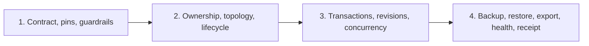

# M01 - Knowledge Kernel

This four-phase plan implements Milestone 1 of the
[Graph-Native Managed Repository Factory](../../docs/research/graph-native-managed-repository-factory.md)
research: one supervised embedded quad store with kernel-level graph topology,
transactions, backup/restore, export, and health checks as the sole durable
store.

## Store Boundary

The `TripleStore` quad dataset is the only application-owned durable store.
The raw store handle has exactly one supervised owner and never reaches web,
integration, runtime, or domain modules. This milestone admits no
factory-domain ontology, commands, or product semantics; those belong to
later milestones. External systems (Git providers, secret stores) are
observed boundaries, not alternate persistence.

## Dependency Graph

## Phase Plans

1. [Phase 1 - Contract, Dependency Pins, And Guardrails](./phase-01-contract-dependency-pins-and-guardrails.md)
2. [Phase 2 - Store Ownership, Topology, And Lifecycle](./phase-02-store-ownership-topology-and-lifecycle.md)
3. [Phase 3 - Transactions, Revisions, And Concurrency](./phase-03-transactions-revisions-and-concurrency.md)
4. [Phase 4 - Backup, Restore, Export, Health, And Receipt](./phase-04-backup-restore-export-health-and-receipt.md)

## Execution Rules

- Only Phase 1 is initially authorized; each later phase requires the
  preceding phase's merged receipt.
- Each section is one reviewable commit; each phase is at most one
  implementation PR.
- Dependency pins, limits, and guardrail semantics are owned by the accepted
  ADRs and architecture contracts and may not be weakened here.
- This plan is greenfield and unchecked. The prior-art plans and receipts
  above prove an equivalent kernel exists; this plan re-derives it
  independently and does not inherit their check state.

## Completion Conditions

The milestone closes only when one supervised quad dataset survives restart,
supports atomic multi-graph transactions with monotonic revisions, backs up
and restores with named-graph identity preserved, exports canonical
N-Quads/TriG, reports bounded health and integrity, fails closed when
unavailable, and architecture scans prove no second persistence path or
store-handle leakage anywhere in the application.
