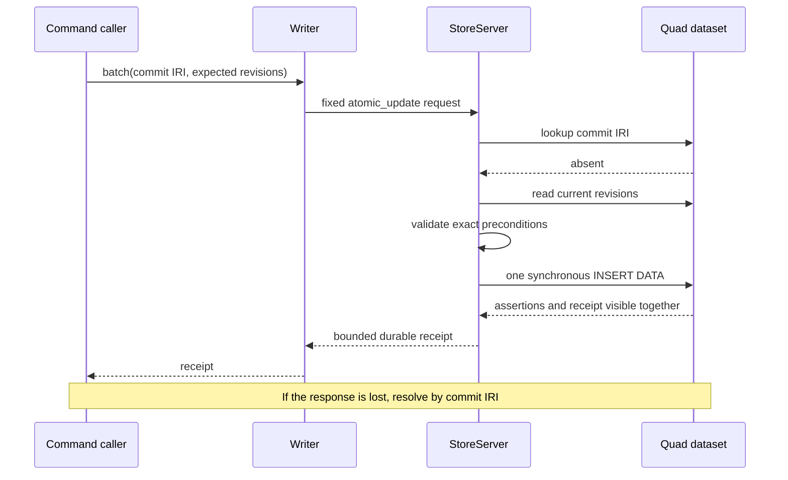

# Atomic Writes And Revisions

## Commit Boundary

`JidoCode.Knowledge.Writer` is the serialized ingress for graph mutation.
Callers first build a transient `WriteBatch` containing:

- a caller-retained commit IRI and canonical SHA-256 batch digest;
- ground RDF additions grouped by named graph;
- an exact expected dataset revision and exact revisions for every target graph;
- a represented removal set governed by explicit maintenance policy; and
- bounded opaque operation metadata that is neither logged nor persisted.

The batch and receipt structs are execution projections, not persisted object
models. Their authoritative meaning is represented as RDF in the dataset.
Application graphs cannot target the default graph or the reserved system
graph, and blank nodes are rejected so replay identity remains stable.

An ordinary accepted command compiles to exactly one ground `INSERT DATA`
operation. That update contains all application assertions plus its commit
receipt, dataset revision, system-graph revision, and affected graph revisions.
The pinned TripleStore backend applies that operation as one synchronous
RocksDB write batch. The 10,000-quad backend limit includes both assertions and
receipt metadata.

There is no staging graph or separate commit marker. Validation and revision
checks run before the update. Backend failure leaves the one atomic batch
absent or present in full. Because no staged state exists, boot recovery has no
partial change set to expose or discard.

## Graph-Native Revision Model

Revisions are immutable graph facts rather than a mutable counter row:

- each commit records its prior and new dataset revision;
- the dataset receives the new monotonic revision value;
- each target graph receives its new monotonic graph revision;
- a graph-change resource records that graph's prior and new revision; and
- the system graph receives its own new revision because the receipt is data.

The current revision is the greatest asserted revision for that resource.
`StoreServer` caches the verified dataset and system revisions while open, but
reconstructs them from the graph on every reopen. A target graph without
revision metadata is revision zero only if the physical graph is empty;
unmanaged non-empty graphs fail as corruption.

Every commit requires an exact global dataset revision and exact revisions for
all target graphs. A mismatch returns `stale_precondition` with a bounded
`RevisionReceipt` containing the current tokens. Two writers racing the same
expectation therefore have exactly one winner even when their target graphs
differ. The global revision supplies total commit order; graph revisions
supply precise cache and concurrency tokens.

Revisions are non-negative integers capped at
`9,223,372,036,854,775,807`. Reaching the cap fails closed and requires an
explicit migration. Wall-clock time, process-local counters, PubSub order, and
telemetry sequence are never authoritative revisions.

Restore preserves lineage and cannot reduce its revisions. Migration is a
normal revisioned commit. A clone must mint a new lineage; it may establish a
new revision history only under that distinct identity. These constraints keep
revision comparisons meaningful within one dataset lineage.

## Receipt And Recovery

The immutable receipt in the system graph contains the commit IRI, batch
digest, prior/new dataset revisions, prior/new affected graph revisions,
addition/removal counts, committed status, and synchronous durability result.
It contains no graph contents or backend handles.

Before a new update, the adapter looks up the commit IRI:

- the same digest returns the existing receipt without changing revisions;
- a different digest returns a commit-identity conflict; and
- a partial or malformed receipt is corruption, never absence.

After update dispatch, a timeout or lost response is an unknown client outcome.
The client must query `Writer.lookup/3` with the retained commit IRI. It must
not create a new commit identity or infer absence from the timeout. The adapter
also performs this receipt lookup when the backend returns an uncertain result.

## Deadlines And Deletions

Writer queue time counts against the operation deadline. Work whose deadline
expires in the queue is rejected before it reaches `StoreServer`. A shorter
caller timeout does not cancel an already dispatched authoritative operation;
the commit IRI is the recovery key.

Ordinary semantic writes are append-only under ADR 0002. `WriteBatch` can
represent removals only with explicit maintenance policy, but the ordinary
atomic path rejects them. Restore, repair, migration, and later semantic
retraction use dedicated reviewed policies; they cannot smuggle arbitrary
SPARQL or a second update through `Writer`.
