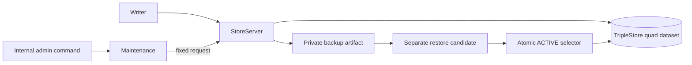

# Backup, Restore, Export, And Integrity

This document defines the Phase 2 recovery contract for the authoritative
embedded quad store. The RDF dataset remains the only source of truth. Backup
manifests and the active-dataset selector are operational filesystem metadata;
they locate and verify graph-store artifacts but do not duplicate domain facts
or answer product queries.

## Operation Boundary

`JidoCode.Knowledge.Maintenance` is the only supervised caller authorized for
backup, export, integrity, restore, and retention inspection. It serializes
maintenance commands and submits a fixed operation catalog to `StoreServer`.
No operation accepts an arbitrary destination, source path, SPARQL statement,
or raw store handle.

Checkpoint and export operations execute inside `StoreServer`. Its mailbox is
therefore the consistency boundary: no `Writer` mutation can interleave with
artifact creation. Readiness is `backing_up` for that exclusive window, and the
artifact receipt reports `exclusive_store_owner` as its consistency mode.

## Artifact Contract

Artifacts are created only beneath the configured backup root with a random,
collision-resistant identifier. Creation never reuses an existing directory.
Directories use mode `0700`; files use mode `0600`.

A checkpoint artifact contains a RocksDB checkpoint and `manifest.json`. Before
the checkpoint, the dictionary sequence counter and RocksDB memtables are
synchronously flushed. The manifest records:

- format and artifact kind;
- creation time and exclusive consistency mode;
- dataset and system-graph revisions;
- store schema, backend schema, and dataset lineage;
- named-graph and quad counts; and
- deterministic SHA-256, byte size, and file count for the payload.

N-Quads and TriG exports use the same manifest and consistency boundary. They
serialize a complete `RDF.Dataset`, preserving named graphs, RDF datatypes,
language tags, and substrate metadata. Retention support only lists candidate
artifact identifiers. It never deletes an artifact.

## Restore Protocol

Restore requires an exact artifact identifier repeated as confirmation. The
identifier resolves only beneath the trusted backup root. The workflow is:

1. Enter maintenance with reason `restore`, then transition to `recovering`.
2. Decode the manifest and verify identity, schema/backend compatibility,
   checksum, byte size, and file count.
3. Copy the checkpoint into a private, separately named candidate directory.
4. Close the active store handle and remove its process monitors.
5. Open the candidate explicitly as a quad store; verify metadata, lineage,
   revisions, graph counts, dictionary/index readability, receipt closure, and
   graph metadata.
6. Append a graph-native restore activity in the system graph. This advances
   dataset and system-graph revisions once without rewriting asserted domain
   graphs.
7. Close the candidate and atomically rename a private `ACTIVE` selector file
   to select it. Reopen the selected path and rerun metadata and integrity
   checks.
8. Return to `ready` only after the selected store passes all checks.

The prior selected directory is not modified or removed. If candidate opening,
activation, reopening, or post-restore verification fails, the selector is
returned to the prior dataset and that dataset is reopened and checked before
maintenance clears. If rollback itself cannot reopen a verified store,
readiness fails closed as `unavailable`.

## Integrity Contract

`JidoCode.Knowledge.Integrity` is read-only and returns a bounded
`IntegrityReport`; it has no repair function. It checks:

- quad backend identity and graph-index readability;
- dictionary counter readability;
- store/backend schema, lineage, dataset revision, and system revision;
- an empty default graph;
- revision metadata for every named graph;
- bounded committed-receipt discovery and complete receipt decoding.

Issues contain only a stable code, severity, bounded graph or commit reference,
and a fixed remediation atom. They never include triples, query text, paths, or
credentials. Repair remains a separate future command requiring explicit
maintenance mode and confirmation.

## Ownership Constraints

Raw `:rocksdb` checkpoint access is confined to
`JidoCode.Knowledge.Backend.Checkpoint`. Filesystem writes require the checked
`graph_backup` role in the knowledge namespace. Persistent RDF mutation remains
owned by `AtomicCommit` and bootstrap `Metadata`, with `RestoreLog` as the sole
fixed maintenance exception for recording restore provenance.
