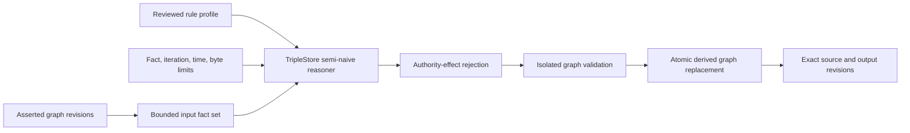

# Bounded Reasoning And Cross-Graph Learning

Phase 9 reasoning enriches the graph without changing the authority of asserted
facts, decisions, evidence, or adopted knowledge. TripleStore evaluates a
reviewed rule profile in memory, and the normal semantic command pipeline is the
only path that can publish the complete result to a replaceable derived graph.

## Reasoning Boundary

`Knowledge.materialize_reasoning/2` accepts a closed profile, an explicit set of
RDF input facts, exact source graph revisions, and hard resource limits. Input
facts are transient. The persisted output contains only inferred statements,
derivation metadata, a reasoning activity, and its validation report.

The closed profiles are:

| Profile | Intended closure |
| --- | --- |
| `class_hierarchy` | RDFS subclass closure and instance classification |
| `capability_hierarchy` | Capability subclass closure without grants |
| `repository_cohort` | Reviewed class, domain, and range classification |
| `dependency_transitivity` | Explicitly declared transitive dependencies |
| `knowledge_applicability` | Reviewed class, domain, and range applicability |
| `owl2rl_safe` | A bounded OWL 2 RL subset excluding equality and authority-expanding rules |

Each request supplies maximum input and derived fact counts, iterations,
elapsed milliseconds, and encoded bytes. The service also enforces global
ceilings, rejects blank nodes and malformed triples, limits source graph count
through the derivation request, runs in a killable task, and rejects results
that exceed the post-fixpoint fact or memory limits. Recursive or explosive
ontologies therefore fail closed instead of publishing a partial closure.

The output graph records ontology, shape, query, profile, and rule versions;
source graph revisions; input, derived, iteration, duration, fact, and byte
limits; the accountable actor; and a complete validation report. Publication
rechecks source revisions and expected prior derivation after materialization,
validates the complete replacement in isolation, and commits it atomically.
Derived graph freshness is computed against current source revisions. Existing
derived lifecycle commands can explicitly mark stale output, publish a new
revision linked to its predecessor, or invalidate disposable output.

## Authority Separation

Reasoning output has no command, acceptance, or adoption authority. Before
publication, the service rejects any inference that would:

- grant a capability or create an authorization/delegation;
- acquire a lease or create command/control transitions;
- accept, reject, or waive evidence or claims;
- satisfy a goal; or
- create or transition an accepted knowledge assertion.

The safe profile excludes OWL rules whose equality or functional-property
semantics could broaden identity or authority. Inferred classifications carry
their graph, reasoning activity, rule revision, source revisions, current
state, and `authority?: false` when projected into later reconciliation.

## Cross-Repository Insights

The `1.7.0` reviewed catalog contains bounded lenses for shared dependencies,
repeated findings and failures, policy outcomes, reusable verification methods,
related source symbols, and applicable lessons. Raw rows from these fleet
queries are not available through `Knowledge.query/6`.
`Knowledge.discover_cross_graph_insights/7` executes the reviewed query and
immediately applies the visibility boundary before returning anything.

The projection requires:

- an exact query and derived/source revision receipt;
- the target repository and evaluated time;
- an authorization/visibility receipt identity;
- an authorized repository set and its visible subset; and
- a minimum visible source threshold.

Rows from non-visible repositories are removed before grouping. A candidate
below the threshold is omitted entirely, so hidden repositories do not leak
through labels, counts, confidence, or explanations. Every returned insight is
a deterministic `proposed` value with visible source repositories,
evidence/classification references, rule and query versions, confidence, and
limitations. It explicitly requires independent evidence and target policy
authorization and cannot accept or adopt itself.

## Learning Feedback

`Knowledge.build_learning_inputs/3` combines a fresh knowledge retrieval with a
committed reasoning result. It requires the exact memory and derived revisions,
current non-contradicted assertions, authority-free inferred classifications,
and a bounded execution budget. The transient reconciliation package contains
accepted knowledge, derived classifications, provenance, contradiction state,
and all source revisions. The execution package contains only selected
knowledge, selection explanations, omissions, and byte/token/item budgets. It
never persists prompt context.

Both packages carry an invalidation token over memory, derived, source, query,
and rule versions. Any revision change makes the package stale and requires a
new query, materialization, reconciliation, eligibility evaluation, and
execution context.

Outcome learning is represented as a new measurement that references prior and
independent outcome evidence plus bounded numeric/boolean metrics. The
measurement is transient until a normal observation/evidence command persists
it in a graph. It reports `confidence_mutated?: false` and
`adoption_mutated?: false`; improvement never silently edits an existing
knowledge assertion.
