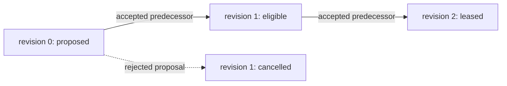

# Claims, Time, Transitions, And Inference

## Representation Boundary

`JidoCode.Knowledge.Claims` selects between two RDF representations. A direct
statement is admitted only in a closed immutable graph when the graph's one
provenance envelope is sufficient and the statement has no consequence,
dispute, confidence, validity, support, contradiction, or supersession needs.
Every other proposition is a first-class `Claim` with RDF subject, predicate,
and object plus source activity, graph scope, epistemic state, and recorded
time.

The supported epistemic concepts are observed, asserted, inferred, proposed,
accepted, rejected, contradicted, superseded, and invalidated. Confidence value
and band are assessments, never dispositions. Accepted and rejected claims
require an explicit `Decision` relationship. Contradicting claims remain in the
graph and are connected with `contradicts`; a correction adds a new claim and
`supersedes` relationship instead of deleting history.

The maps returned by claim and transition functions are transient command and
query projections. They are not persisted records. RDF resources and
relationships in registered named graphs remain authoritative.

## Two Time Axes

Transaction time and valid time answer different questions:

| Time | Predicate | Meaning |
| --- | --- | --- |
| committed knowledge | `recordedAt` | when JidoCode admitted the assertion |
| source generation | `prov:generatedAtTime` | when the source activity generated it |
| external observation | `sourceObservedAt` | when the source world was observed |
| validity start/end | `validFrom`, `validTo` | half-open external-world interval |
| invalidation | `prov:invalidatedAtTime` | when the assertion stopped being usable |

Commands must receive these values from their caller; semantic code never
reads a clock. `Temporal.query/2` is bounded to 10,000 input projections and
1,000 results and classifies a claim as valid, recorded-but-not-valid,
superseded, or unknown for an explicit valid-time point and transaction-time
cutoff.

Delayed observations keep their earlier `sourceObservedAt` and later
`recordedAt`. Retroactive corrections retain the old claim, add the corrected
valid interval, and link supersession. Force-push observations retain both Git
object identities and invalidate or supersede only the affected claim. A
policy known now but effective later is recorded now with a future `validFrom`.

## Causal Transition Chains

`JidoCode.Knowledge.Transitions` compiles transition proposals with subject,
prior and next state, expected predecessor, subject revision, optional fencing
token, actor, cause, bounded reason, generated time, and recorded time. A
separate `Decision` accepts or rejects each proposal.

An accepted chain has exactly one accepted genesis at revision zero and one
accepted successor at each contiguous revision. Every successor references the
accepted transition at the prior revision, has the same subject, and repeats
that predecessor's next state as its prior state. Rejected and superseded
concurrent proposals remain queryable history. The current state is the
endpoint of this unique accepted chain.

Missing predecessors, illegal state edges, revision gaps or regression,
cross-subject links, and duplicate accepted revisions fail closed. Generated
times can be equal and never select a winner; predecessor and revision establish
causal order.

## Derived Authority

Every derived graph records its rule-set resource, ontology release, generation
activity, invalidation state, and one or more first-class
`GraphRevisionReference` resources. Each reference links to a source graph IRI
and a typed revision number; no encoded tuple or foreign-key literal is used.

`JidoCode.Knowledge.DerivedAuthority` classifies a graph as current, stale,
incompatible, or invalidated. A source revision mismatch is stale and produces
a plan for a new derived graph revision. An ontology or rule-set mismatch is
incompatible and requires an explicit compatibility or migration decision.
Derived graphs are disposable and can be rebuilt from asserted sources.

Inferred statements are advisory by default. They cannot satisfy a goal,
authorize a command, or accept a claim unless an explicit governed decision
identifies the policy, authority, decision, and consumed derived graph. The
decision is asserted authority; the derived graph never grants authority to
itself.
