# Current Coding Factory Architecture, Agent Flows, And Gap Analysis

## Snapshot And Conclusion

This document describes the accepted and implemented JidoCode architecture as
of 2026-08-29, using `main` commit
`2d1898aa569bbee0144199420322255c1f7ac006` as the evidence baseline. It covers
the binding ADRs, normative architecture specifications, implementation plans,
merged phase receipts, release manifests, OTP supervision tree, product
surfaces, and implementation modules. Unmerged work in another worktree is
reported only as work in progress and receives no architectural or release
credit.

The shortest accurate description of the current system is:

> JidoCode is a graph-native, single-authority coding-factory kernel with an
> accepted native single-agent runtime, strong semantic control/evidence
> boundaries, governed memory, and a deterministic opt-in repository wiki. It
> is not yet a fully composed, deployed, multi-project coding factory: several
> production adapters and the default end-to-end orchestration wiring remain
> absent, the Codex delegated profile is still disabled pending Phase 6, and
> managed-fleet delegated execution has no implementation plan.

This distinction matters. The repository has extensive executable contracts
and clean-checkout evidence, not merely design documents. At the same time,
passing a component conformance suite does not prove that a real microVM,
credential helper, external verifier, Git provider publication path, alerting
stack, or continuously running factory coordinator is deployed.

### Evidence snapshot

| Measure | Current value | Meaning |
| --- | ---: | --- |
| Binding ADRs | 7 | All seven decisions under `docs/adr` are accepted architecture |
| Planned phase gates | 43 | Across the six implementation-plan families |
| Accepted merged phase gates | 42 | All except delegated coding agent Phase 6 |
| Markdown documents | 181 | ADR, architecture, research, plan, guide, and operations material |
| Elixir source files under `lib` | 729 | Product, knowledge, factory, runtime, integration, web, and Mix-task code |
| Test files | 272 | Unit, integration, adversarial, real-store, product, and release tests |
| Registered graph families | 17 | Closed graph topology at registry revision `2.5.0` |
| Semantic commands | 117 | Latest cumulative registry at protocol `2.11.0` |
| Reviewed queries | 158 | Latest cumulative query catalog at protocol `2.11.0` |
| Application-owned durable stores | 1 | Embedded TripleStore quad dataset |
| Release-audit hidden-authority findings | 0 | At this snapshot's release audit |

`mix jido_code.release verify` and `mix jido_code.release audit` both passed
during this analysis. The verified release contract is application `0.1.0`,
ontology and shapes `1.5.0`, graph registry `2.5.0`, TripleStore schema `1`,
backend schema `2`, Jido `2.3.2`, managed-coding contract `8.0.0`, and
repository-wiki contract `1.0.0`.

## How To Read Status In This Repository

JidoCode uses several status layers that must not be collapsed into one word
such as “done.”

| Layer | Question it answers | Strongest evidence |
| --- | --- | --- |
| Decision accepted | Is this architecture binding? | Accepted ADR |
| Contract implemented | Does executable code enforce the boundary? | Source, conformance tests, and architecture checks |
| Phase accepted | Did clean-checkout CI pass and did the implementation merge? | Receipt pinned to the full merge commit |
| Release enabled | Is an exact profile or feature selectable in the release manifest? | Signed/verified release contract and graph state |
| Default wired | Will the checked-in application start and compose the feature without injected test callbacks? | `Application` supervision and runtime configuration |
| Deployment qualified | Have the real provider, sandbox, credentials, network, storage, and operational environment been proven? | Environment-specific qualification and operating evidence |

The phase receipt is authoritative when plan frontmatter or narrative has
drifted. A merged receipt proves the accepted candidate at its pinned commit;
it does not silently qualify a different adapter, provider, deployment, model,
repository, or later source revision.

The following labels are used below:

- **Live** — default-wired and reachable in the checked-in application.
- **Implemented** — real source exists and has accepted evidence, but requires
  explicit composition or an external adapter.
- **Enabled** — an exact release offering is selectable when its graph policy
  permits it.
- **Gated** — implemented code is intentionally unavailable until a later gate.
- **Contract-only** — a port/control plane is implemented, but no production
  adapter or deployment evidence exists.
- **Research-only** — a recommendation has no accepted ADR and implementation
  plan.

## Governing Decisions

The seven ADRs form one coherent authority model rather than seven independent
features.

| ADR | Binding decision | Architectural consequence today |
| --- | --- | --- |
| [0001: Graph-only source of truth](../adr/0001-graph-only-source-of-truth.md) | One embedded TripleStore quad dataset is the sole application-owned durable authority | No Ecto/Ash/Mnesia/DETS/JSON snapshot/durable queue may compete with graph state; Git, provider systems, secrets, worktrees, and artifacts retain their explicitly external roles |
| [0002: TripleStore backend contract](../adr/0002-triple-store-backend-contract.md) | One exact TripleStore revision, one owner, synchronous atomic writes, reviewed reads, and verified backup/restore | Only `Knowledge` holds the store handle; commands, receipts, and revisions commit together; there is no fallback database |
| [0003: First-class delegated coding agents](../adr/0003-first-class-delegated-coding-agents.md) | `host_controlled` and `delegated_cli` are distinct exact runtime classes behind one outer factory lifecycle | A profile, never user/model/repository text, selects the runtime tuple; both must produce a candidate for independent verification and governed disposition |
| [0004: Delegated-agent credentials and isolation](../adr/0004-delegated-agent-credentials-and-isolation.md) | Developer-local and managed-fleet credentials have different trust contracts | Secret bytes remain outside graph, prompt, argv, logs, and runtime state; managed fleet requires workload exchange or an attaching proxy and real isolation proof |
| [0005: Repository wikis as compiled knowledge projections](../adr/0005-repository-wikis-as-compiled-knowledge-projections.md) | Every repository may have immutable, separately activated wiki editions derived from exact sources | Git and accepted graph facts remain authoritative; the wiki is advisory, editioned, citation-first, and never a mutable second knowledge base |
| [0006: Per-repository wiki maintainer agents](../adr/0006-per-repository-wiki-maintainer-agents.md) | A stable logical maintainer may be represented by disposable per-repository processes | At most one current-source lease/fence exists per repository; candidate previews remain separate and may run concurrently |
| [0007: Repository wiki enrollment and cost governance](../adr/0007-repository-wiki-enrollment-and-cost-governance.md) | Wiki creation is opt-in and model use requires reservation and terminal cost accounting | Missing configuration means off; deterministic V1 makes model calls/tokens structurally zero; future synthesis cannot call a model before worst-case reservation |

The decisions produce four non-negotiable separations:

1. observation is not authority;
2. execution completion is not verification;
3. verification is not acceptance; and
4. candidate acceptance is not publication or merge authority.

## Architectural Shape

### System and authority context

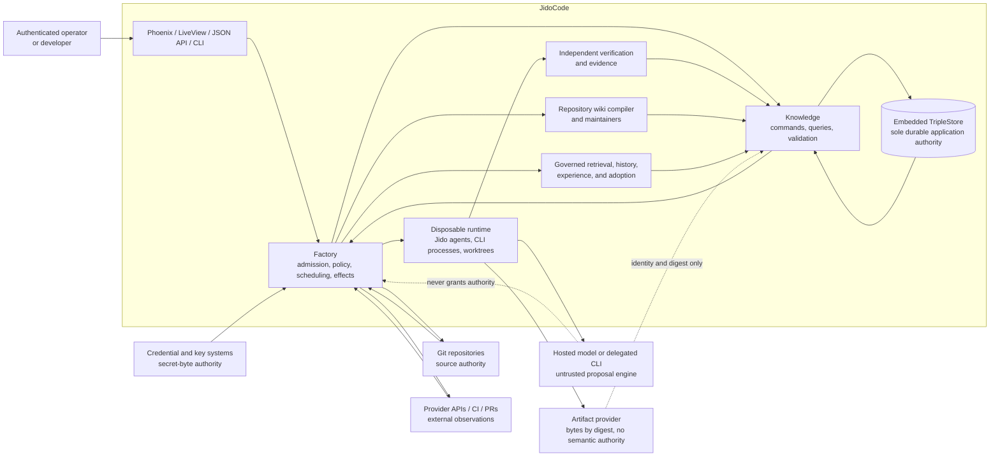

### Logical planes and module ownership

| Plane | Primary namespaces | Responsibility | Durable state |
| --- | --- | --- | --- |
| Knowledge | `JidoCode.Knowledge.*` | Store ownership, ontology, graph registry, commands, queries, validation, revisions, reasoning, memory, wiki graph contracts | TripleStore only |
| Control | `Knowledge.Control.*`, `Factory.Reconciler`, `Factory.Scheduler` | Desired outcomes, policies, goals, plans, tasks, eligibility, leases, reconciliation | Graph facts; coordinators are disposable |
| Execution | `Factory.Execution*`, `Factory.ManagedCoding.*`, `Runtime.*` | Attempt admission, runtime loops, tool/model dispatch, cancellation, candidate production | Graph lifecycle; process/workspace state is disposable |
| Evidence and decision | `Knowledge.Evidence.*`, `Knowledge.Decision.*`, `Factory.Verification.*` | Independent checks, claims, sufficiency, dispositions, follow-ups | Evidence/control graphs |
| Integration | `JidoCode.Integrations.*` | Git, provider HTTP, ReqLLM, credentials, workspaces, artifacts, verifier adapters | External systems or disposable filesystem only |
| Projection | `JidoCode.Product.*` | Scope-safe JSON values, workbench, agent catalog, wiki browsing/search | None; rebuilt from reviewed queries |
| Presentation | `JidoCodeWeb.*`, `Mix.Tasks.JidoCode.*` | Browser, API, operator session, local developer CLI, operations commands | Signed session only; no product authority |

The architecture checker enforces dependency direction and rejects a second
persistence stack, direct store use outside `Knowledge`, raw SPARQL outside the
reviewed boundary, unregistered filesystem writes, reverse plane imports,
browser domain persistence, and multiple modules in one file.

### Default OTP topology

The checked-in application actually starts the following tree:

```mermaid
flowchart TD
  App["JidoCode.Application"]
  App --> Telemetry["Web telemetry"]
  App --> TwMerge["TwMerge cache"]
  App --> DNS["DNSCluster"]
  App --> KS["Knowledge.Supervisor"]
  App --> ModelTasks["Model Stream Task.Supervisor"]
  App --> RS["Runtime.Supervisor"]
  App --> PubSub["Phoenix.PubSub"]
  App --> Endpoint["Phoenix Endpoint"]

  KS --> Ready["Readiness"]
  KS --> Store["StoreServer — sole store handle"]
  KS --> Query["QueryRunner"]
  KS --> Writer["Writer — serialized command ingress"]
  KS --> Maintenance["Maintenance / backup / restore"]

  RS --> Jido["Ephemeral Jido ETS instance"]
  RS --> HarnessRuns["JidoHarness RunRegistry"]
  RS --> AttemptRegistry["Attempt Registry"]
  RS --> AttemptSup["Attempt DynamicSupervisor"]
  RS --> WikiRegistry["Wiki Maintainer Registry"]
  RS --> WikiSup["Wiki Maintainer DynamicSupervisor"]
  RS --> WikiCoordinator["Wiki Coordinator"]
  RS --> WikiScheduler["Wiki Scheduler"]
  RS --> WikiRecovery["Wiki Recovery Coordinator"]
```

What is not in this default tree is as important as what is in it:

- the general `Factory.Reconciler` and `Factory.Scheduler`;
- `Factory.ManagedCoding.Service` and its graph ledger/runtime composition;
- `Factory.SandboxSupervisor`, credential and egress brokers, and effect
  journal;
- repository observation subscriptions or a provider webhook/polling service;
- a production verifier or pull-request publisher; and
- a service that supplies the agent-catalog, coding-submission, and
  managed-attempt graph callbacks used by the product routes.

Those modules can be explicitly started or injected, and many are exercised in
integration tests. They are not a continuously operating factory in the
checked-in default deployment.

## Durable Knowledge Topology

### Graph families

The graph registry is closed. Unknown graph families or malformed identities
fail before a query or mutation.

| Scope | Graph families | Principal contents |
| --- | --- | --- |
| Global/factory | `ontology`, `factory_catalog`, `factory_policy`, `security_audit` | Schema, repository/profile catalogs, policy, authority, audit |
| Repository observations and control | `observation_batch`, `source_revision`, `repository_control` | Provider claims, exact source analysis, goals/plans/tasks/leases/current selections |
| Execution and evidence | `run_attempt`, `run_event_segment`, `evidence` | Attempt lifecycle, segmented event accounting, verification, claims, decisions |
| Repository memory | `memory`, `experience`, `content_lifecycle`, `episode_content` | Accepted assertions, cases/procedures, encrypted-content lifecycle and chunks |
| Repository documentation | `repository_wiki` | One immutable graph per repository wiki edition |
| Cross-repository evaluation | `memory_dataset` | Payload-free governed dataset manifests, rows, lineage, permits, and lifecycle |
| Rebuildable products | `derived` | Inference and read acceleration with explicit non-authoritative status |

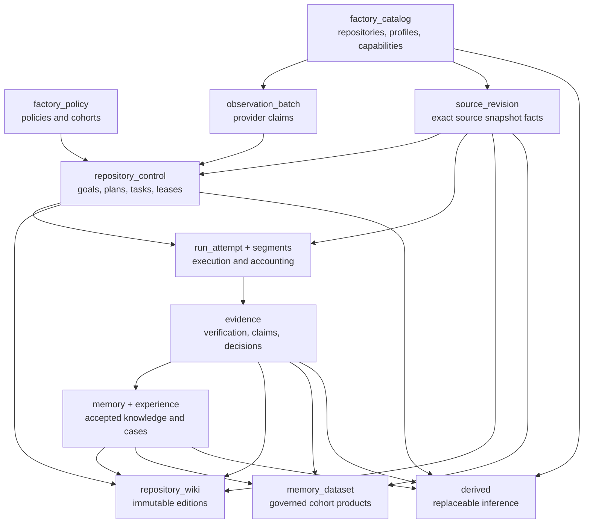

### Write, read, and recovery semantics

- `StoreServer` alone owns the TripleStore handle.
- `Writer` accepts a versioned semantic `CommandEnvelope`, rechecks current
  authority and exact revisions, runs command guards and SHACL validation, and
  commits domain facts, revision facts, provenance, and audit receipt in one
  synchronous ground insert.
- A deterministic command identity plus material digest makes exact replay
  idempotent. Divergent reuse conflicts.
- A timeout is resolved by querying the receipt; code must not blindly repeat
  a possibly completed effect.
- `QueryRunner` accepts only a reviewed catalog query with typed parameters and
  an `AuthorityContext`. Results retain dataset/graph revisions, freshness,
  completeness, truncation, warnings, and provenance.
- PubSub, caches, queues, and runtime registries are hints. A restart re-queries
  graph state.
- Backup uses a store-owner checkpoint and manifest; restore validates a
  private candidate dataset and atomically changes the active dataset selector.
  It never opens a fallback application store.

### Authority matrix

| Thing | Authority it legitimately owns | What it may not decide |
| --- | --- | --- |
| Git object database | Exact source/tree history | JidoCode task state, acceptance, policy, or memory |
| Provider API / CI | Externally observed repository, issue, PR, check, and branch state | Controlled work or truth merely because a provider reported it |
| TripleStore | JidoCode's durable semantic state and provenance | Secret bytes or external-system facts not yet observed |
| Secret/key provider | Credential/key bytes and revocation | Task eligibility, model selection, or graph facts |
| Worktree/sandbox | Temporary filesystem effects | Durable completion, acceptance, or source truth |
| Model or delegated CLI | Proposals, bounded output, and candidate workspace effects | Tools, policy, verification, publication, merge, or knowledge adoption |
| Artifact store | Bytes retrievable by identity/digest | Semantic acceptance or availability authority |
| Independent verifier | Evidence about an exact candidate | Final disposition, publication, or goal satisfaction |
| Decision actor | Claim disposition and allowed control transitions | Direct external effects inside a decision command |
| Human/provider protection | Draft publication and merge | Reinterpretation of prior graph evidence |

## Component Readiness Matrix

| Component | Source implementation | Accepted/release posture | Default operational posture |
| --- | --- | --- | --- |
| TripleStore knowledge substrate | Store owner, writer, query runner, validation, backup/restore, release audit | Accepted through graph phases G0-G9; enabled | **Live** in dev/prod; disabled in ordinary tests unless explicitly started |
| Ontology and semantic protocols | Ontology `1.5.0`, graph registry `2.5.0`, command/query catalogs through `2.11.0` | Accepted and release-verified | **Live** |
| Phoenix workbench and operator auth | LiveView, API controllers, single token-backed operator scope | Product base accepted; coding surfaces added in DCG5 | **Live**, but coding workflow loaders are not configured by default |
| Repository enrollment | `Product.CommandGateway` to graph command | Accepted | **Live** browser action |
| Provider observation and Git analysis | Req GitHub adapter, Git worktree adapter, Elixir AST analyzer | Accepted component boundary | **Implemented**, not continuously supervised or default-composed |
| Goals, plans, eligibility, leases | Semantic control modules plus reconciler/scheduler | Accepted G6 | **Implemented**; general reconciler/scheduler are not default-supervised |
| Host-controlled coding agent | One `Jido.Agent`, strategy, directives, ReqLLM/tool/context gateways | Native single-agent profile accepted as production profile | **Enabled by release**, but no default managed service/ledger/model composition makes the product path runnable end to end |
| Delegated Codex agent | Exact CLI resolver, protected stdin protocol, consent, local credential boundary, workspace controls, checkpoints, candidate capture, fresh verifier | DCG1-DCG5 accepted; `codex_dga1` remains disabled | **Gated** pending DCG6 qualification |
| Sandbox and security brokers | Isolation tiers, reference monitor, credential/egress/approval contracts | Harness HG1-HG8 accepted as control planes | Several **contract-only** production seams; no Firecracker/gVisor fleet adapter is implemented in `lib` |
| Candidate verification and disposition | Graph evidence/decision contracts, delegated fresh verifier, managed workflow coordinators | Accepted | Mixed: delegated verifier is concrete; generic production verifier, ledgers, and post-change verifier are not default-composed |
| Publication | Human-authorized request/coordinator contracts | Draft publication restricted to a pilot envelope; automatic publication/merge disabled | **Contract-only**; no production publication provider exists in `lib` |
| Governed memory | Semantic history, segmented accounting, retrieval, cases/procedures, encrypted content, datasets | MG1-MG7 accepted | **Implemented**; broad capture/export/training disabled and production key/sink composition absent |
| Repository wiki | Deterministic compiler, Mix/lock analysis, guide renderer, edition graph, product projection, cost records | RW1-RW5 accepted; manual and automatic deterministic offerings enabled, default off | UI/read path and coordinators are **live**; compilation ownership defaults to unavailable injected gateways, so no autonomous end-to-end maintainer loop is wired |
| Optional extensions | MCP, remote-agent, multi-agent, autonomous-merge control planes | HG8 accepted control plane | **Disabled**; autonomous merge is explicitly blocked |

## Delivery And Release Status

### Plan families

| Plan family | Accepted phases | Last accepted merged candidate | Current posture |
| --- | ---: | --- | --- |
| [Graph-native managed repository factory](../planning/graph-native-managed-repository-factory/README.md) | 10 / 10 | `6c15f152abab457a93273a5a4863dca0e2fb7bd5` | Graph substrate, control, execution/evidence contracts, product base accepted |
| [Secure and effective agent harness](../planning/secure-effective-agent-harness/README.md) | 8 / 8 | `35275337031c5c085c4060801fe67079ec00be18` | Base harness complete; optional extensions remain disabled |
| [Total agent memory](../planning/total-agent-memory/README.md) | 7 / 7 | `fb4716137c5bf5e6b6a8468cee171e32f83b7266` | Semantic memory contract complete; launch/deployment products still separately gated |
| [Managed coding agent runtime](../planning/managed-coding-agent-runtime/README.md) | 7 / 7 | `00c10cf0e7bd4705773a3fd23bcbcbe1af390580` | Native single-agent profile accepted; specialists and AgentOS rejected |
| [Repository wikis](../planning/repository-wikis/README.md) | 5 / 5 | `574808c1ab8f5ae002c0e7e77af95b53f611b72a` | Deterministic V1 accepted, opt-in, synthesis disabled |
| [Delegated coding agents](../planning/delegated-coding-agents/README.md) | 5 / 6 | `a006652de7788950acdbaf4f07d19eb2438485fa` | Product mechanics accepted; exact Codex profile still unqualified and disabled |

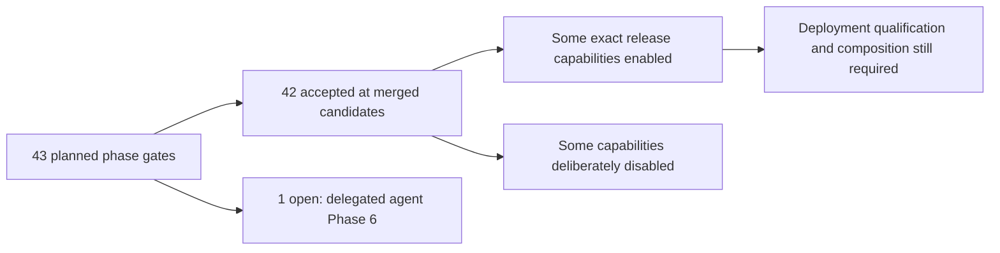

An active separate worktree was detected for branch
`agent/delegated-coding-agents-phase-06-impl` during this analysis. That is
correct parallel-session behavior: the branch can progress without mutating
this `main` worktree, but until clean-checkout CI passes, it merges, and a
Phase 6 receipt pins the merge commit, `main` must continue to report DCG6 as
open and `codex_dga1` as disabled.

### Runtime profiles

| Profile/runtime | Loop owner | Current status | Scope and limits |
| --- | --- | --- | --- |
| Native `single_agent` / `host_controlled` | JidoCode `Jido.Agent` strategy | Accepted production profile | One agent; model/tool/context effects only through Factory gateways; human publication/merge |
| `codex_dga1` / `delegated_cli` | Codex CLI inner loop, JidoCode outer controller | Disabled pending DCG6 | Developer-local, foreground, `jido_code` only, exact Codex CLI `0.144.6`, model `gpt-5.3-codex`, two reconstructed turns, no publication/merge |
| Pi deny/read profiles | Delegated CLI | Test/read compatibility only | Do not satisfy the coding-agent milestone |
| Specialist `Jido.Pod` | Multiple Jido agents | Rejected for production | Evaluation code retained; measured gain was insufficient |
| AgentOS | External agent OS | Rejected/absent | Would introduce unnecessary persistence/authority complexity |
| MCP, remote agents, selective multi-agent | Extension-specific | Disabled | Control contracts exist, but no deployment registration or qualified task class |
| Autonomous merge | None | Blocked | Requires a separate ADR, release gate, shadow/PR evidence, rollback proof, and a new policy revision |

## Agent Flow 1: Repository Enrollment And Observation

Repository enrollment and repository observation are intentionally separate.

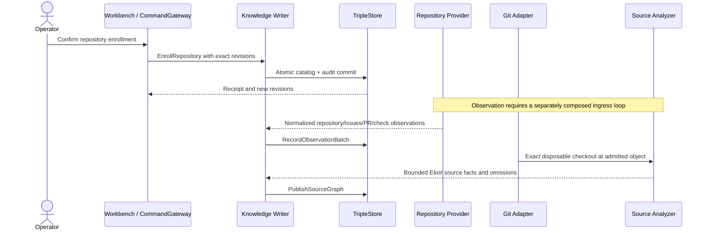

Current behavior:

1. The authenticated browser can enroll a conceptual repository into the
   factory catalog today.
2. `ReqRepositoryProvider` can observe GitHub repository metadata, issues,
   pull requests, branches, checks, and capability facts with bounded bodies
   and external credentials resolved by reference.
3. `GitRepository` can materialize and verify an exact commit in a disposable
   worktree.
4. `ElixirSourceAnalyzer` parses source without executing repository code and
   publishes bounded source facts through a separate command.
5. No default supervisor currently polls providers, consumes webhooks, or
   drives this sequence continuously. An operator/deployment must compose the
   ingress adapters and semantic commands.

An issue or external tracker item remains an observation. It never becomes a
task merely because an external system calls it work.

## Agent Flow 2: From Need To Fenced Work

Work emerges by reconciling observed or declared needs with desired state and
policy.

```mermaid
flowchart LR
  Signals["User intent, policy, source drift,\nprovider issue, finding, prior decision"]
  Observe["Immutable observation\nwith provenance/completeness"]
  Reconcile["Reconcile gap, conflict,\nor existing representation"]
  Goal["Propose goal"]
  Plan["Propose plan at exact source/policy revisions"]
  Adopt["Separate plan adoption"]
  Eligible["Closed-world eligibility"]
  Schedule["Deterministic fleet selection"]
  Lease["Atomic lease + monotonic fence"]
  Attempt["Record attempt before effect"]

  Signals --> Observe --> Reconcile --> Goal --> Plan --> Adopt --> Eligible --> Schedule --> Lease --> Attempt
```

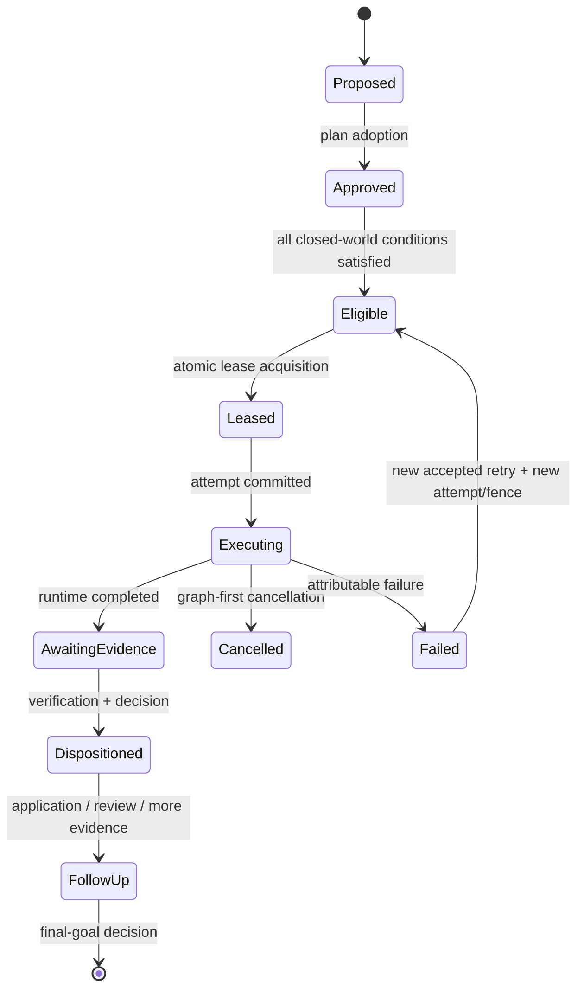

The important checks are:

- plan adoption is a separate decision from plan proposal;
- eligibility is closed-world: absence never means permission;
- source, policy, capability, budget, risk, completeness, freshness, and active
  lease/capacity facts must all be present;
- scheduler memory is not a queue of record;
- lease acquisition is the authority-granting atomic operation; and
- every retry is a new attempt, normally under a new lease/fence.

The semantic modules and disposable scheduler/reconciler implementations are
accepted. The general reconciler and scheduler require injected reviewed-query
discovery and acquisition callbacks and are not started by default.

## Agent Flow 3: Native Host-Controlled Coding

The native profile is the current accepted coding runtime. JidoCode owns every
inner-loop transition and uses the model only for bounded proposals.

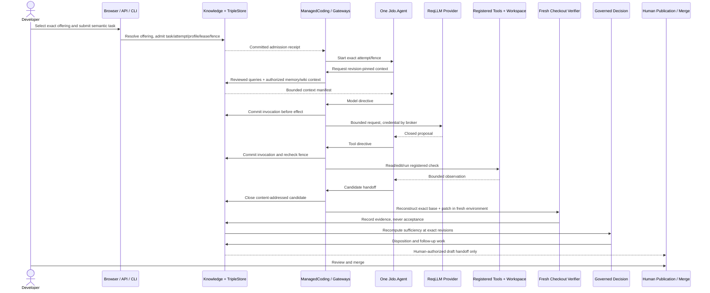

The inner state is bounded and process-local: phase, pending directive,
correlation, and working context. Durable tasks, attempts, effects, budgets,
candidates, evidence, and decisions remain graph-owned. The agent cannot call
Knowledge, an integration, a credential, or a raw workspace directly.

The concrete registered tool set covers source search, symbol inspection,
exact file reads, digest-guarded edit/create/delete, server-owned registered
checks, bounded candidate diff, and candidate capture. Every controlled effect
must have invocation-before-effect evidence and current fence authorization.

Release status and deployability differ here: the native profile is accepted
and named as the production profile, but the product's default graph catalog,
submission, and attempt providers depend on application callbacks that are not
configured. `Factory.ManagedCoding.Service` is also not supervised by default,
and the production graph ledger/verifier/publication composition is not present
as a concrete application child. Consequently, the checked-in browser/API/CLI
coding flow fails closed as unavailable unless a deployment supplies this
composition.

## Agent Flow 4: Delegated Codex Coding

The delegated path preserves the same outer lifecycle but gives an exact CLI
ownership of its private inner loop.

```mermaid
sequenceDiagram
  actor Developer
  participant Catalog as Unified Agent Catalog
  participant Graph as Knowledge + TripleStore
  participant Controller as Delegated Controller
  participant Broker as Consent / Credential / Egress
  participant VM as Isolated Workspace Boundary
  participant Codex as Codex CLI via JidoHarness
  participant Check as Server-Owned Checks
  participant Verify as Independent Fresh Verifier

  Developer->>Catalog: Request scoped offerings
  Catalog-->>Developer: Native + delegated projections; Codex currently disabled
  Developer->>Graph: Select exact opaque profile and consent to billing
  Graph-->>Controller: Attempt, lease, fence, profile, readiness generation
  Controller->>Broker: Recheck foreground consent and opaque login reference
  Broker-->>VM: Attach bounded credential to parent only
  Controller->>VM: Materialize exact source; custody of Git control data
  Controller->>Codex: Fixed argv; compiled prompt on closed stdin
  Codex-->>Controller: Closed bounded JSONL events
  Controller->>VM: Inspect every turn; quarantine unsafe effects
  Controller->>Check: Run only registered checks
  opt one clarification/checkpoint follow-up
    Controller->>Codex: New process, reconstructed turn, same total budget/fence
  end
  Controller->>Graph: Account terminal/ambiguous outer events
  Controller->>Graph: Commit immutable checkpoint and recomputed candidate
  Controller->>Verify: Separate clone, exact patch, authoritative checks
  Verify->>Graph: Governed evidence
  Controller->>VM: Cleanup all disposable state
```

The accepted DGA1 tuple is fixed to Codex CLI `0.144.6`, model
`gpt-5.3-codex`, JidoHarness revision
`e41fc1651282469f2db4219a48d9f7feef1b0dbc`, developer-local existing login,
`jido_code` only, foreground execution, `workspace_write_registered_checks`,
and at most two controller-reconstructed CLI processes. Prompt/context travel
on standard input, not argv or environment. User/project Codex configuration,
rules, skills, MCP, web search, arbitrary directories, unsafe flags, and
provider-session recovery are unreachable.

DCG1-DCG5 prove the semantic profile/catalog, protected runner, local consent
and containment contracts, candidate/accounting/recovery/verifier, and shared
browser/API/CLI product surfaces. DCG6 must still run the predeclared 30-task
live comparison, security and failure drills, independent human review, and
release acceptance. Until that merges, the release manifest correctly lists
`delegated_codex_selection` as disabled.

Even after DGA1, this path remains a developer preview, not a managed factory
worker. DGA2 additionally requires workload identity or attaching proxy,
deployed tenant-isolated sandboxing, managed shadow/pilot evidence, operational
SLOs, alerts/on-call, provider credential rotation, and a new signed release.

## Agent Flow 5: Candidate, Evidence, Decision, And Publication

All runtime classes converge at the candidate boundary.

```mermaid
flowchart LR
  Runtime["Runtime completion\nobservation only"]
  Candidate["Controller-recomputed\ncontent-addressed candidate"]
  Fresh["Fresh exact checkout\nindependent checks"]
  Evidence["Evidence bundle +\nproposed claims"]
  Sufficiency["Pure sufficiency\nassessment"]
  Decision["Governed disposition\nat exact revisions"]
  FollowUp["New follow-up task\nrequires lease/fence"]
  Publish["Human-authorized draft\npublication"]
  Merge["Human/provider-protected merge"]
  Reobserve["External merge observation\n+ post-change verification"]
  Final["FinalGoal decision"]

  Runtime --> Candidate --> Fresh --> Evidence --> Sufficiency --> Decision
  Decision --> FollowUp --> Publish --> Merge --> Reobserve --> Final
```

Outcome stages prevent premature success:

1. `AttemptCompletion` says only that a runtime ended.
2. `PatchApproval` may complete the attempted task but cannot satisfy the goal.
3. `ExternalApplication` requires provider confirmation.
4. `PostChangeVerification` evaluates the changed external snapshot.
5. `FinalGoal` alone may satisfy the goal.

Publication is a separate effect with its own current authorization and
compare-and-swap expectations. The current repository contains publication
ports and coordinators, but production implementations of the generic
publication provider and post-change verifier exist only as test support. The
[autonomous merge blocker](./harness-autonomous-merge-blocker.md) is explicit:
there is no merge adapter, merge credential, or policy capable of granting
autonomous merge.

## Agent Flow 6: Repository Wiki Maintenance

### What goes into a wiki

Authority precedence is fixed:

| Priority | Source | Wiki treatment |
| ---: | --- | --- |
| 1 | Exact Git snapshot | Source, tests, authored docs, `mix.exs`, and `mix.lock`; never rewritten as model-owned truth |
| 2 | Deterministic observations | Source AST, project/lock extraction, provider/build metadata with exact profile and provenance |
| 3 | Accepted graph facts | Repository control, evidence, decisions, and adopted memory at pinned revisions |
| 4 | External references | Allowlisted package/docs/source/changelog/advisory observations with time and expiry |
| 5 | Synthesized explanation | Optional bounded cited prose; structurally unavailable in V1 production |
| 6 | Live panels | Reviewed queries evaluated at view time; never copied into prose as timeless fact |

The deterministic V1 compiler inventories README and root files, source,
tests, configuration, assets, migrations, operations material, authored docs,
guides, ADRs, research, contributing/release/security/upgrade/license files,
`mix.exs`, `mix.lock`, source-graph coverage, omissions, and sensitive or
unsupported content. It produces project overview, getting started, user and
developer guides, architecture/source maps, project and dependency pages,
operations, provenance, freshness, and known-gap collections.

Every direct, optional, dev/test/target, Git, path, private, and transitive Mix
dependency must appear in the catalog or as an explicit gap. Hex links bind an
exact locked version; Git links bind an immutable object; path dependencies
remain inside the repository boundary. Metadata is observational and cannot
override `mix.exs`/`mix.lock`.

### Compilation and activation

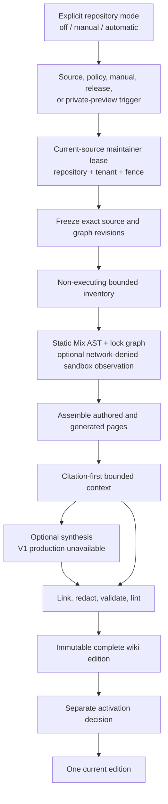

The update classifier uses exact changed paths and graph transitions:

| Change/stage | Required action |
| --- | --- |
| Repository enrolled | No wiki work until an explicit wiki configuration exists |
| Mode `off` | Admit no new compilation or cost; retention/read visibility is separate |
| Manual deterministic | Compile only after explicit authorized request |
| Automatic deterministic | Reconcile new observed default-branch source and admitted graph changes |
| Source/module/test change | Rebuild impacted pages/backlinks and a complete successor edition |
| `mix.exs` change | Re-extract project/dependency intent and rerun dependency completeness lint |
| `mix.lock` change | Re-resolve the complete dependency graph and exact links |
| README/guide/ADR/research change | Re-index authored content, navigation, citations, status, and drift |
| Work/attempt/health change | Refresh live panels; normally no durable prose rebuild |
| Coding attempt/candidate | Optional session-private preview under its own attempt/candidate/fence |
| Candidate accepted or PR opened | Preview may refresh, but never becomes current |
| External merge observed | Fresh checkout and fresh current-source compilation; never promote a preview |
| Release/tag observed | Create or pin a release-purpose edition under retention policy |
| Compiler/schema/policy change | Build a successor under a compatible profile; retain old current until cutover |

### Parallel wiki operation and cost

- Each project has its own wiki edition family and one logical maintainer.
- Only one current-source lease/fence may own a repository at a time.
- Multiple coding sessions may compile private previews concurrently because
  every preview binds repository, base, attempt, candidate, session, audience,
  and fence.
- A preview is excluded from normal search/navigation and cannot be activated
  as current.
- The current release offers manual and automatic deterministic modes, but the
  repository default is off.
- Deterministic compilation performs zero model calls and records zero model
  tokens and zero model cost. Infrastructure cost is explicitly unmeasured,
  not falsely reported as zero.
- Future synthesis requires explicit opt-in, exact provider/model/prompt/price
  profiles, worst-case atomic reservation across invocation through fleet
  windows, and terminal/unknown usage accounting. The production synthesis
  adapter catalog is currently empty.

The graph/compiler/product implementation and deterministic release are
accepted. The default wiki coordinator, however, starts with an unavailable
lease gateway; recovery starts with an empty enrollment loader and unavailable
fact loader; and the maintainer worker currently exposes ownership/status but
does not itself process compilation triggers. A deployment must still wire the
reviewed graph loaders, lease commits, trigger execution, compiler, edition
commands, activation, accounting, and external metadata adapter into the
running coordinator.

## Agent Flow 7: Memory And Learning

Memory is a governed evidence product, not a transcript or hidden-reasoning
archive.

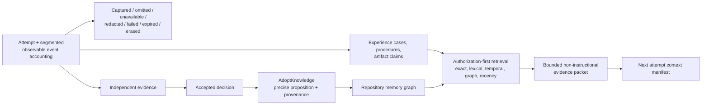

The enabled `semantic_history` profile retains normalized semantic events,
selected messages/results, digests, explicit omissions, and governed
artifacts. It excludes exact assembled prompts, raw provider responses, raw
tool bodies, provider-private state, reusable credentials, secrets, and hidden
chain of thought. `diagnostic_capture`, `project_total_history`, and
`incident_hold` remain disabled.

Knowledge adoption requires accepted claims and a sufficient decision. It
records a precise RDF proposition, evidence, source snapshots, actors, policy,
classification, applicability, confidence, limitations, validity, and
supersession. A later contradiction appends state; it never edits history.

Retrieval authorizes the complete candidate partition before generating or
ranking candidates, filters scope/classification/freshness, and builds a
bounded evidence packet. The context compiler includes that packet as
non-instructional evidence with exact retrieval/query/index/revision
commitments. Models cannot make a remembered item authoritative by repeating
it.

Cross-repository memory requires an explicit cohort, repository set, actor,
purpose, allowed use, data classes, cutoff, expiry, policy revision, and
erasure generation. Imported cases are candidates only; the target repository
must independently accept them. Dataset payloads remain at an approved
external sink and no training/deployment path exists.

The memory protocols are accepted, but default application wiring does not
automatically capture every runtime event, run retrieval for every coding
attempt, or adopt every accepted lesson. The only included exact-content key
provider is explicitly process-local for tests/local deployments and is not
supervised. Production key management, external dataset sinks, deletion
attestations, and a real launch evaluation remain deployment work. Dense
retrieval is an evaluation boundary and is disabled.

## Parallel Projects And Sessions

The semantic architecture is designed for parallelism even though the current
deployment composition is incomplete.

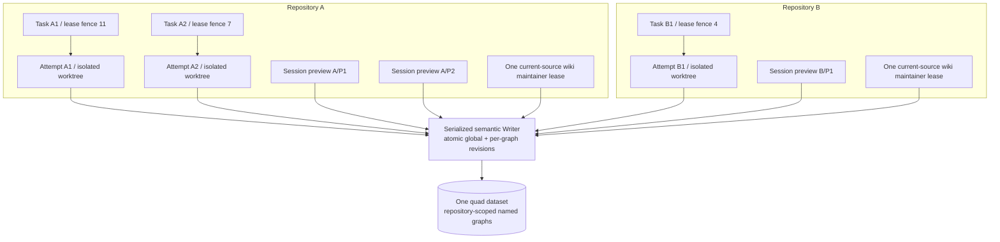

The concurrency model is:

| Boundary | Isolation/concurrency mechanism |
| --- | --- |
| Project | Conceptual repository IRI and repository-owned graph families |
| Task ownership | Atomic execution lease with monotonic fencing token |
| Attempt process | Registry/DynamicSupervisor key derived from attempt IRI and fence |
| Filesystem | Exact disposable worktree per attempt; controller-owned Git metadata |
| Model/tool effects | Invocation identity, permit, current fence, per-scope budgets |
| Verification | Separate checkout/root and evaluator identity |
| Wiki current source | At most one repository maintainer lease |
| Wiki candidate previews | Separate session/attempt/candidate/audience identities; concurrent siblings allowed |
| Fleet fairness | Global, cohort, repository, provider, capability, risk, rate, and budget ceilings |
| Durable commit ordering | One serialized Writer with global and per-graph revisions |

This model avoids a durable runtime queue and allows any disposable coordinator
to rediscover work after restart. It also creates a deliberate serialization
point at semantic commit. Long-running repository/model/tool work can occur in
parallel, but final authoritative commands pass through one store owner.

Current constraints on the parallel-factory claim are substantial:

- the product authenticates one configured operator identity and one default
  factory scope, not independent human/tenant accounts;
- general reconciliation/scheduling is not running by default;
- the native managed service is not composed by default;
- DGA1 is foreground and `jido_code`-only; DGA2 is absent; and
- wiki coordinator defaults do not yet connect to live graph lease/trigger
  adapters.

## Product And Operator Surfaces

| Surface | Current routes/commands | Status |
| --- | --- | --- |
| Operator sign-in | `/sign-in`, signed browser session from `JIDO_CODE_OPERATOR_TOKEN` | Live; single shared configured operator model |
| Factory workbench | `/` | Live graph projection; repository enrollment, work/attempt/knowledge views, wiki UI |
| Coding agent catalog/submission | `/coding-agents` | UI implemented; default providers fail closed without graph callbacks |
| Attempt detail/control | `/managed-coding/:attempt_ref` | UI implemented; depends on missing default graph loader and managed adapter |
| JSON API | `/api/v1/agent-offerings`, `/api/v1/coding-attempts/...` | Authenticated and bounded; same unavailable default backend seams |
| Developer CLI | `mix jido_code.agent catalog|submit|show|steer|answer|cancel|handoff|recovery` | Protected stdin/file protocol; same product gateways and current gating |
| Store operations | `mix jido_code.knowledge health|integrity|backup|export|restore` | Live when store is enabled |
| Install/release | `mix jido_code.bootstrap`, `mix jido_code.release verify|audit|preflight` | Implemented and release-verified |
| Capacity | `mix jido_code.capacity` | Synthetic bounded benchmark, not production load certification |

## Gaps To A Complete Coding Factory

The gap register below separates blockers from intentional safety boundaries.
“Complete” is assumed to mean that an operator can enroll multiple projects,
observe work, schedule isolated agents, produce and independently verify
candidates, maintain project knowledge/wikis, publish human-reviewable drafts,
recover after failure, and operate the service with real deployment evidence.
It does not assume autonomous merge unless that goal is explicitly adopted.

### P0 — End-to-end operability blockers

| ID | Gap | Evidence in the current tree | Required closure evidence |
| --- | --- | --- | --- |
| CF-01 | No default end-to-end factory composition | Core reconciler/scheduler and `ManagedCoding.Service` are not supervised; catalog/submission/attempt providers read unset application callbacks | A production composition supervisor, graph-backed adapter implementations, startup/recovery order, one real browser/API/CLI attempt, clean restart, and a merged receipt |
| CF-02 | Production effect isolation is not implemented | Isolation profiles name gVisor/Firecracker, but `lib` has no VM/container runtime adapter; `MemorySandbox` is an in-process reference adapter | Exact deployed sandbox/image/kernel adapter, no-host/no-network/no-ambient-secret proof, resource enforcement, hostile escape/persistence tests, cleanup and incident drills |
| CF-03 | Production credentials/egress/effect reconciliation are mostly ports | Credential vault, production sandbox, egress transport, effect sink, and several ledgers have only test fakes or injected functions | Real provider-specific helper/proxy or workload exchange, controlled DNS/TLS/egress, durable audit-before-effect, revocation, ambiguity reconciliation, and cross-tenant canaries |
| CF-04 | No complete external publication loop | Generic publication and post-change verifier implementations are only test support; no provider PR adapter is registered | Human-authorized draft PR adapter, exact old-ref/CAS checks, branch protection proof, re-observation, post-change verification, and rollback/incident evidence |
| CF-05 | Observation and source refresh are not continuous | Concrete Req/Git/source-analysis modules exist, but no supervised webhook/poller/subscription composes them | Bounded webhook/poll ingress, durable observation checkpoints in graph, source-head reconciliation, outage/backfill behavior, and multi-repository operating evidence |

### P0/P1 — Agent capability gates

| ID | Gap | Current status | Required next step |
| --- | --- | --- | --- |
| CF-06 | Delegated Codex profile cannot be selected | DCG1-DCG5 accepted; DCG6 open; release flag disabled | Finish the signed 30-task live qualification, adversarial/recovery drills, reviewers, release receipt, clean-checkout merge, and exact profile enablement |
| CF-07 | No managed-fleet delegated agent | DGA2 is explicitly outside the current plan | New research/ADR if needed, implementation plan, workload identity, tenant sandbox, background scheduling, shadow/pilot/SLO/on-call, and provider-specific release |
| CF-08 | Native accepted profile is not deployably composed | Runtime/tool/model components exist, but production admission/lifecycle/candidate/verifier ledgers are not concrete default children | Build the graph-backed managed-coding adapter package and prove the release profile through the actual product route, not only injected fixtures |
| CF-09 | Multi-agent, remote-agent, and MCP execution are unavailable | Control planes are accepted but registry is empty/disabled; specialist topology was rejected | Keep disabled unless a task class demonstrates material benefit and passes separate compatibility, security, cost, conflict, and operating gates |

### P1 — Multi-project product and knowledge gaps

| ID | Gap | Why it matters | Closure direction |
| --- | --- | --- | --- |
| CF-10 | Single-operator product identity | Graph contracts model actors/tenants, but runtime config fixes one local operator/factory scope | Add independently authenticated humans, role/delegation lifecycle, tenant administration, revocation, audit, and cross-scope product tests before claiming multi-tenant service |
| CF-11 | Wiki maintainer loop is not fully wired | Deterministic compiler/release exists, but default lease/fact gateways are unavailable and the worker only owns/statuses a lease | Connect graph discovery, lease commands, triggers, compiler, edition streaming, lint, activation, accounting, and restart recovery; run several repositories concurrently |
| CF-12 | Memory is not automatically integrated into every attempt | Retrieval/adoption/capture modules are callable but no default factory composition drives the full loop | Define per-profile capture/retrieval/adoption services, prove stale/poison/erasure behavior under real attempts, and expose operator controls |
| CF-13 | Production exact-content key and dataset sink adapters are absent | Only an explicitly in-memory key provider is included; external sink deletion is contract-only | Integrate a production key provider and approved sinks with backup, rotation, revocation, hold, physical/cryptographic erasure, and deletion attestations |
| CF-14 | Language and project support is narrow | Source analysis and wiki V1 are Elixir-specific; wiki supports single apps and umbrellas | Declare the intended factory language envelope and add separately qualified analyzers, tools, check catalogs, dependency compilers, and wiki profiles |
| CF-15 | External work-source integration is incomplete | GitHub observations exist, but [Beadwork research](../research/06-beadwork-as-a-git-native-external-work-source.md) has no ADR/plan and no work-source adapter | Accept/reject the proposed generic external-work-source contract; implement inbound-only observation before outbound synchronization |

### P1/P2 — Evaluation, operations, and maturity gaps

| ID | Gap | Evidence | Closure direction |
| --- | --- | --- | --- |
| CF-16 | Evaluation control planes lack real launch evidence | Harness, memory, specialist, and wiki releases use deterministic fixtures/pilots; DGA6 live corpus remains open | Run fresh/private corpora, blinded review, real provider/deployment trials, adaptive attacks, and ongoing drift evaluation with immutable evidence |
| CF-17 | No accepted first-class evaluation graph release | Evaluation/prompt ontology material exists under research, but the 17-family registry has no `evaluation_catalog` or `evaluation_run` family | Decide whether current run/evidence families suffice; otherwise accept ontology/registry/command/query changes with migration and falsification tests |
| CF-18 | Prompt lifecycle is research-only | [Prompt research](../research/09-prompt-improvement-and-evaluation.md) recommends immutable prompt bundles, but no ADR/plan/release implements them | Inventory and content-address operational prompts, define behavior contracts and rollback, then decide on `prompt_catalog` and governed experiments |
| CF-19 | Operational SLO/alerting evidence is not deployed | Telemetry and projection contracts exist; capacity is synthetic; no external metrics/alert/on-call integration is configured | Deploy low-cardinality metrics, SLO/error-budget dashboards, paging, spend alerts, incident exercises, and per-repository/fleet capacity tests |
| CF-20 | Supply-chain evidence is incomplete | Dependencies and runtime binaries are pinned/digest checked, but there is no produced SBOM, signed build provenance, image attestation, or vulnerability-response automation | Add release SBOM/provenance, protected workflow review, image/binary signing, dependency/advisory intake, and emergency revocation drills |
| CF-21 | Single embedded store has no HA deployment design | Backup/restore is strong, but the authority topology is a singleton and DNS clustering does not make the store active-active | Document supported singleton/failover topology, recovery objectives, fencing during failover, backup encryption, restore drills, and scale limits before fleet claims |

### Documentation and governance drift

| ID | Drift | Current example | Risk |
| --- | --- | --- | --- |
| DOC-01 | Architecture index lags merged work | `architecture/README.md` says delegated work does not change release posture until implementation merges and omits DCG4/DCG5; it says wiki implementation remains disabled until receipts are accepted even though RW1-RW5 are accepted | Readers can mistake completed source phases for plans or miss the actual disabled reason |
| DOC-02 | “Current-state inventory” is historical | It explicitly records the pre-graph 2026-07-31 starting tree, including no JSON API or knowledge supervisor | Its filename invites incorrect use as a current inventory; this document should become the current entry point |
| DOC-03 | Plan frontmatter is stale | Harness and memory plans still say `planned`; managed phases 5/6 say `planned`; receipts show all are accepted | Automation or readers using metadata rather than receipts will report false status |
| DOC-04 | Threat register is stale | The living threat model evaluates HG5 even though HG6-HG8, memory, managed coding, wiki, and DCG1-DCG5 later merged | Some risks were reduced in source while deployment risks remain; the register needs a new scored baseline |
| DOC-05 | Some decision prose retains merge-pending language | The memory storage decision still references merge-pending MG6 despite accepted MG6/MG7 receipts | Weakens traceability even though the executable release is consistent |

These documentation issues do not reopen an implementation gate by
themselves, but they make architecture status harder to operate safely. Phase
receipts and executable release manifests remain the authoritative evidence
until the metadata is reconciled.

## Intentional Boundaries That Are Not Bugs

Several absences are deliberate safety decisions:

- no model, agent, verifier, or evaluator can approve or merge;
- no runtime process or queue is durable product truth;
- no automatic fallback changes provider, model, runtime, credential, sandbox,
  or capability;
- no raw prompt, transcript, hidden reasoning, secret, or arbitrary tool output
  becomes accepted memory;
- no repository wiki exists unless a repository explicitly opts in;
- no deterministic wiki model token/cost is fabricated; and
- no evaluation score directly deploys a profile or accepts a patch.

If the product goal includes autonomous merge, that is a deliberate scope
expansion, not the final unchecked subtask of the current plans. It requires a
new accepted ADR and the evidence named by the autonomous-merge blocker.

## Recommended Completion Sequence

The safest path to a complete human-merge coding factory is:

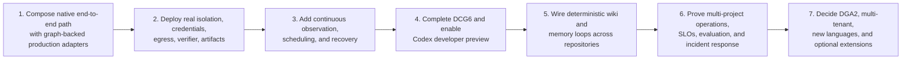

The first three steps provide more factory value than enabling another model
or agent topology: they turn the accepted semantic kernel into a real,
recoverable service. DCG6 can proceed in parallel because its developer-local
scope is intentionally isolated, but it must not be used as evidence for DGA2
or the missing native production composition.

## Definition Of “Complete” For The Current Human-Merge Boundary

A release can credibly call itself a complete coding factory when all of the
following are true at one pinned merged and deployed candidate:

- multiple enrolled repositories are continuously observed at exact source
  identities;
- declared and observed needs reconcile into graph-owned goals/plans/tasks;
- the scheduler runs, honors fleet/repository/provider budgets, and grants
  fenced leases without a durable side queue;
- at least one exact native or managed profile completes useful real tasks
  through the public product surface;
- every effect runs in a proven deployment sandbox with brokered credentials
  and controlled egress;
- candidates are independently reconstructed and checked outside producer
  state;
- decision, draft publication, external re-observation, post-change
  verification, and final-goal stages operate end to end;
- parallel attempts and project-specific wikis/memory remain isolated and
  restart-safe;
- wiki opt-out and token/cost reporting are correct for every repository and
  session;
- backup, restore, cancellation, ambiguity, revocation, erasure, outage, and
  incident drills pass against the actual deployment;
- operator authentication and scope match the claimed single- or multi-tenant
  product; and
- release, evaluation, telemetry, SLO, and on-call evidence are current for
  the exact deployed tuple.

JidoCode currently satisfies the semantic design for most of these items and
has accepted component-level evidence for many. It does not yet satisfy them
as one default-wired, real-adapter, deployed end-to-end system.

## Primary Evidence Map

This analysis is synthesized from the following authoritative groups:

- [Architecture index](./README.md), [module boundaries](./module-boundaries.md),
  [guardrails](./architecture-guardrails.md), and the graph-native
  [Phase 10 receipt](./phase-10-receipt.md)
- [Store lifecycle](./store-lifecycle.md),
  [atomic writes](./atomic-writes-and-revisions.md),
  [semantic commands](./semantic-command-contract.md), and
  [reviewed queries](./reviewed-query-catalog.md)
- [Factory control loop](./factory-control-loop.md),
  [execution lifecycle](./execution-attempt-lifecycle.md),
  [verification](./verification-evidence-boundary.md), and
  [decisions](./governed-decision-outcomes.md)
- [Managed coding runtime](./managed-coding-runtime-contract.md),
  [release contract](./managed-coding-release-contract.md), and MCG1-MCG7
  receipts
- [Delegated profile](./delegated-agent-profile-catalog.md),
  [runtime protocol](./delegated-agent-runtime-protocol.md),
  [product/qualification](./delegated-agent-product-and-qualification.md), and
  DCG1-DCG5 receipts
- [Memory topology](./memory-graph-topology.md),
  [content contract](./memory-content-contract.md),
  [data policy](./memory-data-policy.md), and MG1-MG7 receipts
- [Wiki graph/edition](./repository-wiki-graph-and-edition-contract.md),
  [compilation/update](./repository-wiki-compilation-and-update-protocol.md),
  [Mix/dependency catalog](./repository-wiki-mix-project-and-dependency-catalog.md),
  [maintainer runtime](./repository-wiki-maintainer-runtime.md),
  [enrollment/accounting](./repository-wiki-enrollment-budget-and-accounting.md),
  and RW1-RW5 receipts
- [Knowledge store runbook](../operations/knowledge-store-runbook.md),
  [managed coding operations](../operations/managed-coding-runtime.md), and
  [repository wiki runbook](../operations/repository-wiki-v1-runbook.md)

Code-level claims were checked against `JidoCode.Application`,
`Knowledge.Supervisor`, `Runtime.Supervisor`, the product graph providers,
managed/delegated runtime modules, repository-wiki coordinators, integration
adapters, release manifests, and the concrete/test-only port implementations
under `lib` and `test/support`.
