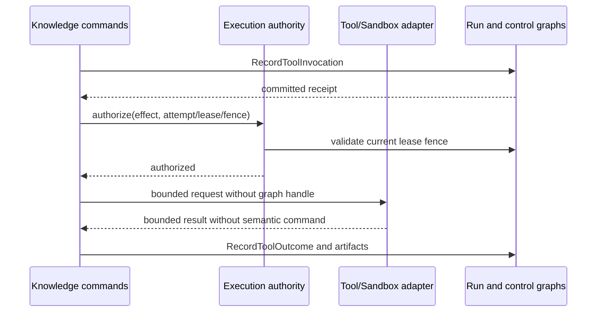

# Governed Execution Effects And Artifacts

Phase 8 separates effect mechanisms from semantic authority. Tools and
sandboxes can perform bounded work, but only the knowledge command boundary can
record execution meaning. `TripleStore` remains the sole durable source of
attempt, invocation, outcome, finding, and artifact history.

## Effect Sequence

An invocation start is committed before its effect. The facade then invokes
the execution authority immediately before calling the adapter. Outcome and
artifact commands independently require the current attempt transition and
the current, unexpired lease/fence. A stale worker can therefore neither run a
new effect through the default facade nor append its result to the run graph.

## Sandbox Boundary

`Factory.Ports.Sandbox` defines provision, snapshot materialization, execute,
inspect, cancel, collect, and destroy. `Factory.Sandbox.Request` binds every
operation to an execution request and exact base snapshot, allowed write paths,
command and environment allowlists, secret references, and CPU, memory, disk,
time, output, and network limits.

`Integrations.MemorySandbox` is the reference disposable adapter. It has no
host filesystem or network access. Injected, allowlisted runner functions work
only on in-memory files; timeout, output, declared CPU/memory use, total work
size, paths, environment, and network intent are checked at the boundary. Raw
secret values are rejected. Work keys, process identity, and local state never
leave the adapter. Lifecycle events expose only an opaque SHA-256 provider
reference and bounded details.

This adapter is not an operating-system isolation boundary and must not be
used to execute untrusted native programs. A host/container adapter must
provide its own kernel-enforced limits while preserving the same port and event
contract. Losing or destroying either adapter's work material cannot delete a
committed run graph.

## Tool Invocation

A `ToolInvocation` IRI is deterministic for attempt, sequence, tool, and tool
version. Durable invocation facts include capability, actor and delegated
agent, lease/fence, input references and qualified digests, deadline, and
expected effect class. Start and outcome command IRIs are derived from the
invocation identity.

Outcome capture includes end time, status and exit class, bounded stdout and
stderr or external references, bounded resource usage, generated artifact
references, and redaction result. Equivalent delivery replays the committed
receipt. Different content under the same invocation outcome identity
conflicts. A tool adapter can only return `Factory.Tool.Result`; returning a
semantic command or any other shape is rejected as corrupt adapter output.

## Artifact Contract

Patches and generated artifacts are content-addressed graph resources. Identity
material includes kind, exact base snapshot, normalized content digest, media
type, byte count, generator invocation, and affected path/symbol scope.
Optional proposed tree and commit IRIs describe a materialized result.

Text content is embedded only when it is NFC normalized, line-ending
normalized, no larger than 32 KiB, classified public/internal, and free of
recognized secret material. All other content uses a content-addressed HTTPS
provider URI plus SHA-256 digest and byte count. `Artifact.verify/2` re-reads
content for every use and fails closed when external content is absent, has a
different size, or has a different digest.

Patch conflicts, partial output, rejected paths, and cleanup failures are
stored as operational `Finding` resources linked to the attempt and artifact.
They are deliberately not `EvidenceBundle` resources and cannot satisfy a goal
without the independent Phase 9 verification and decision flow.

## Recovery Consequences

Only opaque provider references survive in graph history. Recovery reconstructs
requests from graph projections, asks adapters for status through the same
authority boundary, and may destroy or quarantine orphan work. It never infers
a successful tool outcome or artifact merely from a live process, local file,
or provider callback.
