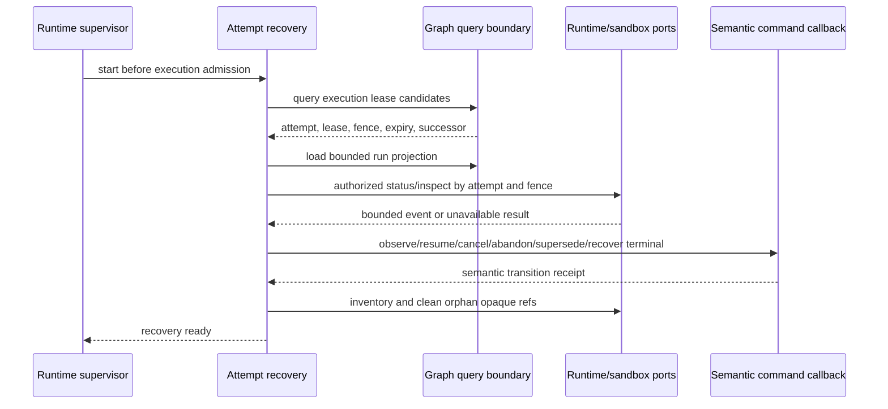

# Execution Provenance And Recovery

Phase 8 closes the governed execution loop without making runtime processes,
sandboxes, provider sessions, or local work material authoritative. The run and
repository-control graphs contain every durable fact needed to inspect an
attempt and decide what recovery action is permitted.

## Immutable Run Closure

`FinalizeExecutionRun` is the only command allowed to close a run graph. It
requires the accepted terminal attempt transition, current lease/fence guards,
the expected run and control revisions, and the complete accepted invocation,
sandbox-activity, artifact, cancellation, and retry reference sets through the
terminal sequence.

The command appends terminal outcome, bounded diagnostics, usage digest,
missing outputs, limitations, and a provenance-completeness assertion. In the
same atomic commit it replaces `Open`/`Building` graph metadata with
`Closed` and either `Complete` or `Incomplete`, plus `closedAt`. A closed graph
rejects every later append. Incomplete or abandoned history is therefore
explicit; it is never presented as complete and cannot be repaired after
closure by bypassing the semantic command boundary.

Run output remains operational provenance. A completed runtime does not imply
verified evidence, a goal decision, or accepted knowledge.

## Bounded Attempt Projection

Query catalog version `1.6.0` provides reviewed lenses for execution lease
candidates, attempt-by-task lineage, attempt facts, accepted transition
timeline, tool invocations, generated artifacts, cancellation/retry lineage,
and run completeness. `Execution.AttemptProjection` combines six run-graph
results only when they have coherent graph revisions and exact query versions.

The projection derives current state from the last accepted transition rather
than from a mutable status literal. It exposes fence, runtime version, actor,
agent, capability, exact source snapshot, last bounded activity, graph receipt,
redacted diagnostics and output digests, artifact metadata, and completeness.
It does not expose instruction content, raw stdout/stderr, provider-private
state, or secret-bearing context. Runtime completion, verification, evidence,
and decision state are separate fields.

The active-attempt control query retains a direct accepted lease successor when
one exists. Recovery can therefore distinguish a current executing lease from
an execution transition that was later revoked, expired, or superseded instead
of dropping the unresolved attempt from discovery.

## Recovery Flow

`Factory.AttemptRecovery` runs at startup and periodically. It reconstructs an
`Execution.Request` from graph projection data, reauthorizes runtime status,
inspects sandbox state through its port, and applies a pure recovery decision.
New effects can use `ExecutionCoordinator`'s readiness gate and are not
committed while startup reconciliation is unavailable.

Recovery actions are conservative:

| Condition | Action |
| --- | --- |
| attempt already terminal | ignore callback and release disposable state |
| runtime version unavailable | semantic supersession |
| source snapshot or policy changed | semantic supersession |
| lease inactive or expired | semantic abandonment |
| cancellation in progress | propagate cancellation |
| provider event is stale or for another attempt | reject event |
| missing terminal callback | recover the terminal transition idempotently |
| crashed compatible runtime | resume when policy permits |
| runtime or sandbox unavailable | retry later without inventing state |
| live compatible attempt | observe and retain its opaque runtime ref |

Orphan cleanup compares provider inventory with runtime keys reconstructed from
attempt IRI and fence. Destroying an orphan changes no graph state. A terminal,
abandoned, or superseded decision releases its disposable ref only after the
semantic transition callback succeeds.

## Supervision

`JidoCode.Runtime.Supervisor` starts recovery only when
`config :jido_code, :attempt_recovery, enabled: true, ...` supplies the reviewed
query/projection callbacks, runtime adapter, authority options, control graphs,
and semantic transition callback. Recovery configuration and process state are
disposable; readiness and the last report are operational observations, not a
second persistence model.
