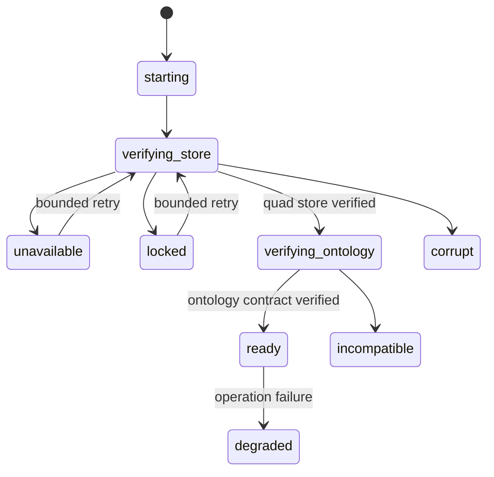

# Failure, Health, And Telemetry Contract

## Purpose

This contract gives the knowledge boundary stable failure and readiness
semantics before Phase 2 introduces the supervised store owner. Backend terms
are translated privately; callers receive only `JidoCode.Knowledge.Error`.

## Error Vocabulary

| Kind | Meaning | Retry mode |
|---|---|---|
| `unavailable` | The verified knowledge substrate cannot currently serve the operation | `retry` with bounded backoff |
| `incompatible` | Store schema, ontology, shape, or application contract is incompatible | `never`; operator/migration action |
| `locked` | Another owner holds the local store path | `retry` with bounded backoff, then operator action |
| `corrupt` | Integrity/checksum verification failed | `never`; isolate and restore |
| `invalid_input` | RDF, command, query parameters, or syntax failed validation | `never`; correct input |
| `unauthorized` | Policy denied the semantic operation | `never`; obtain a new decision/authority |
| `conflict` | Current graph state conflicts with the requested transition | `refresh` before a new command |
| `stale_precondition` | Expected revision, lease, or fencing precondition is no longer current | `refresh` before a new command |
| `timeout` | A bounded operation exceeded its deadline | `verify_receipt` before retrying a write |
| `persistence_failure` | The backend could not confirm a durable result | `verify_receipt` before retrying a write |

Errors expose only `kind`, a compile-time operation atom, retry mode, and a
fixed public message. Raw backend exceptions, SPARQL, RDF values, arbitrary
IRIs, graph contents, credentials, and absolute paths are excluded.

## Health State Machine

`ready` is valid only when both `store_verified?` and `ontology_verified?` are
true and no failure is present. Transition functions reject skipped or
out-of-order verification. Phase 2 must start mutation-capable services only
after reaching this state.

When readiness is absent:

- startup does not advertise the knowledge substrate as ready;
- durable Factory commands are not started or are gated with a typed error;
- HTTP/LiveView work requests fail closed rather than buffering hidden durable
  state in a process, queue, session, or file;
- read-only diagnostics may report the low-cardinality health state; and
- no alternate database or filesystem snapshot is used.

## Telemetry Metadata

Knowledge telemetry metadata is limited to:

- `operation`: a source-defined atom from a bounded API;
- `outcome`: `ok`, `error`, or `rejected`;
- `error_kind`: one error kind from the table above;
- `health_state`: one declared health state; and
- `retry`: one declared retry mode.

Durations, counts, and byte sizes are numeric measurements, not metadata.
`JidoCode.Knowledge.Telemetry.metadata/1` rejects unknown keys and unbounded
values. Detailed causes may be retained only in bounded internal diagnostics
with normal secret redaction; they are never labels or browser payloads.
