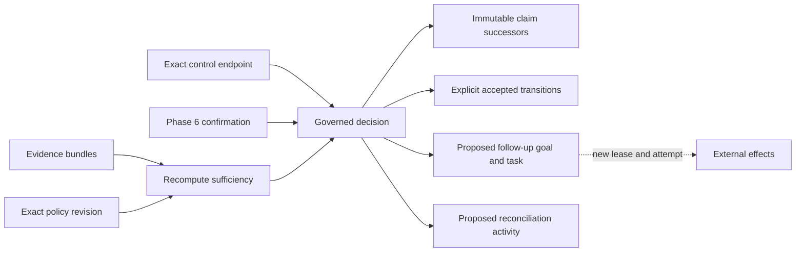

# Governed Decision Outcomes

Phase 9 turns evaluated evidence into explicit claim dispositions and control
transitions. A decision is an immutable graph fact, not a callback that performs
work. `TripleStore` remains the only durable source of truth.

## Decision Boundary

`DecideGoalOutcome` is protocol version `1.7.0`. It atomically appends the
decision and claim disposition to the repository evidence graph and accepted
state transitions plus derived follow-up work to the repository control graph.
The command cannot contain direct external effects.

A decision identifies its actor, scope, goal, task, disposition, decision mode,
outcome stage, risk class, governing policy, sufficiency assessment, considered
evidence, authored rationale references, validity interval, and any superseded
decision or follow-up. Its deterministic identity and command idempotency key
are derived from these bounded inputs.

The admitted dispositions are accept, reject, defer, waive, supersede, and
request more evidence. Human, policy-automatic, and delegated-agent modes have
separate risk constraints. Automatic and delegated decisions cannot waive
requirements; automatic decisions cannot decide high or critical risk, and a
delegated agent cannot decide critical risk. Accept, waive, and supersede also
enforce actor separation from execution and, when policy requires it, from the
evaluator.

## Snapshot Validation

Construction recomputes evidence sufficiency from the supplied bundles,
requirements, and current revision context. The recomputed receipt must equal
the submitted assessment. The command then pins the complete set of required
policy, evidence, control, run, source, and external-confirmation graph
revisions. Extra, missing, or different revisions reject command construction.

Transaction guards require the decision to be absent, every considered bundle
and governing policy to be present, each control transition to still name the
current predecessor, every confirmation to exist in its exact Phase 6
observation or source-revision graph, and every follow-up identity to be absent.
Dataset or graph drift produces a conflict rather than silently reevaluating on
a different snapshot.

## Claims And Satisfaction

Acceptance, rejection, waiver, and supersession create new immutable claim
resources that preserve the precise RDF subject, predicate, and object of the
proposed claim. The successor records its epistemic state, decision provenance,
validity, graph scope, and `supersedes` relation. Earlier evidence and decisions
remain queryable.

Outcome stages prevent attempt completion from being confused with achieved
repository state:

1. `AttemptCompletion` describes execution reaching a terminal runtime state.
2. `PatchApproval` may satisfy the attempted task and propose apply-patch work,
   but it does not satisfy the goal.
3. `ExternalApplication` requires an exact Phase 6 confirmation.
4. `PostChangeVerification` requires confirmation plus evidence evaluated
   against a post-change snapshot.
5. `FinalGoal` is the only acceptance stage that may satisfy the goal and also
   requires confirmation plus post-change evidence.

Related obligations and desired outcomes change only when their current
resolutions are explicitly supplied to the decision and an allowed transition
is constructed. Later contradiction may supersede a previously satisfied goal,
obligation, or desired outcome without deleting the original satisfaction
history.

## Follow-Up And Reconciliation

Apply patch, open or update pull request, request review, remediate failure,
gather evidence, rollback, and monitor outcome are represented as deterministic
`DecisionFollowUp` resources with proposed goals and tasks. Effectful follow-ups
declare that a new lease is required. They do not reuse the completed attempt
or perform provider, Git, or filesystem operations inside the decision command.

Every decision also proposes a reconciliation activity. Dependent goals and
plans are reconsidered by the normal control loop in a later command; the
decision implementation does not mutate them transitively. A superseding
decision can explicitly supersede earlier follow-up resources while preserving
their causation history.

## Read Boundary

The reviewed `1.7.0` query catalog provides decision-by-goal, claim, evidence,
and actor lenses plus waiver, rejection, deferred action, supersession,
satisfaction-path, and follow-up views. Projections include query receipts and
bounded decision provenance. Rationale is limited to authored references;
private reasoning and chain-of-thought are neither required nor represented.
