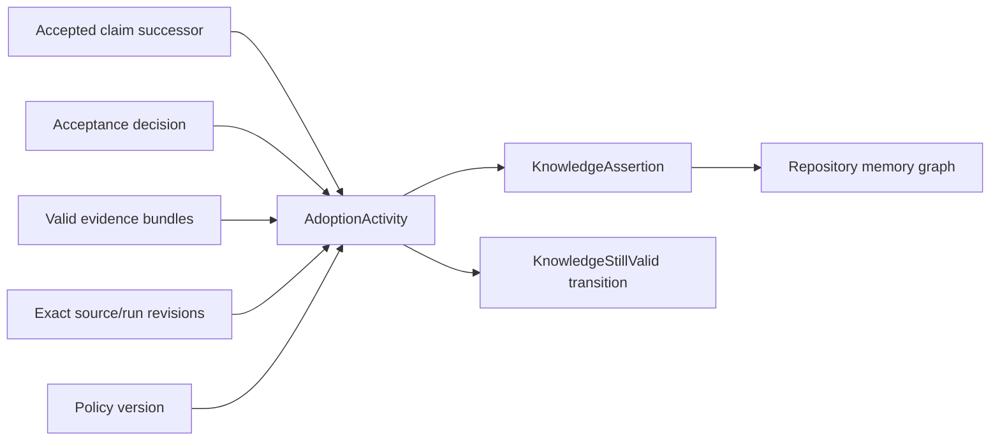

# Governed Knowledge Memory

Phase 9 repository memory is an append-only graph of accepted propositions,
their provenance, and their lifecycle. It is not a transcript store, prompt
cache, mutable record table, or second source of truth. `TripleStore` remains
the only durable authority.

## Adoption Boundary

`AdoptKnowledge` is protocol version `1.7.0`. It accepts only claim successors
created by a sufficient `DecideGoalOutcome` acceptance decision. Construction
requires one precise RDF proposition, the source decision and accepted claims,
all considered evidence, source snapshots and actors, the policy version,
repository or cohort applicability, a controlled classification, confidence,
limitations, and a bounded validity interval.

The controlled classifications are fact, convention, decision, lesson,
pattern, known issue, risk, workaround, preference, and open question.

The assertion identity covers the proposition, source claims and decision,
repository and applicability scope, classification, adoption actor and policy,
confidence, limitations, related resources, support, cohort evidence, validity,
and supersession. An exact retry is therefore idempotent. A compatible adoption
by another actor remains a separate assertion and links to the earlier
assertion as explicit support.

The command guards the accepted claims and decision in the evidence graph,
rejects any later supersession, rejection, or contradiction of those claims,
guards the policy and any supporting assertion or cohort evidence, and pins the
exact evidence, policy, cohort, and expected memory revisions. It writes only
the memory graph and performs no external effects.

Raw prompts, messages, transcripts, tool outputs, private reasoning, retained
raw outcomes, secret-bearing literals, unsupported classifications, stale or
contradictory evidence, waived/unaccepted claims, and scopes broader than the
authorized repository or evidenced cohort are not adoption inputs. Prompt
context stays ephemeral unless a separate acceptance and adoption flow creates
a durable proposition.

## Provenance And Freshness

Each assertion directly links its accepted claims, evidence bundles, decision,
snapshots, evaluator/execution/decision actors, policy, related goals/tasks or
source entities, and exact source graph revision references. Repository memory
freshness tracks immutable source and run inputs. The accepting decision's
control transition is retained through decision provenance rather than treated
as an immediately stale source revision.

Cohort applicability additionally records the exact derived cohort graph
revision and membership evidence. Cohort scope does not grant cross-repository
visibility; retrieval still requires repository authorization and the asserted
scope.

## Evolution

Knowledge is never edited or deleted in place. Every assertion begins with an
accepted revision-zero `KnowledgeStillValid` transition. `SupersedeClaim`
appends later transitions for:

- still valid;
- under review;
- contradicted;
- invalidated;
- expired; or
- superseded.

Under-review and contradicted transitions require a bundle that is actually
classified `Contradictory` in the evidence graph. Supersession atomically
appends a new provenance-complete assertion, its initial state, the old
assertion's superseded transition, and the replacement relation. Replacement
claims are re-guarded as accepted and current. Prior adoption, evidence,
decision, contradiction, and state history remain queryable.

## Retrieval Boundary

The reviewed `1.7.0` catalog provides memory lenses by repository/cohort scope,
goal, task, source entity, policy, classification, validity, and bounded
support/contradiction/supersession neighborhood. Query authorization includes a
separate memory capability.

`Knowledge.Memory.Retrieval` accepts only a fresh reviewed query receipt for one
exact memory revision and one execution context. It groups bounded rows,
selects the latest accepted state revision, checks allowed scopes and
classifications, compares every source graph reference with the caller's exact
current revisions, evaluates validity, and applies deterministic ranking based
on scope specificity, validity, support, evidence, contradiction, and explicit
goal/task relevance.

Current mode excludes stale, expired, contradicted, under-review, invalidated,
and superseded assertions. Historical mode may return them but retains the same
scope and classification authorization. Results include proposition,
classification, current state, validity, confidence, limitations, source,
evidence, decision, snapshot, contradiction and support references, stale
sources, deterministic selection explanation, truncation, and a query receipt.
It does not accept or persist prompt/transcript/tool-output fields, so every new
execution context must be reauthorized and re-queried.

