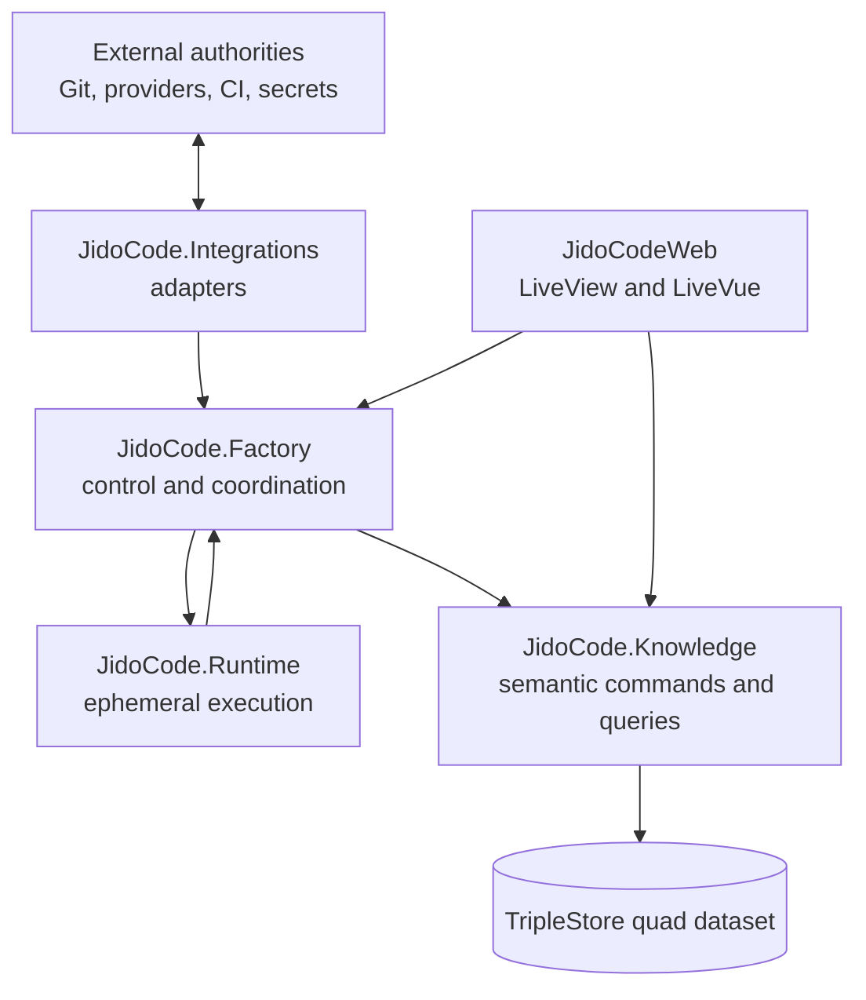
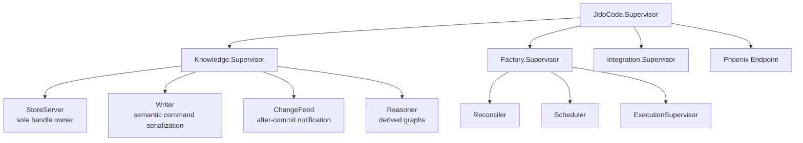

# Module And Plane Boundaries

## Purpose

This document maps ADR 0001 into Elixir namespaces, public APIs, dependency
directions, and the eventual supervision tree. It defines ownership before the
modules exist so later phases can enforce rather than infer the architecture.

## Logical Planes

Arrows represent allowed calls to public contracts. They do not grant a caller
the authority to mutate a graph. Mutation authority is evaluated by the
semantic command boundary.

## Namespace Ownership

### `JidoCode.Knowledge`

Owns:

- the only public semantic command and bounded query facades;
- store lifecycle and the raw `TripleStore` handle;
- graph topology, IRI identity, ontology versions, and shapes;
- command validation, authorization, idempotency, atomic writes, and receipts;
- query catalog, consistency, temporal/current-state resolution, and cursors;
- reasoning and isolated derived graphs;
- backup, restore, export, integrity, health, and committed-change delivery.

Only a private store-owner module under this namespace may call
`TripleStore.open/2` or retain the returned handle. Knowledge internals may use
read/write SPARQL and lower-level TripleStore expert APIs. All other namespaces
receive semantic values and bounded projections only.

### `JidoCode.Factory`

Owns capability-oriented coordination for:

- repository enrollment and retirement;
- provider observation and source analysis;
- desired-state and policy reconciliation;
- goal planning, dependency eligibility, scheduling, and leases;
- execution-attempt coordination;
- evidence evaluation, decisions, and knowledge adoption; and
- product projections that combine reviewed knowledge queries.

Factory services may invoke only public `JidoCode.Knowledge` command/query
contracts. They do not open stores, build raw write SPARQL, or own durable
process snapshots.

### Ports And `JidoCode.Integrations`

Port behaviours are owned by the capability that needs them and cover:

- Git providers and local Git operations;
- source analyzers;
- Jido/runtime execution;
- tools and sandboxes;
- CI and artifact providers;
- secret-reference resolution;
- clocks; and
- opaque identifier generation.

Concrete adapters live under `JidoCode.Integrations` or `JidoCode.Runtime` and
implement those behaviours. Adapters normalize external data and effects but
cannot decide graph meaning, authorize work, accept evidence, or retain the
only durable copy of a result. Secret adapters return values only to the
authorized effect boundary; credential bytes are never command or projection
payloads.

Clock and identifier ports must be injectable so command and concurrency tests
are deterministic. Production adapters may use system time and cryptographic
randomness; tests use fixed clocks and seeded IDs.

### `JidoCode.Runtime`

Owns ephemeral execution workers, registries, dynamic supervisors, and runtime
adapter implementations. Workers operate by attempt IRI and fencing token,
consume bounded context, and report through Factory services. They cannot hold
the store handle or self-accept outcomes.

The managed coding specialization is defined by the
[Managed Coding Runtime Contract](./managed-coding-runtime-contract.md).
`JidoCode.Factory.ManagedCoding` owns its stable admission, start, steering,
cancellation, status, and candidate-handoff facade. Runtime code implements
Factory-owned ports only; it cannot query Knowledge directly, persist through
Jido or AgentOS, or expose PIDs, graph handles, provider sessions, credentials,
or workspace paths through that facade.

### `JidoCodeWeb`

Owns routing, authentication/session presentation, LiveView shells, HEEx
components, LiveVue island mounts, and browser event translation. Web modules
may call Factory services and approved read projections. They cannot issue raw
SPARQL, invoke knowledge internals, or send store/domain structs to the browser.

## Dependency Rules

| Caller | Allowed dependencies | Prohibited dependencies |
|---|---|---|
| `JidoCode.Knowledge` public facade | Knowledge internals and TripleStore | Factory, Runtime, Integrations, Web |
| Knowledge internals | Other Knowledge internals and graph dependencies | Factory, Runtime, concrete adapters, Web |
| `JidoCode.Factory` | Knowledge public facade, owned port behaviours, pure shared values | Knowledge internals, TripleStore, Web, concrete adapters |
| `JidoCode.Integrations` | Port behaviours, adapter payloads, external libraries | Knowledge internals, store handle, Web, policy decisions |
| `JidoCode.Runtime` | Runtime port contracts and Factory reporting APIs | Knowledge internals, store handle, Web |
| `JidoCodeWeb` | Factory APIs and approved Knowledge projections | Knowledge internals, TripleStore, raw SPARQL update |

The root `JidoCode` module may expose stable public application APIs but must
delegate to the owning boundary. It cannot become a generic service locator.

## Public Contract Shapes

Allowed temporary structs or typed maps are limited to:

- validated semantic command envelopes;
- command receipts and typed failures;
- bounded query parameters, cursors, and projection results;
- normalized external adapter requests/responses;
- runtime context and event payloads bounded by attempt authority; and
- test fixtures that represent those public values.

Every such value must be reconstructable from graph state or an external
response. A struct must not:

- be serialized as the primary product model;
- own persistence behavior;
- hide graph relationships behind ID fields;
- acquire aggregate-root mutation semantics;
- provide generic create/read/update/delete operations; or
- cross into the browser with raw RDF/store implementation values.

## Supervision Ownership

The target topology is introduced incrementally after backend compatibility is
proven:

The store owner starts and verifies the quad dataset before mutation-capable
Factory services become ready. Runtime, scheduler, reconciler, projection,
PubSub, and cache processes may retain working state only if deleting it and
restarting the process reconstructs correct behavior from the graph.

## Boundary Review Checklist

Before a new module or dependency is merged, reviewers verify:

1. The owning plane and namespace are explicit.
2. The dependency direction appears in the allowed matrix.
3. Any durable value has an RDF/named-graph representation.
4. Any write is an authorized semantic command, not CRUD or raw caller SPARQL.
5. Any query is bounded, parameterized, authorized, and revision-aware.
6. External and runtime adapters do not acquire semantic authority.
7. Structs remain disposable contract values rather than persisted aggregates.
8. No raw store handle, credential, graph dump, or arbitrary SPARQL crosses the
   boundary into Factory, Runtime, Integrations, or Web code.
