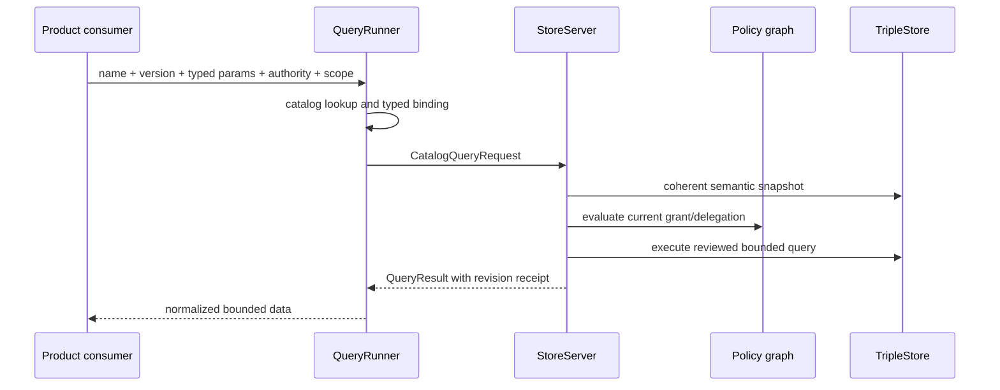

# Reviewed Query Catalog And Execution Boundary

Phase 5 introduces the only supported product read path over the authoritative
dataset. Callers identify a reviewed query and supply typed values; they cannot
submit SPARQL text, graph clauses, backend handles, or decoder functions.

## Contract

`JidoCode.Knowledge.QueryCatalog` owns a closed `1.0.0` catalog. Every
`QueryDefinition` binds:

- stable name, version, purpose, form, and execution class;
- exact parameter schema and required actor capability;
- allowed graph families and completeness assumptions;
- timeout, row, triple, byte, graph, traversal, and collection limits;
- decoder shape, compatibility notes, source text, and SHA-256 source digest.

The initial catalog contains substrate metadata and semantic-contract questions
only. Repository, goal, execution, and presentation-specific questions remain
owned by their later implementation phases.

Changing query behavior, source, or decoding requires an intentional catalog
version review, compatibility note, and fixture update. `QueryCatalog.verify/0`
fails if source and digest diverge or if a definition admits a mutation,
federation clause, unbounded result form, or undeclared graph variable.

## Typed Binding

`QueryParameters` accepts only the exact keys declared by a definition. It
validates registered graph IRIs, canonical resource IRIs, RDF literals,
controlled concepts, date-times, bounded integers, bounded IRI collections, and
opaque cursors. Values are serialized as RDF/SPARQL terms through RDF encoders
and replace fixed catalog placeholders. No value is treated as query text.

Graph selection is constrained twice: the binder verifies the graph family, and
`QueryAuthorization` verifies current graph metadata, owner scope, capability
grant, validity interval, and any delegation boundary from the factory policy
graph. Unknown graphs and scope widening fail with a redacted authorization or
input error.

## Execution

`StoreServer` remains the exclusive store owner and serializes catalog reads
with writes. `QueryExecution` evaluates authorization and query data in one
server call, applies fixed engine limits, normalizes RDF/backend terms, and
returns a `QueryResult` containing query identity, dataset and graph revisions,
ontology version, completeness, freshness, truncation, cursor, warnings, and
execution class. Raw source text, backend identifiers, and unauthorized graph
identities are absent from public errors and telemetry.

## Initial Query Set

The first version covers dataset revision; graph metadata, health, and ontology
compatibility; command and audit references; resource description and bounded
neighborhood; provenance, supporting and contradicting claims, and
supersession; transition endpoint and history; temporal as-of; completeness;
and derived-graph freshness.
