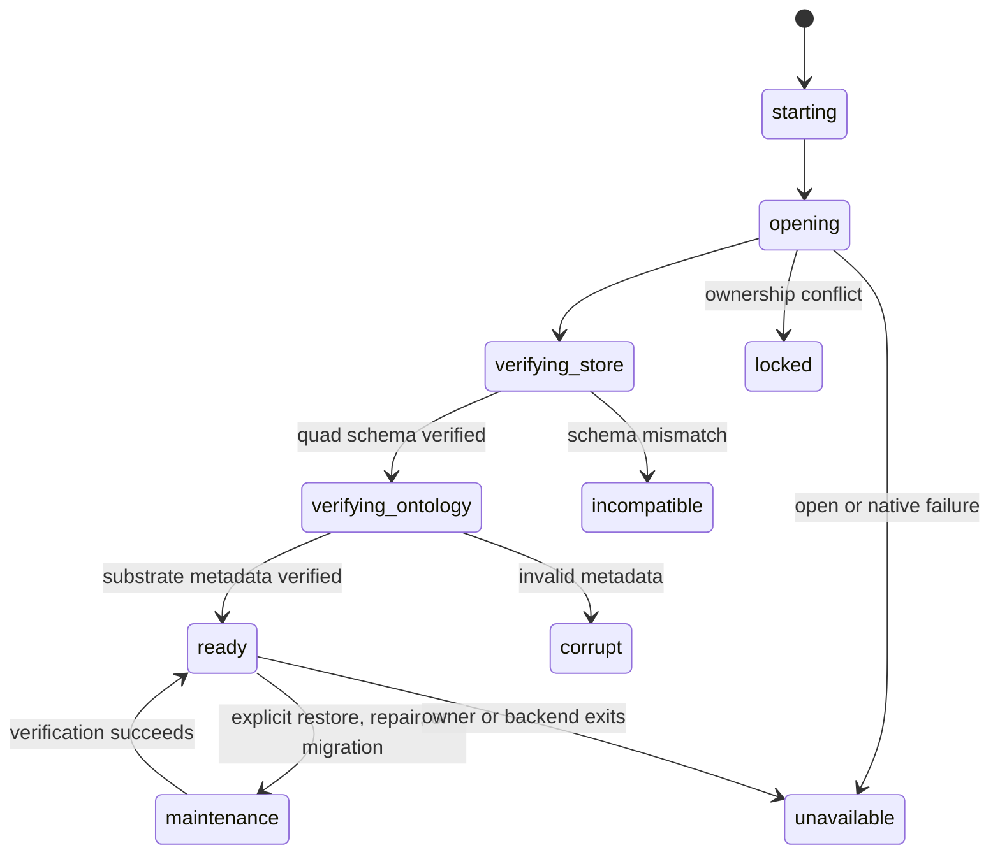

# Authoritative Store Lifecycle

## Scope

`JidoCode.Knowledge.StoreServer` is the sole application process permitted to
open and retain the embedded `TripleStore` handle. It always opens the backend
with `schema: :quad`; raw database and dictionary handles never cross the
process boundary. Callers use fixed internal operations and are authorized by
their supervised process identity. The public summary contains only bounded
state, schema, durability, revision, and redacted failure fields.

`JidoCode.Knowledge.Readiness` is supervised independently and starts before
the store owner. It remains queryable when opening fails or the owner exits,
which lets the endpoint render static and error responses without claiming
that durable commands are available. There is no in-memory, filesystem, or
alternate-database fallback.

## Configuration

The store contract is source-controlled and accepts only these values:

| Setting | Supported value |
|---|---|
| Store schema | `:quad` |
| Application schema version | `1` |
| Durability | `:sync` |
| Open timeout | 100 ms through 120 seconds; default 15 seconds |
| Backend schema version | `2`, verified from substrate metadata |

Development uses `var/knowledge/dev` and `var/backups/dev` beneath the project.
Tests do not start a shared store. A real store test must use `Config.for_test/2`,
which requires a unique identity and separate descendants of the operating
system temporary directory.

Production resolves trusted roots at runtime:

- `JIDO_CODE_STORE_ROOT`, default `/var/lib/jido_code/knowledge`
- `JIDO_CODE_BACKUP_ROOT`, default `/var/lib/jido_code/backups`

Request data and graph data cannot select either path. Store and backup roots
must be absolute, distinct, and non-overlapping. Root, home, workspace root,
the shared temporary root, relative traversal, symlink components, and an
existing world-writable target are rejected before opening the database.

## Filesystem Contract

The service account must exclusively own both roots. JidoCode creates missing
roots with mode `0700` and reapplies that mode before use. Operators should
mount the active root and backup root on durable local volumes with enough free
space for the active RocksDB dataset, compaction headroom, one complete
candidate restore, and the configured backup retention set. Capacity alerts
must fire before RocksDB reaches the volume limit; an out-of-space result is a
persistence failure and never authorizes fallback state.

One application instance owns one active root. NFS, SMB, object-store mounts,
shared persistent volumes, and active-active access to the same directory are
unsupported. Horizontal application instances need an explicit single-writer
deployment boundary rather than shared filesystem locking.

## Startup And Shutdown

Startup proceeds in this order:

1. Start independent readiness in `:starting`.
2. Validate configuration and native TripleStore/RocksDB availability.
3. Prepare private directories and perform a bounded store open.
4. Verify the physical quad schema.
5. Read required substrate metadata. Bootstrap exactly the six initial
   metadata quads only when the entire dataset is proven empty.
6. Verify schema versions, lineage, and non-negative revisions, then report
   `:ready`.

On invalid configuration, timeout, lock contention, incompatibility,
corruption, permission failure, or missing native code, `StoreServer` stays
alive without a handle and readiness records a typed, redacted failure. This
avoids supervisor restart loops and retains safe diagnostics. Backend process
death immediately clears the retained handle and marks readiness unavailable.

Normal shutdown closes the dictionary manager and RocksDB adapter before the
owner exits. A subsequent owner must reopen and reverify the same persisted
metadata before readiness can return.

## Maintenance

Maintenance entry is explicit and limited to restore, integrity repair, and
schema migration. Readiness gates reject ordinary durable operations while in
maintenance. Leaving maintenance requires the same verified, open store; later
recovery sections add close, candidate verification, and atomic activation
before a restored store can leave this state.

Store operation telemetry contains only a fixed operation class (`open`,
`verify`, `read`, `write`, or `maintenance`), outcome, bounded error kind,
retry mode, and duration. Paths, SPARQL, graph IRIs, and graph contents are
never telemetry metadata.
