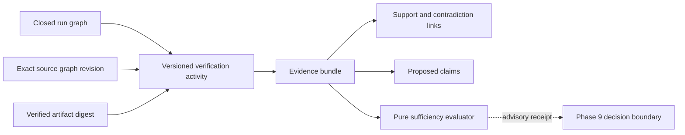

# Verification And Evidence Boundary

Phase 9 converts exact execution outputs into governed evidence without
treating runtime completion, evaluator confidence, or a passing check as an
accepted outcome. `TripleStore` remains the only durable source of truth.

## Plane Boundary

The execution data plane produces immutable run provenance and
content-addressed artifacts. The evaluation data plane reads those exact
inputs and may append a `VerificationMethod`, `VerificationActivity`,
`VerificationCheck`, `EvidenceBundle`, and proposed `Claim` to the repository
evidence graph. The control plane may later consume this graph through a
separate decision command; evidence recording itself cannot transition work,
satisfy a goal, or accept a claim.

## Verification Contract

A verification method has a deterministic identity over its name, kind,
version, accepted input classes, expected claim targets, evaluator capability,
environment, resource bounds, completeness rule, interpretation limits, and
independence rule. Version `1.0.0` admits these controlled method kinds:

- test execution
- static analysis
- semantic comparison
- human review
- policy check
- security review
- external provider confirmation

A verification activity cites one attempt, task, goal, run graph, control
graph, source graph and snapshot, evaluator, environment, bounded checks,
artifact digests, and exact source graph revisions. Embedded artifacts are
rehash-verified before activity construction. External artifacts must be
fetched through an explicit bounded callback and pass the same digest and byte
count check. A method that requires a complete suite rejects mandatory failed,
skipped, or unknown checks. An independent method rejects the execution actor
as its evaluator.

## Evidence Commit

`RecordVerificationEvidence` uses protocol version `1.7.0`. It writes one
evidence graph target and atomically records the method, activity, individual
check outcomes, bundle, source revision references, and generated proposed
claims. Transaction guards require:

- the bundle identity to be absent;
- the attempt and evaluated artifacts to exist in the cited run graph;
- artifact digest and snapshot statements to match the verified inputs;
- the task and goal to exist in the cited control graph; and
- the source graph to declare the cited source snapshot.

The envelope carries the exact evidence, run, control, and source graph
revisions. Revision drift rejects the command. Bundle targets must be a subset
of the method's expected claim targets. Supporting bundles cannot conceal a
mandatory non-passing check. Strength and confidence remain evidence metadata,
not acceptance.

Generated claims use `ClaimProposed`. They include the exact RDF proposition,
source activity, evidence graph scope, transaction time, and validity interval.
Only the later decision boundary may change their epistemic disposition.

## Sufficiency

The sufficiency evaluator is pure and returns one of `sufficient`,
`insufficient`, `contradicted`, `stale`, `incomplete`, `policy_conflicted`, or
`waiver_required`. Its input includes exact policy and plan revisions, current
source revisions, required method classes and environments, coverage,
independent reviewer count, maximum age, security and post-change requirements,
target propositions, and waiver posture.

The receipt includes bounded explanation paths and explicitly sets transition
and acceptance authority to false. It is not persisted by evaluation and
cannot be used as a command without the Phase 9 decision boundary rechecking
its inputs.

## Read Boundary

The `1.7.0` reviewed query catalog adds evidence by goal, claim, attempt, and
artifact; verification timeline; support and contradiction; sufficiency input;
stale evidence; and missing requirement lenses. Projections retain method,
evaluator, check status, coverage, limitation, validity, source revision,
query revision, completeness, freshness, and truncation metadata.

Failed, skipped, unknown, and contradictory facts are not summarized away.
Raw artifact or tool output is not selected. Raw retained output references do
not grant access to their content and the evidence projection marks raw output
authorization false.
