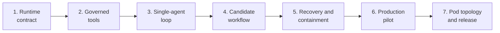

# Managed Coding Agent Runtime Implementation Plan

This seven-phase plan implements the
[Managed Coding Agent Runtime In The Jido Ecosystem](../../research/10-managed-coding-agent-runtime.md)
research as a graph-authorized, host-controlled coding loop built first on one
`Jido.Agent`, with `Jido.Pod` reserved for later evaluated specialist
topologies. It connects JidoCode's accepted context, model, tool, sandbox,
memory, execution, verification, decision, and publication boundaries without
creating a second workflow authority.

## Goal

Deliver a managed coding runtime that can inspect an exact repository
snapshot, plan and apply bounded changes, run registered checks, capture a
candidate artifact, and hand it to independent verification while remaining
fully reconstructable from graph state:

```text
accepted work, policy, lease, and fence
  -> admitted managed coding profile
    -> revision-pinned context and one model interaction
      -> closed tool proposal and current authorization
        -> isolated, fenced workspace effect
          -> bounded result returned to the coding strategy
            -> candidate artifact and complete attempt accounting
              -> independent fresh-checkout verification
                -> governed decision and separate publication
```

The runtime must be useful enough to produce human-reviewable candidate
changes, but no model, agent, pod, runtime process, workspace, or provider
session may authorize an effect, accept evidence, satisfy a goal, adopt
knowledge, publish, or merge.

## Governing Input And Accepted Baseline

The governing research input is:

- [Managed Coding Agent Runtime In The Jido Ecosystem](../../research/10-managed-coding-agent-runtime.md)

The completed plans remain binding:

- [Graph-Native Managed Repository Factory](../graph-native-managed-repository-factory/README.md)
- [Secure And Effective Agent Harness](../secure-effective-agent-harness/README.md)
- [Total Agent Memory](../total-agent-memory/README.md)

This plan starts from the accepted merged baseline that includes the managed
coding runtime research. It does not supersede the graph-only source-of-truth,
semantic command, authorization, fencing, sandbox, verification, decision,
memory, or publication contracts. Any conflict must be resolved through an
explicit specification or ADR amendment before implementation proceeds.

## Runtime Boundary

The initial supported runtime is one disposable `Jido.Agent` with a custom
coding strategy. Its state contains bounded progress, correlation identities,
digests, budgets, and references only. `TripleStore` remains the sole durable
authority for work, leases, attempts, invocations, effects, candidates,
evidence, decisions, and recovery.

Phase 7 evaluated `Jido.Pod` only as a disposable projection of graph-owned
topology and rejected the specialist profile for production because it did not
show a material gain over the qualified single-agent baseline. It also rejected
AgentOS for this release because no measured service benefit justified its
operational and competing-persistence risk. JidoHarness remains a distinct
delegated-runtime profile and is never nested inside the host-controlled coding
loop by default.

## Gate And Phase Mapping

| Gate | Required result | Phase |
| --- | --- | --- |
| MCG1 - runtime contract | Agent state, graph state, profiles, commands, signals, compatibility, and threats form one executable boundary | Phase 1 |
| MCG2 - governed tools | Every source, workspace, check, diff, and candidate effect has a real closed adapter behind complete mediation | Phase 2 |
| MCG3 - single-agent loop | One `Jido.Agent` drives a bounded context-model-tool loop with typed directives, results, steering, and budgets | Phase 3 |
| MCG4 - candidate workflow | The Factory admits, runs, closes, and hands off a complete candidate without collapsing verification, decision, or publication authority | Phase 4 |
| MCG5 - resilient containment | Restart, retry, ambiguity, cancellation, isolation, and resource exhaustion remain graph-recoverable and fail closed | Phase 5 |
| MCG6 - controlled production profile | One exact profile earns shadow and human-reviewed draft-PR authority from private-task and production evidence | Phase 6 |
| MCG7 - topology and release | Pod topology is either safely accepted for a measured specialist class or explicitly rejected while the single-agent release remains complete | Phase 7 |



## Phase Plans

1. [Phase 1 - Runtime Contract, Authority, And Compatibility](./phase-01-runtime-contract-authority-and-compatibility.md)
2. [Phase 2 - Governed Coding Tools And Workspace Effects](./phase-02-governed-coding-tools-and-workspace-effects.md)
3. [Phase 3 - Single-Agent Coding Strategy And Loop](./phase-03-single-agent-coding-strategy-and-loop.md)
4. [Phase 4 - Managed Candidate Workflow And Verification Handoff](./phase-04-managed-candidate-workflow-and-verification-handoff.md)
5. [Phase 5 - Recovery, Cancellation, Security, And Capacity](./phase-05-recovery-cancellation-security-and-capacity.md)
6. [Phase 6 - Production Profile, Evaluation, And Controlled Rollout](./phase-06-production-profile-evaluation-and-controlled-rollout.md)
7. [Phase 7 - Pod Topology, Specialist Evaluation, And Release Acceptance](./phase-07-pod-topology-specialist-evaluation-and-release-acceptance.md)

Phase evidence is recorded in
`docs/architecture/managed-coding-phase-01-receipt.md` through
`docs/architecture/managed-coding-phase-07-receipt.md`.

## Planning Structure And Enforcement

Every phase follows this hierarchy:

```text
Phase
  description
  Section
    description
    Task
      description
      Subtask
```

- Phases use `N`; sections use `N.M`; tasks use `N.M.K`; subtasks use
  `N.M.K.L`.
- Every item begins unchecked until its acceptance evidence exists.
- Every phase, section, and task has its own description.
- Stable task anchors use `mcar-pNN-*`; dependencies use `[after: {...}]`.
- Every task declares `[repo: jido_code]`.
- Every phase ends with its final section named `Phase N Integration Tests`.
- Implementation uses one intentional commit per section and one implementation
  pull request per phase.

Phase closure follows `AGENTS.md`: the implementation pull request must pass
clean-checkout CI and merge, the phase receipt must pin the full merge-commit
SHA and merge date, and the phase, final integration section, receipt task, and
pin subtask remain open until that provenance is recorded. The next phase is
authorized only from the pinned merged baseline. Gate reopening conditions are
never weakened or removed.

## Non-Negotiable Invariants

1. `TripleStore` remains the only application-owned durable authority.
2. Agent, strategy, pod, AgentServer, InstanceManager, scheduler, mailbox,
   provider, stream, journal, sandbox, and workspace state is disposable.
3. The initial release profile is one host-controlled `Jido.Agent`; multi-agent
   and pod specialists remain disabled until Phase 7 accepts an exact class.
4. The model proposes; deterministic code validates, authorizes, executes,
   verifies, decides, and publishes through separate boundaries.
5. Every model and tool effect has invocation-before-effect accounting,
   current lease/fence authorization, bounded inputs and outputs, and a
   terminal or explicitly ambiguous result.
6. No agent or pod receives a graph handle, raw SPARQL, reusable credential,
   publication credential, policy mutation capability, or merge authority.
7. Context is revision-pinned, attributable, bounded, classification-aware,
   and honest about omissions; repository and memory content remains untrusted
   data rather than instruction.
8. Tool names, schemas, adapters, commands, checks, network destinations, and
   output contracts are closed and versioned; raw shell and arbitrary URLs are
   forbidden.
9. Source and workspace mutations are path-, digest-, snapshot-, capability-,
   and fence-guarded inside one disposable sandbox.
10. Cancellation is committed before runtime termination, and every late
    model, tool, sandbox, agent, or pod result is rejected.
11. Ambiguous effects reconcile by effect identity before retry; generic retry
    is forbidden.
12. Candidate generation, clean-checkout verification, evidence sufficiency,
    governed decision, publication, and final goal satisfaction remain
    distinct activities and authorities.
13. Runtime recovery reconstructs from graph state and the exact pinned
    runtime/profile revision; incompatible attempts are abandoned or
    superseded rather than reinterpreted.
14. Pod topology, if enabled, is an exact graph-authorized projection. Models
    cannot add nodes, plugins, modules, managers, owners, links, or partitions.
15. Jido persistence, AgentOS persistence, provider sessions, and JidoHarness
    journals never become a second source of product truth.
16. Secrets, provider-private state, hidden reasoning, personal data outside
    policy, and unbounded transcripts never enter model-visible or durable
    state.
17. Budgets cover turns, tokens, model calls, tool calls, bytes, time, cost,
    processes, memory, disk, and specialist fanout with explicit enforcement
    classes.
18. A profile cannot graduate on utility alone; security, reliability,
    recovery, cost, review burden, and negative controls remain separate gates.
19. Human merge remains mandatory. Autonomous merge requires a separate
    accepted ADR, release gate, shadow evidence, rollback evidence, and plan.
20. HTTP-backed adapters use the existing `Req` library.

## Test And Evidence Rules

- Unit tests accompany each state transition, action schema, directive, signal,
  profile, tool adapter, authorization rule, budget, retry class, and topology
  rule.
- Integration sections exercise real `TripleStore` persistence and real local
  filesystem effects inside isolated temporary workspaces where those seams are
  owned by the phase.
- Mocks cannot close graph authority, workspace mutation, registered-check,
  candidate capture, restart recovery, cancellation, sandbox, verification, or
  publication gates.
- Model-provider tests use deterministic fixtures until Phase 6; live calls are
  consent-gated, non-secret-reporting, pinned, and excluded from ordinary CI.
- Every integration section covers positive, malformed, denied, stale-fence,
  idempotent, duplicate, concurrent, cancellation, restart, and adversarial
  cases relevant to its phase.
- Fixed clocks, deterministic IRIs, immutable fixtures, exact source snapshots,
  and pinned profile revisions make replay comparisons meaningful.
- Later phases rerun all earlier managed-coding, harness, memory, and factory
  invariants. A regression reopens the earliest affected gate.
- Every receipt records dependency and protocol versions, fixture digests,
  commands run, relevant outputs, enabled/disabled posture, known limitations,
  unresolved blockers, and the merged candidate.
- `mix precommit` and Dialyzer pass before each implementation pull request is
  considered merge-ready.

## Completion Definition

The plan is complete only when:

- one host-controlled Jido agent can solve representative Elixir coding tasks
  using only registered, governed tools;
- all runtime state can be deleted and the correct next semantic action can be
  reconstructed from the graph;
- every model and tool effect is completely accounted, correlated, bounded,
  fence-checked, and recoverable;
- prompt injection cannot alter authority, topology, tool schemas,
  verification, publication, or memory policy;
- cancellation rejects all late effects and ambiguous effects reconcile before
  retry;
- candidate artifacts are captured with exact provenance and independently
  verified from a fresh checkout;
- the agent cannot accept evidence, decide goal satisfaction, adopt knowledge,
  publish, or merge;
- one exact profile meets private-task utility, security, reliability, latency,
  cost, and review-burden thresholds in shadow and human-reviewed draft-PR
  rollout;
- pod topology receives an explicit evidence-backed accept-or-reject decision
  without blocking the safe single-agent product; and
- MCG1 through MCG7 are accepted at pinned merged candidates with all reopening
  conditions preserved.
