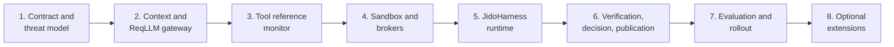

# Secure And Effective Agent Harness Implementation Plan

This eight-phase plan implements the
[Secure And Effective Agent Harness](../../research/02-secure-effective-agent-harness.md)
research: a deterministic, capability-secured harness kernel around disposable
Jido agents, with model access profiles, a ReqLLM gateway, a tool reference
monitor, production sandboxes and brokers, a delegated JidoHarness CLI
runtime, independent verification, digest-bound decisions, pull-request-only
publication, and a measured evaluation and rollout program.

## Harness Boundary

The harness extends the accepted graph-native factory. TripleStore remains
the only durable store; the harness adds no second workflow authority, no
provider-conversation persistence, no Jido hibernation snapshots, and no new
graph family. Runtime agents, provider conversations, sandboxes, worktrees,
journals, caches, and telemetry stay disposable. The model may plan,
investigate, select allowed tools, propose edits, and submit candidate
claims; it must not authorize effects, enlarge capabilities, declare
evidence sufficient, accept its own result, write durable knowledge, or
merge into a protected branch. Runtime success never satisfies a goal.

## Governing Input And Constraints

The governing research input is:

- [Secure And Effective Agent Harness](../../research/02-secure-effective-agent-harness.md)

This plan is execution structure, not architectural authority. The accepted
ADRs, architecture contracts, and phase receipts of the completed
[graph-native factory plan](../graph-native-managed-repository-factory/README.md)
remain binding. Proposed ontology, module, tool, protocol, and deployment
changes in the research still require implementation specifications, tests,
and any necessary ADR amendments. Nothing here weakens an accepted limit.

## Gate And Phase Mapping

| Gate | Required result | Phase |
| --- | --- | --- |
| HG1 - harness contract | Capability, context, invocation, tool, sandbox, approval, and publication resources plus the trust model are executable with conformance fixtures | Phase 1 |
| HG2 - model access | Revision-pinned context manifests and a pinned ReqLLM gateway enforce broker credentials, no silent fallback, and bounded invocation provenance | Phase 2 |
| HG3 - complete mediation | Every host-controlled effect passes the tool reference monitor with closed validation, invocation-before-effect commits, and fence-checked sinks | Phase 3 |
| HG4 - isolation | Repository code runs only in tiered production sandboxes behind credential and egress brokers | Phase 4 |
| HG5 - delegated runtime | JidoHarness CLI attempts run as delegated execution behind resolved adoption gates with proven cancellation containment | Phase 5 |
| HG6 - governed outcomes | Independent fresh-checkout verification, digest-bound single-use approval, and separate publication attempts precede any final-goal decision | Phase 6 |
| HG7 - measured autonomy | Evaluation tracks, adversarial suites, and rollout-stage gates bound how far any profile graduates | Phase 7 |
| HG8 - bounded extensions | MCP, remote agents, multi-agent, and autonomous merge remain separately gated extensions | Phase 8 |



## Phase Plans

1. [Phase 1 - Harness Contract And Threat Model](./phase-01-harness-contract-and-threat-model.md)
2. [Phase 2 - Context Compiler And ReqLLM Model Gateway](./phase-02-context-compiler-and-reqllm-model-gateway.md)
3. [Phase 3 - Tool Reference Monitor](./phase-03-tool-reference-monitor.md)
4. [Phase 4 - Production Sandbox And Brokers](./phase-04-production-sandbox-and-brokers.md)
5. [Phase 5 - JidoHarness Subscription Runtime](./phase-05-jidoharness-subscription-runtime.md)
6. [Phase 6 - Verification, Decision, And Publication](./phase-06-verification-decision-and-publication.md)
7. [Phase 7 - Evaluation And Controlled Rollout](./phase-07-evaluation-and-controlled-rollout.md)
8. [Phase 8 - Optional Extensions](./phase-08-optional-extensions.md)

Phase evidence is recorded in
`docs/architecture/harness-phase-01-receipt.md` through
`docs/architecture/harness-phase-08-receipt.md`, one receipt per phase.

## Planning Structure And Enforcement

Every phase follows this hierarchy:

```text
Phase
  description
  Section
    description
    Task
      description
      Subtask
```

- Phases use `N`; sections use `N.M`; tasks use `N.M.K`; subtasks use
  `N.M.K.L`.
- Every item is an unchecked Markdown checklist item until its acceptance
  evidence exists.
- Every phase, section, and task has its own description paragraph.
- Stable task anchors use `sah-pNN-*`; dependencies use `[after: {...}]`.
- Every task declares `[repo: jido_code]`.
- Every phase ends with its last section named `Phase N Integration Tests`.

Phase closure follows the planning phase closure pattern in `AGENTS.md`: a
phase closes only after its implementation pull request passes
clean-checkout CI and merges. Then the receipt pins the full merge-commit
SHA in Candidate Provenance, its Status and `Gate HGN` sections change from
merge-pending to accepted-at-merged-candidate with the merge date, the plan
ticks its phase checkbox, final integration-tests section checkbox,
phase-receipt task checkbox, and pin subtask, and the next phase is
authorized only from that pinned baseline. Gate reopening conditions are
never weakened or deleted; a gate reopens if any listed invariant fails.

## Non-Negotiable Invariants

1. A deterministic reference monitor mediates every host-controlled effect
   and retry plus the start, cancellation, and result adoption of every
   delegated CLI attempt.
2. Host-controlled tool inputs and outputs use closed structural and
   semantic validation; delegated CLI work receives only an outer coarse
   capability.
3. Repository and provider data remain untrusted regardless of origin.
4. Execution capabilities are scoped, attenuated, expiring, and
   fence-bound.
5. Every JidoCode-controlled lease-governed effect sink rejects stale
   fencing tokens; delegated CLI internals are disposable and all late
   outputs are rejected after cancellation or sandbox destruction.
6. Credentials never enter model context or host-controlled tool sandboxes;
   developer-local CLI use is an explicit local trust exception and a
   managed CLI never shares readable or reusable provider credentials with
   tool descendants.
7. Network egress is denied by default and brokered when required.
8. Executed repository code runs in a production-grade disposable sandbox.
9. Candidate generation, verification, decision, and publication authorities
   are separated.
10. Human approval is bound to an immutable action digest and an
    authenticated, authorized actor distinct from the execution actor when
    accepted policy requires that separation.
11. Durable memory promotion is a governed command, never an automatic
    model side effect.
12. Tools, images, dependencies, adapters, and model profiles are pinned by
    version and digest.
13. Recovery reconstructs authority from the graph rather than process or
    provider state.
14. Security and utility evaluations gate every supported model/tool
    profile.
15. Every attempt records an explicit access mode, authentication kind,
    billing mode, provider/model identity, and capability receipt.
16. Provider or billing fallback is never silent and requires accepted
    policy or user authorization.
17. The ReqLLM adapter requires an explicit broker result before invocation
    and proves ambient discovery is not reached; its application response
    cache, internal cross-call retries, provider-native effects, JSON/output
    repair, legacy type coercion, and telemetry payload capture are disabled
    or rejected unless separately accepted.
18. JidoHarness runs only after release/toolchain compatibility and prompt,
    journal, per-adapter process cancellation, tool-profile, isolation, and
    deployment-class credential-boundary gates pass.
19. Verification begins from an exact closed run and binds its completeness,
    accepted references, actors, and graph revisions to the evidence.
20. The initial configured product actor cannot graduate a profile beyond
    shadow mode without an independently authenticated and granted decision
    actor.

## Test And Evidence Rules

- Unit tests accompany the smallest deterministic schema, validation,
  authorization, capability, manifest, and adapter behavior.
- Integration sections exercise real seams, including an actual TripleStore
  dataset and, where the phase owns them, real provider fixtures, sandbox
  tiers, and CLI adapters; mocks cannot close a storage or isolation gate.
- Every integration section includes positive, negative, retry,
  concurrency, cancellation, restart, authorization, and adversarial cases
  relevant to its phase.
- Fixed clocks, deterministic IDs, immutable fixtures, and exact
  profile/tool/adapter revisions make replay comparisons meaningful.
- Raw prompts, hidden reasoning, and raw model responses remain ephemeral
  under the accepted privacy contract; only bounded normalized results,
  digests, and provenance enter the graph.
- Each phase receipt records the candidate commit, dependency and profile
  pins, fixture digests, commands run, relevant outputs, known limitations,
  and unresolved blockers.
- `mix precommit` passes before every phase receipt.
- Later phases rerun prior invariant suites. A regression reopens the
  earliest affected gate.

## Completion Definition

The plan is complete only when:

- one deterministic harness coordinator drives graph-owned transitions for
  attempts, leases, verification, decisions, and publication;
- every host-controlled model call flows through a pinned ReqLLM gateway
  with immutable, digest-attributed context manifests and honest
  reconstruction status;
- three explicit access modes (host API, host subscription, delegated CLI)
  are enrolled, brokered, and reported without silent fallback;
- every host-controlled effect passes the capability-enforcing tool
  reference monitor and every lease-governed sink rejects stale fences;
- repository code executes only inside tiered production sandboxes behind
  credential and egress brokers;
- delegated JidoHarness attempts are contained, cancellable, and recoverable
  from graph state alone;
- candidate patches are verified by an independent fresh-checkout verifier,
  accepted only through digest-bound single-use approval and governed
  decisions, and published only as bot branches and pull requests under
  separate attempts;
- every graduation beyond shadow mode is justified by pinned evaluation
  profiles, adversarial suites, and rollout gates with an independent
  decision actor; and
- architecture scans find no second durable store, no raw store-handle
  leakage, no unmediated effect path, and no unpinned tool, image, or
  provider surface.
