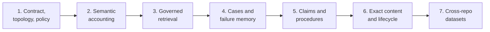

# Total Agent Memory Implementation Plan

This seven-phase plan implements the
[Total Agent Memory For Long-Lived Software Engineering](../../research/03-total-agent-memory-for-software-engineering.md)
research as complete semantic accounting plus selective governed memory. It
preserves exact provenance and explicit content state, derives temporal facts,
cases, artifact claims, and validated procedures, retrieves only small
authorized evidence packets, and never lets retained history grant authority.

## Memory Boundary

The graph remains the durable authority for identity, provenance, policy,
sequence, scope, retention, evidence, lifecycle, and memory status. Runtime
processes, retrieval indexes, caches, worktrees, provider conversations, and
telemetry remain disposable. Existing accepted knowledge remains the narrow
authority layer; episode evidence, cases, summaries, and procedures are
untrusted or advisory until the existing evidence and decision boundary accepts
a precise proposition.

The default runtime profile is `semantic_history`. The
`diagnostic_capture` and `project_total_history` profiles, cross-repository
reuse, dense retrieval adapters, and dataset export remain disabled until their
own accepted specifications and evidence gates pass. Secret values,
provider-private state, and hidden chain-of-thought are never retained.

Exact payload storage starts with bounded encrypted graph content. An
application-owned encrypted content vault is permitted only if the accepted
Phase 6 benchmark rejects graph-native content and a superseding ADR preserves
graph authority, recoverable commit ordering, encryption, backup consistency,
orphan cleanup, and complete erasure.

## Governing Input And Constraints

The governing research input is:

- [Total Agent Memory For Long-Lived Software Engineering](../../research/03-total-agent-memory-for-software-engineering.md)

The completed
[Graph-Native Managed Repository Factory](../graph-native-managed-repository-factory/README.md)
and [Secure And Effective Agent Harness](../secure-effective-agent-harness/README.md)
plans remain binding. This plan does not weaken the sole-store boundary,
semantic-command pipeline, actor separation, fencing, independent verification,
governed decisions, publication boundary, or any accepted gate reopening
condition.

The plan owns reviewed internal query products and bounded harness evidence
packets. It adds no public HTTP API or dedicated product UI. Phase 7 produces
governed evaluation or future-training datasets only; fine-tuning, model
registration, and deployment require a separate accepted plan.

## Protocol And Compatibility Baseline

- Ontology release `1.1.0` adds memory resources and shapes.
- Graph, data-policy, semantic-command, and reviewed-query contracts advance
  to a `2.0.0` memory protocol line because segmented run ordering is a
  breaking execution-layout change.
- New closed graph families are `run_event_segment`, `experience`,
  `content_lifecycle`, and gated `episode_content`.
- Existing closed run graphs remain immutable legacy evidence. New attempts
  use the segmented protocol after MG2; reviewed projections identify the
  protocol and never synthesize missing legacy events or bodies.
- No generic event, memory, record, or content CRUD command is allowed.
- Disposable indexes and future content storage adapters have no semantic or
  workflow authority.

## Gate And Phase Mapping

| Gate | Required result | Phase |
| --- | --- | --- |
| MG1 - memory contract | Stored bytes, capture profiles, topology, retention, privacy, erasure, compatibility, and capacity contracts agree | Phase 1 |
| MG2 - total accounting | Every expected execution event and body has bounded predecessor-chained provenance and an explicit content state | Phase 2 |
| MG3 - governed retrieval | Authorization precedes candidate generation and every packet is bounded, temporal, source-linked, and non-authoritative | Phase 3 |
| MG4 - experience memory | Success, failure, revert, flake, infrastructure, and ambiguous cases remain source-linked, quarantined, and applicability-filtered | Phase 4 |
| MG5 - grounded procedures | Artifact claims stale exactly on drift and procedures require independent evidence without becoming policy automatically | Phase 5 |
| MG6 - exact content | One accepted encrypted storage branch enforces permit-only access, lifecycle, backup, hold, and complete erasure | Phase 6 |
| MG7 - governed datasets | Cross-repository use and dataset export are purpose-bound, chronological, leakage-controlled, erasable, and measurably useful | Phase 7 |



## Phase Plans

1. [Phase 1 - Memory Contract, Topology, And Policy](./phase-01-memory-contract-topology-and-policy.md)
2. [Phase 2 - Total Semantic Accounting](./phase-02-total-semantic-accounting.md)
3. [Phase 3 - Governed History Retrieval](./phase-03-governed-history-retrieval.md)
4. [Phase 4 - Experience Cases And Failure Memory](./phase-04-experience-cases-and-failure-memory.md)
5. [Phase 5 - Artifact Claims And Procedural Memory](./phase-05-artifact-claims-and-procedural-memory.md)
6. [Phase 6 - Exact Content Storage, Access, And Lifecycle](./phase-06-exact-content-storage-access-and-lifecycle.md)
7. [Phase 7 - Cross-Repository Datasets And Release Acceptance](./phase-07-cross-repository-datasets-and-release-acceptance.md)

Phase evidence is recorded in
`docs/architecture/memory-phase-01-receipt.md` through
`docs/architecture/memory-phase-07-receipt.md`.

## Planning Structure And Enforcement

Every phase follows this hierarchy:

```text
Phase
  description
  Section
    description
    Task
      description
      Subtask
```

- Phases use `N`; sections use `N.M`; tasks use `N.M.K`; subtasks
  use `N.M.K.L`.
- Every item starts unchecked until its acceptance evidence exists.
- Every phase, section, and task has its own description.
- Stable task anchors use `tam-pNN-*`; dependencies use
  `[after: {...}]`.
- Every task declares `[repo: jido_code]`.
- Every phase ends with its final section named
  `Phase N Integration Tests`.
- Implementation uses one intentional commit per section and one implementation
  pull request per phase.

Phase closure follows the pattern in `AGENTS.md`: the implementation pull
request must pass clean-checkout CI and merge, the phase receipt must pin the
full merge-commit SHA and merge date, and the phase, final integration section,
receipt task, and pin subtask remain open until that provenance is recorded.
Gate reopening conditions are never weakened or removed.

## Non-Negotiable Invariants

1. `TripleStore` remains the only application-owned durable authority unless
   Phase 6 accepts a superseding encrypted-vault ADR.
2. Every eligible expected event and body records an explicit capture outcome;
   silent loss is forbidden.
3. Capture outcome, representation, location, availability, retention/erasure,
   and hold state remain independent dimensions.
4. Secrets, reusable credentials, provider-private state, and hidden
   chain-of-thought never enter durable memory.
5. Retrieved history is data, not instruction, and cannot grant tools,
   capability, policy, approval, evidence, decision, knowledge, or write
   authority.
6. Authorization constrains candidate generation itself; filtering only after
   lexical, graph, or dense search is forbidden.
7. Current policy, source, tests, evidence, and scope outrank historical
   frequency or similarity.
8. Event segments are bounded, contiguous, exact-set validated, immutable after
   closure, and linked through one guarded attempt head.
9. Closed legacy and segmented runs remain immutable and honest about protocol,
   completeness, unavailable content, and reconstruction limits.
10. Exact content requires encryption before semantic commit and a
    purpose-bound, expiring, single-use access permit before release.
11. Erasure propagates to payloads, indexes, summaries, cases, procedures,
    datasets, exports, providers, backups, and keys while preserving only
    lawful non-sensitive history.
12. Experience cases and procedure candidates remain non-authoritative;
    repetition and runtime success do not promote them.
13. Artifact evidence strength and current freshness remain separate.
14. Accepted propositions still require governed evidence, decision, and
    `AdoptKnowledge`; executable policy requires a separate policy command.
15. Retrieval indexes, embeddings, communities, summaries, and caches are
    disposable and rebuildable from authorized sources.
16. Cross-repository and dataset use require a separately accepted purpose,
    scope, actor, classification, temporal cutoff, and erasure generation.
17. Chronological evaluation forbids future patches, reviews, incidents, and
    delayed outcomes from leaking into earlier attempts.
18. Phase 7 does not train, register, or deploy models.
19. Existing graph, harness, verification, decision, publication, privacy, and
    gate-reopening invariants remain in force.
20. Any HTTP-backed provider or future vault adapter uses the existing
    `Req` library.

## Test And Evidence Rules

- Unit tests accompany the smallest ontology, shape, command, content-state,
  query, authorization, ranking, lifecycle, encryption, and dataset contract.
- Integration sections exercise real `TripleStore` persistence wherever the
  graph owns the seam; mocks cannot close storage, closure, retrieval,
  lifecycle, erasure, or restore gates.
- Each integration section includes positive, malformed, denial, stale
  revision, idempotent retry, concurrency, restart, authorization, and
  adversarial cases relevant to its phase.
- Tests use fixed clocks, deterministic IRIs, immutable fixtures, exact
  protocol versions, chronological cutoffs, and isolated temporary stores.
- Later phases rerun every earlier memory invariant suite. A regression reopens
  the earliest affected MG gate.
- Every phase receipt records dependency and protocol versions, fixture and
  corpus digests, commands run, relevant outputs, enabled/disabled posture,
  known limitations, and unresolved blockers.
- `mix precommit` passes before each phase receipt.

## Completion Definition

The plan is complete only when:

- every new attempt has bounded verifiable event segments and complete
  multidimensional accounting for expected content;
- authorized history queries and evidence packets are temporal, bounded,
  source-linked, scope-safe, and non-authoritative;
- reusable cases include success, failure, revert, flake, infrastructure, and
  ambiguous outcomes with exact lineage;
- artifact claims stale on exact dependency drift and procedures require
  independent evidence, applicability, exceptions, stop conditions, and
  lifecycle;
- exact retained content uses one accepted encrypted storage path, permit-only
  access, queryable lifecycle, backup consistency, holds, and complete
  classified erasure;
- cross-repository use and dataset exports remain separately authorized,
  chronological, leakage-controlled, and erasable;
- at least one launch memory product shows statistically supported benefit
  without a critical false-acceptance increase;
- adversarial gates show zero cross-scope retrieval, zero secret capture, zero
  future-patch leakage, and no path from remembered content to authority; and
- MG1 through MG7 are accepted at pinned merged candidates with all reopening
  conditions preserved.
