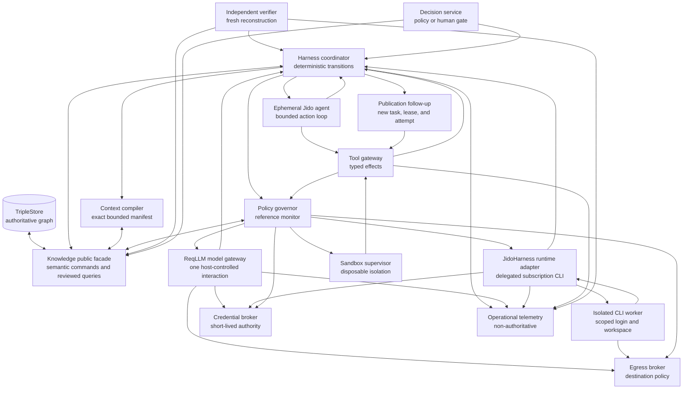

## 2. Secure And Effective Agent Harness For JidoCode

Status: proposed research architecture

Date: 2026-08-15

## Relationship To Existing Architecture

This document extends the proposed
[Graph-Native Managed Repository Factory](./01-graph-native-managed-repository-factory.md)
with a concrete agent-harness design. It focuses on how language-model agents
receive context, propose and execute actions, use tools, recover from failures,
produce evidence, and remain constrained by JidoCode's graph-native authority
model.

The accepted architectural decisions remain authoritative:

- [ADR 0001 - Graph-Only Source Of Truth](../adr/0001-graph-only-source-of-truth.md)
- [ADR 0002 - TripleStore Backend Contract](../adr/0002-triple-store-backend-contract.md)

The accepted implementation contracts also constrain this proposal, especially:

- [Execution Runtime Boundary](../architecture/execution-runtime-boundary.md)
- [Execution Attempt Lifecycle](../architecture/execution-attempt-lifecycle.md)
- [Execution Effects And Provenance](../architecture/execution-effects-provenance.md)
- [Verification And Evidence Boundary](../architecture/verification-evidence-boundary.md)
- [Governed Decision Outcomes](../architecture/governed-decision-outcomes.md)
- [Governed Knowledge Memory](../architecture/governed-knowledge-memory.md)
- [Product Security, Privacy, And Threat Model](../architecture/product-security-privacy-and-threat-model.md)
- [Module Boundaries](../architecture/module-boundaries.md)

This research does not authorize a second durable workflow store, direct model
access to the knowledge store, or a new persistence path. Proposed ontology,
module, tool, protocol, and deployment changes still require implementation
specifications, tests, and any necessary ADR amendments.

## Purpose

JidoCode already has the durable semantic foundations of a managed repository
factory: observations, goals, policies, leases, execution attempts, evidence,
decisions, and adopted knowledge are graph resources with provenance. It also
has a deliberately small Jido runtime whose workers are disposable.

What remains underspecified is the harness around a capable language model:

- how a model receives bounded, attributable input context with honest
  reconstruction status;
- which decisions belong to deterministic code rather than the model;
- how model-selected tools are typed, authorized, and invoked;
- how untrusted repository content is prevented from acquiring authority;
- how arbitrary repository code is isolated during builds and tests;
- how credentials and network access are kept outside model control;
- how developers use API keys, OAuth subscriptions, or installed subscription
  coding CLIs through one honest product experience;
- how candidate patches are verified independently;
- how retries, cancellation, process death, and ambiguous effects recover;
- when single-agent, multi-agent, or non-agent workflows are appropriate; and
- how utility, reliability, security, and product value are evaluated.

The goal is not maximum autonomy. The goal is the most useful autonomy that can
be made explainable, recoverable, least-privileged, and measurably safe.

## Research Question

> What agent harness best enables JidoCode to observe repositories, derive
> governed work, produce useful changes, verify outcomes, and learn from
> accepted results without allowing a probabilistic model or disposable runtime
> to become an authority boundary?

## Research Method

The recommendations synthesize four evidence classes:

1. Agent and reasoning research, including ReAct, planning/search, reflection,
   context use, tool use, and multi-agent failure analysis.
2. Software-engineering agent research, including SWE-bench, SWE-agent,
   Agentless, OpenHands, repository-graph retrieval, repair overfitting, flaky
   tests, and fresh-task benchmarks.
3. Security research and standards, including indirect prompt injection,
   AgentDojo, CaMeL, capability and information-flow controls, OWASP, NIST,
   OAuth, MCP security, software supply-chain provenance, and sandboxing.
4. Production engineering guidance from agent framework maintainers and teams
   operating long-running agent systems.
5. Direct source, guide, compatibility, security, and lifecycle review of the
   AgentJido ReqLLM and JidoHarness repositories.

Primary papers, specifications, standards, and first-party engineering reports
are preferred over secondary summaries. Quantitative benchmark results are
treated as evidence about a particular model, scaffold, task distribution, and
time, not as permanent capability claims.

### Evidence Limitations

- Most repository-agent benchmarks are Python-heavy and publicly available.
- Public tasks may have entered model training data.
- Benchmark scores conflate model, prompt, tools, retrieval, environment, and
  scaffold quality.
- Passing a test suite does not prove semantic correctness or security.
- Vendor engineering reports contain valuable production lessons but are not
  independent controlled studies.
- Security benchmarks cannot enumerate every adaptive attack.
- Current model behavior and protocol versions will continue to change.

The architecture therefore relies on stable security and distributed-systems
principles rather than assuming a particular model remains reliable.

### AgentJido Library Inspection Snapshot

The dependency findings in this document were refreshed from GitHub and checked
against `origin/main` on 2026-08-15:

| Library | Current inspected revision | Release state | Relevant toolchain |
| --- | --- | --- | --- |
| [ReqLLM](https://github.com/agentjido/req_llm) | `159f9e4b4a70550f8bdd412b5a8fe38f64706c68` | Latest Hex/GitHub release is `1.20.0`; inspected `main` is eight commits ahead | Declares Elixir `~> 1.15` and Req `~> 0.5` |
| [JidoHarness](https://github.com/agentjido/jido_harness) | `8bf0d52f4fed0d8a9d2594000d8b3a775da16f8b` | `mix.exs` declares `2.0.0`, but there is no Git tag, GitHub release, or Hex package | Declares Elixir `~> 1.19`; JidoCode currently declares `~> 1.18` |

Current GitHub `main` is research evidence, not a reproducible dependency pin.
Implementation must select a released version or exact commit, record its
digest, and rerun dependency, toolchain, security, license, and compatibility
tests. JidoHarness cannot be added to the current project until its Elixir
support contract is reconciled or JidoCode deliberately upgrades its accepted
toolchain.

## Executive Recommendation

Build the harness as a deterministic, capability-secured workflow kernel around
disposable Jido agents:

```text
graph-observed need
  -> deterministic workflow coordinator
    -> plan proposal and policy validation
      -> graph-visible lease and fencing token
        -> commit-pinned context manifest
          -> ephemeral Jido execution agent
            -> capability-enforcing tool gateway
              -> isolated repository sandbox
                -> candidate patch and provenance
                  -> independent fresh-checkout verifier
                    -> patch-approval decision
                      -> follow-up publication task
                        -> new lease and publication attempt
                          -> pull-request publication
                            -> external-state observation
                              -> post-change verification
                                -> final-goal decision
                                  -> governed knowledge adoption
```

The model may plan, investigate, select among allowed tools, propose edits,
interpret bounded feedback, and submit candidate claims. It must not authorize
effects, enlarge its own capabilities, declare evidence sufficient, accept its
own result, write durable knowledge directly, or merge into a protected branch.

Use one product-level `ModelAccessProfile` contract with three explicit access
modes:

| Access mode | Integration | Control model | Typical credential |
| --- | --- | --- | --- |
| `host_api` | ReqLLM | JidoCode owns each model turn and every local tool effect | API key, cloud identity, or brokered token |
| `host_subscription` | ReqLLM | Same host-controlled turn model where a reviewed OAuth/subscription provider is supported | OpenAI Codex OAuth, Anthropic OAuth, or GitHub Copilot token |
| `delegated_cli` | JidoHarness | One isolated coding CLI owns an internal agent loop; JidoCode governs the whole delegated attempt and verifies its candidate | Developer-local cached login or managed broker/helper |

The product can present these modes through one onboarding and task-selection
experience, but it must not claim they have identical capabilities. ReqLLM is
the preferred path when fine-grained host tool mediation is required.
JidoHarness broadens access for developers who already pay for coding-agent
subscriptions, but it receives only coarse-grained sandbox authority and cannot
perform JidoCode-controlled source-provider/Git publication, decision, or graph
mutations. Calls to the model provider and any enabled provider-native CLI tools
remain internal effects of the coarse delegated run.

The harness should be optimized in this order:

1. Correct authority and security boundaries.
2. Attributable context, reproducible effects, and evidence.
3. Reliable single-agent task completion.
4. Independent verification and calibrated abstention.
5. Cost, latency, and operator experience.
6. Selective planning, parallelism, and multi-agent execution when evaluations
   prove that added complexity improves outcomes.

## Definition Of An Agent Harness

For this proposal, the agent harness is the complete trusted system around the
model, any delegated coding CLI, and their disposable runtime processes. It
includes:

- deterministic workflow coordination;
- context selection and serialization;
- API-key, OAuth/subscription, and coding-CLI access profiles;
- prompt, model, tool, and policy versioning;
- capability issuance and authorization;
- tool validation and effect mediation;
- credential and network brokering;
- sandbox lifecycle and resource limits;
- attempt, invocation, artifact, and evidence provenance;
- independent verification;
- approval, decision, publication, and cancellation;
- recovery and reconciliation; and
- operational telemetry and evaluation.

The prompt is part of the harness, but it is not the harness. A system that
depends on the model obeying a prompt for authorization or containment does not
have a sufficient security boundary.

## Design Principles

### Deterministic Authority Around Nondeterministic Work

Model output is nondeterministic even when the prompt and sampling settings are
unchanged. Deterministic orchestration does not require deterministic model
output. It requires every decision-relevant bounded normalized result or digest
to become an immutable, revisioned observation before trusted code decides which
transition may follow. Raw prompts, hidden reasoning, and raw model responses
remain ephemeral under the accepted privacy contract.

Deterministic code owns:

- workflow state transitions;
- authorization and capability attenuation;
- lease acquisition, expiry, and fencing;
- budget enforcement;
- idempotency and retry classification;
- graph and repository revision checks;
- effect invocation;
- evidence completeness checks; and
- acceptance and publication policy.

The model owns only bounded problem-solving choices inside an authorized
attempt.

### Model As Untrusted Planner

The model should be treated as a useful but tainted planner. Its output may be
incorrect, manipulated by repository content, or intentionally adversarial.

The following are proposals, not authority:

- plans;
- selected tools;
- tool arguments;
- shell commands;
- generated tests;
- claims that checks passed;
- summaries of repository content;
- security assessments;
- requested credentials; and
- requests to remember information.

If prompt injection changes the model's intended action, the reference monitor
still limits effects to the current capability, scope, data-flow, revision, and
policy boundary. This reduces blast radius but does not guarantee safety: an
injected model may choose a harmful action that remains technically in scope.
Security claims must therefore name the enforced policy assumptions and attack
classes and be validated by adversarial evaluation.

### Candidate Production Is Separate From Acceptance

An execution agent may generate a patch, artifact, claim, or proposed evidence
bundle. A separate verifier reconstructs and evaluates that candidate. A
patch-approval decision may justify proposing follow-up publication work but
cannot satisfy the final goal. Publication is separate work with a new task,
authorization, lease, fence, and attempt; it never reuses the completed
execution attempt or decision authority. Goal satisfaction requires observation
of the resulting external state, post-change verification, and a later
`FinalGoal` decision under the accepted decision contract.

This preserves the existing architectural rule:

> Runtime success does not satisfy a goal.

### Graph State Is Durable; Runtime State Is Disposable

TripleStore remains the only durable application-owned state. Jido agents,
provider conversations, scheduler queues, sandboxes, worktrees, caches, and
telemetry traces are disposable working state. They need not themselves be
reconstructable; the graph retains the bounded semantic facts required for
workflow recovery. Here, caches means application response, retrieval, or
projection caches. OAuth/login files are external secret-provider state with
their own ownership and retention contract, not disposable application caches.

The harness must not use:

- Jido hibernation or thaw as a second source of product truth;
- LangGraph checkpointers or memory stores;
- Temporal event history as an additional durable workflow authority;
- provider conversation IDs as the only record of context;
- local transcript files as durable memory; or
- an MCP server's task state as JidoCode workflow truth.

Useful patterns from those systems may be implemented through graph resources
and semantic commands without adopting their storage models.

## Proposed Harness Architecture



### Harness Coordinator

The harness coordinator drives a closed sequence of activities from graph
projections. It does not infer authority from in-memory process state. The
sequence is not one mutable workflow status: tasks, leases, attempts, evidence,
decisions, and publication work retain separate transition chains.

| Resource | Harness coordination responsibility |
| --- | --- |
| Observation and goal | Select exact current inputs and applicable intent |
| Plan and task | Propose, validate, adopt, and determine eligibility |
| Lease | Acquire, renew, expire, release, or supersede with its own fence |
| Execution attempt | Prepare, run, complete, fail, cancel, or abandon |
| Verification activity | Evaluate exact artifacts and issue an evidence sufficiency assessment |
| Decision | Accept, reject, defer, waive, supersede, or request more evidence |
| Publication task | Create separate follow-up work with a new lease and attempt |

Cancellation, expiry, supersession, abandonment, recovery, evidence assessment,
decision, and publication remain explicit activities over the appropriate
resource rather than values in one aggregate state machine.

#### Reasoning

Agentless and production guidance show that simple staged workflows can match
or outperform more autonomous scaffolds while being easier to debug. JidoCode
also already represents goals, tasks, dependencies, leases, attempts, evidence,
and decisions durably. Letting a model replace that control loop would discard
existing safety and recovery properties.

#### Tradeoff

A closed workflow limits spontaneous model behavior. That is intentional for
routine work. Open-ended planning can still occur inside a proposal stage when
the task cannot be decomposed in advance.

### Context Compiler

`RecordExecutionAttempt` must be revised to create the first immutable
`ContextManifest` in the new run graph atomically with the attempt, prepared and
starting transitions, task/lease transitions, and graph metadata. The attempt's
existing context digest identifies that manifest. There is no separately
precreated run graph and no runtime dispatch between these writes.

Each host-controlled model invocation then receives a versioned
`ContextManifest` that identifies:

- attempt, lease, goal, task, and enrollment IRIs;
- exact model-access profile, backend mode, authentication kind, and billing
  classification;
- repository, branch policy, base commit, and source snapshot;
- ontology, query, policy, workflow, prompt, model, ReqLLM or JidoHarness, CLI,
  and tool revisions;
- every graph resource and source excerpt included in context;
- deterministic serialization and ordering;
- content digests and classification labels;
- requested ceilings plus per-dimension enforcement classification for tokens,
  model calls, tool calls, elapsed time, output, resources, and cost;
- current objective and unresolved evidence; and
- the exact capability-derived host tool manifest.

Both initial and later manifests enforce the accepted limits: at most 20 source
graphs and 200 items, 262,144 serialized bytes, 65,536 estimated tokens, 16,384
bytes for one instruction, and 32,768 bytes for one source item. The command,
including provenance and audit, also stays within 16 target graphs and 1,000
effective additions. The manifest records truncation, omissions, measurement
method, and each retained reference. A larger or chunked protocol requires a
separately specified atomicity, completeness, and recovery contract.

Before every host-controlled model call, `RecordModelInvocationStart` atomically
appends the started activity and either references the existing first manifest
or creates and references the next immutable manifest when context changed. It
requires an open run, current lease/fence, expected revisions and sequence, and
all context bounds before provider dispatch. A failed or ambiguous commit does
not dispatch until status recovery proves the start was accepted.
`RecordModelInvocationOutcome` closes that invocation under the next expected
sequence. `FinalizeExecutionRun` requires the complete manifest and invocation
start/outcome reference sets through the terminal sequence. These commands
extend the accepted protocol and require versioned ontology, shape, query,
fixture, and source-manifest updates; they are not informal preparation writes.

A delegated CLI instead receives a `delegated_input` manifest containing only
what JidoCode supplies or enforces: workspace snapshot, task prompt digest,
selected CLI/model/profile and configuration, environment policy, and outer
coarse capability and limits. Provider-internal prompts, context assembly,
memory, internal model turns, and tool manifests are explicitly `unavailable`,
not inferred from Harness events.

Recommended context order is:

```text
1. stable system contract and role
2. lease-derived authority summary
3. task and acceptance criteria
4. applicable policy and repository metadata
5. selected graph resources and source excerpts
6. stable tool definitions
7. recent structured observations
8. current objective and remaining checklist
```

Large data is retrieved just in time through authorized query tools. Context
compaction creates a new explicitly lossy summary linked to all source
observations. It never replaces those observations or becomes accepted
knowledge merely because an agent generated it.

#### Reasoning

Long-context research shows that models do not use all positions equally.
Repository-agent studies also show that excessive code and graph context can
reduce performance. Host manifests make JidoCode-supplied inputs
digest-attributable and explain their authorized revision boundary; reviewed
Knowledge queries and per-call capability enforcement prevent host access
outside it. They are replayable only when every byte is reconstructable from
retained immutable templates, normalized exchanges, and content-addressed
artifacts whose retention covers the claim. Otherwise the manifest records
`partial` or `unavailable` reconstruction and the missing classes. Raw prompts,
responses, and tool output remain ephemeral under the privacy contract, so a
digest alone never implies replayability. Candidate reproducibility instead
comes from retaining and re-verifying the exact candidate artifact. Delegated
manifests make no claim about provider-internal context completeness.

#### Tradeoff

Context selection can omit useful information. The harness should allow bounded
follow-up retrieval and record retrieval misses, rather than solving omission by
exposing the entire repository or dataset.

### Model Access Profiles

Users enroll one or more non-secret `ModelAccessProfile` resources. A profile
binds:

- accountable actor and repository or fleet scope;
- credential owner, authenticated invoking principal, and any accepted
  delegation or authorization-grant IRI;
- access mode: `host_api`, `host_subscription`, or `delegated_cli`;
- provider, model selector, endpoint identity, and allowed modalities;
- external `CredentialReference` and authentication kind;
- API, OAuth, subscription, or unknown billing mode;
- model/tool/context limits and supported structured output;
- whether local tools are host-mediated or CLI-managed;
- required sandbox and egress class;
- provider, ReqLLM, JidoHarness, CLI, and catalog versions;
- approved task and risk classes;
- readiness evidence and last verification time; and
- data-use, retention, and provider-policy constraints.

Secret bytes, local credential paths, raw provider session IDs, and CLI auth
files never enter the profile. The graph stores opaque references, fingerprints,
capability claims, and lifecycle audit.

The current product authentication surface maps every valid browser session to
one configured product principal and actor. Initial subscription support is
therefore single-operator only: a credential is enrolled by and usable only as
that configured actor, and CLI readiness cannot establish another human's
identity. Managed multi-user subscription use is blocked until authentication
identifies distinct human principals and every invocation proves either
credential-owner equality or a current graph `Delegation`/`AuthorizationGrant`.
The invocation records initiating principal, accountable actor, credential
owner, and consent or delegation. A provider account subject is Personal data:
when policy requires it, only a redacted or fingerprinted value enters the
authorized security-audit graph, never the run graph or ordinary telemetry.
Revocation invalidates readiness before another dispatch.

For each dispatch, credential release is the linearization point. After the
committed invocation/run start and immediately before external dispatch, the
broker rechecks current profile and credential revisions, owner/delegation,
revocation generation, and invocation identity, then issues one release permit.
A revocation committed before that point yields a recorded no-dispatch outcome;
a revocation after it blocks every later dispatch and requests cancellation of
the already authorized in-flight effect. Readiness cached before this check has
no authority.

This single configured actor cannot satisfy a decision policy that requires the
accepting, waiving, or superseding actor to differ from the execution actor.
Initial single-operator subscription profiles are therefore limited to shadow
execution and candidate inspection unless policy already supplies a separately
authenticated and granted decision actor. Advancing to an accepted outcome,
human-approved publication, or managed multi-user use requires that independent
identity; CLI account identity is not a substitute.

Profile selection is explicit and policy constrained. JidoCode may recommend a
compatible profile based on task capability and readiness, but it never silently
falls back from subscription to metered API access, changes provider, or changes
model. Such a fallback can alter billing, privacy, capability, and provider
terms. A user or accepted policy must authorize the exact ordered alternatives.

Readiness is capability-specific rather than one boolean. It distinguishes
installed, credential-available, authenticated, model-available, sandbox-ready,
policy-allowed, and live-verified states. A non-billable inspection may still
report authentication as unknown; an optional live smoke request requires
explicit user consent because it can consume API or subscription usage.

#### Reasoning

A common profile and onboarding surface makes API and subscription access feel
consistent to developers while preserving the material difference between a
single model interaction and an autonomous coding CLI. Capability negotiation
prevents the UI or scheduler from offering a workflow that the selected access
path cannot safely perform.

#### Tradeoff

Explicit profiles and no silent fallback introduce setup choices that a generic
provider string would hide. Those choices are necessary because billing source,
credential ownership, tool mediation, model identity, and sandbox guarantees
are product and security semantics, not transport details.

### ReqLLM Model Gateway

JidoCode should use [ReqLLM](https://github.com/agentjido/req_llm) instead of
building provider wire adapters directly on `Req`. ReqLLM already uses Req for
buffered requests and Finch for streaming, normalizes provider models,
responses, tool calls, usage, warnings, finish reasons, errors, structured
outputs, and capability metadata, and maintains fixture-backed provider
compatibility evidence.

The integration follows ReqLLM's documented host boundary:

| ReqLLM owns for one interaction | JidoCode owns across interactions |
| --- | --- |
| Resolve one approved model spec | Select and authorize the model profile |
| Perform one buffered call or stream | Decide when a model effect may occur |
| Normalize response, usage, tool calls, and errors | Govern tools, approvals, retries, loop limits, and cancellation |
| Build canonical tool-result messages | Execute tools and decide whether to call again |
| Emit call-scoped telemetry | Persist provenance, recover work, verify, and decide |

The adapter should depend only on stable public functions such as
`ReqLLM.model/1`, `generate_text/3`, `stream_text/3`,
`ReqLLM.Response.classify/1`, `tool_calls/1`, `usage/1`,
`call_metadata/1`, `ReqLLM.ToolCall.resolve/3`, and canonical context helpers.
It must not call ReqLLM tool-execution helpers or provider-internal modules.

Every ReqLLM call remains an external effect. Factory compiles a closed model
profile, authorizes the provider, endpoint, data classes, credential, options,
and budget, commits the invocation, and then calls the integration adapter.
Runtime agents never call ReqLLM directly.

The initial secure ReqLLM profile should enforce:

- an exact allowlisted model and server-owned endpoint;
- per-call credentials from the credential broker;
- `load_dotenv: false`, no application-global keys, and an adapter precondition
  requiring a nonempty explicit credential before ReqLLM is called;
- no ReqLLM application response cache or serialized
  `%ReqLLM.Context{}`/`Response{}`;
- `max_retries: 0` so Factory reauthorizes every retry;
- finite receive, total, stream-idle, and metadata timeouts;
- strict structured-output validation with `json_repair: false`, no
  `output_repair`, and `ReqLLM.ToolCall.resolve/3` also called with
  `json_repair: false` for actions;
- rejection of any repair/legacy-coercion diagnostic, plus independent validation
  of retained raw tool arguments before ReqLLM-transformed values are trusted;
- a second JidoCode schema and semantic authorization pass;
- telemetry payload capture disabled and bounded error normalization;
- the OpenAI `store` request field forced to `false` where applicable;
- no arbitrary `base_url`, HTTP hooks, custom providers, or provider options;
- no provider-side memory, previous-response continuation, or reusable provider
  WebSocket session as workflow truth; and
- no provider-executed builtins, hosted MCP, code interpreter, file search, or
  web search until their effect and evidence contracts are separately accepted.

ReqLLM does not currently expose one global switch that disables every ambient
credential source. Per-call credentials have precedence, so the JidoCode adapter
must fail before invoking ReqLLM when the broker did not return an explicit
credential and must enable only provider profiles whose explicit credential path
has been verified. Providers that default to ambient ADC, node-global token
caches, or service-account discovery, including unreviewed Google Vertex
profiles, remain disabled until a broker-only call path is proven.

ReqLLM's nominal strict output mode can still accept legacy string-to-number or
string-to-boolean coercion for models not marked `json_strict?`. Initial action
profiles therefore require a model with proven strict JSON behavior and reject
nonempty repair/coercion diagnostics. If the adapter cannot retain and validate
the raw pre-coercion arguments, that provider/model remains ineligible for
effect-bearing structured output. Disabling `json_repair` and `output_repair`
alone is not sufficient.

Omitting tools is not sufficient evidence that a provider request has no hosted
effects. Provider/model metadata can cause ReqLLM to add a native tool for some
specialized model categories. Initial profiles reject deep-research or other
auto-tool model metadata and use fixture/wire conformance tests to prove the
final encoded request contains no provider-executed tools.

ReqLLM may retry transport operations internally by default, but those retries
do not call JidoCode's reference monitor. Disabling them is therefore required
for the first integration. A later exception would need a bounded retry class
whose endpoint, credential, input digest, and lack of external side effect are
proven unchanged.

Provider conversation or response IDs remain external references. Recovery is
driven from graph-owned semantic state and starts another explicit ReqLLM
interaction. Provider state cannot be the only durable memory of an attempt.

Private chain-of-thought is not required for provenance. Under the accepted
privacy contract, full prompts, hidden reasoning, and raw model responses remain
ephemeral and are never persisted. The graph records template/context digests,
normalized proposals, selected actions, bounded rationales, call metadata,
observations, claims, usage, and evidence references after redaction.

Disabling ReqLLM's application cache and setting a provider request field do not
prove that a provider performs no safety retention or native prompt caching.
Each model-access profile records the provider's contractual retention, training,
and cache posture as residual external behavior.

#### Streaming Contract

Streaming is enabled only after buffered-call behavior passes. The adapter
chooses one `ReqLLM.StreamResponse` view, retains the response handle, waits for
complete assembled tool calls and one terminal event, and never executes a tool
from a partial delta. One supervised stream-consumer task owns enumeration. After
a committed cancellation request or lease loss, a separate coordinator calls
`ReqLLM.StreamResponse.close/1`, waits a finite interval for the consumer, and
forcibly terminates it if needed. The consumer also closes the retained response
in an `after` block on success, error, early stop, or cancellation. It never
consumes one view and later attempts to materialize another. Revision/sequence
guards allow exactly one completed, cancelled, timed-out, or failed invocation
outcome to win the race. Partial content before cancellation or error remains a
non-authoritative observation.

#### API-Key Access

API keys and cloud credentials are resolved per call from the existing secret
provider boundary and passed only to the trusted ReqLLM adapter. ReqLLM's own
environment, application-config, in-memory global key, and dotenv discovery
paths are bypassed by requiring the explicit broker result before the call. This
preserves per-actor and per-repository scope and avoids ambient credentials
becoming an invisible fallback. The adapter cannot claim they are disabled
inside ReqLLM itself; it proves they are never reached.

#### Host-Controlled Subscription Access

ReqLLM currently exposes subscription-related paths including OpenAI Codex
OAuth, Anthropic OAuth/subscription compatibility, and GitHub Copilot tokens.
These paths are preferable to a delegated CLI when they preserve the same
one-interaction host boundary, but each requires a separate compatibility,
provider-terms, and security profile.

Subscription onboarding registers an external credential source rather than
copying tokens into the graph:

- explicit short-lived access tokens can be passed directly by the broker;
- `gh auth token` may be wrapped by a developer-local credential adapter and
  passed to ReqLLM per call instead of allowing ambient CLI lookup;
- OAuth files must be explicitly enrolled, outside the repository, store, and
  sandbox, owned by the developer, non-symlinked, and permission checked;
- default `oauth.json`/`auth.json` current-directory discovery is disabled; and
- one profile cannot concurrently let ReqLLM and a provider CLI refresh the same
  credential file.

ReqLLM can refresh and rewrite supported OAuth files. That behavior treats the
file as an external secret-provider cache, not JidoCode durable state, but its
current lock does not coordinate with independent CLI processes. Managed or
multi-user deployments should therefore use a dedicated credential broker that
owns refresh and supplies an access token. Direct file-backed refresh is limited
to an explicit developer-local profile until cross-process ownership is solved.

Anthropic subscription compatibility shapes requests to match a particular CLI
contract, OpenAI Codex targets a ChatGPT backend, and GitHub Copilot availability
is account dependent. These are version-sensitive integration contracts, not
generic OAuth guarantees. They must be pinned, live-tested with user consent,
and reviewed against current provider terms before release. When direct
subscription use is not an accepted public integration contract, JidoCode should
prefer the provider's official CLI through JidoHarness rather than emulate that
CLI over an undocumented endpoint.

#### Reasoning

ReqLLM removes duplicated provider codecs, model metadata, streaming, usage, and
authentication work while preserving the exact ownership split this architecture
requires: one normalized model interaction inside a host-owned control loop. It
also enables some subscription accounts to retain fine-grained JidoCode tool
mediation instead of requiring a more opaque CLI agent.

#### Tradeoff

ReqLLM adds a fast-moving provider and model-catalog dependency. The inspected
main revision is ahead of release `1.20.0`, and its lock currently tests a newer
Req than JidoCode's constraint allows. Adoption therefore needs a pinned release
or commit, a Req `0.6.3` compatibility spike, dependency/security review, and
fixture plus live tests for every enabled model profile.

### JidoHarness Subscription CLI Runtime

[JidoHarness](https://github.com/agentjido/jido_harness) normalizes installed
coding-agent CLIs rather than raw LLM APIs. Current main supports Amp, Claude
Code, Codex, Gemini CLI, Grok, Kimi Code, OpenCode, Pi, and Z.AI through
supervised runs, sessions, managed processes, normalized results, ordered
events, readiness, capability declarations, and provider-dependent cancellation.

JidoHarness is not another implementation of the ReqLLM model port. A CLI may
plan, inspect files, edit, run commands, manage its own context, and use
provider-native tools internally. The correct mapping is a
`JidoCode.Runtime.HarnessAdapter` implementing the existing execution-runtime
port. One Harness run or session turn is a delegated execution activity inside
one graph-authorized JidoCode attempt.

JidoCode retains authority over:

- whether the delegated attempt may start;
- exact repository snapshot, workspace, limits, and task instructions;
- selected provider, CLI, model, and capability profile;
- outer sandbox, environment, credentials, and egress;
- cancellation, lease, and fencing at the adapter boundary;
- candidate artifact and final workspace-diff capture;
- independent verification, decision, publication, and knowledge adoption; and
- all durable state and provenance.

Harness run IDs, session IDs, provider session IDs, event cursors, process IDs,
and journals are disposable runtime references. They may support reattachment
inside one BEAM lifetime but cannot be required for restart recovery. After a
restart, graph recovery classifies a missing CLI process as a runtime diagnostic,
not a new `crashed` attempt state. It uses the accepted transition vocabulary:
recover a provable missing terminal callback; supersede on runtime-version,
source, or policy incompatibility; propagate an in-progress cancellation; and
abandon after the lease becomes inactive or expires. An unavailable process or
sandbox remains `retry_later` rather than inventing a terminal state. `failed`
or `timed-out` requires an attributable terminal runtime event under the current
accepted contract. A future provably-dead/non-resumable transition rule requires
a versioned recovery-policy and command-protocol extension. Any retry is a new
attempt linked with `retryOf`; it starts only after the predecessor terminal
transition and closure commit, and obtains a new lease/fence whenever the prior
lease is no longer executable.

#### Outer Isolation Is Mandatory

JidoHarness explicitly states that coding CLIs execute with the OS permissions
of the BEAM process and that normalized `sandbox_mode` and `approval_mode`
values are requested provider semantics, not a universal OS sandbox. The
production adapter must therefore run in a dedicated disposable worker or
microVM, not as an unrestricted subprocess of the Knowledge-owning BEAM.

The isolated CLI worker receives:

- one disposable worktree at the exact snapshot;
- no store handle, graph endpoint, provider publication credential, SSH agent,
  Docker socket, host filesystem, or unrelated repository;
- a profile-specific credential delivery mechanism described below;
- `env_mode: :replace` with a minimal PATH, HOME, TMPDIR, locale, and provider
  variables;
- provider endpoint egress only, plus separately approved package mirrors;
- hard finite outer run/session-turn count, idle time, wall-clock runtime, output,
  process, memory, and disk limits, plus CLI-internal turns, tokens, cost, and
  subscription-usage ceilings only where the selected profile can enforce or
  reliably report them;
- no additional directories, project extensions, MCP servers, skills, or
  provider configuration unless included in the accepted profile; and
- no protected-branch or external publication authority.

CLI-native sandbox and approval modes remain defense in depth. Capability
declarations determine whether a mode can even be requested, but only the outer
isolation boundary is trusted for containment.

Two deployment classes must remain distinct:

- `developer_local_cli` is an explicit local opt-in that reuses the developer's
  provider CLI login under the same trust assumptions as running that CLI
  manually. It does not claim managed secret isolation.
- `managed_delegated_cli` is blocked until the provider controller can obtain or
  refresh credentials through a broker/helper that tool descendants cannot
  read, copy, or invoke outside the authorized provider request.

A managed design may use a credential-attaching provider proxy, an
executable/cgroup-bound helper, or a provider-specific split controller/tool
process model, but each implementation requires adversarial proof. Mounting a
login cache into the same process tree as repository commands is not an accepted
managed credential boundary.

#### Current JidoHarness Adoption Blockers

The inspected current main is not ready to be a JidoCode production dependency:

1. It is unreleased and declares Elixir `~> 1.19`, while JidoCode uses `~> 1.18`.
2. Prompts are passed in CLI argv by built-in adapters, exposing them to process
   inspection within the execution environment.
3. Runs, sessions, and child processes write size-configured JSONL journals;
   there is no complete memory-only mode propagated through every nested
   process, and one oversized record can exceed both segment and disk limits
   because pre-write rotation neither rejects nor splits it and post-write
   pruning keeps the current segment.
4. Journals may contain source fragments, model text, filenames, and command
   output even though structured credentials and raw provider records are
   redacted.
5. Provider sandbox, approval, native-tool, file-change, usage, and interaction
   capabilities differ and are intentionally not normalized into guarantees.
6. A verified deny-all-tools mode is not uniformly available; an empty tool list
   can mean no CLI flag rather than no tools.
7. JidoHarness is not a workspace provisioner, durable job system, retry engine,
   provider router, or OS isolation layer.
8. Current CLI process trees can expose a cached provider login to repository
   tool descendants, and there is no cross-provider credential-helper contract
   that separates refresh authority from those descendants.
9. Z.AI delegates execution to the Claude adapter but does not expose Claude's
   `cancel/2` callback or native-cancel capability. Cancelling the adapter task
   can leave the OS process group alive until timeout or retention cleanup.

Before managed production use, either the library or a pinned JidoCode
integration must provide stdin or protected-file prompt transport; disabled,
memory-only, or separately owned journals inaccessible to tool descendants;
per-record and total retention bounds; verified deny-all and bounded-tool
profiles; Elixir/OTP compatibility evidence; and a production-supported isolated
process-launch boundary. Every enabled adapter must prove cancellation kills its
CLI parent and descendant process group within a bound; Z.AI remains disabled
until its callback gap is fixed. Managed use additionally requires inaccessible
brokered credential delivery and serialized refresh ownership. Until then, only
explicit developer-local opt-in experiments are permitted, in a dedicated
disposable environment whose process namespace and filesystem are destroyed
after each attempt. Disposable disk journals are acceptable only under that
local trust class and must be disclosed.

#### CLI Evidence Boundary

Normalized Harness events improve progress UX and diagnostics, but they do not
prove complete tool mediation. Missing structured file-change or tool events do
not mean no effect occurred. JidoCode records the delegated run, CLI/provider
versions, bounded normalized lifecycle observations, final workspace digest,
candidate diff, and artifacts. Independent verification from a fresh checkout
remains the correctness authority.

#### Reasoning

Many developers already pay for capable coding agents and should not need a
second metered API account to use JidoCode. JidoHarness provides a broad,
provider-aware CLI normalization layer and caller-independent supervision while
keeping its runtime explicitly ephemeral. Treating it as delegated execution,
rather than pretending it is one model call, preserves truthful capability and
evidence boundaries.

#### Tradeoff

The CLI path offers less fine-grained control and more supply-chain, credential,
and sandbox complexity than ReqLLM. Some CLI-internal actions cannot be committed
before each effect or represented canonically. JidoCode must compensate with
coarse capability limits, strong outer isolation, no high-impact credentials,
workspace-diff capture, and independent verification. Policies may correctly
disallow `delegated_cli` for high-risk tasks even when the user has a valid
subscription.

### Seamless Developer Onboarding

The product should make access choice simple without hiding backend semantics:

1. Discover configured API credential references and supported ReqLLM profiles.
2. Ask JidoHarness for non-billable CLI installation, version, authentication
   evidence, and capability status from the same runtime environment that will
   execute work.
3. Present API, direct-subscription, and CLI-subscription choices together with
   model availability, billing mode, tool-control class, sandbox requirement,
   and task eligibility.
4. Enroll an opaque credential source and fingerprint; never import token bytes
   into the graph.
5. Offer one explicit live smoke request when static readiness cannot establish
   authentication, warning that it may consume metered or subscription usage.
6. Bind a default profile to the actor and optional repository/task scope while
   allowing an explicit per-task override.
7. Recheck readiness and policy at lease acquisition and invocation time.

In the initial single-operator product, enrollment requires the authenticated
configured operator. A CLI `is_authenticated` result is only credential
availability evidence, not actor identity. Multi-user onboarding cannot ship by
reusing a machine-global CLI login; it requires distinct authenticated human
principals, owner-bound credential references, explicit delegation, isolated
session state, and revocation checks.

ReqLLM usage and estimated cost are normalized where providers expose them.
Subscription CLIs may report incomplete usage and no monetary cost. The profile
therefore records accounting mode as `metered_api`, `subscription`, or `unknown`
and always enforces non-monetary turn, time, output, process, and resource
budgets at boundaries it owns. For a delegated CLI, this means outer run/session
turns and worker resources, not unobservable internal model turns.

Every budget dimension records a requested ceiling, enforcement class
(`hard`, `next_effect`, `observed_only`, or `unavailable`), observed amount,
measurement source, and uncertainty. A request option or CLI flag is not called
enforcement without a conformance test. ReqLLM output-token limits can be hard
request bounds, while cumulative token or cost limits are normally
`next_effect` breakers because the completed call can cross them. A CLI that
does not expose trustworthy token or cost data reports those dimensions as
`unavailable`; JidoCode does not present them as enforced subscription budgets.

Errors remain explicit: unavailable credentials, unsupported capabilities,
provider login required, model unavailable, and policy denied are not collapsed
into an automatic provider fallback. This makes the normal path seamless while
keeping billing and authority understandable.

#### Reasoning

Developers should be able to reuse an existing subscription without learning
the internal runtime distinction. A capability-aware profile lets the product
offer one task experience while preserving honest security and cost
explanations.

#### Tradeoff

Readiness checks and capability displays add onboarding UI and periodic health
work. They avoid a worse experience in which a task starts under the wrong
billing account, silently loses tool or sandbox features, or fails after doing
partial work.

### Policy Governor And Reference Monitor

The policy governor converts the current lease, task, repository policy, actor,
and data classification into an attenuated capability set. It is consulted
immediately before every JidoCode-mediated effect, including retries. For a
delegated CLI, it authorizes the whole bounded run and its outer sandbox because
CLI-internal effects are not uniformly interceptable.

An attempt capability should bind:

- repository and enrollment scope;
- exact `ModelAccessProfile`, backend mode, provider, model, and version;
- host-mediated or delegated-CLI control class;
- exact base snapshot and graph revisions;
- permitted tool identities and versions;
- allowed filesystem paths and Git refs;
- graph read and candidate-write scopes;
- network destinations and methods;
- data classifications allowed at each destination;
- maximum files, lines, bytes, processes, and resources;
- credential references that trusted adapters may resolve;
- expiry and monotonic fencing token;
- idempotency namespace; and
- whether the attempt may propose or execute the named task effects.

Execution capabilities never include decision, acceptance, ontology, security
policy, durable-memory, verification, or publication authority. Verification
uses separately authorized commands over exact artifact and graph revisions.
Publication uses a separate follow-up task, lease, fence, and attempt.

#### Reasoning

Prompt injection is a confused-deputy problem: attacker-controlled data
influences a model that holds legitimate user authority. Capability enforcement
at each host-mediated effect prevents injected content from expanding that
authority. The delegated-CLI path cannot claim the same complete mediation and
must instead rely on a narrower coarse capability and outer containment. This is
the central design lesson of CaMeL and classic complete-mediation principles.

#### Tradeoff

Fine-grained capabilities require more policy and tool metadata. That cost buys
bounded compromise impact, better explanations, and safer automated approval.

### Tool Catalog And Gateway

The tool catalog is a closed, versioned collection of model-facing contracts.
It is the authoritative tool interface for ReqLLM-backed host-controlled agents.
Each tool definition records:

- stable name and version;
- input and output schema digests;
- capability and effect class;
- preconditions and expected revisions;
- side effects and reversibility;
- timeout, retry, and idempotency policy;
- maximum output size;
- approval requirements;
- adapter identity and supply-chain digest; and
- safe error vocabulary.

Recommended initial model-facing tools are:

```text
search_source(query, scope, limit)
inspect_symbol(symbol_iri, edge_types, depth, limit)
read_file(path, range, expected_digest)
apply_edit(path, expected_digest, match, replacement)
create_file(path, content)
delete_file(path, expected_digest)
run_registered_check(check_id)
run_governed_command(command_id, arguments)
show_candidate_diff()
submit_candidate(summary, claims)
request_clarification(question)
```

Every input passes closed structural validation and semantic validation. Unknown
properties, path traversal, absolute paths, ambiguous replacements, unauthorized
refs, unapproved destinations, and scope-expanding arguments are rejected before
an effect.

Raw shell access is a separate high-risk capability. Routine tasks should use
registered commands whose executable, working directory, arguments, environment,
network policy, and resource limits are server-owned.

Jido directives may describe requested effects, but the runtime interpreter has
no semantic-command authority. It submits a normalized proposal to the Factory
coordinator. `RecordToolInvocationStart` atomically writes the bounded classified
proposal digest/references and started invocation to the run graph; the normal
Knowledge command pipeline writes successful command authorization provenance
and audit to the security-audit graph through the accepted writer. Raw
secret-bearing arguments are not persisted. After the receipt, Factory
revalidates current policy, revisions, capability, and fence immediately before
the effect, executes through the gateway, and records the bounded outcome
through the same facade. A race-time denial after an admitted start becomes an
authorized no-effect outcome. A request rejected before command admission gets
only the accepted concealed transient receipt unless a separate bounded
rejection-audit protocol is later defined. Persisted authorization explains the
start decision but is never reusable effect authority. A directive is never
authority by itself.

JidoHarness CLIs may use internal tools that do not pass through this gateway.
Their accepted profile therefore exposes only coarse workspace, command,
network, and resource authority enforced by the outer sandbox. CLI event records
are observations, not proof that all internal tools were enumerated or approved.

#### Reasoning

SWE-agent's controlled experiments show that agent-computer interface design
materially changes task success. Small, distinct tools with immediate feedback
reduce formatting errors, unnecessary context, and dangerous ambiguity.

#### Tradeoff

A small interface may initially exclude legitimate workflows. New tools should
be added from observed failure cases with explicit schemas, policy, and tests,
not by granting a universal shell or filesystem API.

### Revision-Scoped Repository Retrieval

JidoCode should use its source graph as a commit-pinned repository index rather
than adding a separate vector database as durable truth.

Recommended retrieval stages are:

```text
issue identifiers and stack traces
  -> lexical search
    -> optional semantic candidate retrieval
      -> exact source-symbol resolution
        -> one-hop graph expansion
          -> related tests and dependencies
            -> dynamic failure evidence
              -> bounded reranking
```

The accepted analyzer already represents files, modules, functions, calls,
dependencies, and OTP behaviours. Candidate extensions include callbacks,
types, protocols, tests, fixtures, endpoints, migrations, configuration,
ownership, and historical change clusters.

Candidate relationships such as `defines`, `imports`, `implements`, `testedBy`,
`configuredBy`, and `changedWith` require ontology, domain/range, and ownership
review before use. Existing terms should be reused only when their accepted
semantics match; for example, an existing policy `ownedBy` relationship must not
silently acquire source-code ownership semantics.

Any embedding or ranking cache is disposable. A retrieved result always names
the repository commit, source graph revision, parser/index version, and source
resources. The harness never silently substitutes a branch tip or nearby index
for the requested commit.

#### Reasoning

SWE-bench identifies localization as a major difficulty. RepoGraph and related
work show that repository structure improves navigation, while larger
neighborhoods can add noise. JidoCode already has a graph-native source model,
making revision-scoped hybrid retrieval a natural extension rather than a new
persistence system.

#### Tradeoff

Graph and lexical retrieval will not capture every semantic relationship. The
agent may request bounded expansion or dynamic evidence, and retrieval quality
must be measured separately from patch-generation quality.

### Host-Controlled Jido Runtime Agent

One ephemeral Jido agent using ReqLLM is the default execution topology when the
selected access profile supports host-controlled interactions. Its disposable
state is limited to values such as:

```text
attempt_iri
lease_iri
fencing_token
context_manifest_iri
model_access_profile_iri
current_sequence
remaining_budgets
runtime_status
```

The agent follows a bounded action loop:

```text
observe -> select one permitted action -> execute -> record -> checkpoint
```

The checkpoint is a graph-visible workflow boundary, not a Jido persistence
snapshot. Native structured tool calling is preferred over parsing textual
`Thought` and `Action` markers.

Hard stop conditions include:

- hard turn, model-call, tool-call, output, resource, and elapsed-time limits;
- token and cost limits before the next effect when trustworthy usage is
  available, with the enforcement class and possible single-call overshoot
  recorded;
- repeated identical actions;
- no new evidence or graph state after a bounded interval;
- repeated schema or authorization failures;
- lease expiry, cancellation, or fence supersession; and
- sandbox or provider failure thresholds.

#### Reasoning

ReAct supports interleaving actions with environment feedback, but unrestricted
loops repeat actions and compound mistakes. A bounded native-tool loop keeps the
useful feedback pattern while leaving control and termination with the harness.

#### Tradeoff

Budgets can stop a task that might eventually succeed. The correct response is
an explicit inconclusive or needs-more-budget result reviewed under policy, not
an unbounded loop.

The `delegated_cli` path does not nest this loop around each CLI turn. The
Harness CLI is itself the delegated agent runtime, wrapped by one JidoCode
attempt worker that supervises lease/fence status, cancellation, event capture,
candidate extraction, and final reporting.

### Planning And Reflection

Routine work uses predefined workflows. A planner is invoked only when the
required task graph cannot be known in advance.

A plan proposal names:

- goals and success criteria;
- tasks and dependencies;
- required capabilities and tools;
- expected read and write scopes;
- evidence and verification requirements;
- parallelization candidates;
- rollback or compensation expectations; and
- per-task budgets.

A deterministic plan compiler checks shape validity, acyclicity where required,
authorization, graph size, write-set conflicts, budgets, and mandatory
verification nodes before adoption.

Reflection is triggered only by external feedback such as compiler errors,
tests, shape validation, tool failures, independent evaluator findings, or human
review. Reflections remain attempt-local hypotheses until governed adoption.

#### Reasoning

Reflexion reports gains when meaningful environmental feedback exists, but
research on intrinsic self-correction finds that asking a model to reconsider
without external evidence often reduces accuracy. Planning and reflection are
therefore useful proposal mechanisms, not verification mechanisms.

#### Tradeoff

Independent feedback costs additional model and compute calls. It should be
reserved for cases where deterministic feedback or human criteria can make the
revision loop measurably better.

### Selective Multi-Agent Execution

Multi-agent execution is enabled only when evaluation shows an advantage for a
task class with one or more of these properties:

- independent breadth-first research branches;
- disjoint repository or graph write sets;
- context that cannot be usefully bounded for one worker;
- specialized tools or rubrics that benefit from isolation; or
- multiple candidates whose diversity improves verified success enough to
  justify cost.

Each worker receives a separate graph task, context manifest, lease, capability,
budget, and output schema. Workers return bounded outputs to the Factory
coordinator. Factory records `Artifact` metadata through the public Knowledge
command facade and gives the coordinator lightweight immutable references.

Free-form agent group chat and role-play are not the coordination model.

#### Reasoning

Anthropic reports strong multi-agent gains for broad research, along with much
higher token cost and poor fit for tightly coupled coding. Multi-agent failure
research finds duplication, information loss, role violations, and inadequate
verification. Explicit graph work contracts preserve attribution and recovery.

#### Tradeoff

This approach cannot exploit every emergent collaborative behavior. It instead
optimizes for bounded cost, understandable delegation, and non-overlapping
authority.

### Sandbox Supervisor

Repository code is untrusted executable input. Builds, tests, package hooks,
compilers, Git filters, and generated binaries may attempt network access,
credential theft, persistence, resource exhaustion, or sandbox escape.

Production execution requires:

- an ephemeral unprivileged environment;
- a read-only base image and copy-on-write workspace;
- no host filesystem, Docker socket, devices, or ambient credentials;
- dropped capabilities, `no_new_privs`, and restrictive system-call policy;
- CPU, memory, process, disk, output, and wall-time limits;
- network disabled by default;
- explicit workspace and artifact mounts;
- immutable sandbox image and tool digests; and
- destruction after bounded artifact capture.

Artifact capture must not create an undeclared application-owned blob store.
Small classified text may be committed under the accepted RDF literal limits.
Large or binary candidates use an immutable provider-owned HTTPS URI, media
type, byte count, and digest represented by an `Artifact` IRI. The artifact must
remain available and authorized for the verifier and accepted retention period
before the sandbox is destroyed.

Recommended isolation tiers are:

| Work | Minimum isolation |
| --- | --- |
| Read-only graph and source analysis with no code execution | Restricted BEAM worker |
| Non-executing file transformation | Strong container or gVisor-style sandbox |
| Builds, tests, package hooks, compilers, or native tools | Firecracker-style microVM |
| Unknown high-risk native workloads | Dedicated microVM host with no secrets |

The current memory sandbox remains useful for deterministic tests and local
development. It is not a production security boundary for hostile code.

#### Reasoning

Ordinary containers share the host kernel and are insufficient as the sole
boundary for arbitrary repository code. Firecracker demonstrates a reduced
microVM device surface with production-scale isolation; gVisor provides a useful
additional userspace-kernel boundary where compatibility permits.

#### Tradeoff

MicroVMs increase operational complexity, startup latency, image maintenance,
and infrastructure requirements. Tiered isolation avoids paying the highest
cost for work that provably cannot execute repository code.

### Credential And Egress Brokers

Credentials remain outside prompts, agent state, worktrees, general sandboxes,
tool arguments visible to the model, graph literals, and telemetry.

The credential broker authorizes release of a graph-held credential reference
against:

- actor and delegated identity;
- repository and provider;
- exact operation and audience;
- minimum scopes;
- release expiry and optional single use;
- attempt, lease, and fencing token; and
- trusted adapter identity.

Those are broker release conditions, not automatically properties of the
provider credential. Each profile separately records credential class
(`static_reusable`, `short_lived_bearer`, `workload_exchange`, or
`attaching_proxy`) and which audience, scope, actor, expiry, attempt, fence, and
single-use restrictions the provider or proxy actually enforces. An ordinary
API key remains reusable and provider-unbound if leaked even though JidoCode
authorizes its release for one attempt. Only a proven provider exchange or
credential-attaching proxy may be described as attenuating the provider
credential. Credential material is delivered directly to the trusted connector,
never to the model or a host-controlled general sandbox.

For `developer_local_cli`, the broker records only an opaque reference to the
developer's existing CLI login and lets the isolated local worker use it under
explicit consent. It does not copy token bytes into the graph, prompt, Jido
agent state, or main application environment. This mode accepts the same
credential exposure as running the provider CLI manually and remains ineligible
for managed fleet claims.

For `managed_delegated_cli`, the CLI controller must obtain provider authority
through a broker/helper that repository tool descendants cannot read or reuse.
Refresh ownership is serialized per credential, and no writable persistent
credential cache is shared with the untrusted workspace process tree. A
single-purpose worker, provider-only egress, short lifetime, rotation, and
output secret scanning remain defense in depth, not substitutes for this
separation.

Network access is denied by default. Required traffic passes through an
authenticated egress broker that enforces destination, method, protocol, data
classification, byte, redirect, and rate policy. It blocks loopback, private,
link-local, cloud metadata, unsafe URL schemes, uncontrolled DNS, and arbitrary
package registries.

#### Reasoning

Prompt injection becomes much more dangerous when untrusted input, sensitive
data, and unrestricted external communication coexist. Separating credentials
and egress removes this combination even if the model is compromised.

#### Tradeoff

Some build systems expect arbitrary internet access. Supported repositories
must use controlled mirrors or explicitly approved destinations; incompatible
builds should fail visibly rather than silently receive unrestricted egress.

### Independent Verifier

The candidate executor does not verify or accept itself. The verifier starts
from immutable inputs:

```text
repository IRI
execution attempt, lease, fence, actor, and agent IRIs
closed run graph IRI, exact revision, completeness, and accepted reference sets
exact source and repository-control graph revisions
base commit and snapshot digest
candidate artifact IRI and authorized immutable URI
candidate patch digest
candidate media type and byte count
verification environment digest
verification policy and rubric revisions
independent evaluator identity and capability
```

The verifier:

1. Creates a fresh checkout at the exact base commit.
2. Applies the complete candidate patch, including new and binary artifacts.
3. Confirms no executor-only state is required.
4. Enforces changed-path, patch-size, and capability policy.
5. Rejects unauthorized changes to verification, policy, or protected workflow
   configuration.
6. Runs formatting, compilation, static analysis, type checks, and repository
   regression tests.
7. Runs verifier-owned issue tests, hidden tests, and security checks where
   applicable.
8. Repeats unstable tests only under a fixed flake policy.
9. Records exact environment, command, result, output, and workspace digests.
10. Emits structured evidence and findings, never an acceptance mutation.

Verification admission requires a committed `FinalizeExecutionRun` receipt for
the exact attempt. Its immutable input also includes the closed run graph IRI and
revision, completeness state and accepted reference sets through the terminal
sequence, attempt/lease/fence, exact source and control graph revisions,
execution actor and agent, and independently authorized evaluator identity and
capability. An `Incomplete` closed run may produce only an unavailable or
inconclusive assessment unless policy explicitly names the missing classes; it
cannot support accepting evidence as though provenance were complete.

Candidate-authored tests are evidence only when the verifier proves that they
fail on the base, pass with the candidate, express a stated requirement, and do
not replace independent regression or hidden checks.

#### Reasoning

SWE-bench Verified found substantial benchmark ambiguity and unfair tests.
Program-repair research also shows that test-passing patches can overfit. Fresh
reconstruction detects dependencies on hidden executor state, while independent
tests reduce self-grading and test-bypass risk.

#### Tradeoff

Independent verification roughly duplicates environment setup and test cost.
That cost is necessary for trustworthy automation and can be reduced through
verified immutable images and caches that do not alter evidence identity.

### Decision And Publication

The decision service evaluates evidence, current revisions, policy, actor
separation, risk, and approval. It records the accepted decision dispositions:
accept, reject, defer, waive, supersede, or request more evidence. Inconclusive
is an evidence-sufficiency assessment that may inform a request for more
evidence; it is not a decision disposition.

An accepted outcome may justify proposing publication work but does not perform
the external effect. Opening or updating a bot branch or pull request is a new
task with independent eligibility, authorization, lease, fence, and execution
attempt. The trusted adapter uses an expected-old-object compare-and-swap,
rejects non-fast-forward updates, and relies on provider branch/ruleset
protection. It lacks protected-branch merge authority; it claims narrower Git
credential scope only where the provider demonstrably supports it.

High-risk effects require human approval bound to an immutable digest of:

- exact action and normalized arguments;
- patch and base revision;
- tool, model, sandbox, policy, and context versions;
- capability and fencing token;
- external destination and data leaving the boundary;
- evidence set;
- reversibility; and
- approval expiry.

Approval additionally binds the authenticated approver, delegated scope, and
single-use approval identity. Immediately before the approved effect, trusted
code rechecks approver authorization, revocation, policy, current revisions,
capability, lease, fence, destination, and artifact availability. The
invocation-before-effect semantic command atomically records the invocation and
consumes the approval before the external effect runs. An ambiguous delivery
leaves the invocation unresolved and records only bounded reconciliation
observations. The trusted adapter may redeliver the same stable effect identity
only while no terminal outcome exists and its contract proves idempotency, then
commits exactly one terminal outcome. Once failed or any other terminal outcome
is committed, a semantic retry uses a new invocation and, under the accepted
attempt contract, a new linked attempt and approval. The consumed approval is
never replayed, and any changed action invalidates it.

#### Reasoning

Human approval is weak when the user sees a vague summary or the action changes
after review. Digest binding prevents content substitution, while single-use
consumption and final authorization/revision checks prevent replay and reduce
time-of-check to time-of-use races. Pull-request-only launch preserves ordinary
review, branch protection, and CI as additional defenses while the harness is
measured.

#### Tradeoff

Mandatory review limits end-to-end autonomy. Autonomous merge should be treated
as a separate product and security decision supported by production evidence,
not as the default next step.

## Information-Flow And Prompt-Injection Model

Every value should carry provenance and trust classification. At minimum:

| Source | Default integrity | Examples |
| --- | --- | --- |
| Accepted policy and ontology | Trusted for declared scope and revision | capabilities, constraints, shapes |
| Authenticated operator command | Trusted intent, still validated | enrollment or approval request |
| Provider or Git observation | Untrusted external data | issue text, PR body, branch name |
| Repository content | Untrusted executable or instructional data | source, README, comments, workflows |
| Model output | Untrusted proposal | plan, command, patch, summary |
| Tool output | Untrusted observation until classified | logs, compiler output, remote result |
| Deterministic verifier result | Evidence under exact environment | exit status, digest, policy finding |
| Authorized decision | Accepted authority for named resources | claim disposition, goal outcome |

Integrity or epistemic trust is independent from confidentiality. The accepted
security contract remains authoritative for classifications such as Public,
Internal, Confidential, Secret Reference, Source Body, Prompt, Raw Tool Output,
Personal, and Audit. In particular, Prompt has no durable graph location and
Secret Reference never contains secret bytes. Egress policy evaluates both
axes: a value may be high-integrity but confidential, or public but untrusted.

The fundamental invariant is:

> Untrusted data may populate bounded data fields, but it cannot create
> authority, enlarge capability, choose an unapproved sink, declassify
> sensitive information, modify security policy, or enter durable accepted
> memory without independent mediation.

Prompt delimiters, instruction hierarchy, injection classifiers, and
model-level training remain useful likelihood reducers. They do not replace
capability enforcement, information-flow restrictions, sandboxing, or
independent decisions.

## Fencing, Idempotency, And Effects

A graph-visible lease provides coordination but does not stop a paused or
partitioned worker from resuming after expiry.

For host-controlled ReqLLM agents, fencing checks are required before every
JidoCode-mediated graph command, sandbox mutation, tool execution, Git/provider
write, artifact publication, and execution outcome. Those sinks receive and
reject stale monotonic fencing tokens.

For a delegated CLI, JidoCode can enforce fencing only at boundaries it owns:

- delegated-run start and follow-up dispatch;
- cancellation and sandbox-lifecycle commands;
- graph commands and runtime-event adoption;
- JidoCode-controlled egress or external adapters;
- candidate/artifact adoption and publication; and
- execution outcome recording.

CLI-internal filesystem, command, and provider effects inside the disposable
sandbox are not individually fenceable through current JidoHarness. On lease
expiry or supersession, JidoCode commits cancellation, asks the adapter to stop,
and independently kills the outer worker's process namespace before destroying
the sandbox; safety cannot depend on every Harness adapter implementing native
cancellation correctly. Any late event, diff, artifact, callback, or result is
rejected by the current-fence check and cannot enter durable graph state or
trigger an external JidoCode effect. This is containment and late-result
rejection, not per-tool fencing.

Post-execution verification, evidence assessment, decision, and approval use
their own authorized semantic commands and exact artifact/graph revision guards;
they do not receive or reuse the expired execution fence. Publication is
separate leased work and therefore receives its own lease and fence.

Before a model invocation, `RecordModelInvocationStart` atomically records its
context manifest and started activity. Before a tool invocation, the equivalent
tool-start command records its started activity. Each idempotency identity is
derived from the attempt, snapshot, fence, operation, and sequence. After
completion, a semantic reporting command records provider/effect identifiers,
bounded results, hashes, observed usage/cost with enforcement class, and status.

Model calls are not exactly-once. If a process dies after the provider responds
but before graph recording, the first response may be irretrievable. Recovery
queries provider status when a pre-dispatch request identity and status API are
available; otherwise it records the outcome as ambiguous and may issue a new
invocation under policy. Every result actually recovered is a distinct result,
and an expected-revision transition permits only one to advance the workflow.

External mutation adapters should accept stable effect IDs or expose status
lookup. An ambiguous result is reconciled before retry. A semantic retry creates
a new attempt linked to the prior attempt rather than overwriting history.

## Memory And Knowledge Adoption

The harness distinguishes:

- active context;
- attempt-local notes and summaries;
- interaction messages;
- proposed claims;
- evidence;
- accepted repository knowledge; and
- security policy and identity.

The model may propose notes, summaries, or claims. It cannot write accepted
memory, identity, authorization, or security policy.

Durable adoption requires current source revisions, provenance, applicable
scope, evidence, an authorized decision, expiry or review policy, and
contradiction handling. Disposable retrieval indexes and derived memory
projections can be quarantined and rebuilt. Accepted memory assertions are
authoritative and append-only; correcting poisoned or stale accepted knowledge
requires explicit contradiction, invalidation, or supersession through a
governed decision.

### Reasoning

Memory-injection and poisoned-retrieval research shows that automatic memory and
retrieval pipelines can be influenced by untrusted interactions or documents.
JidoCode's governed adoption boundary should therefore remain the only path from
model output to reusable accepted knowledge.

## MCP And Remote Agents

MCP is a possible tool transport, not an authority or agent-runtime replacement.
If introduced, an MCP adapter must:

- pin protocol, server package, server identity, and descriptor digests;
- namespace tools by configured server identity;
- treat tool descriptions, annotations, schemas, and results as untrusted;
- apply JidoCode's closed schemas, capabilities, budgets, and approvals;
- forbid token passthrough and validate token audience;
- implement exact redirect, PKCE, issuer, and scope controls;
- prevent SSRF and redirect rebinding during discovery;
- sandbox local or stdio servers separately;
- reauthorize immediately before every call;
- store remote handles as external references, not local authority; and
- treat remote completion as an observation requiring local verification and
  decision.

Remote-agent protocols such as A2A should be added only for delegation to an
independently operated agent. Each remote task maps to a local delegated attempt
with bounded capability and independent verification.

#### Reasoning

MCP standardizes discovery and invocation but explicitly leaves trust,
authorization, consent, and local-server security to the host. Directly
exposing arbitrary MCP tools would bypass the graph-visible tool and capability
model.

#### Tradeoff

Strict onboarding reduces the convenience of installing arbitrary community
servers. The alternative is allowing third-party descriptions and binaries to
modify the trusted execution surface without review.

## Observability And Provenance

Use two distinct planes:

1. RDF/PROV-O-compatible resources are the durable semantic record used for
   recovery, evidence, audit, and decisions.
2. Telemetry or OpenTelemetry traces provide operational performance and debug
   signals and may be discarded.

Recommended operational spans include:

```text
workflow
  plan
  compile_context
  invoke_agent
    model_inference
    retrieve
    execute_tool
    compact_context
  verify
  decide
  publish
  graph_commit
```

Metrics and Knowledge telemetry use only accepted low-cardinality enums; a hash
of a per-attempt IRI is still high-cardinality and is forbidden there. Attempt,
lease, context, tool, sandbox, candidate, and verification IRIs remain in graph
provenance. If incident response requires trace correlation, one access-
controlled trace-only correlation attribute may be enabled under explicit
retention, sampling, cardinality, and redaction policy; it never becomes a metric
tag or durable recovery dependency. Full prompts, repository contents, secrets,
arbitrary IRIs, and raw tool output are excluded.

### Reasoning

Operational traces are optimized for diagnostics and retention, while semantic
provenance is optimized for authority and reconstruction. Combining them would
either leak sensitive content into telemetry or make recovery depend on a
second event store.

## Proposed Module Boundaries

Names are illustrative and should follow accepted repository conventions after
implementation review.

```text
lib/jido_code/
  factory/
    harness_coordinator.ex
    context_compiler.ex
    model_access_profile.ex
    model_gateway.ex
    policy_governor.ex
    tool_catalog.ex
    tool_gateway.ex
    credential_broker.ex
    verification_coordinator.ex
  factory/ports/
    model_interaction.ex
    credential_broker.ex
    egress.ex
    verifier.ex
  integrations/
    models/req_llm.ex
    sandbox/
    mcp/
  runtime/
    agent_loop.ex
    execution_agent.ex
    jido_harness_adapter.ex
    harness_run_registry.ex
```

Boundary rules are:

- `JidoCode.Knowledge` remains the only store and SPARQL boundary.
- `JidoCode.Factory` owns workflow coordination and effect policy.
- `JidoCode.Runtime` owns only disposable Jido/OTP execution.
- integrations implement ports and possess no semantic authority.
- web modules call Factory APIs and approved Knowledge projections; they do not
  submit semantic commands directly.
- model and tool adapters never receive the raw store handle.
- ReqLLM is reachable only through the integrations model adapter and Factory
  model gateway; Jido agents never call it directly.
- JidoHarness is reachable only through the Runtime execution adapter and runs
  in a separately isolated worker; it is not a Knowledge or model-port
  dependency.

### Reasoning

These modules separate semantic authority, workflow coordination, disposable
runtime, and external effects along the dependency directions already accepted
by the repository. The split also keeps provider and sandbox replacement from
changing the durable domain model.

### Tradeoff

Additional ports and coordinators create more explicit seams than a single
agent process calling tools directly. That indirection is required for complete
mediation, deterministic tests, adapter substitution, and recovery from graph
state.

## Proposed Graph Resources

Existing ontology terms should be reused where possible. No new graph family is
proposed. Candidate terms must be mapped to the closed GraphRegistry before
implementation:

| Candidate or existing mapping | Graph family | Writer and lifecycle | Purpose |
| --- | --- | --- | --- |
| `ModelAccessProfile` | `factory/policy` | Authorized control command; append, disable, and supersede | Bind actor/scope to backend mode, provider/model, credential reference, capabilities, billing, sandbox, policy, and version metadata without secret bytes |
| Existing `CredentialReference` | `factory/policy` | Authorized control command; append, revoke, and supersede | Point to external credential material and record its owner, class, and actually enforced provider/proxy bindings without secret bytes |
| `HarnessProfile` | `factory/policy` | Authorized control command; append and supersede | Pin workflow, prompt template, model-access profile, tool, policy, and budget versions |
| `ContextManifest` | `run/{attempt}` | First manifest is atomic in revised `RecordExecutionAttempt`; later host manifests are atomic in `RecordModelInvocationStart`; immutable after commit | Record exact JidoCode-supplied host context, or a delegated-input manifest with provider-internal completeness marked unavailable |
| `ModelInvocation` | `run/{attempt}` | `RecordModelInvocationStart` then `RecordModelInvocationOutcome`; append-only and complete before run closure | Record one host-controlled provider/model call identity, usage, and bounded normalized result |
| Existing `ExecutionAttempt` with delegated-runtime metadata | `run/{attempt}` | JidoHarness execution commands; immutable after close | Record one delegated CLI run/session turn, runtime identity, bounded events, and candidate artifacts without making Harness journals durable truth |
| `ToolDefinitionRevision` | `factory/policy` | Authorized administrative control command; append and supersede | Pin schema, adapter, capability, and supply-chain identity |
| `ActionProposal` | `run/{attempt}` | Atomic part of `RecordToolInvocationStart`; immutable classified digest/references | Capture a model-requested effect without persisting raw sensitive arguments |
| Existing command authorization/audit provenance | `security/audit/{period}` linked to `run/{attempt}` | Generated atomically for an admitted command by the accepted Knowledge command pipeline and audit writer | Record why one invocation start was admitted without becoming reusable effect authority; pre-admission denial is transient unless a separate protocol is accepted |
| `SandboxInstance` | `run/{attempt}` | Execution reporting command; immutable lifecycle observations | Identify image, limits, lifecycle, and attempt |
| Existing `Policy` | `factory/policy` | Authorized control command; append and supersede | Define required verification classes, independence, recency, and flake posture without a duplicate `VerificationPolicy` class |
| Existing `VerificationMethod` and `VerificationActivity` | `repo/{repo}/evidence` | Verification command; append and supersede under evidence rules | Record the exact method and fresh-checkout verification without a duplicate `VerificationRun` class |
| `ApprovalRequest` | `repo/{repo}/control` | Authorized control command; append, consume, expire, or supersede | Bind a human decision to an immutable action digest |
| Existing `ExecutionAttempt` used for publication | `run/{publication_attempt}` | Separate publication task/lease/attempt; immutable after close | Record bot branch or pull-request publication effects |

These resources extend or specialize existing `Agent`, `ExecutionAttempt`,
`Lease`, `ToolInvocation`, `Artifact`, `EvidenceBundle`, `Decision`, and
provenance terms. They are not record-shaped aggregate roots. Every accepted
term still needs shapes, graph-family write rules, retention, completeness, and
query use before release.

### Reasoning

Explicit manifests and proposals make model influence and effect authorization
queryable without persisting a second agent transcript. Mapping them to existing
graph families preserves topology and retention authority while reusing current
verification and execution concepts where they already fit.

### Tradeoff

Recording each harness activity increases graph volume and command size. The
200-item context bound and 1,000-addition command ceiling constrain the first
version; higher-volume protocols require an explicit batching and completeness
design rather than silently exceeding backend limits.

## Security Requirements

### Release-Blocking Controls

1. A deterministic reference monitor mediates every host-controlled effect and
   retry plus the start, cancellation, and result adoption of every delegated
   CLI attempt.
2. Host-controlled tool inputs and outputs use closed structural and semantic
   validation; delegated CLI work receives only an outer coarse capability.
3. Repository and provider data remain untrusted regardless of origin.
4. Execution capabilities are scoped, attenuated, expiring, and fence-bound.
5. Every JidoCode-controlled lease-governed effect sink rejects stale fencing
   tokens; delegated CLI internals are disposable and all late outputs are
   rejected after cancellation or sandbox destruction.
6. Credentials never enter model context or host-controlled tool sandboxes;
   developer-local CLI use makes its explicit local trust exception, while a
   managed CLI cannot share readable or reusable provider credentials with tool
   descendants.
7. Network egress is denied by default and brokered when required.
8. Executed repository code runs in a production-grade disposable sandbox.
9. Candidate generation, verification, decision, and publication authorities are
   separated.
10. Human approval is bound to an immutable action digest and an authenticated,
    authorized actor distinct from the execution actor when accepted policy
    requires that separation.
11. Durable memory promotion is a governed command, never an automatic model
    side effect.
12. Tools, images, dependencies, adapters, and model profiles are pinned by
    version and digest.
13. Recovery reconstructs authority from the graph rather than process or
    provider state.
14. Security and utility evaluations gate every supported model/tool profile.
15. Every attempt records an explicit access mode, authentication kind, billing
    mode, provider/model identity, and capability receipt.
16. Provider or billing fallback is never silent and requires accepted policy or
    user authorization.
17. The ReqLLM adapter requires an explicit broker result before invocation and
    proves ambient discovery is not reached; its application response cache,
    internal cross-call retries, provider-native effects, JSON/output repair,
    legacy type coercion, and telemetry payload capture are disabled or rejected
    unless separately accepted. Provider request storage fields are explicitly
    off where supported; contractual provider retention remains profile data.
18. JidoHarness runs only after release/toolchain compatibility and prompt,
    journal, per-adapter process cancellation, tool-profile, isolation, and
    deployment-class credential-boundary gates pass.
19. Verification begins from an exact closed run and binds its completeness,
    accepted references, actors, and graph revisions to the evidence.
20. The initial configured product actor cannot graduate a profile beyond shadow
    mode without an independently authenticated and granted decision actor.

### Defense-In-Depth Controls

- model instruction hierarchy and structured data channels;
- prompt-injection and output classifiers;
- anomaly detection and budget circuit breakers;
- tool-description and MCP scanning;
- tamper-evident audit relationships;
- canary secrets and exfiltration detection;
- provider/model drift monitoring; and
- rehearsed kill, revoke, quarantine, and restore procedures.

These controls reduce likelihood or speed detection. They do not replace the
release-blocking controls.

## Evaluation Strategy

The harness is evaluated as a complete system. Model leaderboard position is
not a sufficient product metric.

### Evaluation Tracks

| Track | Purpose |
| --- | --- |
| Access-profile conformance | Profile selection, no-fallback behavior, credentials, billing classification, and capability negotiation |
| ReqLLM provider contract | Buffered/stream parity, normalization, strict output, timeout, cancellation, errors, and disabled provider effects |
| JidoHarness CLI contract | Readiness, normalized lifecycle, process cleanup, journal privacy, isolated credentials, cancellation, and candidate capture |
| Harness conformance | Authorization, fencing, schema, idempotency, cancellation, and recovery |
| Adversarial security | Prompt injection, exfiltration, malicious repositories/tools, and sandbox attacks |
| Editing reliability | Multi-language edit application and syntax preservation |
| Retrieval | File, symbol, dependency, and test localization under context budgets |
| SWE-bench Verified | Historical continuity against a reviewed public suite |
| Fresh and private issues | Generalization and contamination resistance |
| Terminal workload | Environment, command, and artifact behavior |
| Flaky-test corpus | Correct pass, fail, infrastructure-failure, and inconclusive classification |
| Production shadow | Real work with no publication side effects |
| Pull-request pilot | Human-reviewed, low-risk, allowlisted automation |

### Primary Metrics

```text
Correct Accepted Yield =
  independently correct accepted outcomes / all eligible tasks
```

Related metric definitions are:

| Metric | Definition |
| --- | --- |
| Accepted precision | Independently correct accepted outcomes / all accepted outcomes |
| Critical false-acceptance incidence | Accepted outcomes with a critical correctness or security defect / all eligible tasks |
| Acceptance coverage | Accepted outcomes / all eligible tasks |
| Attempt coverage | Attempted tasks / all eligible tasks |
| Tool-proposal schema validity | Structurally and semantically valid model tool proposals / all model tool proposals |
| Malformed-proposal containment | Malformed proposals rejected without an effect / all malformed proposals |

### Correctness Adjudication

Every evaluation profile pins its task corpus and revisions, acceptance stage,
correctness oracle, verifier policy, human-review rubric, reviewer independence,
disagreement procedure, and statistical method. Patch approval and final-goal
satisfaction are reported separately.

For executable tasks, correctness requires the independent fresh-checkout
verifier, verifier-owned or hidden checks, security policy, and exact artifact
identity. Fresh or private tasks additionally receive blinded review by two
independent qualified reviewers; disagreement is resolved by a third reviewer
under the pinned rubric. An LLM judge may supply advisory findings but cannot be
the correctness oracle.

Binary proportion gates, including accepted precision, use a two-sided 95%
Wilson score interval fixed in the evaluation profile. Cost, latency, and other
continuous aggregate metrics use a preregistered stratified bootstrap. Changing
the adjudication or interval method creates a new evaluation-profile version and
requires rerunning the gate.

Also report:

- `pass@1`, repeated-run consistency, and separately labelled `pass@k`;
- unauthorized-effect and stale-fence rejection rates;
- provenance and evidence completeness;
- verifier reproducibility and inconclusive rate;
- retrieval recall and token cost;
- valid tool-action and edit-application rates;
- recovery success after injected failures;
- cost and latency per correct accepted outcome;
- human review time and override rate; and
- post-publication CI, revert, incident, and regression rates.

Scores are sliced by repository, language, task class, estimated human duration,
risk, model, access mode, authentication kind, billing mode, ReqLLM revision,
JidoHarness revision, CLI version, harness profile, and tool version. API and
subscription results are never pooled without also reporting each access mode.
Stochastic evaluations use multiple fresh independent executions and confidence
intervals; they do not assume that a provider exposes deterministic seed
control.

### Security Scenarios

The release suite should include:

- source comments or documentation instructing secret exfiltration;
- malicious issue titles, branch names, paths, compiler output, and test logs;
- path traversal, symlink, hard-link, and shell-injection attempts;
- malicious package hooks, Git hooks, workflows, and build scripts;
- metadata-service, SSRF, DNS-rebinding, and redirect attacks;
- fake credentials and canary secrets outside authorized scope;
- memory poisoning and delayed cross-attempt retrieval;
- malicious or over-permissive CLI project settings, extensions, skills, and
  cached provider context;
- provider login cache theft, argv prompt inspection, journal disclosure, and
  cross-actor credential reuse;
- malicious MCP descriptions, changed schemas, results, and local servers;
- stale worker, approval race, branch movement, and duplicate effect races;
- test deletion, skip configuration, verifier manipulation, and forged results;
- resource exhaustion, persistence, and sandbox-escape attempts; and
- cross-repository and cross-tenant data access.

Each scenario checks both task utility and security outcome. A task that fails
safely differs from a task that succeeds by violating policy.

### Initial Rollout Gates

Numeric thresholds are proposed engineering defaults, not empirical laws. They
must become stricter as authority and impact increase.

- zero critical authorization, credential, protected-branch, host, or evidence
  bypasses in a preregistered release adversarial suite sized to the risk
  owner's required confidence bound;
- 100% rejection of stale fencing tokens at every JidoCode-controlled sink and
  100% rejection of late delegated-CLI outputs after expiry or supersession;
- 100% evidence binding to repository, base commit, patch, environment, closed
  run/revision/completeness, actors, JidoCode-supplied context manifest, and
  policy revisions; delegated provider-internal context is explicitly
  unavailable rather than claimed complete;
- 100% containment of malformed tool proposals without an effect;
- 100% rejection of unapproved provider, model, endpoint, credential-source,
  access-mode, and billing-mode fallback;
- ReqLLM behavioral tests prove a missing broker result fails before dispatch,
  only verified explicit credential paths are enabled, fail-first transports do
  not retry, sentinel cache backends are unused, telemetry canaries are absent,
  repair callbacks are never invoked, and responses with repair/coercion
  diagnostics or invalid raw values are rejected;
- ReqLLM wire fixtures prove the applicable provider `store` field is false and
  no provider-native tool is auto-injected; provider contractual retention and
  caching remain explicit residual profile properties rather than test claims;
- streaming tests prove complete tool-call assembly, exactly one terminal
  outcome, cancellation propagation, and response cleanup on success and every
  early-exit/error path;
- every managed JidoHarness profile uses a released or exactly pinned
  toolchain-compatible revision, protected prompt transport, disabled/memory-only
  or separately protected journals inaccessible to tool descendants, enforced
  per-record and total journal bounds, a credential helper/proxy inaccessible to
  tool descendants, serialized refresh ownership, and an outer sandbox;
- every enabled JidoHarness adapter proves cancellation terminates the parent and
  grandchild process group within a bound; the inspected Z.AI adapter remains
  disabled until its missing cancellation callback is fixed and tested;
- every developer-local JidoHarness profile is labeled opt-in and excluded from
  managed-fleet security claims;
- zero subscription credential, prompt, journal, or cross-actor canary leakage
  in the profile-specific adversarial suite;
- no profile advances beyond shadow mode until an independently authenticated
  and granted decision actor can satisfy accepted actor-separation policy;
- at least 300 fresh or private eligible tasks across at least 10 repositories
  before automatic pull-request publication;
- accepted precision of at least 95%, with the lower bound of the 95% confidence
  Wilson interval at least 90%, on the launch task class;
- zero critical false acceptances and separate reporting of non-critical
  false-acceptance incidence;
- every accepted patch reproducible from a fresh checkout;
- all publication limited to bot branches and pull requests;
- at least three fresh independent executions for stochastic benchmark claims;
- immediate disablement on secret exposure, sandbox escape, evidence mismatch,
  or protected-branch mutation.

### Reasoning

Accepted precision prevents an abstaining system from presenting a small number
of unsafe candidates as success, while Correct Accepted Yield also penalizes a
system that accepts almost nothing. Confidence bounds and minimum sample breadth
make rollout evidence more meaningful than one public leaderboard score.

### Tradeoff

These gates require substantial compute and human review and still cannot prove
the absence of adaptive attacks. They are initial release evidence, not a
permanent safety guarantee; suites, thresholds, and risk ownership must evolve
with models, tools, repositories, and publication authority.

## Rollout Plan

| Stage | Scope | Authority |
| --- | --- | --- |
| 0 - Contract | Ontology, threat model, tools, context, and test fixtures | No model effects |
| 1 - Offline | Synthetic and public benchmark repositories | Disposable sandboxes only |
| 2 - Shadow | Real eligible tasks without external writes | Candidates retained for review |
| 3 - Draft PR | Internal allowlisted repositories | Human chooses publication |
| 4 - PR publication | Low-risk allowlisted task classes | Agent publishes; human merges |
| 5 - Broader PR | More repositories and reversible task classes | Human merge remains required |
| 6 - Limited merge | Separate future security and product decision | Reversible, low-risk classes only |

Each `ModelAccessProfile` graduates independently. A ReqLLM API profile's
evidence does not authorize an OAuth model, another provider, or a JidoHarness
CLI profile. Developer-local subscription use may be available before managed
fleet use when its isolation and credential assumptions are explicit, but it
cannot silently claim the managed profile's security level. With the current
single configured product actor, profiles stop at Stage 2. Stage 3 or later
requires a separately authenticated and granted decision actor that satisfies
the accepted actor-separation policy.

## Implementation Sequence

### Phase A - Harness Contract And Threat Model

- Define capability, context, model invocation, tool definition, action proposal,
  sandbox, verification, approval, and publication resources.
- Define `ModelAccessProfile`, credential-source, billing-mode, readiness, and
  backend-capability contracts.
- Extend `RecordExecutionAttempt`, add paired model/tool invocation start and
  outcome commands, and update `FinalizeExecutionRun` completeness guards.
- Define host-context versus delegated-input manifests, full accepted bounds,
  reconstruction status, and provider-internal unavailable fields.
- Keep initial profiles single-operator/shadow-only and define the independent
  decision-actor prerequisite for later stages.
- Define trust labels and allowed information flows.
- Map runtime diagnostics only to the accepted attempt lifecycle and define any
  new dead-runtime recovery condition through a versioned protocol change.
- Build conformance fixtures for authorization, fencing, idempotency, and prompt
  injection.

Reasoning: implementing model calls before authority and threat contracts would
make unsafe behavior the accidental compatibility baseline.

### Phase B - Context And ReqLLM Model Gateway

- Build revision-pinned context manifests through reviewed queries.
- Pin a released ReqLLM version or exact reviewed commit and prove dependency
  compatibility under JidoCode's Req, Elixir, and OTP versions.
- Add the model-interaction port and ReqLLM integrations adapter.
- Begin with one buffered API-key profile, exact model allowlist, no internal
  retries, no ReqLLM response cache/native effects, the provider `store` field
  false where supported, and strict output validation.
- Prove the adapter refuses a missing explicit broker credential, the final
  provider request has no auto-injected tools, and both structured generation
  and tool-call resolution have JSON/output repair disabled.
- Reject ReqLLM repair/legacy-coercion diagnostics and independently validate raw
  arguments; enable effect-bearing output only for models with proven strict
  JSON behavior.
- Add streaming only after buffered conformance, with full tool-call assembly,
  concurrent close-on-cancel, bounded join/forced stop, one terminal event, and
  response cleanup tests.
- Add separately reviewed host-controlled OAuth/subscription profiles without
  ambient credential or current-directory auth-file discovery.
- Record bounded invocation provenance, usage, errors, and budgets.
- Keep Jido state disposable and reconstructable.

Reasoning: attributable context inputs with honest reconstruction status and
model isolation are
prerequisites for useful evaluation and safe provider changes. ReqLLM supplies
the maintained one-call provider normalization layer while JidoCode retains all
cross-call authority. The profile sequence proves the most controlled path
before introducing version-sensitive subscription authentication.

### Phase C - Tool Reference Monitor

- Add a closed tool catalog and schema validation.
- Convert Jido directives or model tool calls into action proposals.
- Authorize normalized effects from lease-derived capabilities.
- Commit invocation before effect and outcome afterward.
- Enforce fencing and idempotency at every lease-governed execution sink.

Reasoning: the tool boundary is both the primary agent-computer interface and
the primary security boundary.

### Phase D - Production Sandbox And Brokers

- Add production sandbox isolation with immutable image identity.
- Add credential and egress brokers.
- Restrict package, Git, provider, and network effects.
- Exercise hostile repositories and resource exhaustion.

Reasoning: running repository code before isolation, secret separation, and
egress policy would expose the host and credentials even if graph authorization
were correct.

### Phase E - JidoHarness Subscription Runtime

- Resolve JidoHarness release status and Elixir `1.19` versus JidoCode `1.18`
  compatibility through an accepted dependency/toolchain decision.
- Require protected prompt transport; disabled/memory-only or separately
  protected managed journals; per-record and total retention bounds; nested
  retention propagation; and verified bounded tool profiles. Disposable disk
  journals remain developer-local only.
- Implement `JidoCode.Runtime.JidoHarnessAdapter` and an ephemeral run registry.
- Offer official CLIs first as explicit developer-local opt-in in the Phase D
  isolated worker with `env_mode: :replace`, provider-only egress, no
  publication credentials, and exact workspace scope.
- Keep managed CLI execution blocked until a provider-specific credential
  helper/proxy is inaccessible to repository tool descendants and refresh
  ownership is serialized; never mount a reusable login cache into their
  process tree.
- Require outer process-namespace termination and per-adapter parent/grandchild
  cancellation tests; keep Z.AI disabled until it exposes and proves native
  cancellation.
- Map Harness lifecycle and terminal results to graph attempts while treating
  event journals and provider session IDs as disposable observations.
- Add non-billable readiness discovery and opt-in live smoke tests for each
  supported subscription profile.

Reasoning: subscription developers receive first-class access through the
official coding tools they already fund, but only after the outer containment,
credential, privacy, and lifecycle gaps that differ from ReqLLM are explicit and
tested.

### Phase F - Independent Verification And Decision

- Admit verification only from the exact committed closed run and bind its
  completeness, accepted references, actors, and graph revisions.
- Reconstruct candidates in fresh verifier environments.
- Add verifier-owned tests, policy checks, and flake handling.
- Bind evidence to exact candidate and environment digests.
- Add digest-bound, single-use human approval.
- Require an independently authenticated and granted decision actor before
  accepted outcomes or publication in the current single-operator product.
- Add a separate publication-task workflow with a new lease and attempt.
- Add external-state observation, post-change verification, and the later
  `FinalGoal` decision required for goal satisfaction.

Reasoning: candidate production has product value only when independent evidence
can distinguish useful changes from plausible but incorrect patches.

### Phase G - Evaluation And Controlled Rollout

- Run access-profile, ReqLLM, JidoHarness, conformance, adversarial, retrieval,
  editing, benchmark, and fresh-task suites.
- Establish accepted-precision and false-acceptance baselines.
- Report API, host-subscription, and delegated-CLI profiles separately.
- Operate shadow mode before publication.
- Progress through pull-request stages only when gates hold.

Reasoning: autonomy should increase from measured outcomes, not from confidence
in prompts or benchmark demonstrations.

### Phase H - Optional Extensions

- Add MCP only through the governed tool boundary.
- Add remote-agent delegation only through graph-visible attempts.
- Add multi-agent work only for evaluated independent graph cuts.
- Consider limited autonomous merge only through a separate ADR and release
  gate.

Reasoning: these features enlarge attack surface, cost, and coordination
complexity and are not prerequisites for a useful single-agent repository
factory.

## Alternatives Considered

### Hand-Written Provider Adapters On Req

Rejected. JidoCode should use ReqLLM's maintained model registry, codecs,
structured output, streaming, usage, telemetry, fixtures, and provider
compatibility layer rather than recreate them. The application still owns the
ReqLLM adapter policy and may use Req directly for unrelated HTTP integrations.

### API-Key Access Only

Rejected as a product constraint. It excludes developers who already fund model
access through ChatGPT/Codex, Claude, GitHub Copilot, Gemini, or other coding CLI
subscriptions. Host-controlled ReqLLM OAuth profiles and isolated JidoHarness
CLI profiles provide explicit paths without weakening the graph authority model.

### One Interchangeable API And CLI Backend

Rejected. ReqLLM represents one host-controlled model interaction; JidoHarness
represents a delegated coding-agent runtime with provider-dependent internal
tools. They share onboarding, profiles, candidate, evidence, and decision
contracts, but not tool-mediation or credential-isolation guarantees.

### JidoHarness In The Knowledge-Owner BEAM

Rejected for production repository execution. JidoHarness documents that CLI
processes inherit the BEAM's OS authority and does not provide a universal OS
sandbox. It belongs behind a Runtime adapter in a separately isolated worker.

### Silent Provider Or Billing Fallback

Rejected. Falling from a subscription CLI to an API key, changing provider, or
changing model can alter cost, privacy, output, capability, and terms. Fallback
is an explicit, ordered, authorized policy decision.

### Fully Model-Directed Workflow

Rejected as the authority model. It is flexible but makes recovery, policy,
cost, and security depend on probabilistic behavior. Bounded model direction
remains useful inside an authorized attempt.

### LangGraph, Temporal, Or ADK As A Sidecar

Rejected for durable orchestration because their checkpoints, event histories,
sessions, or memory stores would become a second workflow authority. Their
interrupt, activity, retry, handoff, and tracing patterns remain useful design
references.

### Jido Hibernate And Thaw For Recovery

Rejected as product recovery because it creates a durable runtime snapshot
format alongside the graph. Jido remains the disposable execution mechanism.

### Direct Shell, Filesystem, Or SPARQL Access

Rejected as the default model interface. These surfaces are difficult to scope,
validate, and explain. A separately authorized shell remains possible for task
classes that cannot use registered tools.

### Prompt-Only Security

Rejected. Instruction hierarchy, delimiters, and classifiers reduce attack
frequency but do not prevent a compromised model from requesting an authorized
tool with malicious arguments.

### Multi-Agent By Default

Rejected because coding work is often tightly coupled and current systems show
high coordination cost and failure rates. It remains an evaluated optimization
for independent work.

### LLM Judge As Acceptance Authority

Rejected. Learned and LLM evaluators can mis-rank candidates, share correlated
model failures, and exhibit positional or verbosity biases. They may produce
advisory findings after deterministic checks but cannot grant acceptance.

### Executor-Owned Verification

Rejected because the executor controls its workspace, generated tests, and
interpretation. Independent fresh reconstruction is required.

### Direct Autonomous Merge At Launch

Rejected. Pull-request publication provides value while preserving branch
protection, CI, human review, and rapid revocation during calibration.

## Research Sources

### Agent Architecture And Effectiveness

1. Yao et al., [ReAct: Synergizing Reasoning and Acting in Language
   Models](https://arxiv.org/abs/2210.03629), ICLR 2023. Supports bounded
   action-observation loops and documents looping and retrieval failure modes.
2. Yao et al., [Tree of Thoughts](https://arxiv.org/abs/2305.10601), NeurIPS
   2023. Shows benefits and costs of explicit candidate search and backtracking.
3. Shinn et al., [Reflexion](https://arxiv.org/abs/2303.11366), NeurIPS 2023.
   Supports reflection when external feedback exists; its ablations caution
   against reflection without useful test signals.
4. Huang et al., [Large Language Models Cannot Self-Correct Reasoning
   Yet](https://arxiv.org/abs/2310.01798), ICLR 2024. Finds intrinsic
   self-correction often degrades reasoning accuracy.
5. Liu et al., [Lost in the Middle](https://arxiv.org/abs/2307.03172), TACL
   2023. Demonstrates positional and long-context retrieval degradation.
6. Yao et al., [tau-bench](https://arxiv.org/abs/2406.12045), 2024. Shows low
   repeated-run reliability and the value of exact end-state evaluation for
   tool-using agents.
7. Cemri et al., [Why Do Multi-Agent LLM Systems
   Fail?](https://arxiv.org/abs/2503.13657), 2025. Catalogs coordination,
   role, information-loss, and verification failures.
8. Schluntz and Zhang, [Building Effective
   Agents](https://www.anthropic.com/research/building-effective-agents),
   Anthropic, 2024. Production guidance favoring simple composable workflows,
   clear tools, environmental feedback, and explicit stop conditions.
9. Hadfield et al., [How We Built Our Multi-Agent Research
   System](https://www.anthropic.com/engineering/multi-agent-research-system),
   Anthropic, 2025. Reports benefits, token cost, checkpointing, artifact
   handoff, evaluation, and deployment lessons for broad research tasks.

### Software-Engineering Agents

10. Jimenez et al., [SWE-bench](https://arxiv.org/abs/2310.06770), ICLR 2024.
    Defines repository-level issue resolution and exposes localization,
    environment, and test-quality challenges.
11. OpenAI and SWE-bench collaborators, [Introducing SWE-bench
    Verified](https://openai.com/index/introducing-swe-bench-verified/), 2024,
    updated 2025. Human review filtered 68.3% of examined samples for
    underspecification, unfair tests, or other major issues.
12. Yang et al., [SWE-agent: Agent-Computer Interfaces Enable Automated
    Software Engineering](https://arxiv.org/abs/2405.15793), 2024. Controlled
    evidence that tool and editing interface design materially changes agent
    success.
13. Xia et al., [Agentless](https://arxiv.org/abs/2407.01489), 2024. Shows a
    staged localization, repair, and validation pipeline can outperform more
    complex open-source scaffolds on its evaluated benchmark.
14. Wang et al., [OpenHands](https://arxiv.org/abs/2407.16741), 2024-2025.
    Provides event-stream, sandbox, tool, and benchmark experience for general
    software agents.
15. Zhang et al., [AutoCodeRover](https://arxiv.org/abs/2404.05427), ISSTA
    2024. Supports AST-aware search and dynamic fault-localization evidence.
16. Ouyang et al., [RepoGraph](https://arxiv.org/abs/2410.14684), ICLR 2025.
    Shows repository-level graph context improves multiple agent systems while
    excessive graph expansion introduces noise.
17. Pan et al., [SWE-Gym](https://arxiv.org/abs/2412.21139), 2024-2025. Shows
    candidate diversity can exceed verifier selection quality, cautioning
    against learned verifiers as acceptance authorities.
18. Zhang et al., [SWE-bench-Live](https://arxiv.org/abs/2505.23419), 2025.
    Finds materially lower performance on fresh issues than on static verified
    tasks using a comparable setup.
19. Smith et al., [Is the Cure Worse Than the Disease? Overfitting in
    Automated Program Repair](https://doi.org/10.1145/2786805.2786825), FSE
    2015. Demonstrates that test-suite-adequate patches can fail to generalize.
20. Micco, [Flaky Tests at Google and How We Mitigate
    Them](https://testing.googleblog.com/2016/05/flaky-tests-at-google-and-how-we.html),
    Google Testing Blog, 2016. Provides production evidence that unstable tests
    can dominate pass-to-fail transitions.

### Security And Governance

21. Greshake et al., [Not What You've Signed Up
    For](https://arxiv.org/abs/2302.12173), 2023. Establishes indirect prompt
    injection through external data and demonstrates tool and exfiltration
    consequences.
22. Debenedetti et al., [AgentDojo](https://arxiv.org/abs/2406.13352), 2024.
    Provides 97 realistic tasks and 629 security cases for utility and prompt
    injection evaluation.
23. Debenedetti et al., [Defeating Prompt Injections by
    Design](https://arxiv.org/abs/2503.18813), 2025. Introduces CaMeL's trusted
    control flow, tainted data, capabilities, and tool-call information-flow
    enforcement.
24. Wallace et al., [The Instruction
    Hierarchy](https://arxiv.org/abs/2404.13208), 2024. Supports model-level
    instruction-priority training as defense in depth, not complete mediation.
25. Ruan et al., [ToolEmu](https://arxiv.org/abs/2309.15817), 2023-2024.
    Evaluates consequential agent failures in emulated high-stakes tools.
26. Zou et al., [PoisonedRAG](https://arxiv.org/abs/2402.07867), USENIX
    Security 2025. Demonstrates targeted corruption of retrieval systems with a
    small number of malicious documents.
27. OWASP, [Top 10 For Agentic Applications
    2026](https://genai.owasp.org/resource/owasp-top-10-for-agentic-applications-for-2026/).
    Defines agent-specific risks including goal hijacking, tool misuse, identity
    abuse, memory poisoning, code execution, and cascading failures.
28. NIST, [AI Risk Management Framework: Generative AI
    Profile](https://www.nist.gov/publications/artificial-intelligence-risk-management-framework-generative-artificial-intelligence),
    NIST AI 600-1, 2024. Provides lifecycle governance, measurement, supplier,
    monitoring, and incident-management guidance.
29. Saltzer and Schroeder, [The Protection of Information in Computer
    Systems](https://web.mit.edu/Saltzer/www/publications/protection/), 1975.
    Establishes least privilege, fail-safe defaults, complete mediation,
    separation of privilege, and capability principles.
30. Burrows, [The Chubby Lock Service](https://research.google/pubs/the-chubby-lock-service-for-loosely-coupled-distributed-systems/),
    OSDI 2006. Establishes sequencer/fencing patterns needed to reject stale
    lease holders at protected resources.
31. Agache et al., [Firecracker: Lightweight Virtualization for Serverless
    Applications](https://www.usenix.org/conference/nsdi20/presentation/agache),
    NSDI 2020. Describes a reduced microVM device model deployed at large scale.
32. MCP Project, [Security Best
    Practices](https://modelcontextprotocol.io/specification/2026-07-28/basic/security_best_practices),
    2026-07-28 specification. Covers confused-deputy attacks, token passthrough,
    SSRF, local-server compromise, authorization URL validation, and state
    handle hijacking.
33. Lodderstedt et al., [OAuth 2.0 Security Best Current
    Practice](https://datatracker.ietf.org/doc/html/rfc9700), RFC 9700, 2025.
    Defines redirect, PKCE, token, audience, and authorization security
    requirements.
34. SLSA Community, [Supply-chain Levels for Software
    Artifacts](https://slsa.dev/spec/v1.2/), version 1.2. Defines artifact and
    source provenance expectations for trusted tool and image supply chains.
35. Dong et al., [Memory Injection Attacks on LLM Agents via Query-Only
    Interaction](https://arxiv.org/abs/2503.03704), 2025-2026. Shows how
    ordinary interactions can poison automatically written and later retrieved
    agent memory under the evaluated policies.

### Runtime And Provenance References

36. Jido, [Jido.Agent 2.3.2](https://hexdocs.pm/jido/2.3.2/Jido.Agent.html).
    Defines immutable agent state, pure command processing, and runtime-owned
    directives used by the proposed disposable worker.
37. Temporal, [Workflow Definition And
    Determinism](https://docs.temporal.io/workflow-definition). Provides useful
    durable-activity, replay, versioning, and idempotency patterns without being
    adopted as a second workflow store.
38. W3C, [PROV-O](https://www.w3.org/TR/prov-o/), 2013. Supplies the stable RDF
    provenance foundation for activities, entities, agents, usage, generation,
    derivation, delegation, and revisions.
39. Zheng et al., [Judging LLM-as-a-Judge with MT-Bench and Chatbot
    Arena](https://arxiv.org/abs/2306.05685), NeurIPS 2023. Reports useful human
    agreement alongside position, verbosity, and related judge biases.

### AgentJido Library Sources

40. AgentJido, [ReqLLM source snapshot
    `159f9e4b`](https://github.com/agentjido/req_llm/tree/159f9e4b4a70550f8bdd412b5a8fe38f64706c68),
    inspected 2026-08-15. Current main evidence for provider, authentication,
    streaming, structured-output, telemetry, and model-catalog behavior; the
    latest published release remains `1.20.0`.
41. AgentJido, [ReqLLM One-Call Host
    Integration](https://github.com/agentjido/req_llm/blob/159f9e4b4a70550f8bdd412b5a8fe38f64706c68/guides/host-integration.md).
    Defines ReqLLM's ownership of one model interaction and the host's ownership
    of policy, tools, loops, persistence, retries, and sandboxing.
42. AgentJido, [ReqLLM Compatibility
    Policy](https://github.com/agentjido/req_llm/blob/159f9e4b4a70550f8bdd412b5a8fe38f64706c68/COMPATIBILITY.md),
    plus the [OpenAI](https://github.com/agentjido/req_llm/blob/159f9e4b4a70550f8bdd412b5a8fe38f64706c68/guides/openai.md),
    [Anthropic](https://github.com/agentjido/req_llm/blob/159f9e4b4a70550f8bdd412b5a8fe38f64706c68/guides/anthropic.md),
    and [GitHub Copilot](https://github.com/agentjido/req_llm/blob/159f9e4b4a70550f8bdd412b5a8fe38f64706c68/guides/github_copilot.md)
    guides. Documents stable host contracts and current API-key/OAuth or
    subscription-related provider paths.
43. AgentJido, [JidoHarness source snapshot
    `8bf0d52f`](https://github.com/agentjido/jido_harness/tree/8bf0d52f4fed0d8a9d2594000d8b3a775da16f8b),
    inspected 2026-08-15. Current unreleased main evidence for normalized coding
    CLI runs, sessions, processes, events, readiness, and provider-dependent
    cancellation.
44. AgentJido, [JidoHarness Security And
    Sandboxing](https://github.com/agentjido/jido_harness/blob/8bf0d52f4fed0d8a9d2594000d8b3a775da16f8b/guides/security.md).
    Explicitly distinguishes requested CLI sandbox/approval modes from an OS
    isolation boundary and documents environment, credential, journal, and
    project-extension risks.
45. AgentJido, [JidoHarness Providers And
    Capabilities](https://github.com/agentjido/jido_harness/blob/8bf0d52f4fed0d8a9d2594000d8b3a775da16f8b/guides/providers.md).
    Defines supported CLIs, provider-dependent lifecycle and interaction
    capabilities, readiness, explicit selection, and no automatic fallback.
46. AgentJido, [JidoHarness Streaming, Replay, And
    Retention](https://github.com/agentjido/jido_harness/blob/8bf0d52f4fed0d8a9d2594000d8b3a775da16f8b/guides/streaming_replay_and_retention.md),
    and [Ownership, Timeouts, And
    Cancellation](https://github.com/agentjido/jido_harness/blob/8bf0d52f4fed0d8a9d2594000d8b3a775da16f8b/guides/ownership_timeouts_and_cancellation.md).
    Documents configured journal rotation/retention, replay gaps,
    caller-independent supervision, intended process-group cancellation, and
    non-recovery after BEAM restart; the source-level exceptions below remain
    release blockers.
47. AgentJido, ReqLLM [generation
    coercion](https://github.com/agentjido/req_llm/blob/159f9e4b4a70550f8bdd412b5a8fe38f64706c68/lib/req_llm/generation.ex),
    [output validation](https://github.com/agentjido/req_llm/blob/159f9e4b4a70550f8bdd412b5a8fe38f64706c68/lib/req_llm/output/validation.ex),
    and [`StreamResponse`](https://github.com/agentjido/req_llm/blob/159f9e4b4a70550f8bdd412b5a8fe38f64706c68/lib/req_llm/stream_response.ex).
    Shows legacy type coercion can precede strict validation, repair controls are
    local rather than wire fields, and direct consumers must close streams.
48. AgentJido, JidoHarness [Z.AI
    adapter](https://github.com/agentjido/jido_harness/blob/8bf0d52f4fed0d8a9d2594000d8b3a775da16f8b/lib/jido_harness/adapters/zai.ex),
    [Claude adapter](https://github.com/agentjido/jido_harness/blob/8bf0d52f4fed0d8a9d2594000d8b3a775da16f8b/lib/jido_harness/adapters/claude.ex),
    [run worker](https://github.com/agentjido/jido_harness/blob/8bf0d52f4fed0d8a9d2594000d8b3a775da16f8b/lib/jido_harness/run/worker.ex),
    and [CLI stream](https://github.com/agentjido/jido_harness/blob/8bf0d52f4fed0d8a9d2594000d8b3a775da16f8b/lib/jido_harness/adapters/cli_stream.ex).
    Shows that Z.AI does not delegate Claude's cancellation callback and stopping
    its adapter task need not stop the separately owned OS process.
49. AgentJido, JidoHarness
    [`Journal`](https://github.com/agentjido/jido_harness/blob/8bf0d52f4fed0d8a9d2594000d8b3a775da16f8b/lib/jido_harness/journal.ex).
    Checks rotation before writing without rejecting or splitting one oversized
    record, then prunes while retaining the current segment, so configured
    segment and disk limits can still be exceeded.

## Conclusion

JidoCode does not need a second agent framework at its architectural center. Its
graph-native control loop already supplies the durable workflow, provenance,
lease, evidence, decision, and learning boundaries that production harnesses
often have to invent later.

The highest-value additions are:

1. a deterministic harness coordinator;
2. mode-honest context manifests and a ReqLLM one-interaction model gateway;
3. explicit API, host-subscription, and delegated-CLI access profiles;
4. a capability-enforcing tool reference monitor for host-controlled agents;
5. an isolated JidoHarness runtime for subscription coding CLIs;
6. production sandbox, credential, and egress boundaries;
7. independent fresh-checkout verification;
8. digest-bound approval and pull-request-only publication; and
9. a continuous adversarial and fresh-task evaluation program.

This design uses model intelligence where it is valuable while ensuring that a
compromised, mistaken, stale, or terminated agent cannot exceed its graph-
authorized role or convert its own output into accepted truth.

## Milestones

1. Deterministic harness coordinator driving graph-owned transitions for attempts,
   leases, verification, decisions, and publication.
2. Context compiler producing immutable, digest-attributed ContextManifests
   atomically with execution attempts and model invocations.
3. Model access profiles covering host_api, host_subscription, and delegated_cli
   with credential brokering and no silent provider fallback.
4. ReqLLM model gateway integrated under a pinned, reviewed release with the
   strict structured-output and streaming contracts.
5. Capability-enforcing tool gateway and policy governor mediating every
   host-controlled effect.
6. Production sandbox plus credential and egress brokers isolating untrusted
   repository execution.
7. JidoHarness delegated-CLI runtime admitted behind resolved compatibility,
   prompt-transport, journal, and cancellation blockers.
8. Independent fresh-checkout verification, digest-bound approval, and separate
   publication tasks with post-change goal decisions.
9. Adversarial and fresh-task evaluation program gating gradual autonomy
   increases.
