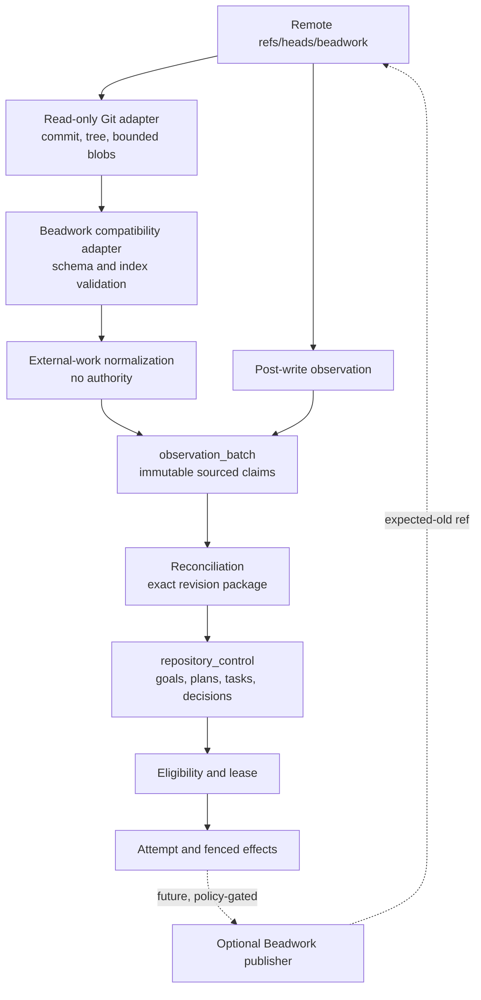

## 6. Beadwork as a Git-Native External Work Source

- Status: research proposal, not an accepted architecture decision
- Research cutoff: 2026-08-17
- JidoCode revision inspected: `69904e676f5606b3e2cd5496c2f5792f2ec80794`
- Beadwork revision inspected: `0b2cacc5a0d8ec323d49de2c1fd02ee748070c8f`
- Beadwork release represented by that revision: `v0.13.2`

## Executive conclusion

Beadwork can become an external source of work for JidoCode in the same broad
sense that provider issues can: it can supply observed requests, structure,
dependencies, scheduling hints, discussion, and external lifecycle claims.
It should not become JidoCode's queue, control graph, lease system, evidence
store, or acceptance authority.

The best first integration is a bounded, inbound-only `beadwork` work-source
adapter. It reads an exact `refs/heads/beadwork` Git commit and tree without
checking the branch out, validates the Beadwork repository schema, normalizes
each ticket as untrusted external-work observations, and records immutable
claims in existing `observation_batch` graphs. Reconciliation then compares
those claims with policy, source, accepted knowledge, goals, plans, tasks, and
decisions. It may propose or reuse a goal, but it cannot adopt a plan, schedule
a task, acquire a lease, or declare a goal satisfied [JC02-JC07].

No new named-graph family is required for the bounded first release. The
existing families already separate the required authority and retention
domains:

```text
factory_catalog     registered Beadwork source and its lifecycle
factory_policy      admission, mapping, approval, and write-back policy
observation_batch   exact immutable Beadwork snapshots and ticket claims
repository_control  JidoCode goals, plans, tasks, reconciliation, and decisions
run_attempt         attempted external publications and runtime provenance
evidence            verification evidence, never Beadwork closure by itself
security_audit      authorization and sensitive administrative changes
derived             disposable current/explanation projections
```

A new graph family would initially duplicate the purpose of
`observation_batch` and weaken the closed graph registry. What is required is a
small set of new resource kinds and ontology terms inside existing families,
plus reviewed commands and queries. A future `work_source_snapshot` manifest
and segment family is justified only if a supported Beadwork source cannot fit
within the current immutable observation-command and query bounds even after
bounded checkpointing. That must be demonstrated with scale evidence and
accepted through a separate topology decision, not assumed now.

Beadwork is particularly attractive because its complete state is a Git tree.
The exact commit, tree, object format, branch ref, repository schema version,
adapter version, and normalized item digest can make every imported claim
reproducible. Its human- and agent-friendly workflow is also a useful product
model. However, Beadwork is a CLI/application whose reusable implementation is
mostly in Go `internal/` packages, not a stable embeddable library. JidoCode
should therefore implement a narrow compatibility adapter against pinned
on-disk schemas and fixtures; it should not link internal packages, execute
`bw sync` during observation, parse prose output, or replay Beadwork commit
messages as commands [BW01-BW08].

## Recommendation summary

| Question | Recommendation |
| --- | --- |
| Can Beadwork supply work? | Yes, as an external observed work source. |
| Is that the same authority as a JidoCode goal or task? | No. A ticket is a claim about requested work; reconciliation must explicitly propose or reuse controlled work. |
| Should `bw ready` feed the JidoCode scheduler? | No. Preserve it only as an advisory source assessment; JidoCode recomputes eligibility from accepted graph state. |
| Should `bw start` grant an execution claim? | No. Assignee and `in_progress` are external claims, not authorization, leases, fences, or capacity ownership. |
| Should `bw close` satisfy a goal? | No. Closure is external lifecycle evidence that can trigger reconciliation, never acceptance by itself. |
| Should the `beadwork` branch become `repository_control`? | No. That would create a second durable control authority and bypass semantic commands. |
| What is the initial direction? | Inbound-only observation. Add outbound comments or state updates only after the inbound contract is proven. |
| How should it be read? | Read an exact remote ref/commit/tree through a read-only Git boundary; do not run `bw sync` or depend on a checked-out worktree. |
| Is Beadwork an Elixir library dependency? | No. Treat it as an external protocol and compatibility target. |
| Which graph stores source configuration? | `factory_catalog`; policy details belong in `factory_policy`. |
| Which graph stores ticket state? | Immutable `observation_batch` graphs. |
| Which graph stores resulting Jido work? | `repository_control`, through existing proposal, reconciliation, adoption, transition, and lease commands. |
| Is a new graph family required? | No for the bounded first release. Reconsider only after measured segmentation pressure. |
| What new identities are needed? | Work source, external work item, item revision, source snapshot/checkpoint, attachment reference, and optional publication identity. |
| What new semantic commands are needed? | Register and transition a work source; extend `RecordObservationBatch` for a reviewed external-work vocabulary. Existing control commands remain authoritative. |
| What new queries are needed? | Source health, current item, item history, dependency neighborhood, reconciliation candidates/linkage, diagnostics, and optional publication status. |

## Scope and method

This report answers four related questions:

1. Where work comes from in the current JidoCode design.
2. What Beadwork actually persists and what its workflow semantics mean.
3. How Beadwork can enter the existing graph-native control loop without
   acquiring unintended authority.
4. Which graph, ontology, identity, command, query, module, security, and
   rollout changes are required.

The study used:

- direct inspection of Beadwork `v0.13.2` at the pinned commit, including its
  issue model, tree storage, schema migrations, readiness rules, start/close
  transitions, sync and replay logic, prompts, tests, and public documentation
  [BW01-BW10];
- direct inspection of JidoCode at the pinned revision, including implemented
  resource identities, graph registry, provider observation values, ingress
  normalization, observation command mapping, semantic command registry,
  reviewed query catalog, reconciliation, scheduling, effect fencing, privacy,
  and accepted phase receipts [JC01-JC16]; and
- Git's content-addressed object and reference-update semantics as the external
  storage substrate [GT01-GT03].

The report separates:

- an external work request from accepted product intent;
- an external lifecycle claim from JidoCode work state;
- a source-level dependency from a controlled plan dependency;
- readiness advice from scheduling eligibility;
- assignment text from authorization and execution ownership;
- a Git commit from evidence that a goal is satisfied;
- an adapter compatibility profile from the Beadwork implementation itself;
- a new ontology resource from a new named-graph family; and
- an inbound observation from an outbound external effect.

Local execution of Beadwork's Go test suite was not used as evidence because a
matching Go toolchain was not available in the inspection environment. The
source was inspected directly and the upstream CI run for the pinned main
revision was green. JidoCode's checks are reported separately at the end of
this change [BW10-BW11].

## Where work comes from in JidoCode today

### Issues are a source of observations, not the product queue

Research document 01 describes providers, source repositories, desired state,
policies, user input, findings, and prior decisions as inputs to a managed
repository factory. It does not make GitHub Issues or any other provider the
authoritative queue [JR01]. The implemented code preserves that distinction:

- `RepositoryProvider.observe_collection/6` can observe `:issues`, pull
  requests, branches, checks, and capabilities;
- `ProviderObservation` admits a bounded `:issue` value;
- webhook ingress maps an `issues` event to a normalized issue observation;
- `Observations.Command` maps only reviewed fields into claims; and
- `RecordObservationBatch` creates one closed immutable observation graph.

The issue's external state is therefore evidence about the world. It is not a
JidoCode `Goal`, `Plan`, `Task`, `StateTransition`, `EligibilityReceipt`, or
`ExecutionLease` [JC04-JC06].

### The actual work-creation path

The current flow is:

```mermaid
flowchart LR
  EXT["External signals\nissues, source, policy, people"]
  OBS["Immutable observations\nexact provenance and completeness"]
  REC["Reconciliation\nclassify gaps and proposals"]
  GOAL["Goal proposal\nrepository_control"]
  PLAN["Plan proposal\nexact input revisions"]
  ADOPT["Plan adoption\nseparate control decision"]
  ELIG["Closed-world eligibility"]
  LEASE["Execution lease\nmonotonic fence"]
  RUN["Attempt and effects"]
  EVID["Verification evidence"]
  DEC["Outcome decision"]

  EXT --> OBS --> REC --> GOAL --> PLAN --> ADOPT --> ELIG --> LEASE --> RUN --> EVID --> DEC
```



At each boundary, authority is deliberately added rather than inherited:

1. An adapter can report a normalized observation but cannot choose graph
   placement or accept its truth.
2. `RecordObservationBatch` can persist an observed claim but cannot create
   controlled work.
3. reconciliation can record a gap and propose or reuse a goal but cannot adopt
   a plan or lease work;
4. plan adoption requires exact source, policy, observation, and control
   revisions;
5. eligibility requires complete, fresh, non-contradictory inputs and explicit
   authorization/capability/capacity facts;
6. lease acquisition atomically grants bounded execution ownership with a
   monotonic fence; and
7. evidence and an authorized decision determine the outcome [JC06, JC08-JC12].

This is where work “comes from”: work emerges through reconciliation between
observed or declared needs and governed desired state. An issue is one possible
trigger and addressed resource. The repository control graph is the durable
authority for what JidoCode has actually proposed, accepted, leased, executed,
and decided.

### Other valid work sources

The architecture permits many sources to contribute to reconciliation:

- provider issues, pull requests, review comments, CI, and repository events;
- desired outcomes and policies asserted by authorized users;
- exact source analysis and detected semantic gaps;
- verification findings and decision follow-ups;
- accepted knowledge that reveals drift or missing obligations;
- direct user interaction translated through an authorized semantic command;
  and
- an external Git-native tracker such as Beadwork.

No source should bypass the same proposal and control boundaries. “Similar to
issues” therefore means similar at the observation/reconciliation boundary,
not identical storage or control semantics.

## Beadwork deep inspection

### Project identity and maturity

The project is `jallum/beadwork`, singular. It describes itself as Git-native
work management for AI coding agents. At the inspected revision it is an
MIT-licensed Go command-line application released as `v0.13.2`. Its stated
purpose is to keep plans, progress, and decisions across agent compaction,
session boundaries, and crashes [BW01, BW10].

Beadwork is not a conventional reusable library:

- its Go module is `github.com/jallum/beadwork`;
- its work, Git, tree, sync, and intent packages live under `internal/`;
- its supported public surface is primarily the `bw` CLI and the persisted Git
  layout; and
- release compatibility is expressed by a repository schema version in
  `.bwconfig`, not an independent library API [BW01-BW03, BW08].

JidoCode should describe the integration as a Beadwork protocol adapter or
work-source adapter, not a library integration.

### Storage model

Beadwork stores its state on the orphan `beadwork` branch and manipulates the
Git object database directly with go-git. It does not put those files into the
normal working tree or index [BW01-BW02]. At repository schema version 2, the
important paths are:

```text
.bwconfig
issues/<ticket-id>.json
status/<status>/<ticket-id>
labels/<label>/<ticket-id>
blocks/<blocker-id>/<blocked-id>
attachments/<ticket-id>/<relative-path>
```

The design documentation also shows `parent/<parent-id>/<child-id>` markers,
and initialization creates a `parent/` directory. However, direct inspection
of the v0.13.2 issue write paths found parenthood persisted in the issue JSON
and did not find corresponding parent-marker writes. This is not a reason to
reject Beadwork. It is evidence that an integration must validate the exact
schema implementation and fixtures, not infer correctness from redundant
documentation alone [BW02-BW05].

The JSON issue shape contains:

- `id`, `title`, `description`, and `type`;
- integer `priority`;
- `status`, `assignee`, `created`, `updated_at`, `closed_at`, and
  `close_reason`;
- `due` and `defer_until`;
- `labels` and `parent`;
- redundant `blocked_by` and `blocks` arrays; and
- comments with text, optional author, and timestamp [BW03].

Attachments are arbitrary blobs below an issue path. They may be text or
binary and can use nested paths. Their existence makes the Beadwork tree more
than a small JSON index and requires explicit size, type, path, classification,
and content-egress policy [BW02].

### How work enters Beadwork

Beadwork work can originate from several paths:

1. A human or agent executes `bw create`.
2. `bw import` loads a Beads-compatible JSONL representation.
3. An agent follows `bw prime` and materializes a multi-step plan into an epic,
   child issues, and dependencies.
4. An agent adds work discovered during execution.
5. Beadwork's update check can create an upgrade-related issue.

The `bw prime` guidance intentionally distinguishes quick fixes from branch/PR
and multi-step work. It recommends one ticket and one worktree, then `start`,
work, commit, close, and sync. This is a useful external workflow convention,
but it is prompt guidance rather than a transactional product invariant
[BW01, BW07, BW09].

### Status and work semantics

The stable public status list at v0.13.2 is:

```text
open
in_progress
deferred
closed
```

`bw start` accepts only an open issue, checks its `blocked_by` tickets, moves it
to `in_progress`, and sets its assignee. `bw close` moves a non-closed issue to
`closed` and records the close time and optional reason. `bw reopen` moves a
closed or in-progress issue back to open and clears assignment/closure fields
[BW04-BW05].

Those transitions do not include:

- a JidoCode principal or delegated actor identity;
- a capability or authorization proof;
- a plan adoption decision;
- a lease duration, renewal, or expiry;
- a monotonic fencing token;
- exact source/policy/control revisions;
- verification evidence; or
- an outcome decision authority.

They are sound local tracker semantics, but they cannot substitute for
JidoCode's control state.

### Dependency and readiness semantics

Beadwork stores blocking relations in both the `blocks/` marker tree and issue
JSON arrays. Link creation prevents a self-loop, a detected dependency cycle,
and a descendant blocking its ancestor. Parent updates also reject direct and
transitive parent cycles [BW04-BW05].

`bw ready`:

- considers open issues;
- also considers deferred issues whose deferral has expired;
- suppresses descendants according to its subtree overlay;
- requires every effective blocker to be closed; and
- sorts by ascending priority, overdue-first within a priority, and then
  creation time [BW05].

That is a helpful external prioritization result. It is not JidoCode
eligibility. JidoCode additionally needs admitted enrollment, accepted goal and
plan endpoints, exact artifacts and source, complete policy authorization,
direct capability, capacity, cancellation state, and absence of a conflicting
lease. Treating `bw ready` as scheduler input would bypass nearly the entire
control loop [JC06].

### Git commit and sync semantics

Every Beadwork operation creates a Git commit whose message carries a
structured intent such as `create`, `close`, `link`, `comment`, or `attach`.
`bw sync` fetches the selected remote, fast-forwards or pushes when possible,
attempts a three-way tree merge when histories diverge, and falls back to
resetting to the remote tip and replaying local intent messages when the merge
conflicts [BW02, BW06].

This design gives Beadwork useful local durability and intelligible history.
It also establishes four integration rules:

1. The current tree at an exact commit is the state observation boundary.
2. Commit messages are untrusted explanatory provenance, not JidoCode command
   envelopes.
3. The observer must never call `bw sync`, because sync mutates local and
   potentially remote state.
4. Outbound writes need JidoCode's stronger fenced effect protocol and an
   expected-old remote ref, not an assumption that the local CLI's check is a
   globally atomic compare-and-swap.

The inspected `casUpdateRef` implementation reads the current ref, compares it
with a cached base, and then calls go-git's `SetReference`. The check and write
are separate storage operations in that implementation. Git's native
`update-ref <ref> <new> <old>` contract is the relevant model for an atomic
expected-old update, and a remote push must similarly reject an unexpected old
tip [BW06, GT02-GT03].

### Current operational caveats

The pinned release has an active project and green upstream CI, but it should
be integrated conservatively. At the research cutoff, open upstream work
included sync/tree edge cases, JSON-output integrity, reftable compatibility,
and intermittent object lookup reports [BW11-BW15]. These are normal maturity
signals for a young tool, but they strengthen the case for:

- pinned compatibility versions;
- exact Git-tree parsing rather than prose or terminal JSON parsing;
- independent integrity checks;
- fail-closed incomplete observations;
- inbound-only rollout; and
- no automatic upgrade of the adapter's accepted repository schema.

## Integration contract

### The source role

Define Beadwork as an `ExternalWorkSource` associated with one conceptual
repository enrollment and one repository locator. A work source describes how
to observe external work; it does not own the resulting JidoCode work.

The initial source profile is:

| Property | Initial value |
| --- | --- |
| Kind | `Beadwork` controlled concept |
| Transport | Git object/ref read |
| Ref | exact configured `refs/heads/beadwork` |
| Direction | inbound only |
| Accepted repository schemas | closed allowlist, initially version 2 |
| Accepted object formats | explicit `sha1` and later tested `sha256` |
| Observation mode | exact snapshot plus bounded changed-item batches |
| Content mode | bounded metadata and text; attachment bodies excluded |
| Write-back mode | disabled |
| Failure posture | incomplete/blocked, never best-effort work creation |

### Non-negotiable authority invariants

The integration must enforce these invariants:

1. An external work item is never typed as a JidoCode `Goal` or `Task`.
2. An external state is never used as a JidoCode work-state concept.
3. An assignee string never identifies or authorizes an internal actor.
4. External priority, due time, and deferral are scheduling hints governed by a
   mapping policy, not direct scheduler inputs.
5. External dependency edges never become accepted plan edges without a plan
   proposal and adoption.
6. `bw ready` never becomes an `EligibilityReceipt`.
7. `in_progress` never becomes an execution lease.
8. `closed` never satisfies a goal or obligation.
9. A Beadwork commit never becomes verification evidence merely because it is
   content-addressed.
10. An adapter never receives graph-placement, authorization, or acceptance
    authority.
11. Every absence conclusion requires a complete, current, non-contradictory
    source snapshot.
12. Every outbound mutation requires a current JidoCode fence and a stable
    external effect identity, then must be reobserved.

### End-to-end topology



The return arrow is observation, not self-confirmation. A successful push
receipt records that a publication effect occurred. Only a later exact read of
the remote ref establishes what is currently observable there.

## Graph placement

### `factory_catalog`: source identity and lifecycle

Add an `ExternalWorkSource` resource to the factory catalog. It should record:

- the conceptual repository and active management enrollment;
- repository locator;
- controlled work-source kind (`Beadwork`);
- exact ref name;
- compatibility profile IRI and accepted schema range;
- read direction and optional write-back capability declaration;
- source registration activity and actor;
- active, paused, incompatible, or retired transition chain; and
- superseded configuration lineage.

The catalog owns identity and attachment to the managed repository. It should
not contain ticket state, access tokens, adapter executable code, filtering
rules, raw remote URLs, or mutable cursors.

### `factory_policy`: admission and translation policy

Use source-scoped policy versions for:

- admitted types, labels, priorities, and statuses;
- repository/cohort applicability;
- title/description/comment and attachment content handling;
- freshness and maximum snapshot age;
- maximum tickets, relations, comments, bytes, and per-item text;
- duplicate and conflict posture;
- ticket-to-goal semantic-key rules;
- material-change and cancellation rules;
- approval requirements;
- external-to-internal priority hints;
- optional outbound operations and allowed fields; and
- retention/erasure overrides.

The adapter reports values. A reviewed evaluator applies this policy and emits
explainable reconciliation classifications.

### `observation_batch`: immutable snapshots and claims

Use the existing family for:

- exact branch commit/tree/ref observations;
- Beadwork schema/prefix/config observations;
- source snapshot/checkpoint and completeness assertions;
- conceptual external work-item identities;
- exact item revisions and normalized digests;
- observed status, type, priority, dates, assignee, parent, labels, and
  dependency relations;
- bounded comment metadata/text observations;
- attachment references, paths, blob identities, sizes, and content types;
- deleted-item tombstones observed from a complete comparison;
- source inconsistencies, limitations, and warnings; and
- adapter, retrieval, request/response, and previous-batch provenance.

The graph metadata remains complete with respect to the admitted command
payload. A separate `CompletenessAssertion` states whether the external source
coverage is complete, partial, or unknown. These two meanings must not be
collapsed.

### `repository_control`: product work and reconciliation

Controlled graph resources link to Beadwork items through `addresses`,
`wasDerivedFrom`, and exact observation revision references:

- reconciliation packages classify the current ticket/source relationship;
- control proposals explain ignore, reuse, create, supersede, or decision
  choices;
- goal proposals address the conceptual external item and cite the exact item
  revision that triggered them;
- plan proposals copy only reviewed, policy-admitted constraints and cite the
  source observation graph revision;
- adopted tasks have their own dependency graph and transitions; and
- outcome decisions may trigger a separate publication proposal.

No external field is copied into control state without an explicit semantic
meaning and provenance.

### `run_attempt`, `evidence`, and `security_audit`

If outbound publication is later enabled:

- `run_attempt` records the attempt, tool invocation, effect identity, fence,
  expected old ref, resulting commit, and bounded outcome;
- `evidence` records verification of the JidoCode goal, not merely the external
  update; and
- `security_audit` records work-source registration, lifecycle changes,
  write-back policy changes, approvals, and privileged publication decisions.

The external resulting commit is a stable effect ID. It is not by itself a
goal-outcome decision.

### `derived`: current views, never new authority

Disposable derived graphs may calculate:

- latest valid item revision per work source;
- open external-work inbox;
- source readiness advice;
- source-to-goal linkage status;
- dependency cycle and inconsistency diagnostics;
- changed-since-last-reconciliation candidates; and
- write-back drift.

Every derived result must bind its exact source graph revisions and remain
`authority?: false`. Stale or missing derivation is recoverable by recomputing
from immutable observations and controlled state.

## Why a new graph family is not initially required

Graph families are authority, lifecycle, capability, link, and retention
boundaries. They are not tables for each new domain noun. Beadwork observations
have the same essential contract as provider observations:

- external and untrusted;
- immutable once recorded;
- confidential by default;
- scoped to an enrolled repository and observation batch;
- subject to observation retention; and
- inputs to reconciliation rather than control authority.

`observation_batch` is therefore the correct family. A `beadwork` or generic
`work_item` graph family would add no new boundary and would require changes to
graph construction, metadata, capability authorization, allowed links,
backup/restore, retention, integrity, query authorization, audit, and startup
compatibility [JC02].

### The measured escape hatch

A separate `work_source_snapshot` manifest and `work_source_segment` family may
be warranted later if all of these become true:

1. the product commits to sources larger than the bounded observation protocol;
2. a full exact current inventory is required for closed-world discovery;
3. an initial or rewritten source cannot be represented within practical
   immutable batch/query limits;
4. checkpoint plus bounded deltas cannot provide adequate recovery or latency;
5. measurements show unacceptable duplication or graph fan-out; and
6. the new family has a distinct lifecycle, completeness, retention, and writer
   capability contract.

The future design would use one immutable manifest per exact source tree and
immutable content-addressed segments. The manifest would bind every segment
digest, total count, schema/profile, and completion activity. A query could
claim complete inventory only when every segment is present and validated.
This is deliberately deferred because JidoCode's current observation command
admits at most 500 assertions and the command pipeline has 1,000-addition and
262,144-byte bounds; the first release should instead set an explicit supported
source size and gather measurements [JC11].

## Identity model

### Work-source identity

Construct the stable work-source IRI from:

```text
conceptual repository IRI
controlled source kind = Beadwork
canonical ref = refs/heads/beadwork
optional source-instance namespace when more than one logical source shares the ref
```

Do not derive it only from a display owner/name, clone URL, local filesystem
path, current commit, or compatibility-profile version. Repository renames,
branch advancement, and adapter upgrades must not create a new conceptual
source.

### Work-item identity

Construct the conceptual external item IRI from:

```text
work-source IRI
NFC-normalized, bounded Beadwork ticket ID
```

The ticket ID remains a bounded display/interoperability literal. It is not
used by itself as an RDF relationship join key. This prevents collisions
between repositories, between multiple work sources in one repository, and
between provider issues and Beadwork tickets with similar display IDs.

### Item-revision identity

Construct an immutable revision IRI from:

```text
conceptual work-item IRI
exact source tree IRI
normalized issue JSON SHA-256 digest
compatibility profile/version
```

The source commit is retained as provenance. The tree identifies current
content, while the commit preserves history, authorship metadata, and lineage.
Two commits with the same tree may refer to one item state but remain distinct
observation activities.

### Snapshot and checkpoint identity

Construct a source snapshot from:

```text
work-source IRI
Git object format
exact commit IRI
exact root tree IRI
repository schema version
adapter normalization profile digest
```

A checkpoint additionally binds the previous accepted source commit, ancestry
classification, enumerated item count, normalized inventory digest, coverage,
and every emitted batch. The checkpoint is complete only after the complete
tree and all required entries are validated and recorded.

### Comments and attachments

Comment identity should be deterministic from the item revision, ordinal,
timestamp, author literal digest, and text digest because Beadwork comments do
not expose a separate stable comment ID.

Attachment identity should bind:

- item IRI;
- normalized relative path;
- exact Git blob IRI;
- content digest when computed;
- size and media classification; and
- source tree.

Never identify either resource from raw text alone. Never turn comment authors
or assignees into product actors by matching display strings.

### Required `ResourceIdentity` additions

Add closed constructors, not caller-selected deterministic kinds, for:

- `external_work_source/4`;
- `external_work_item/2`;
- `external_work_item_revision/4`;
- `work_source_snapshot/5`;
- `work_source_checkpoint/3`;
- `external_comment/5`;
- `external_attachment/4`; and
- optionally `external_publication/4`.

Each constructor should enforce NFC, exact known source kinds, known Git and
content algorithms, bounded values, traversal/control-character rejection,
and the product IRI namespace [JC02].

## Observation and ontology model

### New classes

The next compatible ontology release should define at least:

- `ExternalWorkSource`;
- `ExternalWorkItem`;
- `ExternalWorkItemRevision`;
- `WorkSourceSnapshot`;
- `WorkSourceCheckpoint`;
- `ExternalComment`;
- `ExternalAttachmentReference`;
- `ExternalDependencyObservation` when relation qualification is required;
- `WorkSourceConsistencyFinding`; and
- `ExternalPublication` for a later outbound phase.

An ontology module is not a graph family. These terms can be stored in the
existing catalog, policy, observation, control, run, and audit graphs according
to their authority.

### Controlled concepts

Use controlled concepts for:

- source kind `Beadwork`;
- source lifecycle active, paused, incompatible, and retired;
- external states open, in-progress, deferred, closed, deleted, and unknown;
- external types task, bug, epic, and unknown/custom;
- consistency valid, inconsistent, unsupported, truncated, and unknown;
- ancestry fast-forward, same, rewritten, and unrelated;
- reconciliation classifications ignored, candidate, reused, proposed,
  conflicted, pending-decision, externally-closed, and superseded; and
- publication states proposed, approved, claimed, applied, ambiguous, failed,
  confirmed, and drifted.

Provider concepts must be namespace-specific or explicitly scoped. A Beadwork
`Closed` concept is not the product `GoalSatisfied` concept.

### Reviewed predicates

The observation command needs a closed external-work predicate set, including:

- `observedFromWorkSource`;
- `externalIdentifier`;
- `externalState`;
- `externalType`;
- `externalPriority`;
- `externalAssignee`;
- `externalTitle` or bounded title artifact reference;
- `externalDescriptionDigest` and governed description reference;
- `externalCreatedAt`, `externalUpdatedAt`, `externalClosedAt`;
- `externalCloseReason` under content policy;
- `externalDueAt`, `externalDeferredUntil`;
- `externalLabel`;
- `externalParent`;
- `externalBlocks` and `externalBlockedBy`;
- `hasExternalComment` and `hasExternalAttachment`;
- `itemRevision`;
- `sourceCommit`, `sourceTree`, `sourceRef`, and `repositorySchemaVersion`;
- `inventoryDigest`, `itemCount`, and `ancestryState`;
- `consistencyState` and `consistencyFinding`; and
- `supersedesItemRevision`.

The existing `RecordObservationBatch` allowlist only includes a small provider
vocabulary such as status, ref, commit, conclusion, permission, availability,
and dependency. Beadwork cannot be represented faithfully by injecting
arbitrary `additional_assertions`; those assertions still pass through the
same closed allowlist. The command contract must be intentionally versioned
[JC04].

### Text content posture

Titles, descriptions, comments, close reasons, labels, and attachment content
are untrusted inputs and possible prompt-injection or secret-bearing material.
The initial profile should persist:

- a small bounded title only after redaction/classification;
- a normalized digest and governed artifact reference for longer description
  or comment text;
- bounded label literals;
- author and assignee as opaque external display values when policy allows;
- attachment metadata and blob identity, not bodies; and
- no raw Beadwork JSON or terminal output.

If a workflow needs exact description text, place it in an authorized governed
artifact/source inspection path and compile a bounded context view at use time.
Prompts and raw tool outputs continue to have no durable location [JC07].

### External field mapping

| Beadwork field or feature | Observation meaning | JidoCode control meaning |
| --- | --- | --- |
| Ticket ID | External item display ID within one work source | Stable addressed-resource identity only through its constructed IRI |
| Title | Untrusted requested-intent summary | Candidate goal label after policy/redaction, never identity |
| Description | Untrusted requested intent/context | Candidate goal criteria or planning context after governed inspection |
| `task`, `bug`, `epic` | External classification | Mapping hint; cannot create a Task/Goal class directly |
| Parent | Observed decomposition hint | Candidate goal/plan decomposition after validation |
| Blocks/blocked-by | Observed source dependency | Candidate plan dependency after proposal and adoption |
| P0-P4 priority | External ordering hint | Policy input; never direct scheduler priority |
| Due | External deadline claim | Constraint candidate under policy and time semantics |
| Deferred | Source visibility/readiness hint | Does not pause or transition Jido work automatically |
| Assignee | External attribution/claim | No principal, actor, capability, authority, or lease |
| Open | External unsatisfied-work claim | May trigger reconciliation |
| In progress | External claim that someone started | No Jido transition or lease |
| Closed | External closure claim | Reconciliation input, not evidence sufficiency or satisfaction |
| Close reason | Untrusted explanation | Context for a pending decision |
| Comments | Untrusted contextual observations | Optional governed context, not commands |
| Attachments | External artifact references | Governed content candidates, never auto-prompted |
| `bw ready` | Beadwork's advisory readiness evaluation | Optional diagnostic only |
| Beadwork commit | Exact external revision/effect identity | Provenance, not correctness or acceptance |

## Snapshot, completeness, and change processing

### Observe the tree, not a mutable checkout

The reader should resolve the configured remote ref to an exact commit, then
traverse its tree through a read-only Git port. It should not:

- check out the orphan branch into the product working tree;
- mutate the repository index;
- run shell commands assembled from ticket data;
- execute `bw sync`, `bw upgrade repo`, or any mutating Beadwork command;
- trust `.git/config` to choose a remote without catalog policy; or
- follow symlinks or local paths derived from tree entries.

The adapter should receive bounded Git objects or an opaque object reader, not
a raw unrestricted repository handle.

### Initial full observation

For a new source:

1. resolve the exact configured ref and object format;
2. read `.bwconfig` and require an admitted schema version;
3. enumerate only admitted roots and reject unexpected structural aliases;
4. parse bounded `issues/*.json` with duplicate-key detection and strict types;
5. enumerate status, label, dependency, parent, and attachment indexes;
6. compare redundant JSON and marker representations;
7. validate identifiers, timestamps, priorities, statuses, types, paths,
   referential integrity, and dependency/parent cycles;
8. compute deterministic normalized item and inventory digests;
9. split observations into bounded immutable batches; and
10. publish a complete checkpoint only after every required batch succeeds.

Before the checkpoint closes, queries must report the source as incomplete and
reconciliation must not draw absence conclusions.

### Incremental observation

When the new commit is a descendant of the previous checkpoint:

- diff admitted tree paths between exact trees;
- reparse every changed issue and every item affected by a changed index edge;
- emit explicit deletion observations only when the comparison is complete;
- validate the resulting inventory, not only the changed files;
- bind each batch to both previous and current checkpoints; and
- close the new checkpoint after all chunks commit.

Git diff is an optimization. The exact current tree plus validation defines the
result.

### Rewrites and force pushes

If the ref is no longer descended from the prior checkpoint:

- preserve all prior immutable observations;
- classify the ancestry as rewritten or unrelated;
- require a new complete full scan;
- suspend absence/deletion conclusions until that scan closes;
- record explicit contradictions between old and new current claims; and
- require policy or human review before mass work supersession/cancellation.

A force push must not erase JidoCode history or silently rewrite controlled
work.

### Source consistency rules

Beadwork intentionally duplicates several relationships for efficient reads.
The JidoCode adapter should require agreement between:

- issue JSON `status` and exactly one matching status marker;
- JSON labels and label markers;
- `blocks`/`blocked_by` arrays and `blocks/` markers;
- referenced parent IDs and existing item JSON;
- dependency targets and existing items;
- attachment paths and reachable Git blobs; and
- JSON file name and embedded ticket ID.

The inspected release's parent-marker documentation/implementation mismatch
means parent-marker presence cannot be assumed for schema 2. The compatibility
profile must state whether parent JSON is authoritative, whether markers are
required, and which discrepancy is an error. Unknown or inconsistent schema
state yields partial/unknown completeness and no ready-work proposal.

### Bounds and chunking

The initial source contract should define hard maxima for:

- tree entries inspected;
- tickets per source and per batch;
- RDF assertions/additions and encoded command bytes;
- dependency and parent edges;
- labels and comments per ticket;
- text bytes per field and in total;
- attachments, per-blob size, and aggregate size;
- Git traversal depth and commits inspected;
- wall time and memory; and
- query graph count and result rows.

`ProviderObservation` currently admits up to 500 observations in an envelope,
while `RecordObservationBatch` admits at most 500 assertions. A rich work item
needs multiple assertions, so “500 tickets” is not a safe batch size. The
adapter must budget assertions and bytes before command construction and stop
with a machine-readable incomplete reason rather than truncate silently
[JC04-JC05, JC11].

## Reconciliation semantics

### Candidate classification

For each current, complete, policy-admitted item, reconciliation should produce
one of these explanations:

| Classification | Meaning |
| --- | --- |
| `ignored` | Source policy intentionally excludes the item and explains why. |
| `unknown` | Coverage, schema, identity, or policy is insufficient. |
| `conflicted` | Source representations or Jido state contradict one another. |
| `pending-decision` | Ambiguity, high risk, closure/cancellation, or approval policy requires authority. |
| `existing-work-reuse` | A current controlled goal already addresses this item. |
| `goal-proposal` | A new goal proposal is warranted. |
| `plan-revision-candidate` | Material source changes may require a new plan proposal. |
| `obsolete-work-candidate` | External closure/deletion may justify supersession or cancellation review. |
| `no-gap` | Current controlled state already reflects the admitted source intent. |

These map naturally onto the existing reconciliation gap/proposal model. No
new reconciliation plane is needed [JC06].

### Stable goal linkage

Use a stable semantic key based on the conceptual work source and conceptual
ticket, for example:

```text
external-work:<work-source-iri>:<work-item-iri>
```

The exact item revision is cited as the proposal's originating observation, but
it should not be part of the conceptual semantic key. Otherwise every title,
comment, or priority edit would create a duplicate goal. Reconciliation should:

- reuse the current goal when the requested outcome is materially unchanged;
- propose a new plan when constraints or source context change;
- propose a superseding goal only when the intended outcome changes
  materially; and
- retain the exact item revisions that caused each proposal.

### Parent and dependency translation

Beadwork epics, children, and `blocks` edges are proposals about decomposition
and order. Translation requires:

1. complete identities for all referenced tickets;
2. cycle and orphan diagnostics from the observed snapshot;
3. mapping policy for epic versus task semantics;
4. a bounded plan proposal with exact input revisions; and
5. a separate `AdoptPlan` decision.

The accepted Jido plan may differ. It can merge tickets, split one ticket into
several tasks, add verification/approval nodes, invert an unsafe edge, or ignore
an advisory relationship. The explanation must preserve the mapping.

### External edits

Every new ticket revision wakes reconciliation. Suggested behavior:

- cosmetic title changes update an external projection only;
- description/acceptance changes create a material-change assessment;
- new dependencies can block plan adoption or prompt a new plan;
- priority/due changes affect governed ordering only after policy evaluation;
- reassignment remains attribution only;
- deferral can suppress new proposals if policy allows but cannot suspend an
  active lease; and
- external deletion never deletes a Jido goal, plan, task, attempt, evidence,
  or decision.

### External closure and reopening

When Beadwork closes a ticket with active or incomplete Jido work,
reconciliation should ask which of these is true:

- the external system claims the request is satisfied;
- the request was withdrawn;
- work moved elsewhere;
- the closure is erroneous or stale;
- the controlled goal was already accepted; or
- a publication from JidoCode caused the closure.

The result may be no-op, pending decision, cancellation proposal,
supersession, or outbound drift reconciliation. It is never an automatic goal
outcome. A later reopen similarly triggers reconciliation rather than mutating
accepted history.

## Semantic command changes

### Register and transition work sources

Add intent-named commands to the closed registry:

#### `RegisterExternalWorkSource`

Writes the catalog resource and initial lifecycle transition. Preconditions:

- active enrollment and known conceptual repository/locator;
- known source kind and canonical ref;
- source identity absent;
- compatibility profile allowlisted;
- actor has administrative/catalog authority; and
- expected catalog and dataset revisions match.

#### `TransitionExternalWorkSource`

Moves the source between active, paused, incompatible, and retired through an
append-only transition. Preconditions:

- source and current endpoint known;
- unique successor and expected predecessor;
- reason and actor supplied;
- no unreviewed widening of write-back authority; and
- expected revisions match.

Source policy remains an ordinary versioned policy proposal/transition rather
than mutable fields on the source.

### Version `RecordObservationBatch`

Extend or add a new version of the existing command rather than creating a raw
work-item write command. Changes include:

- explicit `work_source_iri` validation and active-source catalog guard;
- exact commit/tree/schema/profile checkpoint fields;
- external-work classes and predicate allowlist;
- deterministic item/revision/comment/attachment identities;
- bounded typed external values;
- consistency and completeness findings;
- chunk/checkpoint lineage;
- duplicate logical delivery returning the original accepted receipt; and
- divergent reuse of a delivery identity returning conflict.

The command must still create a closed immutable observation graph atomically.
It must not write the catalog, policy, control, evidence, or run graphs in the
same operation.

### Reuse existing control commands

The integration should reuse:

- `RecordReconciliation` and `TransitionReconciliation`;
- `ProposeGoal`;
- `ProposePlan`;
- `AdoptPlan`;
- `TransitionWork`;
- `AcquireExecutionLease` and lease transitions;
- execution attempt/effect commands;
- evidence commands; and
- governed outcome and follow-up decisions.

If these commands cannot express the source link, extend their reviewed closed
payloads with exact external-work revision references. Do not create a shortcut
such as `ImportBeadworkTask`.

### Optional publication commands

Outbound publication should begin with a separate
`ProposeExternalWorkPublication` control command. It records:

- target source and ticket;
- exact currently observed remote commit;
- operation and closed field changes;
- causing goal/decision/attempt;
- policy and approval requirements;
- deterministic semantic publication identity; and
- expiry/revalidation requirements.

Actual dispatch occurs only through the execution reference monitor and fenced
sink. The external branch write never occurs in the graph command transaction.

## Reviewed query changes

Add fixed, bounded, versioned product queries rather than exposing SPARQL or a
raw ticket dump.

| Query | Purpose | Families |
| --- | --- | --- |
| `external_work_source_description` | Source identity, lifecycle, profile, ref, policy, and latest checkpoint | catalog, policy, observation |
| `external_work_source_health` | Freshness, schema, completeness, ancestry, limits, and consistency diagnostics | observation |
| `external_work_item_current` | Latest valid revision of one item with exact provenance | observation, derived |
| `external_work_item_history` | Bounded revision, status, and contradiction timeline | observation |
| `external_work_dependency_neighborhood` | Bounded parent/blocker neighborhood with source revision | observation |
| `external_work_reconciliation_candidates` | Changed admitted items requiring reconciliation | observation, control, derived |
| `external_work_goal_linkage` | Item-to-goal/plan/task and classification explanation | observation, control |
| `external_work_inbox` | Bounded current admitted items grouped by reconciliation state | observation, control, derived |
| `external_work_publication_status` | Proposed, approved, attempted, confirmed, ambiguous, or drifted write-back | control, run, observation |

Every result must include:

- exact dataset and graph revisions;
- source commit/tree/checkpoint;
- ontology/query/profile versions;
- completeness, freshness, truncation, and warnings;
- applied bounds and cursor;
- authority classification; and
- no content for unauthorized repositories or sources.

`external_work_inbox` is a product projection, not a durable queue. Restart
recovery comes from graph discovery and exact current-state resolution.

## Elixir module and port changes

### Recommended ownership

```text
JidoCode.Factory.Ports.ExternalWorkSource
JidoCode.Factory.WorkSources
JidoCode.Factory.WorkSources.Source
JidoCode.Factory.WorkSources.Snapshot
JidoCode.Factory.WorkSources.ItemObservation
JidoCode.Factory.WorkSources.Command
JidoCode.Integrations.Beadwork.Reader
JidoCode.Integrations.Beadwork.SchemaV2
JidoCode.Integrations.Beadwork.Normalizer
JidoCode.Integrations.Beadwork.Publisher        # future only
JidoCode.Knowledge.Commands.RegisterExternalWorkSource
JidoCode.Knowledge.Commands.TransitionExternalWorkSource
```

The generic port should be owned by Factory. The concrete Beadwork modules live
under Integrations. Knowledge remains the only store and semantic command
owner. Web consumes approved projections only [JC03].

### Why not overload `RepositoryProvider`

The existing repository-provider port observes API collections such as issues,
pull requests, branches, checks, and capabilities through one provider locator.
Beadwork is a versioned dataset inside a Git ref with its own identity, schema,
checkpoint, and optional publication semantics. Forcing it into
`observe_collection(:issues, ...)` would lose:

- work-source identity distinct from the repository locator;
- ref/commit/tree/schema completeness;
- cross-file consistency validation;
- initial-scan and rewrite semantics;
- attachment-tree policy; and
- future expected-old ref publication.

A generic `ExternalWorkSource` port can later support Beadwork, Beads, a
repository-local task manifest, or another external tracker without weakening
the provider port.

### Suggested read port

The port should expose semantic operations, not arbitrary paths:

```elixir
@callback observe_snapshot(
            adapter :: term(),
            source :: Source.t(),
            credential_reference :: CredentialReference.t(),
            prior_checkpoint :: Checkpoint.t() | nil,
            options :: keyword()
          ) ::
            {:ok,
             %{
               snapshot: Snapshot.t(),
               items: [ItemObservation.t()],
               next_cursor: String.t() | nil
             }}
            | {:error, AdapterError.t()}
```

The returned values are bounded and contain no credential bytes, raw body,
private URL, local path, graph IRI, or acceptance decision. Pagination is tied
to one exact tree and adapter/profile digest; a cursor from another tree is
invalid.

### Adapter implementation posture

The Beadwork adapter should:

- use the repository's governed Git/provider boundary and `Req` for any HTTP
  transport, never add HTTPoison, Tesla, or `:httpc`;
- parse exact tree blobs using a closed schema module;
- avoid a local shell when the Git boundary can supply objects directly;
- use bounded transient structs only;
- never open TripleStore or construct RDF;
- never call Knowledge internals;
- return safe structured errors; and
- be fully fixture-testable without network or installed `bw`.

The pinned `bw` binary may be used in an isolated compatibility test as an
oracle for fixture creation. It should not be a production runtime dependency
for inbound reads.

## Inbound processing algorithm

An implementation-oriented sequence is:

1. A graph-derived source discovery query finds active work sources whose
   checkpoint is missing, stale, or notified as changed.
2. Factory resolves the source's repository, locator, credential reference,
   compatibility profile, and current policy through reviewed queries.
3. The read-only adapter resolves the remote branch to an exact commit.
4. It reads the exact tree, validates schema and consistency, and produces
   bounded normalized snapshot/item values.
5. Factory builds deterministic delivery identities from source IRI, exact
   tree, profile digest, and chunk index.
6. The observation mapper creates reviewed assertions and
   `RecordObservationBatch` commands.
7. Duplicate accepted deliveries reuse the original receipt; divergent reuse
   conflicts.
8. After all chunks commit, the final checkpoint observation establishes the
   admitted coverage set and inventory digest.
9. The change feed wakes the reconciler as a hint.
10. The reconciler constructs one exact revision package and records explained
    gaps/proposals.
11. Separate product decisions propose goals/plans and adopt work.
12. Scheduler discovery operates only on accepted controlled tasks.

The coordinator stores no durable cursor or queue only in OTP state. It can
rediscover incomplete checkpoints and reconciliations after restart.

## Optional outbound integration

### Roll out operations by risk

If inbound integration succeeds, enable write-back in this order:

1. add a JidoCode-originated comment;
2. add/remove a namespaced integration label;
3. update bounded status/assignee fields with approval;
4. close or reopen an item after an explicit outcome/publication decision;
5. create new Beadwork work from an authorized follow-up decision; and
6. translate plan decomposition/dependencies only after bidirectional conflict
   tests.

Comment-only write-back has the smallest semantic blast radius. Close/create
and dependency mutation have much larger feedback-loop and authority risks.

### Fenced effect protocol

Each publication request should bind:

- current attempt, task, lease, and monotonic fence;
- exact repository and work source;
- exact expected old remote commit;
- operation and canonical field-change digest;
- sequence number;
- correlation/causation lineage;
- policy and approval decision; and
- deterministic external effect identity.

The sink atomically claims that identity, revalidates current authority, builds
or obtains a compatible commit, and pushes only if the remote ref still equals
the expected old commit. The resulting remote commit is the stable external
effect ID. Unexpected advancement returns a conflict and re-enters observation
and reconciliation; it is not automatically merged or replayed [JC10].

### Feedback-loop prevention

Write-back must include durable origin metadata that can be recognized without
trusting arbitrary comment text. At minimum record internally:

- publication IRI;
- causing JidoCode decision and attempt;
- expected old and resulting commits;
- normalized change digest; and
- target item revision.

On reobservation, match the exact resulting commit/change digest to the
publication. Mark it confirmed, but still record the external observation.
Never suppress an observation solely because an author string says “JidoCode.”

### Compatibility choices for writing

There are three plausible strategies:

1. **Pinned `bw` in a sandbox.** Highest behavioral compatibility, but adds a
   binary/tool supply chain and inherits CLI/sync behavior. It must never push
   directly; the fenced sink verifies and publishes the produced commit.
2. **JidoCode serializer for pinned schema.** Smaller runtime dependency and
   easier exact effects, but risks drifting from Beadwork semantics. It needs
   upstream golden fixtures and cross-version tests.
3. **Upstream-supported external API.** Preferred if Beadwork later exposes a
   stable non-`internal` library/protocol with expected-old write semantics.

Do not choose outbound strategy until the inbound compatibility suite and
upstream collaboration establish a supported contract.

## Security and privacy threat model

### Prompt and instruction injection

Ticket titles, descriptions, comments, labels, close reasons, commit messages,
and attachments can contain instructions addressed to an agent. They are data,
not system or developer instructions. Context compilation must label their
origin, bound their size, quote/segment them, and keep them below trusted policy
and control instructions.

### Secret and personal-data leakage

Beadwork lives in Git and can preserve secrets indefinitely in history even
after the current tree changes. The adapter must:

- classify all content as confidential by default;
- scan/redact before durable bounded literals;
- never persist credentials, authenticated URLs, private local paths, or raw
  response bodies;
- store external people as opaque values unless a separate governed identity
  reconciliation exists;
- apply observation retention and erasure policy to imported claims; and
- warn that external Git history may require separate upstream remediation.

### Malicious Git trees and paths

Reject or bound:

- absolute, traversal, non-NFC, control-character, and overlong paths;
- duplicate/confusable ticket IDs;
- unexpected object types and symlink/submodule entries in admitted roots;
- extreme fan-out/depth and object sizes;
- malformed or deeply nested JSON;
- duplicate JSON keys and unexpected scalar types;
- attachment path collisions; and
- object-format or ref mismatches.

Prefer object traversal without filesystem materialization. If materialization
is ever required, use the hardened sandbox/path boundary.

### Identity and authority confusion

External assignee, comment author, commit author, or Git signature must not
become a principal, actor, delegation, capability, grant, or decision authority
through string matching. Cryptographic commit signatures can become separate
observations; even verified authorship does not grant product command authority.

### Denial of service

Attackers or accidents can create huge issue counts, comments, labels,
dependencies, attachments, histories, or highly connected graphs. Enforce
pre-parse byte limits, enumeration limits, traversal budgets, assertion budgets,
query limits, timeouts, concurrency back-pressure, and safe incomplete results.
Never let a work-source event trigger unbounded reconciliation fan-out.

### Schema and index equivocation

An item JSON file and its marker indexes may disagree. Do not choose the value
that makes work look ready. Record a consistency finding, mark the relevant
coverage incomplete, and require repair/reobservation.

### Branch rewrite and rollback

A force-pushed older tree can make work appear reopened, missing, or changed.
Preserve old claims, classify ancestry, require a full scan, and block automatic
negative conclusions. Source observation is historical evidence, not permission
to roll controlled state backward.

### Supply-chain compromise

Pin any Beadwork binary used for tests or future writes by release/commit and
digest, verify its provenance under product policy, isolate it in the sandbox,
and keep it away from graph and credential authority. The inbound parser should
not execute Beadwork code.

### Outbound confused-deputy and replay risk

A stale worker must not comment, close, or rewrite a ticket after its task was
cancelled or lease superseded. Revalidate the current fence immediately before
the atomic sink claim and before dispatch. An ambiguous push outcome remains
ambiguous until remote-ref reconciliation proves applied or not applied
[JC10].

## Failure and recovery semantics

| Failure | Durable/result posture | Recovery |
| --- | --- | --- |
| Branch absent | Source health unavailable; no work deletion | Retry/discover after ref appears |
| Unsupported schema | Source incompatible and incomplete | Pause source or deploy reviewed profile |
| Corrupt JSON/index | Consistency findings; affected coverage incomplete | Repair upstream, then exact reobserve |
| Page/chunk failure | Prior checkpoint remains current; new checkpoint incomplete | Rediscover missing deterministic batches |
| Duplicate delivery | Return original accepted receipt | No new graph |
| Divergent delivery identity | Conflict | Diagnose adapter/profile identity defect |
| Fast-forward update | New exact checkpoint | Incremental parse plus full inventory validation |
| Force push/unrelated history | Rewrite finding; no absence conclusions | Full scan and policy/decision review |
| Adapter crash | No adapter-owned durable authority | Restart and rediscover from graph/external ref |
| Reconciliation crash | Incomplete graph activity remains discoverable | Existing reconciler recovery |
| External write conflict | No silent merge | Reobserve, recompute, request new approval if needed |
| Ambiguous external write | Effect journal remains ambiguous | Query remote exact ref/change and reconcile |
| Post-write drift | Confirmed publication plus later contradiction | New reconciliation package |

## Product experience

### Work-source health

The repository surface should show:

- registered source and ref;
- inbound/outbound mode;
- latest exact commit and observation time;
- schema/profile compatibility;
- complete, partial, unknown, or inconsistent state;
- ticket/relation/attachment counts within bounds;
- rewrite, truncation, and stale warnings; and
- last reconciliation result.

### External work inbox

Present external work separately from controlled work. Each row can show:

- Beadwork ID, bounded title, type, external status, and priority;
- source commit/freshness;
- reconciliation classification;
- linked Jido goal/plan/task when present;
- pending decision or conflict;
- advisory blocker/dependency context; and
- why the item is or is not admitted.

Do not label the list simply “Jido tasks.”

### Side-by-side lifecycle

The most important detail is explicit dual state:

```text
Beadwork: in_progress, assignee=alice
JidoCode: goal proposed, no adopted plan, no active lease
```

or:

```text
Beadwork: closed
JidoCode: goal awaiting evidence decision
```

This makes drift and authority visible instead of silently pretending the two
systems share a state machine.

### Explainability

Every “create work,” “reuse,” “ignore,” “cancel,” and “publish” action should
show:

- exact source item revision;
- applied source/policy profile;
- current control resources;
- classification and bounded reasons;
- required approval;
- resulting command receipt; and
- source revision that would invalidate the conclusion.

## Evaluation plan

### Compatibility fixture matrix

Build immutable Git fixtures for:

- clean schema 0, 1, and 2 repositories;
- empty and missing branch;
- task, bug, epic, children, and multi-level hierarchy;
- open, in-progress, deferred, expired-deferred, and closed items;
- priorities P0-P4, due dates, timestamps, labels, comments, and assignees;
- blockers, missing targets, self edges, dependency cycles, and parent cycles;
- attachments with text, binary, nested paths, and boundary sizes;
- JSON/marker mismatches and the parent-marker documentation difference;
- duplicate IDs, filename/embedded-ID mismatch, malformed JSON, duplicate keys,
  unknown fields, unknown schema, and invalid timestamps;
- SHA-1 and, when supported, SHA-256 object formats;
- fast-forward, diverged, force-pushed, and unrelated histories;
- Beadwork-generated commits and independently serialized compatible commits;
  and
- malicious content and path fixtures.

### Contract tests

Prove:

- deterministic identities and normalized digests;
- no graph/store/authority access from the adapter;
- exact enrollment/source/locator binding;
- closed predicate and shape admission;
- duplicate delivery idempotency and divergent conflict;
- complete checkpoints only after all chunks;
- no absence result from incomplete/rewritten sources;
- exact revision propagation into reconciliation and goal proposals;
- no automatic plan adoption, transition, lease, or outcome;
- bounded queries and cross-scope concealment;
- retention and redaction behavior; and
- restart discovery with empty OTP state.

### Differential tests against Beadwork

For every pinned compatibility release:

1. generate fixtures using the Beadwork CLI;
2. parse them with the JidoCode adapter;
3. compare normalized issue, status, label, parent, dependency, comment, and
   attachment views;
4. serialize any future outbound operation in isolation;
5. read the result with the pinned Beadwork CLI; and
6. compare semantic state and Git tree expectations.

Any disagreement blocks enabling that profile.

### Scale and reliability tests

Measure:

- full and incremental scan latency;
- objects, bytes, and allocations per ticket;
- triples/assertions and encoded bytes per item;
- batch/chunk counts;
- reconciliation fan-out and coalescing;
- query latency at small, medium, and maximum supported sources;
- recovery after process death at each batch boundary;
- ref movement during observation;
- concurrent identical and conflicting observations; and
- optional concurrent publication conflicts.

### Agent outcome study

Compare provider-issue, Beadwork, and direct-user work sources on:

- correct goal deduplication;
- plan decomposition quality;
- dependency interpretation;
- context precision and tokens;
- stale-work avoidance;
- successful evidence-backed completion;
- external/internal drift detection;
- unnecessary work and duplicate execution;
- review time; and
- human trust calibration.

The study should keep the Jido control loop constant. It evaluates source
quality, not whether external trackers should replace governance.

### Initial acceptance gates

The inbound release should require:

1. 100% exact source commit/tree/profile provenance.
2. Deterministic item and revision identity across repeated reads.
3. Zero automatic goals from incomplete, corrupt, unsupported, or rewritten
   snapshots.
4. Zero direct external status-to-control transition mappings.
5. Zero external assignee-to-authority mappings.
6. Zero external closure-to-goal-satisfaction mappings.
7. Duplicate logical delivery creates exactly one observation graph.
8. Divergent reuse of an identity conflicts.
9. All fields, paths, collections, graph additions, and queries stay within
   declared bounds.
10. No raw JSON, credentials, private URLs/paths, prompts, or attachment bodies
    enter observation commands.
11. Restart recovery succeeds from graph state and external ref alone.
12. Existing provider issue ingestion and control-loop tests remain unchanged
    in authority semantics.

Outbound comment-only release adds:

1. current-fence revalidation before dispatch;
2. atomic effect claim and deterministic effect identity;
3. expected-old remote ref enforcement;
4. one stable resulting commit ID;
5. ambiguous-result reconciliation;
6. post-write remote observation; and
7. no duplicate comment under retries or process death.

## Phased roadmap

### Phase 0: contract and upstream alignment

- accept an ADR for external work-source semantics and the no-new-family
  decision;
- discuss a stable on-disk compatibility contract with Beadwork maintainers;
- define source identity, schema profiles, bounds, content classification, and
  unsupported behavior;
- define competency questions and ontology terms;
- decide initial source-size support; and
- capture v0.13.2 fixtures and digests.

### Phase 1: offline read-only adapter

- add pure bounded work-source values and the generic port;
- implement `SchemaV2` against exact Git-tree fixture inputs;
- validate redundant indexes and normalized inventory digests;
- test malicious/corrupt/rewritten inputs;
- perform no network, graph, or work creation; and
- compare against pinned `bw` outputs in isolated tests.

### Phase 2: catalog and immutable observation

- release ontology/shapes and identity constructors;
- add source registration/transition commands;
- version `RecordObservationBatch` for external work;
- implement exact checkpoints, chunk lineage, and source health queries;
- add retention/redaction/audit behavior; and
- run in shadow ingestion mode.

### Phase 3: reconciliation and controlled work proposal

- add source-scoped mapping policies;
- add reconciliation candidates and linkage queries;
- support ignore, reuse, goal proposal, conflict, and pending-decision
  explanations;
- preserve exact item revision provenance in goals/plans;
- require normal plan adoption and scheduling; and
- prohibit source-driven automatic cancellation or satisfaction.

### Phase 4: product projections and evaluation

- add source health, external inbox, dual lifecycle, and explanation surfaces;
- evaluate against provider issues and direct-user sources;
- tune bounds and retention;
- document operator repair and compatibility upgrade procedures; and
- decide whether Beadwork becomes a supported product integration.

### Phase 5: comment-only publication experiment

- add policy, approval, publication proposal, and fenced Git sink;
- use expected-old remote refs and stable commit effect IDs;
- reobserve and confirm every effect;
- test feedback loops, conflicts, ambiguity, and process death; and
- keep close/create/dependency operations disabled.

### Phase 6: selective bidirectional lifecycle

- consider labels and state changes;
- require explicit outcome/publication decisions for close/reopen;
- add create/follow-up only with stable origin linkage;
- add dependency write-back only if semantic round-trip is demonstrated; and
- re-evaluate segmented graph needs from measured source scale.

## Alternatives considered

### Make the Beadwork branch JidoCode's control graph

Rejected. It would create a second app-owned durable state authority, bypass
semantic command authorization/revisions, lose graph-native evidence and
decision relationships, and conflate tracker state with leases and outcomes.

### Import every open Beadwork ticket directly as a Jido task

Rejected. It bypasses desired state, mapping policy, reconciliation, goal
proposal, plan proposal/adoption, capability requirements, and verification
strategy. It also makes ticket edits unsafe mutable task updates.

### Drive the scheduler from `bw ready`

Rejected. `bw ready` evaluates Beadwork status, deferral, subtree, blocker, and
priority rules. It has no Jido enrollment, plan, artifact, policy,
authorization, capability, capacity, cancellation, or lease facts.

### Treat `bw start` as a distributed lease

Rejected. It has no expiry, renewal, maximum duration, current authority
revalidation, or monotonic fence. An assignee string is not a secure holder
identity.

### Treat `bw close` as evidence of completion

Rejected. It records an external lifecycle claim and optional reason. It does
not prove the expected repository state, test outcome, artifact, review,
deployment, or acceptance policy.

### Execute `bw --json` for every observation

Rejected for the primary path. CLI JSON is useful for differential tests, but
it adds binary/process/output compatibility, may omit tree-level integrity, and
cannot establish exact ref/tree consistency by itself. Reading the pinned tree
is the stronger source boundary.

### Embed Beadwork's Go packages

Rejected. The relevant packages are `internal/`, so they are not a supported
external library API. A sidecar would add deployment and RPC complexity without
removing compatibility risk.

### Mirror Beadwork into a relational table or filesystem cache

Rejected as authoritative storage. A disposable cache may accelerate reads,
but immutable observation graphs and external Git remain reconstructable
sources. A mirror must not become a hidden durable queue.

### Create a Beadwork named graph family immediately

Rejected. Its authority, lifecycle, retention, and writer are already those of
external observations. Add semantic resources within existing families first.

### Use provider issues only

Viable but unnecessarily restrictive. Beadwork provides repository-portable,
agent-oriented work state and exact Git provenance. Supporting it behind a
generic external-work port improves source diversity without changing control
authority.

## Decisions proposed for later acceptance

This research recommends that an implementation ADR explicitly accept or
reject each statement:

1. External trackers are observation sources, not control authorities.
2. `ExternalWorkSource` is a catalog resource attached to one active repository
   enrollment and locator.
3. Beadwork v0.13.2 repository schema 2 is the first compatibility profile.
4. Inbound parsing reads exact Git trees and never invokes a mutating Beadwork
   command.
5. Beadwork observations use existing `observation_batch` graphs.
6. No new graph family is introduced for the initial bounded release.
7. Ticket, ticket revision, snapshot, checkpoint, comment, and attachment
   identities are product-constructed IRIs.
8. External status/type/priority/assignment remain provider-scoped claims.
9. Reconciliation is the only path from a current external item to proposed
   Jido work.
10. Existing plan adoption, eligibility, leases, evidence, and decisions remain
    mandatory.
11. Source completeness requires exact schema/index/inventory validation.
12. Force pushes suspend negative conclusions until a full checkpoint closes.
13. Content is confidential and untrusted; attachment bodies are excluded from
    initial durable observations.
14. Initial integration is inbound-only.
15. Outbound work is a separate policy-gated, approved, fenced, expected-old-ref
    effect that must be reobserved.
16. A new segmented work-source graph family requires measured proof and a
    separate graph-topology decision.

## Final recommendation

Build Beadwork support as a generic external-work-source adapter with a pinned
Beadwork v0.13.2/schema-2 compatibility profile.

The initial implementation should register the source in the factory catalog,
apply admission and mapping policy from the factory policy graph, read exact
Git commits and trees, and publish bounded immutable work-item claims into
`observation_batch` graphs. Reconciliation should then explain whether each
item is ignored, unknown, conflicted, already represented, or worthy of a goal
proposal. Everything after that point should use the existing JidoCode work,
plan, adoption, eligibility, lease, execution, evidence, and decision contracts.

Do not add a new graph family for the first release. Add the missing ontology
resources, resource identity constructors, catalog lifecycle commands,
external-work observation vocabulary, and reviewed queries within the current
topology. Set an explicit supported source-size bound and use incomplete
checkpoints when it is exceeded. Revisit immutable manifest/segment graph
families only with measured evidence.

Do not begin with bidirectional sync. First prove that JidoCode can repeatedly
and safely answer:

- which exact Beadwork source and revision was observed;
- which tickets are current and complete;
- what each ticket claims;
- which claims conflict or changed;
- which controlled goal, if any, addresses the ticket;
- why work was proposed or ignored; and
- why external status did not bypass JidoCode authority.

Once those answers are reliable, comment-only publication can test the fenced
effect and reobservation loop. Closing, reopening, creating, and rewriting
dependencies should remain later, separately approved capabilities.

Beadwork's strongest contribution is not a replacement scheduler. It is a
portable, Git-addressable source of durable human/agent work intent. JidoCode's
strongest contribution is turning that intent into governed, explainable,
evidence-backed work without confusing an external tracker claim with truth or
authority. The integration should preserve both strengths.

## Sources

### Beadwork project and implementation

- **BW01.** Jason Allum, [`jallum/beadwork`](https://github.com/jallum/beadwork/tree/0b2cacc5a0d8ec323d49de2c1fd02ee748070c8f), [README](https://github.com/jallum/beadwork/blob/0b2cacc5a0d8ec323d49de2c1fd02ee748070c8f/README.md), and [license](https://github.com/jallum/beadwork/blob/0b2cacc5a0d8ec323d49de2c1fd02ee748070c8f/LICENSE), inspected commit `0b2cacc5a0d8ec323d49de2c1fd02ee748070c8f`.
- **BW02.** Beadwork, [storage, attachments, and sync design](https://github.com/jallum/beadwork/blob/0b2cacc5a0d8ec323d49de2c1fd02ee748070c8f/docs/design.md).
- **BW03.** Beadwork, [issue and comment model](https://github.com/jallum/beadwork/blob/0b2cacc5a0d8ec323d49de2c1fd02ee748070c8f/internal/issue/issue.go) and [persistence/index helpers](https://github.com/jallum/beadwork/blob/0b2cacc5a0d8ec323d49de2c1fd02ee748070c8f/internal/issue/persist.go).
- **BW04.** Beadwork, [create/import implementation](https://github.com/jallum/beadwork/blob/0b2cacc5a0d8ec323d49de2c1fd02ee748070c8f/internal/issue/create.go), [update/start/close implementation](https://github.com/jallum/beadwork/blob/0b2cacc5a0d8ec323d49de2c1fd02ee748070c8f/internal/issue/update.go), and [label implementation](https://github.com/jallum/beadwork/blob/0b2cacc5a0d8ec323d49de2c1fd02ee748070c8f/internal/issue/label.go).
- **BW05.** Beadwork, [dependency and readiness implementation](https://github.com/jallum/beadwork/blob/0b2cacc5a0d8ec323d49de2c1fd02ee748070c8f/internal/issue/blocking.go), [list/order implementation](https://github.com/jallum/beadwork/blob/0b2cacc5a0d8ec323d49de2c1fd02ee748070c8f/internal/issue/list.go), and [status registry](https://github.com/jallum/beadwork/blob/0b2cacc5a0d8ec323d49de2c1fd02ee748070c8f/internal/issue/status.go).
- **BW06.** Beadwork, [repository sync implementation](https://github.com/jallum/beadwork/blob/0b2cacc5a0d8ec323d49de2c1fd02ee748070c8f/internal/repo/repo.go), [TreeFS commit/ref logic](https://github.com/jallum/beadwork/blob/0b2cacc5a0d8ec323d49de2c1fd02ee748070c8f/internal/treefs/treefs.go), and [intent replay](https://github.com/jallum/beadwork/blob/0b2cacc5a0d8ec323d49de2c1fd02ee748070c8f/internal/intent/intent.go).
- **BW07.** Beadwork, [`bw prime` agent workflow](https://github.com/jallum/beadwork/blob/0b2cacc5a0d8ec323d49de2c1fd02ee748070c8f/prompts/prime.md).
- **BW08.** Beadwork, [repository schema migrations](https://github.com/jallum/beadwork/blob/0b2cacc5a0d8ec323d49de2c1fd02ee748070c8f/internal/repo/migrate.go) and [repository schema/current version](https://github.com/jallum/beadwork/blob/0b2cacc5a0d8ec323d49de2c1fd02ee748070c8f/internal/repo/repo.go).
- **BW09.** Beadwork, [migration from Beads](https://github.com/jallum/beadwork/blob/0b2cacc5a0d8ec323d49de2c1fd02ee748070c8f/docs/migration.md) and CLI import/export commands at the pinned tree.
- **BW10.** Beadwork, [`v0.13.2` release](https://github.com/jallum/beadwork/releases/tag/v0.13.2) and [CI run for the inspected revision](https://github.com/jallum/beadwork/actions/runs/27825389840), 2026-06-19.
- **BW11.** Beadwork, [pull request 140: sync merge empty-tree corruption](https://github.com/jallum/beadwork/pull/140), open at the research cutoff.
- **BW12.** Beadwork, [pull request 137: JSON output corruption](https://github.com/jallum/beadwork/pull/137), open at the research cutoff.
- **BW13.** Beadwork, [issue 142: reftable unsupported](https://github.com/jallum/beadwork/issues/142), open at the research cutoff.
- **BW14.** Beadwork, [issue 138: intermittent object lookup during sync](https://github.com/jallum/beadwork/issues/138), open at the research cutoff.
- **BW15.** Beadwork, [pull request 143: negative fetch refspec handling](https://github.com/jallum/beadwork/pull/143) and [pull request 144: reftable proof of concept](https://github.com/jallum/beadwork/pull/144), open at the research cutoff.

### Git storage and reference semantics

- **GT01.** Git, [Git objects](https://git-scm.com/book/en/v2/Git-Internals-Git-Objects) and [Git references](https://git-scm.com/book/en/v2/Git-Internals-Git-References).
- **GT02.** Git, [`git update-ref`](https://git-scm.com/docs/git-update-ref), including expected-old object and transaction semantics.
- **GT03.** Git, [`git push`](https://git-scm.com/docs/git-push), including force-with-lease and expected remote-ref protection.

### JidoCode accepted architecture and implementation

- **JR01.** JidoCode research, [Graph-Native Managed Repository Factory](./01-graph-native-managed-repository-factory.md).
- **JC01.** JidoCode, [architecture guardrails](../architecture/architecture-guardrails.md) and [module boundaries](../architecture/module-boundaries.md).
- **JC02.** JidoCode, [graph identity and topology](../architecture/graph-identity-and-topology.md), [`ResourceIdentity`](../../lib/jido_code/knowledge/resource_identity.ex), and [`GraphRegistry`](../../lib/jido_code/knowledge/graph_registry.ex).
- **JC03.** JidoCode, [module and plane boundaries](../architecture/module-boundaries.md).
- **JC04.** JidoCode, [`ProviderObservation`](../../lib/jido_code/factory/observations/provider_observation.ex), [observation mapper](../../lib/jido_code/factory/observations/command.ex), and [`RecordObservationBatch`](../../lib/jido_code/knowledge/commands/record_observation_batch.ex).
- **JC05.** JidoCode, [`RepositoryProvider` port](../../lib/jido_code/factory/ports/repository_provider.ex), [observation envelope](../../lib/jido_code/factory/observations/observation_envelope.ex), and [ingress](../../lib/jido_code/factory/observations/ingress.ex).
- **JC06.** JidoCode, [factory control loop](../architecture/factory-control-loop.md), [reconciler](../../lib/jido_code/factory/reconciler.ex), and [reconciliation control](../../lib/jido_code/knowledge/control/reconciliation.ex).
- **JC07.** JidoCode, [product security, privacy, and threat model](../architecture/product-security-privacy-and-threat-model.md).
- **JC08.** JidoCode, [semantic command contract](../architecture/semantic-command-contract.md) and [command registry](../../lib/jido_code/knowledge/command_registry.ex).
- **JC09.** JidoCode, [query consistency and temporal state](../architecture/query-consistency-and-temporal-state.md), [reviewed query catalog](../architecture/reviewed-query-catalog.md), and [implemented query catalog](../../lib/jido_code/knowledge/query_catalog.ex).
- **JC10.** JidoCode, [harness phase 3 receipt](../architecture/harness-phase-03-receipt.md), especially fenced and idempotent external sink requirements.
- **JC11.** JidoCode, [phase 6 receipt](../architecture/phase-06-receipt.md), especially provider/Git observation completeness, idempotency, and operational bounds.
- **JC12.** JidoCode, [phase 7 receipt](../architecture/phase-07-receipt.md), especially reconciliation, eligibility, and leases.
- **JC13.** JidoCode, [authority bootstrap and audit](../architecture/authority-bootstrap-and-audit.md).
- **JC14.** JidoCode, [execution effects and provenance](../architecture/execution-effects-provenance.md) and [execution runtime boundary](../architecture/execution-runtime-boundary.md).
- **JC15.** JidoCode, [claims, time, transitions, and inference](../architecture/claims-time-transitions-and-inference.md).
- **JC16.** JidoCode, [current-state inventory](../architecture/current-state-inventory.md) and [bounded projections, cache, and subscriptions](../architecture/bounded-projections-cache-and-subscriptions.md).
