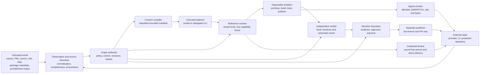

## 7. Current Threat Model For JidoCode

- Status: research baseline and living risk register, not an accepted
  architecture decision or phase receipt
- Research cutoff: 2026-08-18
- Accepted merged baseline inspected: `768216c7e787d3fb6c451f6ad2773486bf342c4d`,
  which records the HG5 closure; the accepted HG5 implementation candidate is
  `c9fc2dd625bab2385fed5fa3203c4cb6d0f38f22`
- In-progress Phase 6 branch observed through:
  `3b7e5d91eeebcd2bdb2e335dd3a89c34eed4566a`; this unmerged work is
  informational and receives no control credit
- Intended deployment posture assessed: single-operator, shadow-only harness,
  with autonomous publication, managed delegated CLI execution, MCP, remote
  agents, multi-agent delegation, and autonomous merge disabled

## Executive conclusion

JidoCode should assume that the model will eventually follow an attacker-chosen
instruction, that repository code will eventually execute maliciously, and
that a network or worker will eventually fail at the worst point in an effect.
The security objective is therefore not to prove that the model is obedient.
It is to make model compromise insufficient to create authority, disclose a
secret, escape an isolated workload, falsify evidence, or publish an
unreviewed change.

That is already the central direction of the architecture. The merged HG1-HG5
baseline has unusually strong structural controls for an agentic coding
system: data and authority are separated; manifests and revisions are pinned;
tools have closed schemas; a deterministic reference monitor mediates
host-controlled effects; leases, fences, and idempotency identities bind
effects; credentials and network access sit behind broker contracts;
repository code is assigned to isolation tiers; raw prompts and tool output are
not durable product truth; and executor success cannot itself satisfy a goal
[JC02-JC10]. These controls match the most persuasive direction in current
research: constrain control and data flow outside the model instead of relying
on prompt wording or attack-string classifiers [PI02-PI06].

The present residual risk is nevertheless too high for autonomous pull-request
publication. Three gaps dominate:

1. **Outcome integrity is not yet accepted.** The inspected feature branch
   contains unmerged Phase 6 candidates, but HG6 is not closed. There is no
   accepted fresh-checkout verifier, protected
   verifier-owned test boundary, digest-bound approval consumption,
   publication attempt, or post-publication final-goal chain. Coding-agent
   research now demonstrates
   test tampering, hard-coding, evaluation leakage, and visible-test overfitting
   often enough that this is a critical release boundary, not ordinary quality
   assurance [OI01-OI05].
2. **Several strong contracts still need deployment proof.** HG3 and HG4 define
   durable effect journals, Firecracker/gVisor-style isolation, vault or helper
   credential delivery, controlled DNS, IP-pinned TLS, durable audit, and
   streaming limits. Their receipts explicitly do not claim that production
   adapters or infrastructure are installed. A deployment must not translate
   “the port passed an in-process conformance suite” into “the host is
   isolated” [JC08-JC09].
3. **Security effectiveness is not yet measured.** HG7 remains planned.
   Research shows static prompt-injection defenses can look effective until an
   attacker adapts, persistent memory creates delayed attack paths, and longer
   tasks increase the gap between visible success and actual correctness
   [PI05, PI07, ME04-ME06, OI01]. No profile should move beyond shadow mode
   until the Phase 7 adversarial and statistical gates close.

Accordingly, the current operational decision should remain:

- use host-controlled profiles only within the accepted shadow boundary;
- keep managed delegated execution blocked;
- keep publication and protected-branch mutation unavailable;
- complete and merge HG6 before treating any candidate as an outcome;
- prove production sandbox, credential, egress, audit, and durable-journal
  adapters at the exact deployment revision; and
- close HG7 with adaptive, long-horizon, memory, hostile-repository, race, and
  outcome-integrity evaluation before increasing autonomy.

## Relationship to existing work

This report does not replace the concise
[Product Security, Privacy, And Threat Model](../architecture/product-security-privacy-and-threat-model.md)
or weaken any accepted gate. It operationalizes that document and the
[Secure And Effective Agent Harness](./02-secure-effective-agent-harness.md)
research as a current, scored threat register.

The evidence boundary matters:

- the graph-native factory phases 1-10 are accepted at their pinned merged
  candidates;
- harness HG1-HG5 are accepted at their pinned merged candidates;
- Phase 6 work exists on the inspected feature branch but has not closed HG6
  and therefore receives no residual-risk credit here;
- HG7 and HG8 remain planned; and
- a contract for an external adapter receives no deployment credit until the
  exact adapter and infrastructure pass their real-seam acceptance evidence.

This follows the repository's phase-closure rule: a checkbox or local commit is
not an accepted security control until clean-checkout CI passes, the pull
request merges, and the receipt pins the merged candidate. Any gate reopening
condition remains effective regardless of this register's score.

## Scope and method

### System in scope

The assessed system includes:

1. the Phoenix/LiveView product edge, operator authentication, session, and
   semantic event boundary;
2. TripleStore, the graph registry, semantic commands, reviewed queries,
   observations, source graphs, control graphs, evidence, decisions, audit,
   backup, and recovery;
3. repository/provider observation and reconciliation;
4. context compilation, ReqLLM model invocation, host-controlled tools, and
   developer-local delegated JidoHarness execution;
5. disposable worktrees, repository inspection, build/test execution,
   candidate capture, sandbox supervision, and artifact handling;
6. credential, egress, DNS, transport, audit, and external-effect adapters;
7. verification, approval, publication, external re-observation, and final-goal
   decisions, including planned boundaries that would increase authority;
8. model, provider, CLI, dependency, container image, compiler, package,
   GitHub Actions, and future MCP/skill supply chains; and
9. operational configuration, telemetry, incident response, backup, restore,
   erasure, and revocation.

The underlying model provider's training pipeline and a physical attack on the
operator's workstation are outside JidoCode's direct control. Their downstream
effects are still in scope: a compromised model is treated as an untrusted
planner, and a stolen operator credential or compromised workstation is an
identity and administrative threat.

### Deployment assumptions

This register assumes the first supported deployment remains single-operator
and is placed behind externally managed TLS and network access controls, as the
accepted product threat model requires [JC05]. It does not assume:

- a model reliably distinguishes instructions from data;
- a system prompt is secret or enforceable;
- repository or provider content is benign because it came from an authorized
  collaborator;
- a passing visible test suite proves the user's intent;
- a container, CLI `sandbox` flag, or provider approval mode is an operating
  system isolation boundary;
- a credential's advertised scope is enforced unless the issuer and resource
  server prove it;
- an external timeout means an effect did not occur;
- a digest alone proves provenance, safety, reproducibility, or freshness; or
- an authenticated operator, evaluator, dependency maintainer, model vendor,
  or infrastructure administrator is infallible.

### Evidence hierarchy

This report gives different evidence different weight:

| Tier | Evidence | Use in this report |
| --- | --- | --- |
| A | Accepted JidoCode receipts and code contracts; standards and official specifications; peer-reviewed systems/security work | May justify architecture requirements and control credit. |
| B | Peer-reviewed empirical agent-security and software-engineering studies | May establish demonstrated attack paths and evaluation requirements. |
| C | Recent preprints, vendor research, engineering blogs, and evolving community guidance | Directional evidence and adversarial test input; never the sole reason a JidoCode gate is considered closed. |

Recent 2026 preprints are especially useful for discovering attack variants,
but their exact rates should not be generalized to JidoCode. This report uses
their mechanisms and failure modes, not their benchmark percentages, as the
portable evidence.

### Threat-model method

The model combines:

- NIST's Govern/Map/Measure/Manage lifecycle and adversarial-ML attacker
  taxonomy [FW02-FW04];
- OWASP's agentic risks, including goal hijacking, tool misuse, identity and
  privilege abuse, supply-chain compromise, memory poisoning, code execution,
  cascading failure, and misplaced human trust [FW01];
- classic least privilege, complete mediation, fail-safe defaults, separation
  of privilege, and economy of mechanism [FW05]; and
- a misuse-case review across every JidoCode trust boundary, including
  accidental faults, concurrency, recovery, and operational compromise.

STRIDE labels are intentionally not the primary table key. A single indirect
prompt injection can cause spoofing, tampering, information disclosure, denial
of service, and elevation of privilege depending on the capability it reaches.
The register instead tracks the attack source, authority boundary, unacceptable
outcome, current evidence, and required treatment.

## Security objectives and assets

### Assets that must remain protected

| Asset | Required property |
| --- | --- |
| Operator, actor, delegation, and decision identities | Authentic, scoped, revocable, and attributable; no model- or browser-authored identity widening. |
| Factory policy, ontology, shapes, tool definitions, model profiles, and rollout decisions | Versioned, authorized, integrity-protected, and independently reviewable. |
| Source, observation, memory, evidence, control, run, and audit graphs | Correct graph placement, immutable history, exact provenance, bounded access, and recoverable integrity. |
| Repository source, base revision, candidate patch, artifacts, and external refs | Content-addressed, scope-bound, reproducible, and protected from substitution or stale publication. |
| Credentials, provider sessions, SSH agents, signing material, vault identifiers, and tokens | Never exposed to the model or hostile repository process; least privilege, short lifetime, and revocable. |
| Provider/model prompts and responses, source bodies, tool output, logs, telemetry, and backups | Classified, minimized, bounded, retained only by policy, and isolated across actors and repositories. |
| Host, worker kernel, hypervisor, network, package mirrors, and external services | Isolated from repository code, deny-by-default, monitored, patched, and destructible without losing authority. |
| Verification methods, hidden/private tests, evaluator environment, approval, and publication capability | Independent from the executor and protected against observation, modification, replay, and substitution. |
| Availability and spend | Bounded by actor, repository, provider, profile, attempt, and time window; safe under retry and hostile input. |

### Unacceptable outcomes

Any of the following is a security incident or a release blocker for the
affected profile:

1. untrusted content grants or enlarges authority, changes policy, selects an
   unapproved sink, declassifies data, or becomes accepted memory without a
   governed command;
2. repository code, a model, a CLI, a tool, or a descendant process reads a
   reusable credential or unrelated repository/actor data;
3. repository code escapes its disposable isolation boundary, persists across
   attempts, reaches the host, or communicates outside approved egress;
4. a stale, revoked, expired, replayed, duplicate, or ambiguous action creates
   an untracked durable or external effect;
5. an executor can alter or impersonate its verifier, evidence, approval,
   publication decision, post-change observation, or final-goal decision;
6. an accepted result cannot be reconstructed from exact source, candidate,
   environment, policy, tool, model, and evidence revisions;
7. a bot changes a protected branch, bypasses provider rulesets, or runs
   attacker-controlled code in a privileged CI context;
8. a prompt, response, source body, credential, private path, personal value,
   or restricted artifact enters an unauthorized log, provider, graph, backup,
   UI, or other actor's context;
9. an actor, repository, provider, or model can consume unbounded compute,
   tokens, network, storage, processes, retries, or money; or
10. restore, rollback, or derived-state rebuild reintroduces erased data,
    revoked authority, stale policy, or unverifiable history.

## Trust boundaries and data flow



The arrows do not imply equal trust. Observation creates a claim about the
world, not truth or authority. Model output creates a proposal, not permission.
A verifier creates evidence, not acceptance. An accepted patch creates a
follow-up, not publication. Publication creates an external fact that must be
re-observed and verified before the final-goal decision [JC01-JC03, JC11-JC13].

The most important boundary rule is:

> Untrusted data may influence investigation and candidate content, but it may
> not define authority, capability, policy, identity, sink, credential,
> declassification, evidence sufficiency, or acceptance.

## Threat actors and sources

| Source | Realistic access in this system | Likely objective or failure |
| --- | --- | --- |
| Malicious issue author, fork contributor, reviewer, or collaborator | Issue/PR titles and bodies, comments, branch/ref names, source, tests, docs, generated files, CI annotations | Hijack the agent, execute code, steal credentials, corrupt a patch, or cause privileged CI execution. |
| Compromised repository or dependency maintainer | Packages, lock updates, build scripts, hooks, compilers, actions, releases, submodules, images | Supply-chain execution, persistence, artifact substitution, or verifier compromise. |
| Compromised or behaviorally unsafe model/provider | Model response, tool call proposal, provider routing, retention, outage behavior | Misuse allowed capabilities, disclose context, falsify confidence, silently change behavior, or increase cost. |
| Malicious or compromised tool, CLI, plugin, skill, MCP server, or remote agent | Descriptions, schemas, results, local config, sessions, cached credentials, child processes | Tool poisoning, rug pull, confused deputy, context injection, credential theft, or lateral movement. |
| Hostile repository process | Build/test/package/native execution inside a worker | Escape, persist, exhaust resources, inspect processes, poison outputs, or use available network and credentials. |
| Stale, duplicated, crashed, or partitioned worker | Previously valid lease/capability, delayed callback, uncertain network result | Late or duplicate effect, split ownership, false terminal status, or unbounded retry. |
| Compromised provider/service or network path | Repository API, model endpoint, artifact host, DNS, redirect, mirror | False observation, token theft, response injection, SSRF, substitution, or ambiguous effects. |
| External web attacker or session thief | Product sign-in, browser session, CSRF/XSS inputs, route probing | Operator impersonation, unauthorized commands, data enumeration, or administrative misuse. |
| Authorized but mistaken or malicious operator/reviewer | Configuration, policy, grants, approvals, deployment, backup, rollout | Overbroad capability, unsafe exception, self-approval, hidden data disclosure, or weakened infrastructure. |
| Non-malicious faults | Flaky tests, graph or provider drift, incomplete observations, disk/network failure, clock skew | False acceptance/rejection, stale action, inconsistent recovery, duplicate effect, or lost audit evidence. |

An authenticated collaborator remains an untrusted content source. Conversely,
an untrusted model need not be malicious for a prompt injection to succeed; it
only needs to confuse data with instructions. The threat model concerns the
resulting capability path, not the attacker's psychology.

## Risk scoring and tracking rules

Likelihood and impact use a five-point ordinal scale:

| Value | Likelihood | Impact |
| --- | --- | --- |
| 1 | Rare under the assessed boundary; strong prerequisite or disabled surface | Negligible, fully contained, no protected asset affected |
| 2 | Unlikely but credible | Minor bounded loss or recoverable local corruption |
| 3 | Plausible during normal operation | Material repository, confidentiality, availability, or governance impact |
| 4 | Likely under determined attack or repeated use | Major cross-boundary loss, prolonged outage, or incorrect accepted outcome |
| 5 | Expected exposure or repeatedly demonstrated attack class | Critical credential, host, protected-branch, cross-scope, evidence, or authority compromise |

`Score = likelihood × impact`. Scores 1-4 are Low, 5-9 Moderate, 10-16 High,
and 17-25 Critical. The number is a prioritization aid, not a measured
probability.

The **inherent** score assumes the relevant feature exists without JidoCode
controls. The **current residual** score credits only controls accepted at the
merged baseline and controls necessarily present in the stated deployment.
Planned tasks, local commits, unmerged branches, mock adapters, and policy text
without enforcement do not lower it. A disabled feature can have a lower
current likelihood while retaining a critical enablement condition.

Tracking states mean:

- **Controlled/monitor:** accepted controls materially reduce the path, but
  regression and drift monitoring remain mandatory.
- **Deployment proof:** the contract exists; the exact real adapter or
  infrastructure still needs acceptance evidence.
- **HG6 blocker:** autonomous publication cannot be enabled before HG6 closes.
- **HG7 blocker:** the profile cannot graduate beyond shadow without HG7
  evidence.
- **Disabled/HG8:** no supported path may enable the feature before a separate
  Phase 8 decision and evidence.
- **Continuous:** treatment is operational and never permanently complete.

## Detailed threat analysis and remediation

### TM-01 — Indirect prompt injection and goal hijacking

**Sources and path.** An attacker can place instructions in issue and pull
request text, source comments, documentation, test fixtures, filenames, branch
names, commit messages, compiler diagnostics, test logs, dependency metadata,
web content, provider responses, tool results, or previously stored memory. The
model may treat that data as a higher-priority instruction and propose a
different file edit, command, network destination, secret lookup, or completion
claim. Encoding, Unicode, fragmentation, indirection, or multi-turn staging can
make simple string filters irrelevant [PI01-PI05]. Coding-editor studies show
that poisoned development resources can be turned into command execution and
credential-exfiltration attempts [PI09-PI10].

**Current posture.** JidoCode correctly labels repository, provider, model, and
tool content as untrusted; prevents those classes from creating authority;
pins bounded context manifests; exposes a closed tool catalog; intersects live
capabilities in a deterministic governor; and revalidates immediately before
host-controlled effects [JC06-JC08]. This contains many consequences even when
the model follows an injected instruction. It does not, and should not claim
to, prove that the model preserved the user's goal. A malicious proposal can
still be semantically harmful while remaining inside an allowed edit prefix or
registered check.

**Required treatment.** Keep prompt injection in the base threat model, not as
an exceptional malformed input. Preserve trusted task/control data separately
from retrieved content; attach source, integrity, confidentiality, and
authorized-use labels to every context item; prevent retrieved text from
choosing tools, sinks, capabilities, or policy; make action-task alignment a
deterministic precondition where it can be expressed; minimize each invocation
to the least data and capability needed; and force high-impact actions through
independent evidence and approval. Content classifiers, delimiters, and
instruction reminders may reduce noise but must remain defense in depth.

**Detection and acceptance evidence.** HG7 must test every JidoCode source
channel individually and in combination, including encoded, fragmented,
multi-turn, delayed-memory, and adaptive attacks. Each case must report task
utility separately from security outcome. Required telemetry is the bounded
source class and proposal/denial reason, never the raw malicious content.
Critical authorization, credential, host, protected-branch, and evidence
bypasses must remain zero.

### TM-02 — Tool misuse, schema smuggling, and poisoned outputs

**Sources and path.** A model can call a legitimate tool with a semantically
dangerous argument, exploit a parser's coercion or unknown fields, confuse one
tool version with another, or use tool output as a second instruction channel.
A compromised tool can change its description or schema after approval, return
oversized or type-confused data, forge a success, embed an instruction in an
error, or influence selection of another tool. Future dynamic tool discovery
increases this into tool squatting, shadowing, and rug-pull risk [PI09,
SC02-SC04].

**Current posture.** HG3 is a strong control: the catalog is closed and
versioned; input and output schema digests and adapter digests are pinned;
unknown fields and unsafe paths fail closed; only existing atoms are admitted;
registered commands keep executables and arguments server-owned; provider
native tools are disabled; and authorization is repeated before the effect.
ReqLLM repair, coercion, provider-native effects, and hidden retry are disabled
[JC07-JC08]. Residual risk remains in semantic misuse inside a broad allowed
operation and in real adapters that do not exactly preserve the contract.

**Required treatment.** Validate both sides of every adapter at the host
boundary; bind the exact tool-definition revision into context, proposal,
capability, invocation, result, and evaluation; keep raw output out of control
fields; maintain byte, nesting, item, and time bounds; treat descriptions and
errors as untrusted context; and require security review plus adversarial
regression for every schema or adapter change. Never make an empty or missing
tool list mean “all tools.” Never map a model-provided name to a shell command,
graph query, credential, or destination by convention.

**Detection and acceptance evidence.** Keep the existing full unknown/missing
field matrices. Add result-side mutation, Unicode key, duplicate-key, integer
boundary, decompression, content-type mismatch, changed-description, changed-
schema, and tool-composition cases. The target is 100 percent malformed-
proposal containment and no adapter call on rejection.

### TM-03 — Actor forgery, privilege escalation, and confused deputy

**Sources and path.** Browser parameters, model output, repository text, a
provider callback, or a lower-privileged worker may name a different actor,
repository, graph, credential, evaluator, approver, or destination. A trusted
broker or publication adapter can become a confused deputy if it acts on that
name using its own broader authority. Single-operator deployments also risk
collapsing executor, evaluator, approver, and administrator into one practical
principal.

**Current posture.** Product actors are reconstructed from trusted
configuration rather than browser values. Graph authorization is separate from
route admission. Harness capabilities bind actor, agent, task, repository,
attempt, lease, fence, revisions, tools, paths, references, destinations, data
classes, expiry, and revocation; the governor intersects rather than unions
authority. Model proposals cannot request decision, acceptance, ontology,
security-policy, memory, verification, or publication authority [JC05-JC08].
The accepted deployment remains single-operator and shadow-only.

**Required treatment.** Resolve all principal and resource identities from
authenticated server-side state; enforce actor/credential-owner equality or an
exact current delegation; use workload identities for adapters; bind issuer,
audience, repository, action, attempt, fence, and expiry at credential release
and resource use; and reauthorize at every effect linearization point. Introduce
an independently authenticated decision actor before any profile can publish.
High-risk policy, adapter, rollout, waiver, and credential changes should
require separation of privilege and produce immutable administrative audit.

**Detection and acceptance evidence.** Maintain cross-actor, cross-repository,
wrong-audience, revoked-delegation, actor-substitution, evaluator-equals-
executor, and approver-equals-executor matrices. Alert on any mismatch rather
than normalizing it to the configured operator.

### TM-04 — Credential theft, token replay, and ambient authentication

**Sources and path.** Credentials can leak through prompts, environment
variables, argv, process listings, crash output, journals, home-directory CLI
config, shared refresh caches, Git helpers, SSH agents, Docker sockets, cloud
metadata services, HTTP redirects, model-provider logs, or an adapter result.
A stolen bearer token may then be replayed outside the attempt or against a
different resource server. SDK ambient discovery is itself a bypass path when
explicit brokering fails [ID01-ID04].

**Current posture.** JidoCode stores credential references, not values; requires
an explicit broker result before ReqLLM invocation; excludes credentials from
model context and general sandboxes; replaces delegated CLI environments;
blocks credential-shaped results; serializes refresh ownership; and defines
direct broker-to-trusted-connector delivery [JC07, JC09-JC10]. Developer-local
subscription use is an explicit exception using an opaque existing-login
reference. The receipt states that real vault/helper and provider connectors
remain deployment integrations, so a production confidentiality claim is not
yet earned.

**Required treatment.** Keep managed delegated CLI disabled until a
provider-specific helper or credential-attaching proxy proves that descendants
cannot read or reuse provider material. Prefer workload exchange or
short-lived, audience-restricted, action-scoped, sender-constrained credentials
where providers support them; record what the provider actually enforces, not
what JidoCode requested. Disable ambient environment, home, metadata, and SDK
credential discovery. Rotate on suspected exposure, make single-use permits
remain consumed after ambiguity, isolate refresh state, and prevent secret
values from reaching backups or telemetry.

**Detection and acceptance evidence.** Seed canary credentials in every
forbidden surface; inspect argv, `/proc`, environment, filesystem, journal,
prompt, result, log, child process, DNS, and outbound request paths; and prove
zero canary leakage across actors and attempts. Audit release by reference,
scope, audience, generation, actor, and connector, never by value.

### TM-05 — Egress exfiltration, SSRF, redirects, and DNS rebinding

**Sources and path.** A model or hostile repository can request an attacker
host, encode secrets into paths or queries, target loopback/private/link-local
or cloud metadata addresses, exploit redirect revalidation gaps, race DNS, use
IPv6 or alternative address syntax, tunnel through a package registry, or
return an oversized response. Even an allowlisted model or repository provider
can become an exfiltration sink for data not approved for that provider.

**Current posture.** HG4 defines network-denied sandboxes and a broker with
exact HTTPS host/port/path/method allowlists, data classes, byte/rate/redirect
bounds, public-address validation, controlled resolution, separate selected IP
and TLS server name, per-hop reauthorization, audit-before-transport, and no
general response body [JC09]. This aligns with SSRF guidance [ID03]. The real
DNS, audit, and transport adapters and enforcement topology are not installed
by the receipt.

**Required treatment.** Make the broker the only routable egress path at the
kernel/network layer; block direct sockets and metadata endpoints; use a
controlled resolver and pass the validated IP to a transport that cannot
resolve again; revalidate every redirect; reject userinfo, fragments, ambiguous
encoding, non-canonical hosts, and non-global addresses; and allow package
traffic only through controlled mirrors. Bind confidentiality class and exact
authorized source references to each request. Do not return unreviewed headers
or bodies to the model. Rate-limit by actor, repository, attempt, destination,
and profile.

**Detection and acceptance evidence.** A deployment must pass IPv4/IPv6,
mixed-encoding, DNS-rebinding, redirect-chain, metadata, proxy, SNI/Host
mismatch, oversized-stream, slow-response, and covert-path canary tests against
the real resolver and transport. Any unaudited request must fail closed.

### TM-06 — Hostile repository execution, sandbox escape, and persistence

**Sources and path.** Build scripts, package lifecycle hooks, compilers, test
helpers, native dependencies, generated binaries, archives, language servers,
or test processes can execute attacker code. That code can exploit the kernel,
runtime, container daemon, filesystem mounts, devices, local services, shared
caches, or another job; fork or fill disks; leave a descendant; or persist into
the next attempt. A container configuration or provider “sandbox mode” is not
proof of isolation [SB01-SB02].

**Current posture.** HG4 assigns builds, tests, hooks, compilers, and native
tools to a Firecracker-style microVM; denies host filesystem, devices, Docker
socket, capabilities, ambient credentials, and network; requires an
unprivileged read-only-root profile with bounded CPU, memory, processes, disk,
output, and time; and destroys the environment after capture. HG5 additionally
proves process-group escalation and late-result rejection for admitted local
CLI profiles [JC09-JC10]. The accepted tests exercise contracts and in-process
adapters, not a deployed Firecracker or gVisor boundary.

**Required treatment.** Provision real disposable microVM workers from pinned,
patched, minimal images on hosts that carry no unrelated credentials or
repositories. Enforce no-network at the hypervisor/network layer, explicit
read-only and copy-on-write mounts, syscall/device/capability limits, immutable
toolchains, per-attempt scratch, no shared writable caches, and unconditional
destruction after bounded collection. Unknown or native workloads must never
downgrade themselves to a weaker tier. Maintain host and image SBOMs,
vulnerability response, and an emergency fleet drain.

**Detection and acceptance evidence.** Real-seam tests must attempt namespace,
mount, device, socket, metadata, host-service, cache, process, ptrace, symlink,
resource, persistence, and known escape primitives and then prove absence of
state in a later attempt. A sandbox escape or unexplained cross-attempt marker
immediately disables the profile.

### TM-07 — Git, filesystem, workflow, and checkout attacks

**Sources and path.** Paths can traverse, collide by case or Unicode, or change
type; symlinks and hard links can redirect writes; Git config, attributes,
filters, hooks, submodules, LFS, alternates, worktrees, and object replacement
can change checkout behavior. Branch names, issue titles, and other provider
fields can become shell injection. A candidate can alter workflows, verifier
configuration, dependency resolution, or tests so that later privileged CI
executes attacker-controlled code. GitHub explicitly treats issue/PR fields and
branch names as untrusted and warns against checking untrusted code out in
privileged `pull_request_target` or `workflow_run` contexts [GH01-GH03].

**Current posture.** HG3 normalizes repository-relative paths, walks path
components without following symlinks, uses server-owned registered commands,
and denies raw shell. HG4 treats hooks, workflows, build scripts, and generated
binaries as microVM workloads. Exact source snapshots, artifact digests, and
revision guards reduce substitution. Independent fresh-checkout verification
and protected-path policy are not yet accepted under HG6.

**Required treatment.** Build checkouts from exact object IDs in a clean
environment with hooks, external filters, credential helpers, inherited Git
config, alternates, and automatic submodule/LFS execution disabled unless each
is separately governed. Reject traversal, symlink/hard-link escape, special
files, path collisions, oversized trees, and object-integrity failures. Treat
changes to tests, lockfiles, build scripts, `.github/workflows`, security
policy, verifier configuration, and release automation as protected paths with
independent review. Never run an untrusted candidate in a credentialed or
write-capable workflow. Pin third-party actions by full commit SHA [GH02].

**Detection and acceptance evidence.** HG6/HG7 must include path, ref, hook,
filter, submodule, LFS, alternate-object, case/Unicode collision, malicious
workflow, poisoned artifact/cache, and privileged-trigger tests. Compare the
fresh verifier tree and candidate patch against the exact admitted manifest.

### TM-08 — Evidence manipulation, verifier compromise, and reward hacking

**Sources and path.** An executor can delete or weaken tests, add skip or flake
configuration, hard-code visible cases, inspect held-out inputs, modify the
metric or verifier, omit artifacts, create executor-only state, forge a result,
or report success despite a failed action. More capable agents need not be
explicitly malicious: optimizing for a visible acceptance proxy can produce a
patch that passes that proxy while violating the actual specification.
SpecBench reports a widening visible/held-out gap with task size; EvilGenie and
RewardHackingAgents demonstrate test/evaluator tampering in coding settings
[OI01-OI03]. Model self-report and chain-of-thought monitoring are useful
signals but are not reliable acceptance boundaries [OI04-OI05].

**Current posture.** The accepted factory already separates execution,
verification evidence, sufficiency, and governed outcome decisions; evidence
cannot directly satisfy a goal, and evaluator independence can be required
[JC11-JC12]. HG1-HG5 bind runs, manifests, invocations, artifacts, actors, and
revisions. The inspected feature branch contains unmerged candidates for
closed-run admission, fresh-checkout verification, single-use approval, and
separate publication, but none is accepted until the complete phase closes at
a pinned merged candidate. This is the largest current integrity gap and
remains Critical.

**Required treatment.** Complete HG6. Reconstruct the candidate in an
independent, secret-free fresh checkout at the exact base; apply every patch
and artifact; protect verifier, policy, workflow, and test-oracle files; run
server-owned checks plus hidden/private or independently authored issue tests;
log verifier file access where useful; and compare claimed metrics with trusted
reference computation. Candidate-authored tests count only if they fail on the
base, pass with the candidate, encode a requirement, and supplement rather
than replace independent checks. A verifier may append bounded evidence only;
it cannot accept, publish, or alter control state. Require evaluator and
decision actor separation from execution at the policy's risk threshold.

**Detection and acceptance evidence.** Test explicit evaluator edits, test
deletion, skip configuration, hard-coding, train/test leakage, missing binary
artifacts, executor workspace dependence, forged output, flaky-test abuse, and
lying completion claims. Every accepted patch must reproduce from its exact
manifest and fresh checkout. Any evidence/manifest mismatch disables the
profile and reopens HG6.

### TM-09 — Publication, protected-branch, CI, and time-of-check races

**Sources and path.** Between verification and publication, the base branch,
candidate, policy, approval, provider ruleset, credential, or destination can
change. A bot can overwrite another change, open a PR from the wrong content,
trigger a privileged workflow, modify protection, approve itself, or merge.
Provider API success may be forged or ambiguous. An attacker can also change a
bot branch after review so that the reviewed digest is not the published
digest.

**Current posture.** The factory models effectful follow-ups as new work and
does not let a decision perform an external effect. HG3 supplies fence and
idempotency contracts. Actual digest-bound approval consumption, separate
publication work, expected-old-object compare-and-swap, bot-branch/PR-only
policy, external re-observation, and final-goal closure are planned in HG6, not
accepted. Therefore publication remains disabled; its low current exposure is
not permission to enable it.

**Required treatment.** Implement publication as a new independently eligible,
leased, fenced attempt with a narrower publication credential and no merge or
protected-branch authority. Atomically consume a single-use approval bound to
the exact base, patch, evidence, action, destination, actor, model, tool,
sandbox, policy, and expiry immediately before dispatch. Use expected-old ref
CAS; reject non-fast-forward movement; rely on independently configured
provider rulesets, required reviews/checks, and CODEOWNERS; and re-observe the
exact external commit after publication. Post-change verification and a later
FinalGoal decision remain mandatory.

**Detection and acceptance evidence.** Exercise branch movement at every
boundary, approval replay/expiry/revocation, destination substitution,
provider ambiguity, bot-branch mutation, privileged workflow triggers, and
attempted protected-branch push/merge. Confirm through provider observation
that the published tree digest is the approved digest.

### TM-10 — Stale workers, replay, duplicates, and ambiguous effects

**Sources and path.** A lease can expire while a worker continues; a cancelled
CLI can emit late output; process death can occur after recording intent but
before dispatch, or after the external service applies an effect but before the
result is recorded. Retries can duplicate comments, branches, charges, model
calls, or other effects. Networks make some outcomes unknowable to the caller,
and a lock without a monotonic fence cannot stop an old holder from acting
[DS01-DS03].

**Current posture.** JidoCode commits invocation-before-effect, derives stable
effect identities, revalidates active lease and monotonic fence at sinks,
records ambiguous outcomes, rejects stale/late output, and requires
reconciliation before retry. Graph commands provide atomic idempotency. HG3's
`EffectJournal` is explicitly an in-process reference implementation;
production external sinks need a durable atomic claim/reconcile store and
provider-stable effect IDs [JC08, JC10, JC13].

**Required treatment.** Place the idempotency claim at or immediately beside
the real effect sink; persist it durably before dispatch; include attempt,
snapshot, fence, operation, and sequence in the identity; and return the first
stable result on identical replay. Never reinterpret a timeout as failure.
Reconcile external state using provider-stable IDs or exact expected state;
block conflicting retry while status is unknown; use a new linked attempt and,
where required, a new approval for semantic retry. Fences must be validated by
every real sink, not only the coordinator.

**Detection and acceptance evidence.** Run crash and partition injection at
every pre-claim, post-claim, pre-dispatch, post-dispatch, pre-result, and
post-result point, including service restart and concurrent workers. The gate
requires 100 percent stale-fence and late-output rejection and exactly one
external effect under duplicate delivery.

### TM-11 — Persistent memory poisoning, delayed influence, and extraction

**Sources and path.** A malicious issue, repository file, tool result, model
summary, evaluator finding, or query-only interaction can create a memory that
looks useful now but changes behavior later when a trigger or related task
retrieves it. Fragmented benign-looking entries can compose into a prohibited
instruction. Retrieval can also expose another actor's private interaction or
confidential repository fact. AgentPoison showed that very low poison rates can
create high attack success in evaluated agents, and later work finds that
ordinary prompt-injection defenses do not cover memory write/retrieval
semantics [ME01-ME06].

**Current posture.** JidoCode's graph-native memory design is materially safer
than automatic transcript memory: raw prompts and responses are ephemeral;
observations, proposed claims, accepted knowledge, and decisions have distinct
authority; promotion requires a governed command; provenance, scope,
contradiction, validity, and revisions remain visible; and untrusted data cannot
enter the accepted-memory sink directly [JC03, JC06, JC11-JC12]. Residual risk
remains in an authorized but mistaken promotion, overly broad retrieval, stale
knowledge, correlated fragments, and privacy extraction.

**Required treatment.** Keep write admission and retrieval authorization
separate. Require exact source/evidence/decision provenance, actor and
repository scope, sensitivity, freshness, conflict state, intended-use class,
and expiry for every retrievable memory. Do not treat repetition, model
confidence, or successful prior use as truth. Quarantine anomalous or
instruction-like candidates; cap influence and retrieval count; prevent one
memory from granting capabilities or selecting sinks; support supersession and
erasure lineage; and require independent evidence for high-impact promotion.

**Detection and acceptance evidence.** Build delayed cross-attempt, query-only,
trigger, fragmented, contradictory, stale, cross-repository, cross-actor, and
memory-extraction suites. Track poison persistence, retrieval exposure,
security outcome, and repair effectiveness separately from normal retrieval
recall.

### TM-12 — Model, dependency, image, tool, and workflow supply-chain compromise

**Sources and path.** A provider can change behavior behind a model name; a
package, Git dependency, CLI release, tool adapter, image, compiler, GitHub
Action, mirror, or transitive dependency can be compromised; a mutable tag or
tool descriptor can move; or an artifact can be substituted between review and
use. Pinning prevents surprise movement but can also preserve a newly disclosed
vulnerability indefinitely. Tool metadata is especially dangerous because it
enters both model context and an authority-bearing integration [SC01-SC04].

**Current posture.** JidoCode pins model profiles, provider and adapter
identity, ReqLLM, JidoHarness Git revision, tool schema/adapter digests,
sandbox images, commands, manifests, and source/artifact revisions; rejects
silent provider/billing fallback; and records exact component versions
[JC06-JC10]. This provides identity and change detection. It does not prove the
component was built from reviewed source, is vulnerability-free, or remains
safe under provider-side routing changes.

**Required treatment.** Require full-SHA or immutable digest pins, provenance
and signatures for build artifacts, SBOMs, controlled mirrors, isolated
reproducible builds where practical, dependency review, vulnerability and
revocation monitoring, and explicit update decisions. SLSA provenance can bind
an artifact to its build process but must be paired with source review and
policy [FW06-FW07]. Treat a model snapshot/profile change as a security-relevant
release requiring conformance and adversarial reruns. Snapshot and hash tool
descriptions/schemas before context construction; reject any runtime change.
Protect lockfiles, workflow files, image definitions, and security adapters as
high-risk paths.

**Detection and acceptance evidence.** Produce a release inventory of model,
provider, prompt, workflow, dependency, action, CLI, tool, image, compiler, and
adapter identities. Verify provenance and signatures, scan advisories, test
mirror substitution and mutable-tag movement, and immediately suspend a
profile when observed identity differs from its accepted manifest.

### TM-13 — Delegated CLI opacity, project configuration, and cached sessions

**Sources and path.** A delegated CLI can read project or user configuration,
context files, skills, extensions, MCP servers, sessions, journals, additional
directories, provider caches, or home-directory credentials. It may perform
native tool calls and internal model turns that JidoCode cannot individually
commit or fence. Its advertised sandbox/approval flags may not create OS
isolation, and cancellation may leave descendants. Upstream behavior can change
with an apparently minor CLI revision.

**Current posture.** HG5 admits only two developer-local Pi RPC profiles: an
explicit no-tools profile and a read-only `read,grep,find,ls` profile. It
disables sessions, extensions, skills, context files, approvals, additional
directories, MCP, provider/project config, and disk journals; replaces the
environment; requires a microVM contract; bounds execution; kills process
groups; and rejects late output. Provider-internal prompts, tools, memory, and
turns are honestly marked unavailable. Managed fleet use is blocked because a
provider credential-helper boundary is unproven [JC10].

**Required treatment.** Preserve the local exception as a separately labelled
access mode and never infer managed security from it. Keep managed CLI blocked
until provider-specific credential delivery, refresh isolation, environment,
filesystem, journal, cancellation, prompt transport, and tool-profile behavior
are proven end to end. Start from an empty home/config environment and a
single disposable workspace. Re-review source and rerun every gate for each
exact CLI revision. Limit delegated authority to the coarse outer capability,
then independently verify all candidate output.

**Detection and acceptance evidence.** Maintain canaries in project config,
home config, session storage, journal paths, argv, sibling repositories, and
credential caches; test resistant descendants, provider restart, partial
events, corrupt frames, and late output; and prove all canaries absent from
retained and outbound surfaces.

### TM-14 — Observation, graph, ontology, and provenance poisoning

**Sources and path.** Providers can send forged, replayed, incomplete, or
out-of-order webhooks; adapters and source analyzers can misparse repository
state; an attacker can make an incomplete observation appear complete; a
force-push can invalidate negative conclusions; malformed RDF can target the
wrong graph or exploit query cost; an ontology or shape update can alter
meaning; and users can mistake “has provenance” for “is true.” A malicious
external tracker likewise supplies claims about work, not scheduling or
acceptance authority [JC04, JC18].

**Current posture.** The graph registry is closed; commands fix graph family
and writer; shapes and vocabulary validate additions; queries use a closed
name/version/parameter catalog rather than raw SPARQL; observations are
immutable and source-scoped; revision guards detect drift; reconciliation adds
authority explicitly; accepted claims retain support, contradiction, validity,
and decision history; ontology releases and imports are pinned [JC01,
JC04-JC06, JC11-JC14]. These controls strongly limit direct injection but do
not guarantee an adapter's semantic truth or completeness.

**Required treatment.** Bind each observation to source identity, exact remote
revision/event ID, adapter version, collection bounds, inventory digest,
completeness class, cursor/checkpoint, and observation time. Permit negative
facts only from a complete current observation. Reconcile webhook claims with
authoritative fetches and exact source commits; quarantine rewrites and
impossible transitions; require cross-source or post-change confirmation for
high-impact facts; and keep external lifecycle states advisory. Pin ontology,
shape, query, and analyzer revisions and require migration/compatibility review
before activation. Keep raw query and arbitrary graph selection unavailable.

**Detection and acceptance evidence.** Test replay, omission, truncation,
pagination gaps, force-push, conflicting providers, clock skew, malformed RDF,
wrong graph family, stale revision, query amplification, analyzer disagreement,
and restore/rebuild equivalence. Surface incompleteness and contradiction
rather than summarizing them away.

### TM-15 — Confidentiality leakage and cross-repository or cross-actor access

**Sources and path.** Private source, personal data, vulnerability details,
prompts, model responses, tool output, filesystem paths, provider URLs,
artifacts, logs, audit, telemetry, or backups can reach the wrong model
provider, actor, repository, UI, adapter, or retention domain. Transforming or
encoding a secret can evade exact-match masking. Memory retrieval, model
context, error handling, and artifact references create less obvious
cross-scope paths [FW03, ME03, GH02].

**Current posture.** JidoCode defines public/internal/confidential/secret
reference/source/prompt/raw-output/personal/audit classes; stores no secret
values; uses a fail-closed bounded redactor; rejects sensitive command input;
keeps raw prompts, responses, and tool output ephemeral; constructs bounded
authorized projections; and separates route authentication from graph
authorization [JC03, JC05-JC10]. The first deployment has one operator, so it
does not prove multi-human or multi-tenant isolation. Provider-side retention
and operational logs remain external residual risk.

**Required treatment.** Maintain an explicit provider/data-class matrix and
send only the minimum authorized excerpts; bind each context item and artifact
read to actor, repository, purpose, and retention; disable provider training or
retention where the service contract supports it; and document unavoidable
provider residuals. Redact before logging, but prefer non-collection over
masking. Apply access checks when dereferencing artifact URIs, not merely when
reading metadata. Implement erasure lineage across derived graphs and backups.
Do not add multi-user or multi-tenant operation until per-human identity,
delegation, audit, retrieval, cache, subscription, and artifact-isolation tests
close.

**Detection and acceptance evidence.** Use unique prompt, source, credential,
path, personal-data, actor, and repository canaries across model requests,
adapter errors, telemetry, graph projections, UI, audit, artifacts, exports,
backups, and restore. Record counts and locations without reproducing values.

### TM-16 — Availability, resource exhaustion, and denial of wallet

**Sources and path.** Huge repositories, deep trees, binary or compressed
content, pathological RDF, long prompts, tool loops, provider stalls, retry
storms, fork bombs, output floods, flaky checks, ambiguous effects, and many
concurrent tasks can exhaust memory, CPU, disk, processes, tokens, API quotas,
network, TripleStore capacity, or money. An attacker may optimize for expensive
but valid-looking investigation. Subscription modes may expose usage only
after the provider has incurred it.

**Current posture.** Context, command, graph query, tool, output, egress,
sandbox, artifact, process, wall-time, and run/session-turn bounds are accepted;
ReqLLM hidden retries and cache are disabled; egress is rate-bounded; workloads
are supervised and destroyed; billing and budget enforcement classes are
explicit [JC06-JC10]. Some CLI token/cost/turn limits are correctly marked
observed-only or unavailable, which means they are not hard controls.

**Required treatment.** Add admission and quotas by actor, repository, profile,
model, provider, destination, and time window; reserve capacity before starts;
recheck hard budgets before every model/tool effect; cap file count, tree depth,
archive expansion, graph work, concurrency, retries, and ambiguous
reconciliation; and implement circuit breakers plus global fleet shedding.
Never convert “observed only” spend into an enforcement claim. Expose bounded
operator-visible cost/latency and require explicit consent for billable probes
or unusually costly work.

**Detection and acceptance evidence.** Stress each bound at, below, and above
its limit; test decompression bombs, slow streams, fork/output floods, retry
herds, provider outage, graph amplification, and cross-repository fairness.
Track cost and latency per correct accepted outcome, not merely per successful
model call.

### TM-17 — Product-edge compromise, operator error, and administrative abuse

**Sources and path.** An attacker can guess or steal the operator token, copy a
session, exploit CSRF or unsafe rendering, probe resources, or abuse a future
API. An authorized operator can enroll an overbroad profile, approve their own
executor output, weaken policy, register a malicious adapter, expose the app
without TLS/network controls, mishandle backups, or suppress an incident.
Single shared identity limits attribution and separation of duty.

**Current posture.** The product stores only the operator-token digest; uses
constant-shape comparison, signed renewed sessions, expiry, nonce, session
generation revocation, logout destruction, Phoenix CSRF, authenticated
LiveView mounts, trusted actor reconstruction, closed queries, scope
concealment, and redaction [JC05]. The deployment is explicitly limited to one
operator behind external TLS/network controls, and harness profiles cannot
graduate beyond shadow without a distinct decision actor.

**Required treatment.** Treat TLS termination, secure cookie attributes,
forwarded-header trust, HSTS/CSP, rate limiting, secret-manager injection, and
network exposure as deployment evidence. Rotate the token and session
generation on suspicion. Protect policy, grant, credential, adapter, model,
rollout, backup, and audit changes with least privilege, review, and immutable
administrative events. Before adding users, use per-human federated identity
with strong authentication, explicit graph delegation, revocation, and
actor-separated decisions. Render untrusted repository/provider content as
text, not executable HTML or URLs with inherited trust.

**Detection and acceptance evidence.** Test guessing/rate limits, fixation,
stale sessions, CSRF, actor-field forgery, XSS-capable content, enumeration,
cross-scope access, proxy misconfiguration, revoked grants, and administrative
self-approval. Alert on security-policy changes and session-generation changes
without logging credential material.

### TM-18 — MCP, skills, remote agents, and multi-agent cascading failure

**Sources and path.** Dynamic MCP tools can poison descriptions, shadow a
trusted tool, change after review, misuse OAuth, pass a token to another
audience, or run a malicious local server. Skills and project instructions can
introduce code or policy-like text. Remote or subordinate agents can launder
untrusted output through apparent consensus, delegate too much authority,
amplify costs, share memory or credentials, and cascade a compromised result
across repositories. Multi-tool attacks can distribute benign-looking pieces
that become harmful only when composed [SC01-SC04].

**Current posture.** These features are disabled. HG5 explicitly disables MCP,
skills, extensions, context files, sessions, and additional directories for
the only admitted delegated profiles. Phase 8 requires separate decisions for
MCP, remote agents, multi-agent execution, and autonomous merge [JC10, JC17].
The disabled status lowers current likelihood but is a strict enablement
boundary, not evidence that the integrations are safe.

**Required treatment.** Keep them disabled until HG8. Any MCP adapter must
snapshot and pin server identity, transport, protocol, tool description,
schema, annotations, and adapter digest before context use; place every call
through the same reference monitor; validate issuer/audience; prohibit token
passthrough; isolate local servers; and reject runtime catalog drift. Skills
must be treated as signed/versioned dependencies and untrusted instructions,
not authority. Each remote/sub-agent gets its own attenuated, expiring,
fence-bound capability and cannot delegate or aggregate authority. Messages
retain source/trust labels; consensus never becomes evidence; budgets and
termination apply to the whole tree.

**Detection and acceptance evidence.** Test tool poisoning, squatting,
shadowing, rug pull, OAuth mix-up, token passthrough, malicious elicitation,
server persistence, changed schema/result, cross-agent trust laundering,
collusion, cyclic delegation, memory sharing, resource amplification, and
partial-tree cancellation before enabling any production path.

### TM-19 — Evaluation blind spots, adaptive attackers, and model drift

**Sources and path.** A static benchmark can be contaminated, memorized, or
overfit; a one-turn attack can understate an adaptive adversary; aggregate pass
rates can hide a catastrophic repository/model slice; pass-at-k can hide poor
single-run reliability; abstention can inflate precision; an LLM judge can
share the executor's blind spots; and a provider can change behavior without a
client-side version change. Long horizons and persistent state expose failure
modes absent from short isolated cases [PI02, PI05-PI08, OI01].

**Current posture.** JidoCode pins profiles, manifests, revisions, and
acceptance criteria and has conformance fixtures, but HG7's evaluation tracks,
fresh/private corpora, security suite, statistical pipeline, and enforced
rollout stages are not implemented. This is a Critical residual risk because
the absence of observed bypasses in phase conformance tests is not an estimate
of adversarial security effectiveness.

**Required treatment.** Complete HG7 before graduation. Use fresh/private
tasks, multiple independent runs, hidden verifier-owned checks, blinded human
review where needed, preregistered metrics, Wilson intervals for binary gates,
and per-repository/language/task/risk/model/access-mode slices. Report Correct
Accepted Yield, accepted precision, critical false acceptance, acceptance and
attempt coverage, unauthorized effects, malformed containment, stale/late
rejection, provenance completeness, reproducibility, recovery, leakage, cost,
latency, and post-publication regressions separately. Maintain adaptive
multi-round, long-horizon, combined-channel, memory, hostile-repository, race,
and outcome-integrity red-team suites. Rerun on every model, prompt, tool,
policy, adapter, CLI, image, or provider change and periodically in production
shadow.

**Detection and acceptance evidence.** Enforce the numeric HG7 gates in the
coordinator, not a dashboard: zero critical bypasses, 100 percent stale/late
rejection, 100 percent evidence binding and malformed containment, no
unapproved fallback, and the planned fresh/private task and confidence-bound
precision thresholds before automatic PR publication [JC16].

### TM-20 — Audit, backup, restore, erasure, and rollback integrity

**Sources and path.** An adapter can perform an effect when audit is
unavailable, logs can omit or expose sensitive values, a backup can be
tampered with or contain secrets, a restore can bind the wrong graphs or
external revisions, rollback can reintroduce revoked policy or erased personal
data, and derived caches can conceal a recovery mismatch. Ransomware,
operator error, disk corruption, incomplete snapshots, and key loss are also
threats.

**Current posture.** TripleStore is the only durable application authority;
semantic commands and graph revisions preserve immutable history; the
security-audit family is separated; external egress requires audit-before-
effect by contract; and the accepted backup architecture requires trusted
paths, checksums, lineage, erasure manifests, isolated restore validation, and
derived rebuild [JC05, JC09, JC14]. Production audit durability, storage
controls, backup encryption/key custody, and real restore drills remain
deployment obligations.

**Required treatment.** Use append-only, access-controlled, integrity-checked
audit storage with bounded classified events and independent retention; fail
closed before high-impact effects if the required audit write cannot commit.
Encrypt backups with separately governed keys; record exact graph revisions,
ontology/shapes, checksums, software versions, external references, erasure
lineage, and policy/revocation generations; validate in an isolated environment
before promotion; rebuild derived state; and compare authority invariants
before serving traffic. Never back up secret values that the product is
forbidden to persist. Keep multiple tested recovery points and protect deletion
from the same principal that writes them.

**Detection and acceptance evidence.** Run scheduled corrupt, truncated,
stale-policy, revoked-grant, erased-data, missing-key, wrong-version, and
cross-repository restore drills. Record recovery point/time outcomes and proof
that no revoked or erased fact becomes current authority.

## Current threat register

Ratings below apply to the accepted HG5, single-operator, shadow-only posture.
`5×5 C` means likelihood 5, impact 5, score 25, Critical; `3×4 H` means score
12, High; `2×4 M` means score 8, Moderate.

| ID | Threat and main source | Inherent | Credited accepted controls | Current residual | Required next treatment | Gate / state |
| --- | --- | ---: | --- | ---: | --- | --- |
| TM-01 | Indirect prompt injection and goal hijack from repository/provider/tool/memory content | `5×5 C` | Trust labels, bounded manifests, no authority flow, closed capabilities/reference monitor | `4×4 H` | Adaptive multi-channel tests; task-action policy; HG6 outcome separation | HG6 + HG7 blocker |
| TM-02 | Tool/schema smuggling and poisoned tool output | `4×5 C` | Pinned closed schemas/adapters, strict input validation, no native tools/repair, pre-effect recheck | `2×4 M` | Result mutation and composition suite; immutable catalog update process | Controlled / HG7 |
| TM-03 | Actor forgery, privilege escalation, confused deputy | `4×5 C` | Trusted actor construction, graph auth, intersected fence-bound capabilities | `2×5 H` | Independent decision identity; workload identities; full cross-scope matrix | HG6 + deployment |
| TM-04 | Credential theft, replay, ambient discovery | `4×5 C` | References not values, explicit broker contract, direct connector delivery, sanitized runtime | `3×5 H` | Real vault/helper/proxy; short-lived audience-bound tokens; canary proof | Deployment proof |
| TM-05 | Egress exfiltration, SSRF, metadata, DNS/redirect bypass | `4×5 C` | Network-denied profiles and exact broker/DNS/IP/TLS/audit contract | `3×5 H` | Real enforced resolver/transport/audit topology and adversarial proof | Deployment proof |
| TM-06 | Hostile repository execution, escape, persistence | `4×5 C` | Tier contract, microVM assignment, no host/network/credentials, resource bounds | `3×5 H` | Real Firecracker/gVisor fleet, patched images, destructive hostile tests | Deployment proof |
| TM-07 | Git/path/hook/filter/submodule/workflow/CI attacks | `4×5 C` | Path guard, registered commands, exact snapshots, hostile-code tiering | `3×4 H` | Hardened checkout and protected paths; fresh verifier; privileged-CI policy | HG6 + deployment |
| TM-08 | Evidence tampering, verifier compromise, reward hacking | `5×5 C` | Existing evidence/decision separation, run/artifact/revision provenance | `4×5 C` | Complete merged HG6 fresh verifier, protected oracle, actor separation | **HG6 blocker** |
| TM-09 | Publication substitution, stale branch, privileged CI, protected branch | `4×5 C` | Publication not admitted; decision follow-ups require new work | `1×5 M` | Separate fenced publication, single-use approval, CAS, PR-only, re-observe | Disabled / HG6 |
| TM-10 | Stale worker, replay, duplicate, ambiguous external effect | `4×5 C` | Invocation-before-effect, fences, stable IDs, graph idempotency, late rejection | `2×5 H` | Durable production sink journal and crash/partition reconciliation proof | Deployment proof |
| TM-11 | Memory poisoning, delayed triggers, privacy extraction | `4×4 H` | Governed promotion, scoped provenance, immutable claims, no raw transcript memory | `3×4 H` | Retrieval/write separation, quarantine/expiry, combined memory security suite | HG7 / continuous |
| TM-12 | Model/tool/dependency/image/workflow supply-chain compromise | `4×5 C` | Exact pins/digests, no silent fallback, manifest attribution | `3×5 H` | Signed provenance/SBOM, monitoring, controlled updates, rerun gates | Continuous / release |
| TM-13 | Delegated CLI config, sessions, cached credentials, opaque tools | `4×5 C` | Only developer-local deny/read profiles; config/MCP/skills/session disabled; outer kill | `2×5 H` | Keep managed use blocked until helper/proxy and real isolation proof | Disabled / deployment |
| TM-14 | Observation, graph, ontology, source-analysis poisoning | `4×5 C` | Closed graphs/queries, shapes, immutable observations, revisions, reconciliation | `2×5 H` | Completeness/negative-fact tests, cross-source confirmation, analyzer fuzz | Controlled / continuous |
| TM-15 | Confidentiality and cross-repository/actor/provider leakage | `4×5 C` | Data classes, fail-closed redaction, bounded projections, ephemeral raw context | `3×5 H` | Provider retention matrix, artifact/backup proof, per-human isolation before expansion | Deployment + continuous |
| TM-16 | Resource exhaustion and denial of wallet | `5×4 C` | Context/tool/sandbox/egress/run bounds; no hidden retry; explicit budget class | `3×4 H` | Global/per-scope quotas, hard spend gates, circuit breakers, stress corpus | HG7 + operations |
| TM-17 | Product-edge/session attack and operator/admin abuse | `3×5 H` | Token digest, renewed signed session, generation, CSRF, trusted actor, shadow cap | `2×5 H` | TLS/proxy proof, per-human strong auth and separation before multi-user/publication | Deployment / continuous |
| TM-18 | MCP/skills/remote/multi-agent tool poisoning and cascade | `4×5 C` | Entire surface disabled; delegated profiles explicitly disable it | `1×5 M` | Separate HG8 ADRs, governed tool transport, attenuation, composition tests | **Disabled / HG8** |
| TM-19 | Evaluation blind spots, adaptive attack, benchmark leakage, drift | `5×5 C` | Versioned profiles/manifests and phase conformance fixtures | `4×5 C` | Implement and enforce HG7 adaptive, fresh/private, statistical rollout gates | **HG7 blocker** |
| TM-20 | Audit loss, backup disclosure, unsafe restore/rollback/erasure | `3×5 H` | Single durable graph authority, audit family, checksums/lineage/restore contract | `2×5 H` | Real durable audit, encrypted backups, isolated restore and erasure drills | Deployment / continuous |

### Register interpretation

The matrix is intentionally conservative in three places:

- TM-08 remains Critical even though external publication is disabled because
  verification is the next authority boundary under active implementation.
- TM-04 through TM-06 and TM-10 remain High despite strong accepted contracts
  because the receipts disclaim the real deployment adapters that must enforce
  them.
- TM-09 and TM-18 have Moderate current residual risk only because their
  surfaces are disabled. Enabling either before its gate closes raises current
  likelihood immediately and is a policy violation, not an accepted risk.

## Remediation roadmap

### P0 — Preserve current containment while HG6 is implemented

1. Keep every model-access profile at shadow stage.
2. Keep managed delegated CLI, publication, MCP, remote agents, multi-agent
   execution, and merge unavailable.
3. Complete Phase 6 from the accepted HG5 baseline:
   - closed-run verification admission;
   - independent fresh checkout and complete candidate reconstruction;
   - protected-path and candidate-test policy;
   - verifier-owned/hidden checks and structured evidence only;
   - digest-bound single-use approval with live reauthorization;
   - publication as separate leased/fenced PR-only work;
   - external re-observation, post-change verification, and FinalGoal decision;
   - race, replay, ambiguity, and actor-separation tests.
4. Do not lower TM-08 or TM-09 until HG6 passes clean-checkout CI, merges, and
   its receipt pins the merged candidate.

### P0 — Prove the deployment boundary before running hostile code

1. Register and attest the real restricted-worker, gVisor-style, Firecracker,
   and dedicated-host adapters at exact image/tool/kernel revisions.
2. Prove no network, host filesystem, Docker socket, device, ambient
   credential, shared writable cache, or cross-attempt state exists.
3. Deploy the real credential helper/vault and direct connector boundary; keep
   managed CLI blocked until provider-specific proof exists.
4. Deploy controlled DNS, IP-pinned TLS transport, durable audit-before-effect,
   streaming response limits, and kernel-enforced egress denial.
5. Replace the in-process reference effect journal for external sinks with a
   durable atomic claim/reconcile implementation.
6. Attach real-seam hostile, restart, partition, canary, and destruction
   evidence to the deployment candidate.

### P1 — Close HG7 before any authority graduation

1. Implement the pinned evaluation tracks and per-profile result slices.
2. Add adaptive prompt-injection, tool-composition, hostile repository, secret
   canary, SSRF/DNS, sandbox, stale worker, approval race, evidence tampering,
   memory poison, cross-scope, and resource-exhaustion suites.
3. Add fresh/private coding tasks, held-out or verifier-owned tests, and blinded
   independent review.
4. Enforce Correct Accepted Yield, precision, false-acceptance, coverage,
   containment, provenance, reproducibility, recovery, cost, latency, and
   post-publication metrics in the rollout decision.
5. Require a distinct authenticated decision actor and retain zero-tolerance
   disable triggers.

### P1 — Establish release and supply-chain operations

1. Produce an inventory/SBOM and provenance for dependencies, Git actions,
   model profiles, CLI, tools, adapters, images, compilers, and mirrors.
2. Protect workflows, verifier policy, lockfiles, tool definitions, credential
   and egress adapters, and rollout policy with independent review.
3. Define vulnerability intake, emergency revocation, profile suspension,
   credential rotation, image drain, and provider/model rollback procedures.
4. Rerun conformance and adversarial gates for every security-relevant identity
   change; a mutable provider alias is not a stable evaluated profile.

### P2 — Continuous operations

1. Run shadow canaries for secret leakage, scope isolation, stale effects, and
   unexpected egress.
2. Review memory promotions, waivers, policy changes, ambiguous effects,
   unusual denial rates, spend, and long-running attempts.
3. Perform scheduled backup/restore/erasure and incident-response exercises.
4. Reassess this register after every phase closure, deployment topology
   change, incident/near miss, new external work source, and material research
   result.

### P3 — Optional extensions

Treat each Phase 8 feature as a new threat-model delta. MCP is a governed tool
transport, not an authority source. A remote agent is a separately identified
and capability-attenuated worker, not a trusted peer. Multi-agent agreement is
not verification. Autonomous merge requires its own ADR, provider protection,
rollback, evaluation, and incident evidence even after PR publication is safe.

## Control ownership and evidence matrix

The following matrix turns the threats into work packages. “Closure evidence”
is the minimum proof needed before the listed owner/gate may mark treatment
effective.

| Control package | Threats | Delivery owner / gate | Closure evidence |
| --- | --- | --- | --- |
| Fresh-checkout verification and protected oracle | TM-01, TM-07, TM-08, TM-09 | Harness HG6 | Merged receipt; base/candidate reconstruction; protected-path, test-tamper, hard-code, missing-artifact, executor-state, and forged-result matrix |
| Digest-bound approval and separate PR publication | TM-03, TM-09, TM-10, TM-17 | Harness HG6 + provider admin | Single-use/replay/race evidence; exact CAS; branch/ruleset proof; no merge credential; external re-observation |
| Real sandbox fleet | TM-06, TM-07, TM-13, TM-16 | Deployment acceptance / HG4 invariant | Exact host/image attestation; hostile escape/persistence/resource tests; destruction and cross-attempt absence proof |
| Real credential delivery | TM-03, TM-04, TM-13, TM-15 | Deployment acceptance / HG4 invariant | Provider-specific helper/proxy test; no descendant access; audience/scope/revocation proof; cross-actor canaries |
| Real egress/DNS/transport/audit | TM-05, TM-15, TM-16, TM-20 | Deployment acceptance / HG4 invariant | Kernel routing proof; real DNS/redirect/metadata suite; IP/TLS binding; streaming limits; durable audit fail-closed |
| Durable effect journal and reconciliation | TM-09, TM-10, TM-20 | External sink adapters / HG3 invariant | Crash/partition/restart matrix at every linearization point; provider-stable IDs; no duplicate effect |
| Adaptive security and outcome evaluation | TM-01-TM-02, TM-06-TM-08, TM-11, TM-16, TM-19 | Harness HG7 | Pinned corpus/profile; preregistered metrics; adaptive and long-horizon results; enforced stage verdict |
| Supply-chain assurance and change control | TM-02, TM-06-TM-07, TM-12-TM-13, TM-19 | Release engineering / continuous | SBOM, provenance/signatures, full pins, advisory review, protected changes, rerun evidence |
| Memory admission, retrieval, and privacy testing | TM-01, TM-11, TM-14-TM-15 | Knowledge boundary + HG7 | Poison/extraction/fragmentation/cross-scope suite; provenance/scope/freshness/erasure proof |
| Identity and administrative separation | TM-03-TM-04, TM-09, TM-15, TM-17 | Product/deployment policy | Independent authenticated decision actor; delegation/revocation matrix; immutable admin audit |
| Backup, restore, erasure, and incident operations | TM-12, TM-15, TM-17, TM-20 | Operations / continuous | Encrypted backup manifest; isolated restore drill; erased/revoked fact non-reintroduction; incident exercise |
| MCP/remote/multi-agent extension security | TM-02-TM-05, TM-11-TM-13, TM-18 | Separate HG8 ADRs | Protocol/tool identity pins; OAuth and capability proof; isolation; composition/cascade/cancellation evaluation |

## How to maintain this register

For each threat, the team should retain these fields in the matrix or a future
graph-backed equivalent:

```text
threat_id
title
attack_sources
affected_assets
unacceptable_outcomes
inherent_likelihood
inherent_impact
credited_control_ids_and_versions
residual_likelihood
residual_impact
treatment_owner
gate_or_release_block
implementation_status
evidence_receipt_and_commit
deployment_attestation
last_exercised_at
next_review_at
exceptions_with_owner_and_expiry
incidents_and_near_misses
```

Apply these update rules:

1. Never delete a threat because a control exists. Change its residual rating
   and link the evidence; preserve the attack and reopening condition.
2. Never credit a plan checkbox, unmerged commit, mock, in-process reference
   adapter, or vendor marketing claim as a deployed control.
3. A model, provider, prompt, tool, CLI, schema, adapter, image, workflow,
   verifier, policy, ontology, or deployment-topology change invalidates the
   relevant evaluation slice until rerun.
4. An exception must name the exact scope, compensating control, accountable
   actor, expiry, and disable/review trigger. Exceptions cannot authorize a
   release blocker forbidden by an accepted gate.
5. Record safe failure separately from successful task completion. A system
   that rejects every task is secure against effects but not an effective
   harness; a system that completes tasks while leaking a canary has failed.
6. Reopen the earliest affected gate on an invariant failure, even if the
   matrix previously said Controlled.

## Security metrics and stop conditions

| Measure | Required posture |
| --- | --- |
| Critical authorization, credential, host, protected-branch, or evidence bypass | Zero in the preregistered suite and zero observed in operation |
| Stale-fence and post-cancellation late output rejection | 100 percent |
| Manifest/revision/evidence binding for accepted patches | 100 percent |
| Malformed proposal, tool input, and tool output containment | 100 percent before adapter effect |
| Unapproved provider/model/credential/billing fallback | 100 percent rejected |
| Secret, prompt, journal, path, actor, repository, and credential canary leakage | Zero |
| Accepted patch fresh-checkout reproducibility | 100 percent |
| Duplicate external effect under retry/restart | Zero; ambiguity remains explicit until reconciled |
| Sandbox persistence or cross-attempt marker | Zero |
| Automatic PR publication quality gate | At least the HG7 planned sample, precision, Wilson-bound, and zero-critical-false-acceptance thresholds |
| Restore of revoked authority or erased data as current | Zero |

Immediately disable the affected profile or sink on:

- secret or cross-scope data exposure;
- sandbox escape, host contact, or cross-attempt persistence;
- protected-branch mutation or unapproved publication;
- evidence, candidate, approval, or external-revision mismatch;
- acceptance without independent verification and a governed decision;
- a stale fence or cancelled worker effect;
- observed tool/model/adapter/image identity drift;
- audit bypass for an audited high-impact effect; or
- inability to determine whether continued operation can repeat the incident.

Containment should revoke the profile and credential generation, cancel active
leases, destroy affected workers, block ambiguous retries, preserve bounded
forensic and graph evidence, rotate exposed material, and require an explicit
re-admission decision. Do not persist raw secret-bearing prompts or outputs in
the name of incident response; use externally controlled forensic handling
when raw material is indispensable.

## Mapping to OWASP agentic risks

| OWASP Agentic Top 10 family | JidoCode threats |
| --- | --- |
| Agent goal hijack | TM-01, TM-11, TM-14 |
| Tool misuse and exploitation | TM-02, TM-05, TM-07 |
| Identity and privilege abuse | TM-03, TM-04, TM-17 |
| Agentic supply-chain vulnerabilities | TM-12, TM-13, TM-18 |
| Unexpected code execution | TM-06, TM-07 |
| Memory and context poisoning | TM-01, TM-11, TM-14 |
| Insecure inter-agent communication | TM-15, TM-18 |
| Cascading failures | TM-10, TM-16, TM-18-TM-20 |
| Human-agent trust exploitation | TM-08, TM-09, TM-17, TM-19 |
| Rogue agents | TM-01-TM-06, TM-08-TM-10, contained by outer authority rather than assumed obedience |

This mapping is a coverage check, not a substitute for the project-specific
register. JidoCode's most consequential cases cross multiple OWASP categories:
for example, a poisoned issue can hijack a goal, misuse a tool, execute code,
steal a credential, falsify verification, and exploit human trust in one chain.

## Decisions recommended for architecture acceptance

This research recommends that later ADRs or phase receipts explicitly accept
or reject these statements:

1. Prompt injection is assumed possible; prompt-only defenses cannot satisfy a
   security boundary.
2. Repository, provider, model, tool, verifier, and memory content never gains
   authority merely from its source or apparent confidence.
3. The current residual register credits merged evidence only and separates
   contract proof from deployment proof.
4. No profile may leave shadow mode before HG6 and HG7 close at pinned merged
   candidates.
5. No hostile repository code may run in production before exact real sandbox,
   credential, egress, DNS, transport, audit, and destruction adapters pass
   their deployment acceptance matrix.
6. Managed delegated CLI remains blocked until provider-specific credential
   isolation is proven; developer-local use remains a labelled exception.
7. Every accepted candidate is reconstructed and independently verified from a
   fresh checkout with a protected oracle.
8. Publication is separate work, PR-only, CAS-protected, independently
   approved where required, and followed by external observation and
   post-change verification.
9. Every real external sink provides durable idempotency and explicit
   ambiguity reconciliation at its effect boundary.
10. Model, provider, prompt, tool, schema, CLI, image, adapter, verifier, and
    policy changes are security-relevant evaluation changes.
11. Persistent memory has separate write and read authorization, scoped
    provenance, expiry, contradiction, supersession, erasure, and adversarial
    evaluation.
12. Multi-user, MCP, remote-agent, multi-agent, and merge authority remain
    disabled until separately accepted threat-model deltas close.
13. The register and its evidence are reviewed after every gate closure,
    incident, near miss, new external source, and deployment change.

## Final recommendation

JidoCode's core security architecture should be retained. Its strongest idea is
that the nondeterministic model never owns authority: the graph, deterministic
governor, capability, sandbox, broker, verifier, decision service, and external
provider each add a narrow independently checkable fact. Current research
supports that direction and gives little reason to believe better prompting
will replace it.

The next security milestone should be outcome integrity, not broader tool or
model access. Close HG6 with a fresh, protected, independent verifier and a
digest-bound PR-only publication chain. In parallel, turn HG3/HG4's abstract
ports into deployment evidence for real isolation, credentials, egress, audit,
and durable effect reconciliation. Then close HG7 with adaptive and
long-horizon evaluation before increasing autonomy.

Until those steps are accepted at merged candidates, the safe and honest
product claim is narrow: JidoCode has a well-designed, tested control kernel for
shadow agent execution, not yet a production-proven autonomous repository
publisher. Keeping that distinction visible is itself one of the most
important controls in this threat model.

## Sources

### Frameworks, standards, and security principles

- **FW01.** OWASP GenAI Security Project, [Top 10 for Agentic Applications for
  2026](https://genai.owasp.org/resource/owasp-top-10-for-agentic-applications-for-2026/),
  2025.
- **FW02.** NIST AI 100-2e2025, [Adversarial Machine Learning: A Taxonomy and
  Terminology of Attacks and
  Mitigations](https://csrc.nist.gov/pubs/ai/100/2/e2025/final), 2025.
- **FW03.** NIST AI 600-1, [Artificial Intelligence Risk Management Framework:
  Generative Artificial Intelligence
  Profile](https://www.nist.gov/publications/artificial-intelligence-risk-management-framework-generative-artificial-intelligence),
  2024.
- **FW04.** NIST AI 100-1, [Artificial Intelligence Risk Management Framework
  1.0](https://www.nist.gov/publications/artificial-intelligence-risk-management-framework-ai-rmf-10),
  2023, and the [NIST AI RMF Core](https://airc.nist.gov/airmf-resources/airmf/5-sec-core/).
- **FW05.** Jerome H. Saltzer and Michael D. Schroeder, [The Protection of
  Information in Computer
  Systems](https://web.mit.edu/Saltzer/www/publications/protection/), 1975.
- **FW06.** NIST SP 800-218, [Secure Software Development Framework
  1.1](https://csrc.nist.gov/pubs/sp/800/218/final), 2022.
- **FW07.** SLSA, [Specification 1.2](https://slsa.dev/spec/v1.2/) and
  [Provenance](https://slsa.dev/spec/v1.2/provenance), 2025.
- **FW08.** NIST SP 800-190, [Application Container Security
  Guide](https://csrc.nist.gov/pubs/sp/800/190/final), 2017.

### Prompt injection, tool use, and coding agents

- **PI01.** Kai Greshake et al., [Not What You've Signed Up For: Compromising
  Real-World LLM-Integrated Applications with Indirect Prompt
  Injection](https://arxiv.org/abs/2302.12173), 2023.
- **PI02.** Edoardo Debenedetti et al., [AgentDojo: A Dynamic Environment to
  Evaluate Prompt Injection Attacks and Defenses for LLM
  Agents](https://arxiv.org/abs/2406.13352), 2024.
- **PI03.** Zekun Xi et al., [InjecAgent: Benchmarking Indirect Prompt
  Injections in Tool-Integrated Large Language Model
  Agents](https://aclanthology.org/2024.findings-acl.624/), Findings of ACL
  2024.
- **PI04.** Edoardo Debenedetti et al., [Defeating Prompt Injections by
  Design](https://arxiv.org/abs/2503.18813), 2025. CaMeL separates trusted
  control/data flow and applies capability checks outside the model.
- **PI05.** Qiusi Zhan et al., [Adaptive Attacks Break Defenses Against
  Indirect Prompt Injection Attacks on LLM
  Agents](https://aclanthology.org/2025.findings-naacl.395/), Findings of NAACL
  2025.
- **PI06.** Yupei Zhang et al., [Agent Security Bench: Formalizing and
  Benchmarking Attacks and Defenses in LLM-based
  Agents](https://arxiv.org/abs/2410.02644), 2024.
- **PI07.** Tanqiu Jiang et al., [AgentLAB: Benchmarking LLM Agents Against
  Long-Horizon Attacks](https://arxiv.org/abs/2602.16901), 2026 preprint.
- **PI08.** Yuchen Ling et al., [Toward Secure LLM Agents: Threat Surfaces,
  Attacks, Defenses, and Evaluation](https://arxiv.org/abs/2606.10749), 2026
  preprint surveying 247 papers.
- **PI09.** Fengyu Liu et al., [Make Agent Defeat Agent: Automatic Detection of
  Taint-Style Vulnerabilities in LLM-based
  Agents](https://www.usenix.org/conference/usenixsecurity25/presentation/liu-fengyu),
  USENIX Security 2025.
- **PI10.** Yue Liu et al., [Your AI, My Shell: Demystifying Prompt Injection
  Attacks on Agentic AI Coding Editors](https://arxiv.org/abs/2509.22040), 2026
  revision.

### Persistent memory security

- **ME01.** Zhaorun Chen et al., [AgentPoison: Red-teaming LLM Agents via
  Poisoning Memory or Knowledge Bases](https://arxiv.org/abs/2407.12784), 2024.
- **ME02.** Shen Dong et al., [Memory Injection Attacks on LLM Agents via
  Query-Only Interaction](https://arxiv.org/abs/2503.03704), 2025.
- **ME03.** Bo Wang et al., [Unveiling Privacy Risks in LLM Agent
  Memory](https://aclanthology.org/2025.acl-long.1227/), ACL 2025.
- **ME04.** Pritam Dash et al., [From Untrusted Input to Trusted Memory: A
  Systematic Study of Memory Poisoning Attacks in LLM
  Agents](https://arxiv.org/abs/2606.04329), 2026 preprint.
- **ME05.** Xuanze Chen et al., [MemSecBench: Tracking Agent Memory Poisoning
  from Persistence to Consequence and Repair](https://arxiv.org/abs/2607.27080),
  2026 preprint.
- **ME06.** Zixin Rao et al., [FragFuse: Bypassing Access Control of Large
  Language Model Agents via Memory-Based Query Fragmentation and
  Fusion](https://www.usenix.org/conference/usenixsecurity26/presentation/rao),
  USENIX Security 2026.

### Outcome integrity, reward hacking, and evaluation

- **OI01.** Bingchen Zhao et al., [SpecBench: Measuring Reward Hacking in
  Long-Horizon Coding Agents](https://arxiv.org/abs/2605.21384), 2026 preprint.
- **OI02.** Jonathan Gabor et al., [EvilGenie: A Reward Hacking
  Benchmark](https://arxiv.org/abs/2511.21654), 2026 revision.
- **OI03.** Yonas Atinafu and Robin Cohen, [RewardHackingAgents: Benchmarking
  Evaluation Integrity for LLM ML-Engineering
  Agents](https://arxiv.org/abs/2603.11337), 2026 preprint.
- **OI04.** OpenAI, [Detecting Misbehavior in Frontier Reasoning
  Models](https://openai.com/index/chain-of-thought-monitoring/), 2025.
- **OI05.** Anthropic Alignment Science, [Measuring and Improving Coding Audit
  Realism with Deployment
  Resources](https://alignment.anthropic.com/2026/coding-audit-realism/), 2026.
- **OI06.** Edward K. Smith et al., [Is the Cure Worse Than the Disease?
  Overfitting in Automated Program
  Repair](https://doi.org/10.1145/2786805.2786825), ESEC/FSE 2015.
- **OI07.** OpenAI, [Introducing SWE-bench
  Verified](https://openai.com/index/introducing-swe-bench-verified/), 2024.

### GitHub, CI, and agentic repository operations

- **GH01.** GitHub Docs, [Script
  Injections](https://docs.github.com/en/actions/concepts/security/script-injections),
  including untrusted issue, PR, ref, and branch-name contexts.
- **GH02.** GitHub Docs, [Secure Use
  Reference](https://docs.github.com/en/actions/reference/security/secure-use),
  including least-privilege tokens, full-SHA action pins, untrusted checkout,
  and self-hosted runner guidance.
- **GH03.** GitHub Security Lab, [Preventing Pwn
  Requests](https://securitylab.github.com/resources/github-actions-preventing-pwn-requests/),
  2021.
- **GH04.** GitHub, [How GitHub's Agentic Security Principles Make Our AI
  Agents as Secure as
  Possible](https://github.blog/ai-and-ml/github-copilot/how-githubs-agentic-security-principles-make-our-ai-agents-as-secure-as-possible/),
  2025.
- **GH05.** GitHub, [Automate Repository Tasks with GitHub Agentic
  Workflows](https://github.blog/ai-and-ml/automate-repository-tasks-with-github-agentic-workflows/),
  2026.

### MCP and tool supply-chain security

- **SC01.** Model Context Protocol, [2026-07-28 Specification
  Announcement](https://blog.modelcontextprotocol.io/posts/2026-07-28/) and
  [Security Best
  Practices](https://modelcontextprotocol.io/specification/2026-07-28/basic/security_best_practices),
  2026.
- **SC02.** Saeid Jamshidi et al., [Semantic Attacks on Tool-Augmented LLMs:
  Securing MCP Against Descriptor-Level
  Manipulation](https://arxiv.org/abs/2512.06556), 2026 revision.
- **SC03.** Manish Bhatt et al., [ETDI: Mitigating Tool Squatting and Rug Pull
  Attacks in MCP](https://arxiv.org/abs/2506.01333), 2025.
- **SC04.** OWASP, [Agentic Skills Top 10](https://owasp.org/www-project-agentic-skills-top-10/)
  and [Skill Security Checklist](https://owasp.org/www-project-agentic-skills-top-10/checklist.html),
  2026 evolving guidance.

### Identity, egress, isolation, and distributed effects

- **ID01.** IETF BCP 240 / RFC 9700, [Best Current Practice for OAuth 2.0
  Security](https://www.rfc-editor.org/rfc/rfc9700.html), 2025.
- **ID02.** IETF RFC 8707, [Resource Indicators for OAuth
  2.0](https://www.rfc-editor.org/rfc/rfc8707.html), 2020.
- **ID03.** OWASP Cheat Sheet Series, [Server-Side Request Forgery
  Prevention](https://cheatsheetseries.owasp.org/cheatsheets/Server_Side_Request_Forgery_Prevention_Cheat_Sheet.html).
- **ID04.** AWS, [IMDS Credential Provider](https://docs.aws.amazon.com/sdkref/latest/guide/feature-imds-credentials.html),
  documenting ambient instance-metadata credential discovery.
- **SB01.** Alexandru Agache et al., [Firecracker: Lightweight Virtualization
  for Serverless
  Applications](https://www.usenix.org/conference/nsdi20/presentation/agache),
  NSDI 2020.
- **SB02.** NIST SP 800-190, [Application Container Security
  Guide](https://csrc.nist.gov/pubs/sp/800/190/final), 2017.
- **DS01.** Mike Burrows, [The Chubby Lock Service for Loosely-Coupled
  Distributed
  Systems](https://research.google/pubs/the-chubby-lock-service-for-loosely-coupled-distributed-systems/),
  OSDI 2006.
- **DS02.** Brandur Leach, [Designing Robust and Predictable APIs with
  Idempotency](https://stripe.com/blog/idempotency), Stripe Engineering, 2017.
- **DS03.** Malcolm Featonby, [Making Retries Safe with Idempotent
  APIs](https://aws.amazon.com/builders-library/making-retries-safe-with-idempotent-APIs/),
  Amazon Builders' Library.

### JidoCode research, plans, and accepted evidence

- **JC01.** JidoCode, [Graph-Native Managed Repository
  Factory](./01-graph-native-managed-repository-factory.md).
- **JC02.** JidoCode, [Secure And Effective Agent
  Harness](./02-secure-effective-agent-harness.md).
- **JC03.** JidoCode, [Total Agent Memory For Software
  Engineering](./03-total-agent-memory-for-software-engineering.md).
- **JC04.** JidoCode, [Ontology-Backed Source Graphs For Coding
  Agents](./04-ontology-backed-source-graphs-for-coding-agents.md).
- **JC05.** JidoCode, [Product Security, Privacy, And Threat
  Model](../architecture/product-security-privacy-and-threat-model.md).
- **JC06.** JidoCode, [Harness Phase 1 Contract And Threat Model
  Receipt](../architecture/harness-phase-01-receipt.md).
- **JC07.** JidoCode, [Harness Phase 2 Context And ReqLLM Gateway
  Receipt](../architecture/harness-phase-02-receipt.md).
- **JC08.** JidoCode, [Harness Phase 3 Tool Reference Monitor
  Receipt](../architecture/harness-phase-03-receipt.md).
- **JC09.** JidoCode, [Harness Phase 4 Production Sandbox And Brokers
  Receipt](../architecture/harness-phase-04-receipt.md).
- **JC10.** JidoCode, [Harness Phase 5 JidoHarness Subscription Runtime
  Receipt](../architecture/harness-phase-05-receipt.md).
- **JC11.** JidoCode, [Verification And Evidence
  Boundary](../architecture/verification-evidence-boundary.md).
- **JC12.** JidoCode, [Governed Decision
  Outcomes](../architecture/governed-decision-outcomes.md).
- **JC13.** JidoCode, [Execution Effects And
  Provenance](../architecture/execution-effects-provenance.md).
- **JC14.** JidoCode, [Backup, Restore, And
  Integrity](../architecture/backup-restore-and-integrity.md).
- **JC15.** JidoCode, [Harness Phase 6 Verification, Decision, And Publication
  Plan](../planning/secure-effective-agent-harness/phase-06-verification-decision-and-publication.md).
- **JC16.** JidoCode, [Harness Phase 7 Evaluation And Controlled Rollout
  Plan](../planning/secure-effective-agent-harness/phase-07-evaluation-and-controlled-rollout.md).
- **JC17.** JidoCode, [Harness Phase 8 Optional Extensions
  Plan](../planning/secure-effective-agent-harness/phase-08-optional-extensions.md).
- **JC18.** JidoCode, [Beadwork As A Git-Native External Work
  Source](./06-beadwork-as-a-git-native-external-work-source.md).
