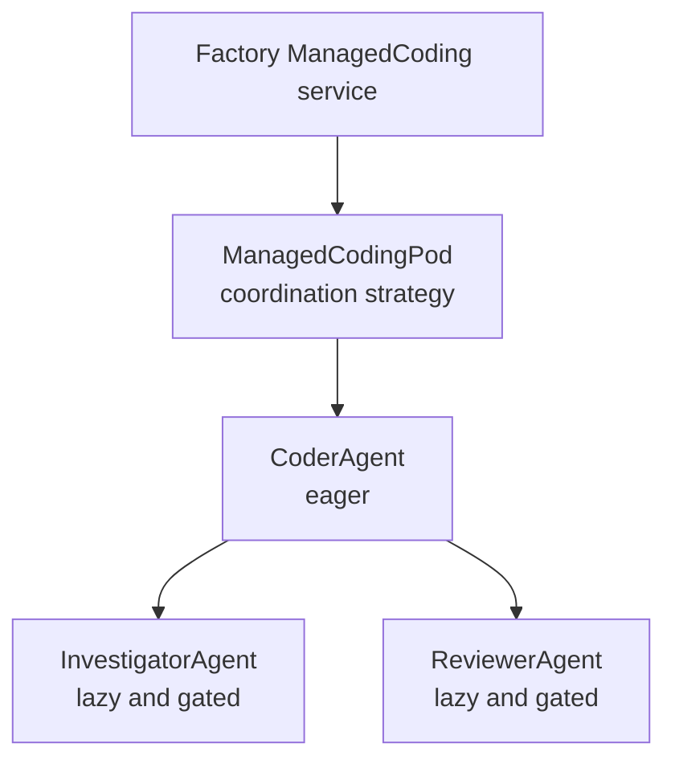
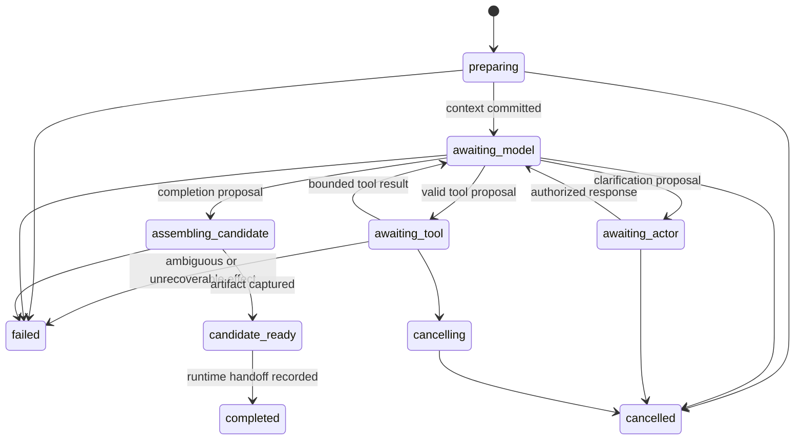

## 10. Managed Coding Agent Runtime In The Jido Ecosystem

- Status: research proposal, not an accepted architecture decision,
  implementation plan, runtime profile, or rollout authorization
- Research cutoff: 2026-08-24
- Accepted merged JidoCode baseline inspected:
  `fb4716137c5bf5e6b6a8468cee171e32f83b7266`
- Pinned ecosystem baseline: Jido `2.3.2`, ReqLLM `1.20.0`, and JidoHarness
  `2.0.0` at `e41fc1651282469f2db4219a48d9f7feef1b0dbc`
- Current upstream snapshots inspected: Jido
  `548b2a345765ba33e687341c661bbbcbdda73d94`, Jido AgentOS
  `b89641721e68c4fed79a2c0ded94bb10c3b6371e`, and JidoHarness
  `8b468b4902f295e4f3162b2b841cae29806bcdaa`

## Executive Conclusion

JidoCode should implement a **Managed Coding Agent Runtime** as a
product-owned, graph-authorized behavioral loop built on `Jido.Agent`. It
should use `Jido.Pod` only when one accepted coding profile needs a durable
*runtime topology* of cooperating Jido agents. Neither an agent nor a pod may
become a second durable workflow authority.

The recommended boundary is:

```text
TripleStore facts, policy, lease, attempt, evidence, and decisions
  -> Factory admits one exact managed coding attempt
    -> disposable Jido.Agent or attempt-scoped Jido.Pod runtime
      -> deterministic context compiler
      -> one-interaction model gateway
      -> capability-enforcing tool gateway
      -> isolated workspace and registered checks
    -> candidate artifact and bounded execution evidence
  -> independent fresh-checkout verification
  -> governed decision
  -> separately authorized publication
```

`Jido.Agent` is the correct unit for the coding behavior because it provides
immutable state, explicit actions, strategies, signal routing, and
runtime-owned directives. `Jido.Pod` is the correct unit only for an evaluated
team topology because a pod is itself a Jido agent with a canonical topology
of named agent or nested-pod collaborators. `Jido.AgentOS` is an important
ecosystem direction for hosting long-lived pods, but JidoCode should not adopt
an AgentOS persistence path that competes with its graph-only source of truth.

The first production candidate should remain **single-agent**. A custom coding
strategy should drive a bounded inspect-plan-edit-check loop through existing
JidoCode host boundaries. A pod-compatible topology may be introduced at the
same contract seam, but reviewer, investigator, or parallel worker nodes must
remain disabled until their task class demonstrates benefit and non-regression
through the accepted evaluation and rollout gates.

This recommendation fills a concrete gap. JidoCode already implements context,
model, tool, sandbox, execution, memory, verification, approval, publication,
and recovery control planes. It does not yet connect them into one managed
coding loop. Its current native `ExecutionAgent` tracks runtime status only,
and its admitted JidoHarness profiles are developer-local, deny-all or
read-only, and explicitly ineligible for managed fleet execution.

## Relationship To Accepted JidoCode Architecture

This research extends but does not override:

- [Graph-Only Source Of Truth](../adr/0001-graph-only-source-of-truth.md)
- [TripleStore Backend Contract](../adr/0002-triple-store-backend-contract.md)
- [Execution Runtime Boundary](../architecture/execution-runtime-boundary.md)
- [Execution Attempt Lifecycle](../architecture/execution-attempt-lifecycle.md)
- [Execution Effects And Provenance](../architecture/execution-effects-provenance.md)
- [Verification And Evidence Boundary](../architecture/verification-evidence-boundary.md)
- [Governed Decision Outcomes](../architecture/governed-decision-outcomes.md)
- [Product Security, Privacy, And Threat Model](../architecture/product-security-privacy-and-threat-model.md)
- [Module And Plane Boundaries](../architecture/module-boundaries.md)
- [Secure And Effective Agent Harness](./02-secure-effective-agent-harness.md)
- [Total Agent Memory For Long-Lived Software Engineering](./03-total-agent-memory-for-software-engineering.md)
- [Coding Agent Evaluations For Development](./08-coding-agent-evaluations-for-development.md)
- [Prompt Improvement And Evaluation](./09-prompt-improvement-and-evaluation.md)

The following invariants remain binding:

1. `TripleStore` is the only application-owned durable authority.
2. Models, agents, pods, runtimes, worktrees, queues, journals, and caches are
   disposable effect mechanisms or projections.
3. A model may propose an action but cannot authorize it, enlarge a
   capability, accept evidence, decide goal satisfaction, adopt knowledge, or
   publish by itself.
4. Every effect is reauthorized against the current lease and fencing token
   immediately before dispatch.
5. Candidate generation, independent verification, governed decision, and
   publication remain separate authorities.
6. Secret values, reusable credentials, provider-private data, and hidden
   reasoning never enter durable graph state or model-visible context.
7. Runtime recovery begins from graph state, not agent memory, pod storage,
   provider conversation state, or a local journal.

## Research Question

> How should JidoCode use `Jido.Agent`, `Jido.Pod`, and adjacent Jido ecosystem
> components to run a useful coding loop while preserving graph-owned
> authority, complete mediation, reproducible recovery, independent
> verification, and gradual rollout?

The subordinate questions are:

1. Which state belongs in a Jido agent, and which state must remain in the
   graph?
2. Should the initial runtime be one agent, a pod, or an AgentOS-hosted pod?
3. How should model calls and tool effects return to the behavioral loop?
4. How should cancellation, retries, ambiguous effects, and process loss be
   represented?
5. When does a specialist or multi-agent topology justify its additional cost
   and risk?
6. How can the same Factory attempt contract support both a host-controlled
   Jido loop and a delegated JidoHarness coding CLI without conflating their
   trust models?

## Research Method And Evidence

This proposal combines:

1. Direct inspection of JidoCode's accepted execution, harness, memory,
   verification, and publication implementations.
2. Direct inspection of the pinned Jido `2.3.2` package, including
   `Jido.Agent`, `Jido.Agent.Strategy`, `Jido.AgentServer`,
   `Jido.Agent.InstanceManager`, `Jido.Pod`, `Jido.Pod.Topology`, and pod
   mutation/reconciliation modules.
3. First-party Jido guides for agents, strategies, pods, runtime selection,
   persistence, and multi-tenancy.
4. First-party Jido AgentOS and JidoHarness sources as ecosystem direction and
   adapter evidence, not as automatically accepted JidoCode dependencies.
5. The security, evaluation, memory, and prompt research already accepted as
   planning input in this repository.

The current first-party Jido documentation may describe a newer patch release
than JidoCode's pin. Recommendations that depend on behavior beyond `2.3.2`
must therefore receive a compatibility test or an explicit dependency update
before implementation.

## What The Jido Concepts Actually Mean

### `Jido.Agent`: Unit Of Behavior

A `Jido.Agent` is an immutable data structure with validated state. Its core
operation processes actions and returns a complete updated agent plus
runtime-owned directives. The split matters:

- agent state changes are explicit and testable;
- actions express behavior;
- a strategy controls multi-step execution and routing;
- directives describe outbound effects for the runtime;
- `AgentServer` supplies the OTP process boundary and routes results or
  signals back into the agent.

The strategy seam is particularly relevant. A custom strategy may implement an
LLM loop, expose a stable snapshot, route model and tool result signals, and
schedule bounded continuation ticks. This is a better fit than hiding a coding
loop inside a GenServer callback or recursively calling a model adapter.

For JidoCode, the agent is **not** the durable execution attempt. It is one
disposable interpreter of the current graph-authorized attempt. Its state may
contain bounded working references and loop progress, but every value needed
for semantic recovery must already be committed to or reconstructable from the
graph.

### `Jido.Pod`: Unit Of Runtime Topology

In Jido `2.3.2`, a pod is an ordinary `Jido.Agent` with:

- a canonical `%Jido.Pod.Topology{}` snapshot;
- named `:agent` or nested `:pod` nodes;
- eager or lazy node activation;
- `:depends_on` links for reconciliation order;
- `:owns` links for runtime parentage;
- nodes managed through ordinary `Jido.Agent.InstanceManager` registries;
- explicit reconciliation and node lookup; and
- live batched add/remove mutation with validation and reports.

A pod does not create a new kind of cognitive intelligence. It manages the
runtime shape of collaborating agents. The pod itself remains an agent and can
own coordination behavior through actions, a strategy, and plugins.

Jido documentation calls the topology durable because it can live in ordinary
agent persistence. Under JidoCode's accepted architecture, that meaning must
be narrowed:

> A pod topology may be durable as an accepted graph specification; the
> running Jido topology snapshot is only a disposable projection of that
> specification.

JidoCode must not enable Jido storage as an independent product database or
recover semantic authority from a pod checkpoint. The current ETS-only Jido
runtime is compatible with this rule.

### `Jido.AgentOS`: Kernel Direction, Not Current Authority

Jido AgentOS describes an OTP-native host for long-lived pods with the mental
model:

```text
Kernel -> Pod -> Agent
```

That model is attractive for Phoenix applications that want a sibling agent
runtime subsystem. It also presents an application-facing context in front of
raw pod mechanics, which agrees with JidoCode's module-boundary rules.

AgentOS is not currently a JidoCode dependency. Its documented persistence
examples introduce a persistence adapter such as Ecto. That would violate
JidoCode's sole-store rule if it became durable product authority. JidoCode may
evaluate AgentOS later only if one of these conditions is satisfied:

1. it runs as a purely disposable kernel reconstructed from graph state;
2. it gains a graph-authoritative storage adapter whose writes go through
   accepted JidoCode semantic commands; or
3. an explicit superseding ADR authorizes a different persistence boundary.

AgentOS terminology is therefore useful for ecosystem alignment, but direct
adoption is not required to implement the first managed coding agent.

### JidoHarness: Delegated Runtime, Not The Host-Controlled Loop

JidoHarness normalizes external coding CLI processes. JidoCode already admits
an exact JidoHarness revision behind `ExecutionRuntime`, but only through
developer-local Pi RPC profiles with deny-all or bounded read-only tools.

The Managed Coding Agent Runtime and JidoHarness are two different execution
profiles:

| Profile | Loop owner | Tool mediation | Recovery truth |
| --- | --- | --- | --- |
| Host-controlled Jido agent | JidoCode strategy and signals | Every tool call crosses `ToolGateway` | Graph attempt and event state |
| Delegated JidoHarness CLI | External coding CLI | Outer attempt sandbox/capability plus admitted CLI profile | Graph attempt and bounded observations |

They must not be nested casually. Wrapping an autonomous CLI inside a
host-controlled LLM loop would create two planners, two retry policies, unclear
budgets, and an ambiguous tool authority boundary.

## Current JidoCode Gap

JidoCode already has most of the required deterministic pieces:

- `JidoCode.Factory.Harness.ContextCompiler` for revision-pinned context;
- `JidoCode.Factory.ModelGateway` and the ReqLLM adapter for one model
  interaction;
- `JidoCode.Factory.Tool.ReferenceMonitor`, `ToolGateway`, and effect journal;
- a closed tool catalog with read, edit, check, diff, submission, and
  clarification contracts;
- sandbox, credential, and egress boundaries;
- graph-owned attempt, event, content, evidence, decision, and memory
  protocols;
- independent fresh-checkout verification and governed publication; and
- runtime supervision, cancellation, fencing, and graph-based recovery.

The missing bridge is one product-owned loop that:

1. receives an admitted graph work item;
2. compiles exact context;
3. invokes one model interaction;
4. validates a model response or tool proposal;
5. executes an authorized tool through a concrete adapter;
6. returns the bounded result to the model loop;
7. stops on completion, budget, cancellation, denial, or failure;
8. assembles a candidate artifact; and
9. hands the candidate to independent verification.

The current `JidoCode.Runtime.ExecutionAgent` is not that loop. It records only
attempt IRI, fencing token, runtime status, and sequence. The tool catalog also
names intended adapter identities such as `JidoCode.Factory.Tools.ApplyEdit`,
but concrete production adapters for those identities are not implemented.

## Recommended Runtime Architecture

### Product Boundary

The stable public API should remain a Factory service rather than raw Jido
calls:

```text
JidoCode.Factory.ManagedCoding
  admit_attempt/2
  start_attempt/2
  steer_attempt/3
  cancel_attempt/3
  attempt_status/2
```

The service resolves current graph authority, lease, fence, snapshot, coding
profile, prompt bundle, tool catalog, model profile, budgets, and sandbox
profile. It then starts or signals the disposable runtime. Web, schedulers, and
operators should not address pod nodes or agent pids directly.

### Initial Single-Agent Shape

The first accepted profile should use one agent:

```text
JidoCode.Runtime.ManagedCodingAgent
  strategy: JidoCode.Runtime.ManagedCodingStrategy
  runtime: AgentServer under the existing Jido instance
  identity: opaque attempt IRI + fencing token runtime key
  storage: ETS only
  recovery: reconstruct from current graph attempt projection
```

The agent owns behavioral progress only. Deterministic host services remain
ordinary modules and ports; they should not be wrapped in pretend agents merely
to make the topology look multi-agent.

### Pod-Compatible Expansion

When evaluation justifies specialists, the same Factory boundary may select an
attempt pod:



Only behavioral roles belong in the topology. Context compilation, model
dispatch, tool authorization, sandboxing, graph commands, verification, and
publication remain host-owned boundaries outside the pod.

An illustrative topology is:

```elixir
use Jido.Pod,
  name: "managed_coding_attempt",
  topology:
    Jido.Pod.Topology.new!(%{
      name: "managed_coding_attempt",
      nodes: %{
        coder: %{
          agent: JidoCode.Runtime.CoderAgent,
          manager: :managed_coding_workers,
          activation: :eager
        },
        investigator: %{
          agent: JidoCode.Runtime.InvestigatorAgent,
          manager: :managed_coding_workers,
          activation: :lazy
        },
        reviewer: %{
          agent: JidoCode.Runtime.ReviewerAgent,
          manager: :managed_coding_workers,
          activation: :lazy
        }
      },
      links: [
        {:depends_on, :reviewer, :coder}
      ]
    })
```

This is illustrative research syntax, not an accepted module definition.

The default accepted topology should still enable only `:coder`. Lazy nodes
must not become reachable merely because they appear in a module. Each
specialist requires an accepted profile revision, graph authorization,
capability ceiling, budget allocation, and rollout evidence.

## Coding Strategy And State Machine

The coding behavior should be a custom `Jido.Agent.Strategy`, not a large
effectful action. A strategy is appropriate because the distinguishing behavior
is a multi-step, asynchronous model/tool loop with stable snapshots and signal
routes.

Recommended states:



The agent state should contain only bounded working data:

- attempt IRI and fencing token;
- exact runtime, profile, prompt, tool, and context digests;
- current loop phase and monotonic local sequence;
- remaining model, token, tool, time, and output budgets;
- current model invocation or tool invocation IRI;
- bounded references to the latest result;
- candidate workspace/diff digests when available;
- cancellation or terminal classification; and
- reconstruction watermark tying the runtime to a graph revision.

It must not contain:

- raw credentials;
- a graph/store handle;
- unbounded prompt, response, transcript, or tool bytes;
- provider-private session state as recovery truth;
- policy or capability objects that can outlive reauthorization;
- an accepted-evidence or goal-satisfaction decision; or
- mutable repository truth.

## Action, Directive, And Signal Protocol

The loop should keep decision logic pure and make effects explicit.

### Pure Strategy Actions

Candidate internal actions include:

- `BeginAttempt`
- `ContextPrepared`
- `ModelSucceeded`
- `ModelFailed`
- `ToolSucceeded`
- `ToolDenied`
- `ToolAmbiguous`
- `ActorResponded`
- `CandidateCaptured`
- `CancelRequested`
- `BudgetExceeded`
- `RuntimeRecovered`

Each action validates the expected current phase, invocation identity,
sequence, fence, and digest before changing agent state.

### Runtime-Owned Directives

JidoCode may define custom directive structs for requests such as:

- compile exact context;
- dispatch one model interaction;
- execute one governed tool proposal;
- request one actor clarification;
- capture the candidate artifact; and
- emit one bounded runtime observation.

The directive executor must call Factory-owned facades, not Knowledge internals
or raw adapters. Results return as typed signals correlated to the directive's
attempt, sequence, invocation IRI, and fence.

### Signal Routes

The strategy should declare closed routes similar to:

```text
jido_code.coding.start
jido_code.coding.context_result
jido_code.coding.model_result
jido_code.coding.tool_result
jido_code.coding.actor_response
jido_code.coding.candidate_result
jido_code.coding.cancel
jido_code.coding.recover
```

Unknown, duplicated, stale, cross-attempt, or post-terminal signals fail closed
or become bounded ignored observations. They never reopen a terminal attempt.

## Model Interaction Boundary

Every turn uses `ModelGateway` as one interaction, not as a hidden agent loop.
The runtime must bind:

- model-access profile and exact provider/model identity;
- prompt-bundle revision and digest;
- context-manifest IRI and digest;
- tool definitions and schema digests;
- invocation budget and timeout;
- response format and validation revision;
- attempt, actor, scope, lease, and fence;
- streaming policy; and
- explicit no-fallback behavior.

Model output should normalize into one of a small set of host meanings:

1. a tool proposal;
2. a candidate-completion proposal;
3. a clarification request; or
4. a bounded failure/abstention.

Free-form text may accompany a proposal as untrusted explanatory material. It
cannot itself select an effect adapter, alter policy, mark a check successful,
or complete the attempt.

## Tool Runtime Boundary

The existing catalog is a sound contract starting point, but a managed runtime
requires real adapter implementations. Initial adapters should cover:

- source search;
- exact-digest file read;
- one-match digest-guarded edit;
- no-overwrite file creation;
- exact-digest file deletion;
- registered checks;
- candidate diff inspection; and
- candidate artifact capture.

Each adapter must:

1. operate only inside the attempt workspace;
2. resolve canonical paths through the repository path guard;
3. receive a current fence and bounded capability;
4. reject stale snapshots and content digests;
5. return a typed, size-bounded result;
6. record invocation-before-effect and terminal outcome;
7. reconcile ambiguous effects before retry; and
8. expose no raw shell, arbitrary command, unrestricted network, or graph
   access.

Publication must remain outside the coding loop. `submit_candidate` is a
separately approved publication operation after independent verification and
governed decision, not a normal coder tool.

## Context And Memory

The context compiler should produce a new manifest at the start of an attempt
and whenever a material graph or workspace revision invalidates the current
context. A model turn consumes only:

- system and authority contract;
- current task and objective checklist;
- repository policy and constraints;
- exact snapshot source excerpts or semantic paths;
- closed tool definitions;
- bounded current observations; and
- an optional separately authorized memory evidence packet.

Retrieved memory remains structurally separated and explicitly
non-instructional. Repository content, issue text, comments, prior patches,
tool output, and remembered procedures are untrusted data even when they come
from an internal graph.

The runtime must recompile rather than silently reuse context when a relevant
source graph, policy graph, lease, capability, prompt bundle, tool definition,
memory partition, or erasure generation changes.

## Graph And Runtime Ownership

### Graph-Owned Durable State

The graph owns:

- work eligibility and dependencies;
- lease and fencing token;
- execution attempt identity and lifecycle;
- context and model invocation manifests;
- tool proposals, invocation receipts, and bounded outcomes;
- candidate artifacts and provenance;
- cancellation requests and observed terminal outcomes;
- verification evidence;
- approval and decision records;
- publication attempts; and
- adopted knowledge and memory lifecycle.

### Runtime-Only State

Jido/Jido.Pod owns only disposable runtime material:

- pids, monitors, mailboxes, timers, and queues;
- agent working state and strategy cursor;
- pod member adoption and current topology projection;
- provider stream handles;
- temporary tool buffers;
- sandbox handles and worktree paths; and
- bounded in-memory journals or caches.

Deleting all runtime-only state and restarting must not change which work is
authorized, which effects occurred, which candidate exists, or which result was
accepted.

## Pod Topology Authority And Mutation

A managed coding topology must be selected by a graph-owned profile revision.
The runtime may instantiate the corresponding static Jido topology, but the
agent may not enlarge it.

Live `Jido.Pod.mutate/3` should be disabled for ordinary model behavior. If a
future adaptive profile needs topology changes, the order must be:

```text
agent proposes topology change
  -> deterministic validator checks allowed profile transition
  -> graph command records authorized topology revision
  -> runtime applies the exact add/remove plan
  -> runtime reports reconciliation result
  -> graph records bounded observation
```

A runtime mutation failure does not roll back graph history or authorize an
alternate topology. Recovery reconciles the accepted graph topology revision
or terminates the attempt. Self-replication, arbitrary module names, arbitrary
manager names, cross-partition adoption, and model-selected plugins remain
forbidden.

## Tenant, Repository, And Attempt Isolation

Jido partitions can provide logical runtime namespaces. They do not replace
JidoCode authorization or sandbox isolation.

The recommended mapping is:

| Boundary | Mechanism |
| --- | --- |
| Tenant hard isolation | Separate Jido instance and separate graph authority scope when required |
| Shared-instance logical tenant | Jido partition derived from an opaque tenant identity |
| Repository authorization | Graph scope and capability, not partition alone |
| Attempt runtime identity | Attempt IRI plus fencing token within the partition |
| Filesystem isolation | Dedicated disposable sandbox/worktree |
| Provider isolation | Credential and egress brokers |

No raw tenant, repository, or user text should become an atom. Runtime-defined
pod node names should use validated strings to avoid atom exhaustion.

## Recovery, Retry, And Cancellation

### Recovery

On BEAM or worker loss, Factory reads the graph attempt projection and classifies
the next action:

- terminal attempt: do not recreate;
- active lease and no unresolved effect: recreate agent/pod from a bounded
  recovery command;
- model invocation without a committed result: classify provider outcome as
  unknown and retry only under the profile's idempotency policy;
- tool invocation with ambiguous effect: reconcile the effect identity before
  any retry;
- cancellation committed: recreate only enough runtime to enforce termination
  or record absence; and
- incompatible runtime/profile revision: abandon or supersede, never reinterpret
  through a new version.

Agent or pod checkpoints may accelerate reconstruction only if they are
verified against the exact graph watermark. They are never sufficient recovery
evidence by themselves and should remain disabled initially.

### Retry

The strategy may propose retry, but deterministic policy decides whether it is
allowed. Model calls, reads, edits, checks, publication, and external effects
have different retry semantics. A generic “retry last step” action is unsafe.

### Cancellation

Cancellation order remains:

1. commit the graph cancellation request;
2. close new model/tool admissions;
3. signal the agent or pod;
4. cancel provider streams and sandbox processes;
5. reject late results through fence/cancellation checks;
6. destroy temporary workspaces as policy permits; and
7. record the observed cancellation outcome.

Stopping a pid alone is not a semantic cancellation.

## Single-Agent And Multi-Agent Policy

The single-agent profile is the baseline because it minimizes coordination,
context duplication, conflicting edits, cost, and authority edges.

Specialists are justified only for a task class with measurable independent
work, such as:

- parallel investigation of non-overlapping graph/source cuts;
- an independent advisory review pass that cannot accept its own findings; or
- language/domain specialization with disjoint capabilities.

They are not justified merely to simulate organizational roles. Every
additional node adds:

- another model context and prompt-injection surface;
- another budget and cancellation boundary;
- result attribution and conflict-resolution work;
- duplicated or divergent repository understanding;
- possible cross-node data leakage; and
- pressure to confuse consensus with evidence.

Pod topology does not authorize multi-agent execution. A graph-owned rollout
decision must name the exact topology, task class, model profiles, capability
partition, context-sharing policy, budgets, evidence, and disable path.

## Verification And Completion

The coding agent may propose that a candidate is ready. It cannot complete the
goal authoritatively.

The runtime handoff requires:

- closed attempt event accounting;
- exact candidate diff and workspace digest;
- source snapshot and base revision;
- tool and model invocation completeness;
- unresolved-effect count of zero;
- no active cancellation or stale fence;
- explicit omissions and unavailable content;
- candidate artifact provenance; and
- the coding profile, prompt, model, tool, runtime, and topology revisions.

Independent fresh-checkout verification then evaluates the candidate from its
artifact, not the coder's mutable workspace. Evidence sufficiency, acceptance,
goal satisfaction, knowledge adoption, and publication remain subsequent graph
commands with distinct actors and authority.

## Security Analysis

The principal threats are:

1. **Repository prompt injection.** Source and issue content attempts to alter
   system goals or tool policy.
2. **Tool-argument smuggling.** Model output encodes traversal, command, URL,
   or oversized payloads inside apparently valid fields.
3. **Capability drift.** A long-running loop uses authority after lease,
   policy, actor, or scope changes.
4. **Stale runtime effects.** A cancelled or superseded agent writes after a
   newer fence exists.
5. **Context substitution.** A cache, branch tip, stale graph, or provider
   conversation replaces the pinned source context.
6. **Pod topology escalation.** An agent adds a worker, plugin, module, owner,
   or cross-partition link outside its profile.
7. **Agent-to-agent laundering.** One compromised specialist presents
   untrusted content as trusted coordination data.
8. **Secret exposure.** Credentials enter context, tool output, environment
   inherited by repository code, or durable logs.
9. **Self-verification.** The coder's own test selection or narrative becomes
   accepted evidence.
10. **Denial and cost exhaustion.** Loops, parallel nodes, output, tests, or
    retries consume unbounded resources.

Required controls include strict instruction/data separation, closed schemas,
complete mediation, current-fence checks, immutable context manifests,
capability attenuation, bounded outputs, sandbox isolation, brokered secrets
and egress, exact effect identities, independent verification, hard budgets,
and immediate profile disablement.

## Observability And Evaluation

Telemetry is operational and disposable. Durable evaluation evidence is
adopted through graph commands. The runtime should emit bounded measurements
for:

- loop turns and terminal phase;
- model latency, token use, and structured-response failures;
- tool proposal, denial, execution, retry, and ambiguity counts;
- context size, omissions, retrieval cost, and recompilations;
- changed files, diff size, and edit conflicts;
- check selection, duration, flake classification, and resource use;
- cancellation latency and late-result rejection;
- runtime/pod restart and recovery outcome;
- candidate verification result and review burden; and
- cost per accepted candidate and per useful failure.

The release target is the complete profile:

```text
model + parameters + prompt bundle + coding strategy + agent/pod topology
  + context policy + memory policy + tool catalog/adapters + sandbox
  + budgets + verifier + repository/task distribution
```

Changing any material field produces a new evaluation target. The initial
profile should graduate through offline fixtures, hostile repositories, private
tasks, shadow execution, and human-reviewed draft pull requests. Production
merge authority remains a separate decision.

## Proposed Module Boundaries

The following names illustrate ownership rather than prescribe final modules:

```text
JidoCode.Factory.ManagedCoding
JidoCode.Factory.ManagedCoding.Admission
JidoCode.Factory.ManagedCoding.Recovery
JidoCode.Factory.ManagedCoding.CandidateHandoff

JidoCode.Runtime.ManagedCodingAgent
JidoCode.Runtime.ManagedCodingStrategy
JidoCode.Runtime.ManagedCoding.Directives.*
JidoCode.Runtime.ManagedCodingPod          # later, gated
JidoCode.Runtime.ManagedCodingAgents.*     # later, gated

JidoCode.Integrations.Tools.SearchSource
JidoCode.Integrations.Tools.ReadFile
JidoCode.Integrations.Tools.ApplyEdit
JidoCode.Integrations.Tools.CreateFile
JidoCode.Integrations.Tools.DeleteFile
JidoCode.Integrations.Tools.RegisteredCheck
JidoCode.Integrations.Tools.CandidateDiff
JidoCode.Integrations.Tools.CandidateCapture
```

`JidoCode.Runtime` may depend on Factory runtime ports and report bounded
events. It must not call Knowledge internals. Concrete tool adapters remain
effect-only integrations and cannot issue semantic commands or authorize
themselves.

## Recommended Delivery Sequence

This is research sequencing, not an implementation plan.

### Stage A: Close The Single-Agent Contract

- Define the coding profile, state machine, budgets, signal schemas, and
  terminal classifications.
- Define exactly what state is graph-owned versus agent-owned.
- Add architecture checks preventing Runtime-to-Knowledge access and Jido
  persistence from becoming product truth.

### Stage B: Implement Concrete Local Tool Adapters

- Implement digest/path/fence-guarded source and workspace tools.
- Register server-owned checks without raw shell access.
- Prove invocation-before-effect, idempotency, ambiguity reconciliation, and
  cancellation.

### Stage C: Connect Context, Model, And Tools

- Implement the custom coding strategy and directives.
- Route model and tool results through closed signals.
- Enforce complete turn, token, time, tool, output, and cost budgets.
- Produce candidate artifacts without publication authority.

### Stage D: Recovery And Independent Verification

- Reconstruct from graph projections after every runtime phase.
- Inject crashes before and after each external effect.
- Hand candidates to the accepted fresh-checkout verifier.
- Prove the coder cannot accept, publish, or adopt its own result.

### Stage E: Controlled Real-Provider Pilot

- Register one pinned model, prompt, tool, sandbox, and repository task class.
- Run hostile and private offline tasks.
- Graduate through shadow and human-reviewed draft-PR stages.
- Retain human merge and an immediate disable path.

### Stage F: Evaluate Pod Topologies

- Compare the single agent against one narrowly defined specialist topology.
- Partition context and capabilities rather than cloning the full task.
- Measure correctness, negative transfer, coordination failures, security,
  latency, and cost.
- Enable no additional topology unless the complete product improves.

## Alternatives Considered

### Keep Delegating Everything To JidoHarness

Useful as a developer-local or future managed CLI profile, but rejected as the
only runtime. It cannot provide host-level mediation for every internal CLI
tool call, and current admitted profiles are not managed-write capable.

### Put The Whole Loop In One GenServer

Rejected. It hides decision transitions, effect ownership, strategy state,
and testable signal contracts while duplicating Jido's agent runtime.

### Make Every Deterministic Service A Pod Agent

Rejected. Context compilation, authorization, model dispatch, tool execution,
and graph commands are host services and effect boundaries, not cognitive
roles. Wrapping them as agents adds failure and messaging surfaces without
useful autonomy.

### Start With A Multi-Agent Coding Team

Rejected as the baseline. It increases cost and coordination risk before a
single managed loop has production evidence.

### Adopt AgentOS With A Separate Database

Rejected under current ADRs. A second persistence layer for pods or runtime
workflow would compete with graph authority and make recovery ambiguous.

### Persist Full Jido Agent Or Pod State In The Graph

Rejected. Framework-internal state is version-coupled and not the semantic
domain model. Persist exact domain events and bounded reconstruction inputs,
then recreate runtime state through the pinned strategy version.

## Open Questions

1. Should the first runtime use a custom strategy directly or extend the Jido
   FSM strategy with coding-specific actions?
2. Which Jido directives should be reused, and which typed JidoCode directives
   are necessary for asynchronous model/tool effects?
3. Does `Jido.AgentServer` currently provide all correlation and back-pressure
   guarantees required for streamed model/tool results, or is a bounded
   Factory-side dispatcher needed?
4. Should one attempt equal one AgentServer, or should safe consecutive
   attempts reuse an instance only after complete state reset? The safer
   initial answer is one attempt per runtime identity.
5. What is the smallest concrete tool set that can solve meaningful Elixir
   tasks without raw shell access?
6. Which registered checks need network access, and how will dependency fetches
   be separated from repository-controlled execution?
7. Can candidate capture be made fully deterministic across supported Git
   versions and filesystem metadata?
8. What graph resource should identify a coding strategy and pod topology
   revision without persisting framework internals?
9. Should a future AgentOS integration use a custom graph-backed storage
   adapter or remain an ephemeral kernel?
10. Which task class, if any, demonstrates enough benefit to authorize the
    first specialist pod node?

## Acceptance Hypotheses For A Future Plan

A future implementation plan should not close until it proves at least:

1. One real host-controlled agent completes representative Elixir changes using
   only registered tools.
2. Deleting all Jido runtime state and restarting reconstructs the correct next
   action from the graph.
3. Every model and tool effect is correlated, bounded, fence-checked, and
   represented by complete graph accounting.
4. Repository prompt injection cannot change authority, topology, tool schemas,
   verification requirements, or publication policy.
5. No credential or forbidden content enters model context, agent/pod state,
   graph literals, or tool diagnostics.
6. Cancellation rejects every late model, tool, sandbox, and specialist result.
7. Ambiguous write effects are reconciled before retry.
8. The agent cannot accept evidence, decide goal satisfaction, adopt knowledge,
   publish, or merge.
9. Independent clean-checkout verification consumes the captured candidate,
   not the coder workspace.
10. The profile meets explicit private-task utility, security, reliability,
    latency, and cost thresholds before draft-PR rollout.
11. The single-agent disable path works without disabling deterministic factory
    operations.
12. Any pod topology is an exact graph-authorized projection and cannot mutate
    itself outside an accepted profile transition.

## Recommendation

Proceed with a formal implementation plan for a **single-agent Managed Coding
Runtime** on `Jido.Agent`, designed from the outset to fit behind a
pod-compatible Factory boundary.

Do not begin by adopting AgentOS, enabling persistent Jido storage, or creating
a multi-agent team. First connect the deterministic host-controlled loop to the
existing context, model, tool, sandbox, memory, verification, and publication
contracts. Add `Jido.Pod` only when it represents an evaluated runtime topology
of genuine behavioral collaborators.

The decisive architectural sentence is:

> `Jido.Agent` decides the next bounded behavioral step, `Jido.Pod` may manage
> an authorized topology of such agents, JidoCode Factory authorizes and
> mediates every effect, and the knowledge graph alone determines durable
> truth.

## Primary References

1. Jido, [Agents](https://jido.hexdocs.pm/agents.html), version `2.3.x`.
   Defines immutable agent state, action processing, strategies, and
   runtime-owned directives.
2. Jido, [Agent Strategies](https://jido.hexdocs.pm/Jido.Agent.Strategy.html),
   version `2.3.x`. Defines custom strategy commands, ticks, signal routes, and
   stable snapshots for multi-step behavior.
3. Jido, [Pods](https://jido.hexdocs.pm/pods.html), version `2.3.x`. Defines a
   pod as an agent with a canonical topology, InstanceManager-owned nodes,
   reconciliation, partition inheritance, and live topology mutation.
4. Jido, [`Jido.Pod.Topology.Node`](https://jido.hexdocs.pm/Jido.Pod.Topology.Node.html),
   version `2.3.x`. Defines named `:agent` and `:pod` collaborators, activation,
   manager, metadata, and initial state.
5. Jido, [Multi-Tenancy](https://jido.hexdocs.pm/multi-tenancy.html), version
   `2.3.x`. Defines separate-instance and shared-partition isolation models and
   pod partition inheritance.
6. AgentJido, [Jido source](https://github.com/agentjido/jido), inspected at
   upstream snapshot `548b2a345765ba33e687341c661bbbcbdda73d94` and through
   the pinned Hex package `2.3.2`.
7. AgentJido, [Jido AgentOS](https://github.com/agentjido/jido_agent_os),
   inspected at `b89641721e68c4fed79a2c0ded94bb10c3b6371e`. Describes the
   `Kernel -> Pod -> Agent` host model for long-lived agent backends.
8. AgentJido, [JidoHarness](https://github.com/agentjido/jido_harness), pinned
   by JidoCode at `e41fc1651282469f2db4219a48d9f7feef1b0dbc` and inspected
   upstream at `8b468b4902f295e4f3162b2b841cae29806bcdaa`.
9. JidoCode, [Secure And Effective Agent Harness](./02-secure-effective-agent-harness.md).
10. JidoCode, [Execution Runtime Boundary](../architecture/execution-runtime-boundary.md).
11. JidoCode, [Harness Phase 8 Receipt](../architecture/harness-phase-08-receipt.md).
12. JidoCode, [Memory Phase 7 Receipt](../architecture/memory-phase-07-receipt.md).
