## 11. Repository Wikis As Compiled Knowledge Projections

- Status: research proposal, not an accepted architecture decision
- Research cutoff: 2026-08-26
- JidoCode revision inspected: `cd4b774a4a44867d0a1651f75b8e73774aeb62ce`
- Primary product scope: one optional, independently maintained wiki per coding
  project that explicitly enables it, with bounded fleet-wide coordination

## Follow-On Proposals

This research has been translated into proposed implementation boundaries:

- [ADR 0005: Repository wikis as compiled knowledge projections](../adr/0005-repository-wikis-as-compiled-knowledge-projections.md)
- [ADR 0006: Per-repository wiki maintainer agents](../adr/0006-per-repository-wiki-maintainer-agents.md)
- [ADR 0007: Repository wiki enrollment and cost governance](../adr/0007-repository-wiki-enrollment-and-cost-governance.md)
- [Repository wiki graph and edition contract](../architecture/repository-wiki-graph-and-edition-contract.md)
- [Repository wiki compilation and update protocol](../architecture/repository-wiki-compilation-and-update-protocol.md)
- [Repository wiki Mix project and dependency catalog](../architecture/repository-wiki-mix-project-and-dependency-catalog.md)
- [Repository wiki maintainer runtime](../architecture/repository-wiki-maintainer-runtime.md)
- [Repository wiki enrollment, budget, and accounting](../architecture/repository-wiki-enrollment-budget-and-accounting.md)
- [Repository wiki product and qualification](../architecture/repository-wiki-product-and-qualification.md)
- [Repository wikis implementation plan](../planning/repository-wikis/README.md)

## Executive Conclusion

JidoCode should allow each enrolled codebase to opt into a revision-pinned,
per-project wiki. The wiki should make the knowledge embedded in source code,
tests, `mix.exs`, `mix.lock`, authored documentation, Git history, accepted
decisions, evidence, and operational contracts navigable to humans and coding
agents. It should not become a second source of truth, a mutable notebook, an
unreviewed transcript store, or a replacement for source code and executable
verification.

The recommended architecture is a **compiled knowledge projection**:

```text
exact repository snapshot + authored docs + source graph + accepted graph facts
  -> deterministic extraction and revision-aware synthesis
    -> immutable, closed repository-wiki edition
      -> bounded, authorized product projection
        -> human navigation and agent context selection
```

Each repository that explicitly enables the feature receives its own wiki
identity, edition history, scope, update policy, and logical maintainer-agent
identity. A small deployment may keep one supervised maintainer process per
active repository. A larger factory should preserve one logical maintainer per
enabled repository while starting disposable workers only when source or
knowledge revisions require work. No maintainer process, mailbox, model
session, local checkout, or generated file is durable authority. Recovery re-
queries the graph and resumes or supersedes the exact wiki compilation under a
lease and fencing token.

A dedicated `repository_wiki` named-graph family is justified. Existing source
graphs describe a particular code snapshot, memory graphs contain governed
knowledge, control graphs own work and decisions, and generic derived graphs
are not currently shaped for addressable pages, editions, citations, guide
coverage, dependency catalogs, or wiki publication lifecycle. The new family
should remain derived and non-authoritative: activating an edition means it is
safe and current enough to present, not that every synthesized statement has
become accepted truth.

The wiki should combine four deliberately distinct forms of content:

1. **Source-backed pages** expose repository-authored README, user, developer,
   operator, architecture, and contributing documentation at an exact Git
   revision.
2. **Deterministic reference pages** describe facts such as Mix project
   configuration, dependency resolution, modules, routes, supervision,
   behaviours, configuration keys, checks, and build commands.
3. **Synthesized explanation pages** connect code, documentation, evidence,
   and accepted knowledge while retaining citations, confidence, conflicts,
   omissions, and generation provenance.
4. **Live operational lenses** show current work, attempts, freshness, and
   release posture through reviewed queries at request time rather than
   recompiling durable prose for every state transition.

The primary update boundary is an externally confirmed repository revision.
Candidate work may generate a private preview edition for verification, but a
candidate, passing check, agent conclusion, or acceptance decision must not
silently replace the active project wiki. The active edition advances only
after the new source revision is observed, source and documentation analysis
closes, wiki lint passes, and policy authorizes activation. This preserves the
existing separation between runtime completion, verification, decision,
external application, and final accepted state.

The first delivery should be deterministic and Elixir-specific. It should
compile project overview and dependency pages from safe analysis of `mix.exs`,
`mix.lock`, the resolved Mix dependency tree, package metadata, and repository
documentation. Model synthesis should be introduced only after exact source
attribution, edition closure, stale-revision rejection, cross-repository
isolation, and deterministic rebuild are proven.

## Research Question

How should a graph-native coding factory maintain a useful wiki for every
project while many repositories and coding attempts proceed in parallel?

The design must answer all of the following:

- What counts as wiki source material?
- Which facts are copied, summarized, linked, inferred, or rendered live?
- When is each page created, refreshed, marked stale, or retired?
- How are authored user and developer guides incorporated without replacing
  Git as their authority?
- How are all direct and transitive Mix dependencies represented with exact
  versions, scopes, provenance, documentation, package, and source links?
- Does the wiki require a new graph family?
- What does “one wiki agent per project” mean under graph-only durability and
  bounded OTP supervision?
- How can projects update concurrently without cross-scope leakage or stale
  compilation winning a race?
- How can several coding sessions on one project retain independent wiki
  contexts and candidate previews without competing for the active wiki?
- How does wiki knowledge enter an agent context without becoming instruction
  or authority?
- How is the wiki tested for omissions, contradictions, hallucinations,
  broken links, and temporal drift?

### Parallel Session Requirement

Parallelism exists both across projects and within a project. Several coding
sessions may capture the same active wiki, branch from the same or different
source revisions, and produce divergent candidates concurrently. A session
must retain an immutable context package pinned to the wiki edition it
actually used; a later activation cannot silently change its prompt history or
candidate provenance.

Each session may request a private preview bound to its coding attempt,
candidate tree, fence, and audience. These previews are separate editions even
when the base revision matches. One session cannot read, cancel, append to,
review, or promote another session's preview through repository membership.
Candidate completion, verification, acceptance, or draft publication does not
select a winner for the active wiki. Only externally observed repository
history supplies the source snapshot from which the next current edition is
compiled.

## Method And Evidence Boundary

This proposal combines:

- Stacey Vetzal's argument that code records domain, organizational, risk, and
  verification knowledge [W1], and that codebase archaeology can feed a
  persistent wiki and later project application [W2];
- Andrej Karpathy's raw-source, schema, wiki, ingest, query, and lint pattern
  [W3];
- the original WikiWikiWeb emphasis on low-friction, interlinked,
  collaboratively improved pages [W4] and its open, incremental, organic,
  observable, and convergent design principles [W5];
- Diátaxis's separation of tutorials, how-to guides, reference, and
  explanation by reader need [W6];
- Mix's project and dependency contracts [W7-W12]; and
- JidoCode's accepted graph, source-analysis, memory, runtime, verification,
  and product boundaries [J1-J10].

The public sources establish useful patterns and tool behavior. They do not
prove that an LLM-maintained wiki is accurate, safe, economical, or useful for
JidoCode. Those are implementation hypotheses requiring corpus-based and
production evaluation. This document therefore recommends boundaries and a
test program; it does not accept a graph family, ontology revision, model
profile, or product rollout.

## Definitions

### Codebase Knowledge

Codebase knowledge is the set of claims that can be supported by source code,
tests, configuration, documentation, dependency definitions, resolved build
state, Git history, operational evidence, and accepted decisions. It includes
what a system does and the assumptions, language, boundaries, and risk choices
encoded by its implementation.

Not every inference from code is true about the customer or business. Code can
faithfully encode a mistaken or obsolete organizational model. The difference
between code-derived claims and other sources is therefore a first-class drift
finding, not noise to be summarized away.

### Wiki

A wiki is an incrementally maintained network of addressable, interlinked
pages. Page identity, links, backlinks, revision visibility, simple navigation,
and continuous correction are more fundamental than Markdown, HTML, or any one
editing interface. A useful wiki allows its structure to emerge as knowledge
grows while retaining enough conventions to prevent duplicate and orphaned
concepts.

### Repository Wiki

A repository wiki is one scope-filtered knowledge product for one conceptual
JidoCode repository. It can contain pages derived from many exact graph and
external sources, but its page catalog, active edition, visibility, and
citations never cross the repository boundary implicitly.

### Wiki Edition

A wiki edition is an immutable, content-addressed compilation result over exact
source and graph revisions, a compiler profile, ontology and shape versions,
and bounded external metadata observations. An edition is built invisibly,
closed once, linted, and then either activated, rejected, superseded, or
retained only for diagnosis.

### Wiki Page

A wiki page is an addressable presentation resource with a stable semantic key
and one or more edition-specific representations. Its title and URL slug are
display properties, not identity. A page may combine sourced sections,
deterministic facts, bounded synthesis, and live query panels, but each section
must expose its own provenance class.

### Wiki Maintainer

A wiki maintainer is a graph-owned logical agent profile and a disposable
runtime projection. It can inspect accepted inputs, propose a compilation,
produce bounded page sections, run wiki lint, and request edition activation.
It cannot change source code, merge documentation, widen scope, accept its own
claims, alter policy, or turn wiki prose into accepted memory.

## Relationship To Accepted JidoCode Architecture

This proposal extends, but does not weaken, the following accepted boundaries:

1. `TripleStore` remains the only application-owned durable dataset [J1].
2. Git and package providers remain external authorities. Exact repository
   snapshots and provider observations are represented in the graph [J1, J4].
3. Source graphs are immutable, revision-scoped semantic indexes. They do not
   currently persist complete source bodies [J4].
4. Semantic commands remain the only product-mutation path and reviewed
   queries remain the only product-read path [J2, J5].
5. Derived output is rebuildable and has no acceptance or execution authority
   [J3].
6. Runtime agents, worktrees, caches, and process state remain disposable
   [J6, J7].
7. Verification, evidence, decision, accepted knowledge, publication, and
   merge remain distinct boundaries [J8].
8. Repository and memory content is untrusted data when included in a model
   context [J6, J9].
9. Product surfaces receive bounded projections and semantic events, never
   graph handles or arbitrary queries [J10].

The wiki is therefore a projection plane and knowledge-product extension. It
is not a new application database and it does not replace repository source,
accepted memory, or control history.

## Goals And Non-Goals

### Goals

- Give every repository that opts in a navigable, current, source-attributed
  wiki while leaving all other factory functionality available when it opts
  out.
- Help a new human or agent understand what the project is, who it serves, how
  it is structured, how to use it, and how to work on it.
- Include all source-controlled user, developer, operator, architecture, and
  contributing guides in the wiki navigation.
- Describe every direct and transitive Mix dependency with exact resolution,
  project use, scope, provenance, and verified external links.
- Preserve uncertainty, contradiction, incompleteness, and drift.
- Update predictably as accepted code and documentation progress.
- Provide bounded wiki context to coding agents without granting authority.
- Allow many repositories to compile independently with bounded global
  capacity and fair scheduling.
- Provide deterministic-only generation with zero model calls and attribute,
  reserve, cap, and report every synthesis token and calculated cost.
- Rebuild an edition from graph and external source identities after total
  runtime loss.

### Non-Goals

- Replacing source code, README files, ExDoc, tests, or compiler output.
- Treating generated prose as accepted business truth.
- Persisting raw model prompts, responses, hidden reasoning, or unrestricted
  source bodies.
- Letting a model execute `mix.exs` or repository aliases on the host.
- Building one globally visible wiki that merges private repositories.
- Making the wiki a free-form graph browser or arbitrary SPARQL interface.
- Allowing direct wiki edits to bypass source review or semantic governance.
- Updating the active wiki from an unmerged worktree or unverified candidate.
- Training or fine-tuning a model from wiki content.

## Enrollment, Opt-Out, And Cost Governance

Wiki maintenance should be off until an authorized repository configuration
selects it. Repository enrollment alone must not compile a wiki or invoke a
model. The useful modes are independent:

- disabled, manual, or automatic maintenance;
- deterministic-only or synthesis-allowed generation;
- candidate previews disabled or allowed; and
- existing editions retained/readable or concealed under separate retention
  and presentation policy.

Deterministic-only should be a first-class product: it can compile project,
dependency, source-reference, guide-navigation, gap, and live-panel pages with
structurally no model capability. This provides a cost-sensitive path with
provable zero model calls and tokens, although sandbox, metadata, compute,
storage, and network resources may still have infrastructure cost.

Every synthesis invocation should reserve its worst-case tokens and monetary
exposure before dispatch. The reservation must atomically check invocation,
attempt, edition, preview/session, repository, tenant, and fleet ceilings.
Parallel sessions share repository and tenant budgets; opening more sessions
must not multiply permitted spend.

After the call, immutable accounting should retain provider-reported,
gateway-measured, estimated, unavailable, or contradicted token dimensions;
the exact pricing revision; calculated integer monetary cost; and any reserved
ambiguous exposure. A missing count is not zero, telemetry is not the durable
ledger, and retries are separately attributable calls. The product should show
maximum admitted exposure before consent and actual/reserved/unknown usage per
edition and time window afterward.

Opt-out commits before cancellation and blocks every new effect. Already
dispatched cost remains attributable, ambiguous reservations remain held until
reconciled, and prior editions follow separate read/retention policy rather
than being silently deleted.

## Why The Wiki Should Be Compiled

Karpathy's pattern separates immutable raw sources from an LLM-maintained wiki
and a schema that governs ingest, query, and lint [W3]. JidoCode needs a
stronger version of that separation because it manages effects, credentials,
private repositories, accepted decisions, and multiple temporal revisions.

Compilation provides five important properties:

1. **Exact inputs.** Every output names the source snapshot and graph revisions
   from which it was produced.
2. **Atomic visibility.** Readers see the prior complete edition until a new
   complete edition is activated.
3. **Reproducibility.** Deterministic sections can be rebuilt byte-for-byte and
   synthesized sections can be attributed to an exact profile and request.
4. **Honest failure.** Missing sources, incomplete analysis, unavailable
   package metadata, and synthesis failure remain explicit edition gaps.
5. **Replaceability.** Wiki output can be discarded and regenerated without
   changing asserted source facts or accepted knowledge.

The compiler analogy must not hide epistemic differences. Compilers normally
produce one result from formal input. Wiki synthesis may encounter ambiguous,
contradictory, or incomplete evidence. A correct compiler must preserve those
states instead of selecting the most fluent interpretation.

## One Wiki Per Coding Project

The unit of wiki ownership should be the conceptual `Repository` already used
by enrollment and source identity, not a local directory, branch, provider URL,
Mix application name, or runtime worker.

Each repository receives:

- one stable wiki IRI;
- zero or one active edition at an evaluated time;
- any number of immutable historical, rejected, preview, or superseded
  editions under retention policy;
- a repository-scoped page namespace;
- one exact maintainer profile and logical maintainer identity;
- a compilation policy, source inventory policy, classification ceiling,
  visibility scope, and update budget;
- a current completeness and freshness projection; and
- independent compile leases and fencing tokens.

An Elixir umbrella repository remains one repository wiki by default, with
application subspaces discovered from `Mix.Project.apps_paths/1`. A business
decision may enroll an umbrella child as a separate conceptual project, but
the child must then receive its own identity and source scope rather than
silently sharing wiki authority.

Cross-repository links require both repositories to be visible to the current
actor. A private dependency or related project must not influence page counts,
labels, backlinks, search ranking, or explanations for an unauthorized reader.
Fleet insights should continue through separately authorized cross-graph
queries and datasets, not through a shared unpartitioned wiki index.

## Recommended Wiki Information Architecture

Diátaxis distinguishes tutorials, how-to guides, technical reference, and
explanation [W6]. A project wiki should preserve those reader needs while also
separating user, developer, and operator audiences.

### Core Page Catalog

| Area | Required pages | Primary sources | Compilation class |
| --- | --- | --- | --- |
| Home | Project summary, status, audiences, entry points, active source and wiki revisions | `mix.exs`, README, catalog, live projections | deterministic plus bounded synthesis |
| Getting started | Install, first run, first successful task, local prerequisites | README, user guides, aliases, verified commands | source-backed |
| User guides | Product concepts, workflows, feature guides, FAQ, troubleshooting | repository docs, routes, tests, accepted product knowledge | source-backed plus drift annotations |
| Developer guides | Setup, architecture, code organization, conventions, testing, contribution, release | README, `AGENTS.md`, contributing docs, architecture docs, `mix.exs`, tests | source-backed plus deterministic reference |
| Operator guides | Configuration, deployment, health, backup, restore, incidents, rollback | operations docs, config inventory, release contract | source-backed plus restricted live status |
| Domain model | Actors, goals, concepts, terms, invariants, workflows | source graph, docs, tests, accepted knowledge | synthesized with citations |
| Architecture | planes, components, module boundaries, supervision, routes, data and effect flow | architecture docs, source graph, runtime observations | deterministic graph views plus explanation |
| Code map | modules, behaviours, protocols, entry points, calls, ownership, tests | source graph and exact source spans | deterministic reference |
| Dependencies | direct and transitive Mix dependency pages and dependency graph | `mix.exs`, `mix.lock`, resolved Mix graph, Hex/Git metadata | deterministic reference |
| Configuration | compile-time/runtime keys, defaults, environments, secret-reference posture | `mix.exs`, config files, code, ops docs | deterministic with security filtering |
| Quality | checks, test organization, static analysis, coverage claims, known gaps | aliases, CI config, tests, evidence graph | source-backed plus live evidence |
| Decisions | accepted ADRs, supersession, open proposals, consequences | repository ADRs and accepted graph decisions | source-backed and graph-linked |
| Change and release | releases, migrations, compatibility, notable changes | tags, changelog, migration docs, provider observations | source-backed and temporal |
| Known limitations | incomplete analysis, contradictions, drift, missing docs, unavailable links | wiki lint, source coverage, evidence | deterministic diagnostic |
| Current work | active goals, tasks, attempts, blockers, and outcome posture | reviewed graph queries | live projection, not compiled prose |

### Page Type And Audience Are Independent

A user tutorial and developer tutorial are both tutorials. A dependency page
and route page are both reference. An architecture rationale and domain-model
discussion are explanations. Audience and documentation type should therefore
be separate controlled properties:

```text
audience: user | developer | operator | security_reviewer | agent
doc_type: tutorial | how_to | reference | explanation | decision | diagnostic
```

This avoids a directory structure that forces one page into only one reader
need. Product navigation can offer audience lenses while backlinks retain the
underlying shared concepts.

### Authored Guides Remain First-Class

Every source-controlled guide admitted by repository policy should appear in
the wiki index, including README files, `docs/**`, contributing material,
operator runbooks, ADRs, upgrade notes, and project-specific instruction files.
The compiler should:

1. identify the guide at an exact repository snapshot;
2. classify its audience and documentation type;
3. record its relative path, content digest, title, headings, internal links,
   classification, and source revision;
4. map it onto a stable wiki page identity;
5. render its content through a bounded source-content gateway or a sanitized
   source-backed page representation;
6. add backlinks, related concepts, freshness, and drift annotations without
   rewriting the authored text; and
7. report broken links, stale commands, missing prerequisites, and code/docs
   contradictions as findings.

If a required guide is missing, the wiki should render an explicit coverage
gap and optionally propose a documentation task. It must not generate a
plausible guide and present it as repository-authored documentation.

## Knowledge Sources And Precedence

The wiki integrates sources without flattening their authority.

| Source | What it contributes | Authority and limits |
| --- | --- | --- |
| Exact source files | implementation, names, configuration, docs, tests | Git is authoritative for bytes at the cited snapshot; intent may remain uncertain |
| `mix.exs` | declared project configuration and direct dependency intent | executable/untrusted source; analyze safely and distinguish static from evaluated values |
| `mix.lock` | exact locked dependency resolution and checksums/SCM refs | authoritative for the committed lock at that snapshot, not proof the dependency was built or safe |
| Resolved Mix graph | environment/target-specific direct and transitive dependency graph | valid only for exact toolchain, environment, target, project, and lock digest |
| Source graph | modules, functions, relationships, paths, coverage | deterministic analyzer facts with explicit profile and completeness [J4] |
| Provider observations | repository, branch, PR, CI, release, and external status | observed claims with source and observation times |
| Tests and verification | executed behavior under one environment and revision | evidence, not universal truth or automatic acceptance |
| ADRs and architecture docs | authored decisions and intended constraints | source-authored; accepted status must be interpreted through repository policy |
| Accepted graph decisions | governed dispositions and satisfaction paths | authoritative only for their exact scope, validity, and revisions |
| Accepted memory | reusable propositions with provenance and lifecycle | may inform synthesis only when current, visible, and applicable [J9] |
| Wiki synthesis | explanations, connections, summaries, and navigation | derived, non-authoritative, citation-required, replaceable |
| Live projections | current work, health, and execution state | evaluated at request time with exact query receipt |

When sources disagree, the compiler must retain each claim and create a drift
or contradiction page. Recommended precedence is not “newest prose wins.” The
consumer should see:

- what the code currently does;
- what authored documentation says;
- what executed evidence supports;
- what policy or decision accepts;
- where those views disagree; and
- what is incomplete or unknown.

## Mix Project Knowledge

### Project Overview From `mix.exs`

Mix defines project configuration through `Mix.Project.project/0`, normally in
`mix.exs`, and exposes project and dependency traversal functions through
`Mix.Project` [W7, W8]. Every Elixir project wiki should attempt to represent:

- application name and version;
- Elixir version requirement;
- description, package metadata, source URL, homepage, and documentation
  configuration when declared;
- umbrella membership and child applications;
- compile paths, compilers, build-per-environment posture, and preferred
  environments;
- OTP application callback and extra applications;
- aliases such as setup, test, quality, documentation, asset, release, and
  deployment workflows;
- direct dependencies with requirement and options;
- lockfile identity and configured dependency/build paths;
- supported environments and targets;
- source and test paths;
- declared applications, escripts, releases, and protocol consolidation when
  present; and
- fields that could not be resolved safely.

The overview must distinguish three states for every field:

1. **statically declared** in source;
2. **evaluated in an authorized sandbox** under an exact toolchain and
   environment; or
3. **unresolved** because configuration is dynamic, unsafe, unavailable, or
   outside the current profile.

### Never Execute Untrusted `mix.exs` On The Host

`mix.exs` is executable Elixir. A repository can run arbitrary code while Mix
loads the project. The wiki compiler must not call `Code.require_file/1`,
`Mix.Project.config/0`, `mix deps`, or project aliases directly on the JidoCode
host for an untrusted repository.

The safe sequence is:

1. parse `mix.exs` and `mix.lock` as syntax without evaluation;
2. extract a conservative static project projection;
3. decide whether dynamic evaluation is necessary;
4. commit an invocation-before-effect record;
5. run the exact pinned Elixir/Mix toolchain inside a production sandbox with
   replaced environment, no ambient credentials, denied network by default,
   bounded filesystem access, time, memory, disk, output, and process count;
6. invoke only a reviewed introspection task, never arbitrary aliases supplied
   by the repository;
7. normalize the result through a closed schema;
8. record toolchain, environment, target, input digest, output digest,
   limitations, and fence; and
9. publish the resulting claims through the semantic command boundary.

Failure to evaluate dynamically does not erase static findings. It marks the
project overview incomplete and explains which fields remain unresolved.

### Complete Dependency Catalog

The wiki should list **all resolved direct and transitive dependencies** for
every admitted environment and target, not only the top-level tuples visible
in `mix.exs`. Mix can expose dependency paths, SCMs, and a dependency tree, and
`mix deps.tree` prints the project dependency graph [W8, W9]. Hex can report
package and release metadata [W10], open exact package documentation [W11],
and report retired or vulnerable Hex dependencies through its audit task
[W12].

Every repository-scoped dependency use should record:

| Field | Requirement |
| --- | --- |
| Package identity | ecosystem, repository, package/app name, and canonical external identity |
| Resolution | exact Hex version or exact Git commit/tag/ref; path/umbrella identity where applicable |
| Declaration | requirement and options from the direct parent declaration |
| Relationship | direct or transitive, all immediate parents, and bounded paths from the root project |
| Scope | `prod`, `dev`, `test`, custom environment, target, runtime, optional, and compile-only posture |
| SCM | Hex, Git, GitHub shorthand, path, umbrella, or unknown/custom |
| Integrity | lock checksum, package checksum, Git commit, archive digest, and lockfile digest when available |
| Project use | source references, configured adapters, behaviours, imports, runtime applications, and tests that exercise it |
| Package summary | version-specific description and declared licenses, clearly attributed to package metadata |
| Links | exact package page, exact-version documentation, source repository, homepage, changelog/release, issue tracker, and advisory page when verified |
| Freshness | metadata observation time and whether a link or package status could be confirmed |
| Risk posture | retirement/advisory evidence, override, Git pin, mutable ref, unavailable docs, license gap, and unsupported source |

Link construction must be deterministic and verified:

- Hex package: `https://hex.pm/packages/{package}`;
- exact HexDocs release, when present:
  `https://hexdocs.pm/{package}/{version}/`;
- Git dependency: exact repository URL plus immutable commit, never a branch
  name alone;
- GitHub shorthand dependency: repository plus exact tag or commit selected by
  the lock;
- local path or umbrella dependency: repository-scoped wiki page and exact
  relative path, never a host absolute path;
- private Hex/Git dependency: only links and metadata visible to the authorized
  actor; and
- missing/unverified link: an explicit unavailable state rather than a guessed
  homepage.

Package metadata is not project truth. A package description can change while
the locked code does not. The page should retain the exact dependency
resolution and separately timestamp the metadata observation.

### Current JidoCode Seed Example

At the inspected revision, `mix.exs` declares application `:jido_code`, version
`0.1.0`, Elixir `~> 1.19`, a Phoenix/LiveView/Vite presentation stack, and
direct dependencies including:

```text
live_vue, phoenix_vite, phoenix, phoenix_html, phoenix_live_reload,
dialyxir, lazy_html, phoenix_live_dashboard, salad_ui, decimal, rdf,
jido, jido_harness, req_llm, triple_store, heroicons, swoosh, req,
telemetry_metrics, telemetry_poller, gettext, jason, dns_cluster, bandit
```

This list is only a research fixture. The eventual JidoCode wiki must derive
its catalog from the exact active snapshot and resolved lock rather than
embedding this list in application code. It must include transitive
dependencies and distinguish Hex packages, exact Git pins, environment-only
tools, non-application assets, and overrides.

## Recommended Graph Topology

### Add A `repository_wiki` Graph Family

A persistent wiki requires a graph family because its lifecycle and page
semantics do not match any current asserted family. The proposed closed family
is:

| Property | Proposed contract |
| --- | --- |
| Family | `repository_wiki` |
| Scope | exactly one enrolled repository plus one edition identity |
| Graph IRI | `/repo/{repository-token}/wiki/{edition-token}` |
| Writer | `wiki_compiler` only through closed semantic commands |
| Lifecycle | building, closed; immutable after closure |
| Completeness | building, complete, incomplete |
| Authority | derived presentation only; never command, policy, evidence, decision, or accepted-memory authority |
| Inputs | exact catalog, source, observation, control, evidence, memory, ontology, query, and external-metadata revisions declared by the edition |
| Retention | bounded wiki-edition history; active and release editions retained longer than failed previews |
| Visibility | repository and actor scope; no implicit fleet visibility |

The graph should contain `Wiki`, `WikiEdition`, `WikiPage`, `WikiSection`,
`WikiLink`, `WikiCitation`, `WikiSource`, `WikiGap`, `WikiDriftFinding`,
`WikiDependencyUse`, `WikiExternalLink`, and `WikiLintReport` resources. It
should not contain source credentials, raw prompts, hidden reasoning, arbitrary
HTML, graph handles, local checkout paths, or unbounded source/code bodies.

### Keep Compilation Control Outside The Wiki Graph

The repository control graph should own:

- compilation request and task identity;
- maintainer profile and actor;
- lease, fence, budgets, cancellation, retry, and supersession;
- expected source and graph revisions;
- edition activation or rejection;
- the active-edition transition chain; and
- reconciliation after a newer source revision appears.

The wiki graph owns only the compiled edition and its provenance. This keeps
work authority out of derived content.

### Edition Rather Than In-Place Page Mutation

The backend's bounded atomic command cannot safely replace a large wiki in one
ordinary write. A wiki edition should therefore use a segmented, hidden-until-
closed publication protocol:

1. `RequestWikiCompilation` records exact inputs and obtains a lease/fence.
2. `StartWikiEdition` creates a building edition graph and manifest.
3. `AppendWikiEditionSegment` adds a bounded exact set of pages, sections,
   links, and citations under an expected segment head and graph revision.
4. `FinalizeWikiEdition` proves the exact page/segment set, citation closure,
   content root, completeness, lint result, and source-revision set, then
   closes the graph.
5. `ActivateWikiEdition` appends an accepted repository-control transition
   from the previous active edition to the new closed edition.
6. A later edition supersedes presentation selection without rewriting the
   earlier graph.

Readers query only an activated, closed edition whose source revisions still
match the requested mode. Failed or incomplete editions remain invisible to
ordinary readers and available through bounded privileged diagnostics.

This immutable-edition strategy is preferable to replacing a stable derived
graph in place because it provides atomic activation, historical release
documentation, deterministic content roots, and clean cancellation when a
newer commit arrives during compilation.

### Candidate Resource Shape

Conceptually:

```text
WikiEdition
  repository                 exactly 1
  sourceSnapshot             exactly 1
  compilerProfile            exactly 1
  sourceGraphRevision        1..N
  inputRevisionDigest        exactly 1
  pageManifestDigest         exactly 1 at closure
  lintReport                 exactly 1 at closure
  completenessState          exactly 1
  generatedAt                exactly 1
  generatedBy                exactly 1
  predecessorEdition         0..1

WikiPage
  wikiEdition                exactly 1
  semanticKey                exactly 1
  slug                       exactly 1 within edition
  title                      exactly 1
  audience                   1..N
  documentationType          exactly 1
  provenanceClass            exactly 1
  section                    1..N
  citation                   1..N for synthesized claims
  completenessState          exactly 1
  freshnessState             exactly 1

WikiCitation
  supportsSection            exactly 1
  sourceResource             exactly 1
  sourceSnapshot             exactly 1 when repository-backed
  sourcePathOrEntity         exactly 1
  sourceDigest               exactly 1 when content-addressable
  sourceGraphRevision        0..1
  observedAt                 0..1
  relation                   support | contradict | qualify | exemplify
```

Page IRIs should derive from repository plus a controlled semantic key. Slugs
and titles may change without changing conceptual page identity. Edition-
specific sections receive content-addressed identities so a compiler cannot
silently change content under a replayed resource IRI.

### Content Storage Posture

The first version should avoid a second content store and avoid copying whole
source trees into RDF.

- Bounded generated summaries and structured page sections may be graph
  literals after classification, redaction, and size checks.
- Full source code remains in the exact Git snapshot and is fetched only by a
  bounded source-content gateway.
- Authored Markdown guides remain Git-authoritative. The wiki graph stores
  their identity, digest, structure, links, classification, and annotations;
  the presentation boundary retrieves or renders the exact permitted content.
- Large generated renderings may be exported as content-addressed provider
  artifacts, but the graph retains their digest, media type, size, source
  edition, and verification result.
- Existing `episode_content` is not a generic wiki blob family and should not
  be repurposed. Its accepted placement and lifecycle are tied to governed
  memory content.

If product requirements later demand offline, application-owned full wiki
renderings, the `repository_wiki` specification must define bounded encrypted
or classified content chunks and their erasure/backup semantics. It must not
silently introduce a filesystem wiki database.

## Wiki Compilation Pipeline

```mermaid
flowchart LR
  Change[Observed repository or graph revision] --> Reconcile[Wiki reconciliation]
  Reconcile --> Lease[Per-repository compile lease and fence]
  Lease --> Sources[Authorized exact source package]
  Sources --> Extract[Deterministic extractors]
  Extract --> Synth[Bounded optional synthesis]
  Synth --> Assemble[Page and citation assembly]
  Assemble --> Lint[Wiki lint and completeness]
  Lint --> Close[Close immutable edition]
  Close --> Activate[Policy-authorized activation]
  Activate --> Project[Bounded wiki projection]
```



### 1. Detect And Classify Change

The reconciler compares the active edition's exact inputs with current graph
revisions. It classifies the change as:

- source code;
- authored documentation;
- `mix.exs` or `mix.lock`;
- configuration;
- route or supervision topology;
- accepted decision or memory;
- external package metadata;
- release/tag;
- visibility or policy;
- compiler/schema/profile; or
- live operational state that needs no durable recompile.

The change classifier proposes a bounded page impact set. It does not accept
the wiki result or infer that unchanged paths imply unchanged semantics.

### 2. Acquire Per-Repository Authority

One compilation lease is active per repository wiki. It binds repository,
target source snapshot, compiler profile, actor, capability, deadline, budgets,
and a monotonic fence. A newer source snapshot can request cancellation and
supersession. Every page segment and activation command checks the current
fence so the older compiler cannot win after finishing late.

### 3. Build An Exact Source Package

The context package contains only authorized, bounded inputs:

- repository and snapshot IRIs;
- exact graph revision references;
- changed-path and changed-entity projections;
- source analysis coverage;
- admitted authored-document inventory;
- safe static Mix projection;
- optional sandbox-evaluated Mix projection;
- resolved dependency graph;
- applicable accepted decisions and memory;
- prior active wiki page index and content digests;
- visibility and classification policy;
- compiler and model profiles; and
- explicit omissions.

Repository text is data, not instruction. A README, source comment, dependency
description, or existing wiki page cannot change the compiler profile, tool
catalog, graph family, credential mode, output schema, or activation policy.

### 4. Run Deterministic Extractors First

Deterministic extractors should generate:

- project and umbrella overview;
- Mix configuration and dependency graph;
- document inventory and heading graph;
- routes, modules, behaviours, protocols, supervisors, configuration keys,
  and test relationships supported by the source graph;
- ADR and operations indexes;
- exact source links and citations;
- page impact and backlink candidates; and
- explicit gaps from incomplete analysis.

Only after these facts exist should a model synthesize explanations or propose
connections. Model output must refer to source-resource identifiers supplied
in its context rather than inventing citations.

### 5. Synthesize Bounded Explanations

The synthesis profile should receive one page or a small related page set at a
time. It returns a closed structure containing:

- proposed title and bounded summary;
- section blocks;
- citation identifiers selected only from the supplied set;
- support, contradiction, and qualification relationships;
- confidence and limitations;
- proposed related-page semantic keys; and
- unresolved questions.

The host validates every identifier, link, byte count, classification, and
claim. Unknown citations, uncited factual sections, instructions embedded in
source material, unsafe HTML, external tracking URLs, and cross-repository
references fail closed.

### 6. Assemble And Lint The Whole Edition

Page-level success is not edition completeness. Finalization must recompute:

- the exact required page set;
- all page and section content digests;
- every internal link and backlink;
- source and citation closure;
- dependency coverage against the resolved graph;
- required user/developer/operator guide coverage;
- contradictions and drift;
- orphaned and duplicate semantic keys;
- classification and visibility;
- active source and graph revision match; and
- whole-edition content root.

The lint report may close an edition as incomplete for diagnosis. Only policy-
admitted lint outcomes may activate it.

## Update Stages

The wiki should not update uniformly on every event. The following lifecycle
preserves useful freshness without publishing unverified work.

| Factory stage or event | Wiki action | Visibility and authority |
| --- | --- | --- |
| Repository enrollment | No wiki compilation until an authorized wiki configuration is selected | Default disabled; zero wiki model calls or tokens |
| Manual deterministic wiki enabled | Compile deterministic content only on explicit request | No model capability; may activate after closure and lint |
| Automatic deterministic wiki enabled | Reconcile deterministic baseline and source changes | Automatic maintenance with zero model calls/tokens |
| Synthesis enabled | Admit exact page classes only after pricing, consent, and aggregate budget reservation | Every call and retry receives attributable token/cost accounting |
| Wiki opted out or disabled | Stop new work, cancel before further effects, retain incurred accounting | Prior edition presentation and retention remain separately governed |
| New default-branch snapshot observed | Mark active edition stale against the new snapshot and request compilation | Prior edition remains visible with stale banner until replacement activates |
| Source graph publication closes | Compile deterministic code, architecture, configuration, and test pages | New edition remains building/invisible |
| Authored docs change | Re-index exact guides, rebuild affected navigation and drift checks | Source-backed content remains attributed to new Git revision |
| `mix.exs` changes | Rebuild project overview, aliases, application, config, direct dependencies, and affected guides | Dynamic evaluation requires sandbox evidence |
| `mix.lock` changes | Rebuild complete resolved dependency graph and every affected dependency page | Exact lock resolution changes only after confirmed source revision |
| Dependency metadata refresh | Refresh separately timestamped package descriptions, docs/source links, retirement/advisory observations | Must not change the locked resolution or imply a source change |
| Coding attempt starts or runs | Capture an exact wiki context; no active-edition rewrite; live work panel queries current graph | Each parallel session retains its own immutable context provenance |
| Candidate captured | Optionally compile a private preview bound to the session, attempt, tree, fence, and audience | Sibling previews remain isolated; proposed and unverified, never active for ordinary readers |
| Fresh-checkout verification | Lint preview, execute documented commands, check dependency and guide drift | Produces evidence; does not activate the wiki |
| Candidate accepted | Retain preview and decision linkage; wait for external application | Acceptance is not proof the source provider changed |
| Merge/default-branch application confirmed | Observe the new source snapshot and start the normal compilation path | No reuse of an unverified worktree as current source |
| Post-change verification passes | Permit activation when edition inputs and lint still match | Activation is presentation approval, not claim acceptance |
| Accepted knowledge or decision changes | Rebuild only pages whose declared graph inputs include those resources | Preserve exact policy/evidence provenance |
| Release/tag observed | Pin a release wiki edition and release-specific dependency catalog | Release edition remains historical and immutable |
| Rollback observed | Compile the externally observed rollback snapshot as a new temporal event | Do not rewrite or delete the rolled-back edition |
| Wiki compiler/schema/profile changes | Full rebuild under a new compiler identity; compare editions | Prior edition remains readable until the new contract passes |
| Repository suspended or retired | Stop new maintenance, freeze or retire active selection by policy | Historical editions retain authorized read posture |
| Visibility/authorization changes | Re-query and reauthorize before any page read; rebuild if compiled content boundary changed | Cached pages cannot retain broader visibility |

### Targeted Versus Full Recompilation

Targeted recompilation is safe only when the compiler can prove the complete
impact set. A docs-only spelling change may affect one page and its digest. A
module rename can affect architecture, code map, API, developer guide,
dependency-use, and backlinks. A `mix.lock`, ontology, source-analyzer,
visibility, compiler-schema, or page-identity change normally requires a full
edition rebuild.

Even a targeted build creates a complete new edition manifest. It may reuse
unchanged section content by digest, but must not activate a patchwork of
sections evaluated against different source snapshots.

## One Maintainer Agent Per Project

### Logical Identity, Disposable Process

“One running agent per enabled project” should mean one stable logical maintainer
identity and at most one effect-authorized compiler for a repository/fence. It
should not require one permanently stateful model session per repository.

The logical maintainer profile binds:

- repository and tenant scope;
- host-controlled runtime class;
- compiler, context, model, and tool versions;
- allowed query, source-inspection, dependency-metadata, synthesis, and wiki-
  command capabilities;
- classification ceiling;
- page, source, link, token, cost, time, and edition budgets;
- update and activation policy;
- deployment and credential class; and
- immutable profile digest.

The runtime process holds only current page work, correlations, digests, and
bounded diagnostics. It can be destroyed at any point. Restart reconstructs
the active compile request, edition manifest, completed segments, exact next
head, source revisions, lease, fence, and omissions from graph projections.

### Recommended OTP Shape

```text
JidoCode.Factory.WikiCoordinator
  -> discovers stale/missing repository wikis through reviewed queries
  -> coalesces lossy change hints
  -> applies fleet/repository capacity and fairness
  -> acquires one graph-visible wiki compile lease per repository

JidoCode.Runtime.WikiSupervisor
  -> Registry keyed by repository wiki + edition + fence
  -> DynamicSupervisor for disposable WikiMaintainer workers
  -> no durable queue or process checkpoint

WikiMaintainer worker
  -> deterministic extraction services
  -> optional bounded host-controlled Jido.Agent synthesis
  -> semantic wiki commands through Factory mediation
  -> no source-write, publication, merge, policy, or memory-adoption authority
```

For a small fleet, a lightweight repository coordinator may remain alive to
coalesce changes. For a large fleet, workers should start only for active
compilations, and the coordinator should use bounded concurrent enumeration
with back-pressure. Correctness comes from graph rediscovery and fenced
commands, never from keeping every process alive.

### Do Not Reuse The Coding Agent's Mutable Session

The agent changing code should not also be the sole maintainer or reviewer of
the resulting wiki edition. It may generate a candidate preview, but the wiki
compiler should start from the captured candidate or externally confirmed
snapshot and a fresh bounded context. This avoids carrying hidden assumptions,
tool results, or private model state into documentation.

At minimum:

- deterministic reference compilation is independent of the coding agent;
- synthesized preview sections name the execution actor;
- fresh wiki lint re-reads the candidate snapshot;
- activation uses a current graph fence and source observation; and
- policies can require an independent reviewer for high-risk user or operator
  guidance.

### Drift Findings Create Work, Not Direct Source Edits

When the maintainer finds stale or missing source-controlled documentation, it
should create a bounded `WikiDriftFinding` and propose a normal documentation
goal/task. A separately admitted coding attempt may update repository docs,
which then follow candidate verification, human publication, and merge. The
wiki agent must not quietly patch README or guides while compiling the wiki.

## Parallel Project And Session Operation

Many coding projects may observe commits and build wikis simultaneously, and
one project may have multiple coding sessions producing previews. The design
should allow parallel extraction and synthesis while retaining the single
serialized TripleStore writer.

### Concurrency Rules

1. One active current-source wiki compile lease and fence per repository.
2. Each candidate preview has a distinct session/attempt/candidate lease and
   fence with no active-edition authority.
3. Different repositories and bounded same-repository previews may extract and
   synthesize concurrently.
4. Graph commits remain bounded and serialized through the Knowledge writer.
5. A newer repository source revision supersedes or cancels the older build
   before activation.
6. Late page, lint, or activation results with an old fence are rejected.
7. Repository scheduling obeys global, tenant, repository, session, provider,
   model, sandbox, token, and cost limits.
8. Fairness prevents a large repository, rapid commit stream, or high session
   fan-out from starving smaller repositories or current-source freshness.
9. Duplicate current-source change hints coalesce by highest observed dataset
   and repository source revision; distinct session previews do not coalesce.
10. A dropped PubSub hint is recovered by periodic graph discovery.
11. Compilation failure or cancellation in one session cannot affect a sibling
    preview or another repository wiki.

### Hot Repository Policy

A repository receiving commits faster than a wiki can compile should not build
every intermediate edition. The coordinator may cancel or skip an unactivated
intermediate build and compile the newest observed source revision, provided
it records the supersession and never skips a release/tag edition required by
retention policy.

Debounce and coalescing are scheduling optimizations. They cannot change which
source revision an edition claims or allow an older build to activate after a
newer fence exists.

## Wiki Query And Product Surface

### Reviewed Query Products

The query catalog should add bounded queries for:

- active wiki edition by repository;
- wiki edition metadata, input revisions, completeness, lint, and history;
- page by stable semantic key or presentation reference;
- page sections with citations and provenance classes;
- page links, backlinks, and bounded neighborhood;
- page search over exact title/key/tag plus bounded lexical index results;
- guide coverage by audience and documentation type;
- dependency catalog, dependency page, parents, and bounded root paths;
- stale, incomplete, contradicted, orphaned, duplicate, and broken-link pages;
- wiki/source drift by changed entity or path;
- candidate preview comparison; and
- release edition lookup.

Results must preserve edition, repository, source snapshot, dataset/graph
revisions, compiler profile, completeness, freshness, truncation, visibility,
and citation receipts. A page URL or slug grants no repository visibility.

### Product Navigation

The current single-route workbench can add a repository wiki area selected by
verified query parameters, without exposing a raw graph browser. Suggested
navigation is:

```text
Repository
  Overview
  Use
    Tutorials
    How-to guides
    Concepts
  Develop
    Setup
    Architecture
    Code map
    Testing and contribution
  Operate
    Configuration
    Deployment and recovery
  Reference
    Dependencies
    Routes and APIs
    Modules and behaviours
  Knowledge
    Decisions
    Drift and open questions
    Releases
```

Every page should show a compact “About this page” disclosure containing:

- repository and source revision;
- active wiki edition and generation time;
- authored, deterministic, synthesized, or live provenance;
- compiler/model profile when relevant;
- citation count and unresolved gaps;
- freshness, completeness, contradiction, and truncation state; and
- a link to exact source or evidence when authorized.

### Search Is A Bounded Retrieval Product

Search must authorize the repository partition before candidate generation.
It should combine exact page keys/titles, lexical content, graph relationships,
and optional disposable ranking indexes. A global vector store or shared page
index must not retrieve across scopes and filter afterward.

Search results remain pointers into one authorized edition. Generated answers
should cite wiki pages and, for consequential claims, the underlying exact
source or graph resources. Filing a query answer back into the wiki requires a
new compilation activity; chat history is not durable wiki content.

## Wiki Use By Coding Agents

The wiki can improve repository orientation, terminology, guide discovery,
dependency understanding, and context selection. It should enter the existing
context compiler as one reviewed source class, not as a system prompt or
unbounded memory dump.

Recommended retrieval order:

1. identify the exact task, repository, source snapshot, and allowed wiki
   edition;
2. anchor on task terms, paths, source symbols, dependencies, errors, or exact
   page keys;
3. retrieve a small page neighborhood with citations;
4. prefer deterministic/source-backed sections over synthesis when resolving
   executable facts;
5. include contradiction, freshness, completeness, and omission metadata;
6. retrieve exact source spans or authored guides for consequential details;
7. treat every wiki section as untrusted quoted data;
8. record which page/section revisions influenced the attempt; and
9. verify edits against source, compiler, tests, and fresh-checkout checks.

The wiki cannot grant a capability, choose a tool, change a model profile,
authorize network access, approve an effect, declare evidence sufficient,
satisfy a goal, adopt memory, publish, or merge.

## Wiki Lint And Quality Model

Karpathy identifies lint as the operation that finds contradictions, stale
claims, orphan pages, missing concepts, and gaps [W3]. JidoCode should make
that operation deterministic where possible and evidence-aware where
synthesis is involved.

### Required Lint Classes

| Lint class | Required checks |
| --- | --- |
| Structural | unique semantic keys/slugs, valid page/section shapes, bounded sizes, complete manifest |
| Link | all internal links resolve in the edition; backlinks match; external links have allowed schemes and verification state |
| Citation | synthesized factual sections have admitted citations; citations resolve to exact visible sources |
| Temporal | source, graph, metadata, compiler, and policy revisions match the edition claim |
| Completeness | required overview, dependency, and guide pages exist or have explicit gaps |
| Dependency | every resolved dependency has a page; every page matches lock resolution and environment/target scope |
| Drift | docs versus code, tests versus docs, dependency descriptions versus actual use, and prior versus current edition |
| Contradiction | incompatible supported claims are retained and connected rather than silently merged |
| Security | no secret-like values, private paths, credential URLs, unsafe HTML, prompt content, or cross-scope citations |
| Authority | wiki statements do not claim acceptance, policy, verification, publication, or merge without exact governed source |
| Source | no fabricated path, symbol, package, version, commit, check, actor, or evidence reference |
| Usability | no orphan required page, navigation cycle trap, duplicate concept page, missing audience entry point, or unbounded page |

### Page And Edition States

Product projections should reuse the accepted explicit-state posture:

- `ready`;
- `empty`;
- `stale`;
- `incomplete`;
- `contradicted`;
- `truncated`;
- `unauthorized`;
- `unavailable`;
- `maintenance`; or
- `recovery`.

A numerical quality score may aid ranking, but it must not hide a zero-
tolerance failure or imply epistemic acceptance.

## Security, Privacy, And Threat Model

### Repository Prompt Injection

Source files, comments, README content, guides, package descriptions, issue
text, and existing wiki prose are untrusted. Text such as “ignore the schema,”
“run this command,” or “upload credentials” is content to classify, not an
instruction to the compiler. The maintainer profile, tool catalog, output
schema, and activation policy come only from trusted graph and code-owned
configuration.

### Executable Build Configuration

`mix.exs`, aliases, custom compilers, dependencies, and build scripts can
execute code. Static parsing occurs without evaluation. Dynamic introspection
uses an isolated, fenced sandbox with no ambient credentials, denied network,
minimal environment, exact toolchain, bounded output, and invocation-before-
effect accounting.

### Dependency Metadata And Link Poisoning

Package descriptions, README files, homepages, changelogs, and source links
are external observations. The host fetches metadata through `Req` and a closed
provider adapter, validates URI scheme and provider boundary, applies byte/time
limits, and records observation time. Repository content cannot choose an
arbitrary URL for server-side fetching.

### Cross-Repository Leakage

Authorization partitions candidate pages before search or graph traversal.
Private dependency identities, package organizations, repository names,
backlink counts, and shared-concept counts cannot appear in another project's
wiki without explicit visibility. Per-repository edition graphs reduce but do
not replace query authorization tests.

### Secret And Personal Data

The compiler applies the shared data policy and redactor before semantic
commit. Secret values, reusable credentials, authorization headers, private
keys, provider-private state, hidden reasoning, and personal data outside an
accepted purpose are forbidden. Secret references may appear only as bounded
status and policy projections.

### Hallucinated Synthesis

Every synthesized factual section requires citations from the admitted source
set. The host validates citation identity but cannot prove that prose follows
the source. Evaluation must measure entailment, contradiction, and omission;
high-risk user/operator guidance may require deterministic rendering or human
review. Uncertain synthesis should state uncertainty and open questions.

### Stale Authority Confusion

An active wiki edition is not an authorization token. A coding attempt must
still use current graph policy, lease, fence, source snapshot, and capability
checks. If the edition is stale, it may aid historical explanation but cannot
override current source or control facts.

### Unsafe Rendering

Generated Markdown must not permit arbitrary HTML, embedded scripts, remote
iframes, unsafe URI schemes, event attributes, or credential-bearing images.
Rendering should use a closed CommonMark subset and repository-owned UI
components. External media is proxied or omitted according to policy.

## Failure And Recovery Semantics

| Failure | Required result |
| --- | --- |
| Source or graph revision changes during compile | stale precondition; cancel/supersede and rebuild |
| Maintainer process crashes | rediscover open compilation and segments from graph |
| Model call times out | record ambiguous/failed invocation; do not infer a section |
| External package metadata unavailable | retain exact lock facts; mark metadata/link fields unavailable |
| Sandbox cannot evaluate Mix | retain static projection and explicit unresolved fields |
| One page fails synthesis | close incomplete or retry under policy; never silently omit a required page |
| Wiki lint fails | edition remains inactive; prior active edition stays visible with freshness status |
| Activation response is lost | recover semantic receipt by retained command identity |
| Newer commit appears | fence-reject old results and compile newest required snapshot |
| PubSub hint is dropped | periodic query rediscovers stale/missing edition |
| Derived index is lost | rebuild from authorized active edition graphs |
| Store is unavailable | wiki reads/writes fail closed; no filesystem snapshot becomes authority |
| Restore reintroduces an older edition | normal revision and active-edition reconciliation runs before readiness |

Open wiki compilations must not be reconstructed from local Markdown files or
model-provider sessions. The graph manifest and exact external source revision
are the recovery boundary.

## Retention And Historical Editions

Not every intermediate edition needs indefinite retention.

Recommended classes are:

- **active edition:** retained while selected and through a rollback window;
- **release edition:** retained with the corresponding source tag/release;
- **superseded ordinary edition:** retained for a bounded audit and drift
  window, then eligible for governed removal;
- **candidate preview:** retained through candidate/decision resolution and
  then according to evidence policy;
- **failed/incomplete edition:** retain manifest, lint, failure provenance,
  and bounded diagnostics longer than disposable generated bodies; and
- **retired repository edition:** preserve according to repository retention,
  legal hold, and restore-floor policy.

Removal is a maintenance effect with exact edition identity, authorization,
backup/restore-floor checks, and audit. Source-backed guide content remains
subject to its Git/provider retention. Removing a wiki rendering does not
claim the external source was erased.

## Evaluation Program

### Research Questions

1. Does the wiki reduce time and tokens needed to orient to an unfamiliar
   repository?
2. Does it improve source localization, dependency understanding, change
   planning, and documentation discovery?
3. Does it reduce repeated repository exploration across attempts?
4. How often are synthesized claims unsupported, contradicted, or stale?
5. Can users distinguish authored, deterministic, synthesized, and live
   content?
6. Does one logical maintainer per repository remain economical and recoverable
   under parallel commit streams?
7. Do parallel sessions retain captured-context, preview, fence, cache, and
   notification isolation without multiplying one repository's fleet share?
8. Does page-level reuse preserve full-edition consistency?
9. Do wiki-derived contexts improve verified task success without increasing
   unsafe actions or false confidence?

### Ablations

- source tools only, no wiki;
- README and authored docs only;
- deterministic project/dependency/code-map wiki;
- deterministic wiki plus synthesized explanations;
- wiki with exact/lexical navigation only;
- wiki with graph-neighborhood retrieval;
- fresh active wiki versus deliberately stale wiki;
- independent wiki maintainer versus coding-session reuse; and
- on-demand compilation versus event-driven maintained editions.

### Metrics

| Category | Metrics |
| --- | --- |
| Correctness | citation entailment, unsupported claim rate, contradiction recall, dependency resolution accuracy, exact source-link accuracy |
| Completeness | required page coverage, dependency coverage, authored-guide coverage, explicit gap recall |
| Freshness | merge-to-stale latency, merge-to-active-edition latency, stale activation count, metadata observation age |
| Agent utility | localization recall, context precision, verified task success, tokens, turns, tool calls, time |
| Human utility | onboarding task completion, guide discovery, answer correctness, confidence calibration, correction burden |
| Operations | compile latency, graph additions, edition size, model cost, retries, cancellation latency, recovery success |
| Isolation | cross-repository leaks, unauthorized candidates, hidden-count leakage, stale-fence acceptance |
| Safety | secret leaks, unsafe links, prompt-injection success, unsupported high-risk guidance, authority confusion |

### Initial Release Gates

The first production profile should require:

- repository enrollment default disabled and opt-out without loss of other
  factory functionality;
- deterministic-only generation with zero model invocations and tokens;
- reservation and attributable token/cost accounting for every synthesis call,
  including retries, ambiguity, and parallel session aggregates;
- zero cross-repository or secret leakage;
- zero stale-fence edition activations;
- zero dependencies missing from the resolved admitted graph;
- zero fabricated package versions, source paths, commits, or citations;
- deterministic project and dependency pages reproducible from the same input;
- complete distinction between authored, deterministic, synthesized, and live
  content;
- bounded recovery after total maintainer-runtime loss;
- no active wiki update from an unconfirmed candidate tree;
- statistically supported improvement in at least one orientation or coding
  outcome without a significant verified-correctness regression; and
- acceptable compile latency, model cost, graph growth, and human correction
  burden under the target fleet profile.

## Recommended Delivery Sequence

### Phase 0: Ratify The Contract

- Accept or amend this research through an ADR and architecture specification.
- Pin repository opt-out, manual/automatic, deterministic/synthesis, preview,
  pricing, token-accounting, and hard-budget semantics.
- Decide the `repository_wiki` graph family, edition identity, page vocabulary,
  content bounds, retention, and activation semantics.
- Pin source, Mix, Hex, compiler, query, and model compatibility.
- Extend the architecture checker before enabling writes.

### Phase 1: Deterministic Project Inventory

- Keep every repository wiki disabled until explicit configuration.
- Add safe static `mix.exs` and `mix.lock` analysis.
- Inventory README and project documentation.
- Generate a disposable project overview and guide/dependency coverage report
  without durable wiki writes.
- Build hostile `mix.exs`, path, link, and metadata fixtures.

### Phase 2: Wiki Edition Substrate

- Add ontology, shapes, graph registry, semantic commands, segmented edition
  publication, lint closure, activation, queries, and recovery.
- Prove one repository can rebuild the identical deterministic edition after
  runtime loss.
- Keep model synthesis disabled.

### Phase 3: Complete Mix Dependency Wiki

- Add authorized sandbox Mix introspection and environment/target resolution.
- Generate pages for every direct and transitive dependency.
- Fetch package metadata and verify links through `Req` adapters.
- Add retirement/advisory observations without making the wiki a security
  decision authority.

### Phase 4: Guides And Product Navigation

- Integrate user, developer, operator, architecture, ADR, contributing, and
  release guides.
- Add source-backed rendering, backlinks, audience/type navigation, exact
  citations, drift reports, and explicit projection states.
- Add the repository wiki area to the existing authenticated workbench.

### Phase 5: Bounded Maintainer Agent

- Admit one exact host-controlled wiki-maintainer profile.
- Add bounded explanation synthesis, page-level citations, context injection
  defenses, cancellation, retry, recovery, and independent lint.
- Require worst-case budget reservation plus invocation-level token and
  monetary accounting before synthesis is eligible.
- Keep source writes, publication, merge, and accepted-memory promotion
  disabled.

### Phase 6: Candidate Preview And Documentation Feedback

- Compile private candidate-preview editions from captured candidates.
- Verify changed commands, dependencies, guides, links, and drift from a fresh
  checkout.
- Turn documentation gaps into normal proposed work rather than direct edits.
- Activate only after externally confirmed source application.

### Phase 7: Parallel Fleet Evaluation And Rollout

- Exercise many repositories, rapid commit streams, large dependency graphs,
  private packages, umbrella projects, cancellation, restore, and policy
  changes.
- Measure utility, correctness, cost, graph growth, isolation, and operator
  burden.
- Prove opt-out, deterministic-only zero-model posture, hard aggregate budgets,
  and accounting recovery under multi-session races.
- Roll out by exact repository cohort and maintainer profile with a fast
  disable path.

Every phase should follow the repository's receipt and merged-candidate closure
pattern. A failed earlier invariant reopens its gate regardless of later wiki
functionality.

## Alternatives Considered

### Generate Markdown Into Every Repository

Generated Markdown is easy to browse and version, but automatically committing
it would mix derived output with authored source, produce high-churn diffs, and
grant the maintainer source-write/publication authority. Authored guides should
remain in Git; generated wiki editions should remain graph-owned projections.
A human may explicitly export or adopt selected content through a normal
documentation change.

### Keep A Filesystem Wiki Beside Each Worktree

This creates a second application-owned durable path or loses the wiki on
cleanup. Local rendered files may be disposable caches only. They cannot be
the sole edition, progress, citation, or active-selection record.

### Generate The Wiki On Every Page Request

On-demand synthesis avoids durable derived content but repeats cost, produces
non-reproducible answers, loses compounding links, and makes whole-wiki lint
difficult. Live operational panels should be on demand; the stable wiki edition
should be compiled.

### Build One Global Fleet Wiki

A global wiki makes shared concepts easy to link but creates severe visibility,
retention, and cross-tenant leakage risks. Per-repository wikis plus separately
authorized fleet insights preserve isolation. Public package identities may be
shared as external resources without sharing private repository pages.

### Use A Vector Database As The Wiki

Embeddings can improve retrieval but do not supply page identity, revision
history, citation closure, graph authority, contradiction, or deterministic
rebuild. A disposable vector index may rank authorized pages after the graph
has selected the repository partition.

### Let The Coding Agent Maintain The Wiki In Its Existing Session

This reduces model calls but carries hidden assumptions and mutable session
state across the coding and documentation boundaries. Candidate preview reuse
is allowed as attributed input; final compilation and lint should start from
the captured or merged revision through a fresh bounded process.

### Maintain One Permanent Model Session Per Repository

Persistent sessions appear to provide continuity but become opaque competing
memory, consume fleet capacity, and complicate recovery and profile upgrades.
Use a stable graph identity and disposable event-driven workers.

### Reuse Accepted Memory As The Wiki

Accepted memory intentionally contains only governed propositions. A useful
wiki also needs authored guides, deterministic reference, unresolved questions,
contradictions, navigation, and live lenses. Wiki synthesis must remain derived
and cannot dilute the acceptance meaning of memory.

### Store Full Source And Documentation Bodies In The Source Graph

This simplifies rendering but expands sensitive-content, retention, backup,
erasure, and command-size exposure. Retain exact bytes in Git/provider
authority, store bounded graph structure and synthesis, and fetch source-backed
content through a governed gateway.

## Open Decisions For An ADR And Specification

1. Exact ontology and graph-registry version for `repository_wiki`.
2. Maximum pages, sections, citations, links, literals, segments, and total
   edition bytes.
3. Which source-backed guide formats may be rendered and their content limits.
4. Active, release, preview, failed, and retired edition retention periods.
5. Whether active edition selection requires a human decision for all
   repositories or only declared risk classes.
6. Exact static versus sandbox-evaluated Mix profile and supported umbrella,
   environment, target, SCM, and private-package behavior.
7. External metadata allowlist, refresh interval, and offline posture.
8. Whether page search starts lexical-only or admits a disposable dense index.
9. Which page kinds permit model synthesis in the first profile.
10. Required independent review for user, operator, security, and migration
    guidance.
11. Product route/query shape within the existing single-route workbench.
12. Export behavior for static documentation sites or release artifacts.

## Final Recommendation

Adopt the repository wiki as an optional first-class, per-project, derived
knowledge product over the existing graph-native factory.

The design should start with these hard decisions:

1. At most one wiki per conceptual repository, explicitly disabled or enabled
   through repository control; enrollment alone creates none.
2. One `repository_wiki` named graph per immutable edition.
3. Authored docs and source bytes remain Git-authoritative.
4. Wiki editions compile from exact source and graph revisions and activate
   atomically only after closure and lint.
5. Every project and dependency page is deterministic before model synthesis
   is enabled.
6. Every direct and transitive Mix dependency receives a version-specific,
   repository-scoped page with verified package, docs, source, homepage,
   changelog, issue, integrity, scope, parent, and usage information where
   available.
7. User, developer, operator, architecture, contributing, decision, and release
   guides are first-class wiki navigation, not attachments.
8. One logical wiki maintainer exists per enabled project, but runtime workers remain
   disposable, event-driven, capacity-bounded, leased, and fenced.
9. Candidate wikis are private previews; the active wiki follows externally
   confirmed source state.
10. Deterministic-only mode makes zero model calls; synthesis reserves and
    records every token/cost exposure against shared repository, tenant, and
    fleet budgets.
11. Wiki content remains untrusted, non-authoritative context with explicit
    provenance, uncertainty, contradiction, completeness, and freshness.

This architecture makes the codebase's accumulated knowledge visible without
pretending extraction is truth. It also gives JidoCode a natural compounding
cycle:

```text
code and project evidence
  -> repository archaeology
    -> per-project wiki synthesis
      -> bounded human and agent application
        -> verified code and documentation changes
          -> new observed evidence and a new wiki edition
```

The cycle is valuable precisely because its boundaries remain explicit. Code,
docs, wiki synthesis, evidence, decisions, and accepted knowledge can inform
one another without collapsing into one undifferentiated—and eventually
untrustworthy—body of prose.

## Sources

### Public Sources

- [W1] Stacey Vetzal, [Code Is Knowledge](https://stacey.vetzal.ca/2026/2026-04-09-code-is-knowledge/), 2026-04-09.
- [W2] Stacey Vetzal, [Every Codebase Is an Uncompiled Knowledge Base](https://stacey.vetzal.ca/2026/2026-04-10-every-codebase-is-an-uncompiled-knowledge-base/), 2026-04-10.
- [W3] Andrej Karpathy, [llm-wiki](https://gist.github.com/karpathy/442a6bf555914893e9891c11519de94f), 2026.
- [W4] Ward Cunningham, [WikiWikiWeb](https://c2.com/ppr/wiki/JavaIdioms/WikiWikiWeb.html), Portland Pattern Repository.
- [W5] Ward Cunningham, [Wiki Design Principles](https://c2.com/doc/wikisym/WikiSym2006.pdf), WikiSym 2006.
- [W6] Daniele Procida, [Diátaxis](https://diataxis.fr/), technical documentation framework.
- [W7] Elixir, [Introduction to Mix](https://hexdocs.pm/elixir/introduction-to-mix.html).
- [W8] Elixir, [`Mix.Project`](https://hexdocs.pm/mix/Mix.Project.html).
- [W9] Elixir, [`mix deps.tree`](https://hexdocs.pm/mix/Mix.Tasks.Deps.Tree.html).
- [W10] Hex, [`mix hex.info`](https://hex.hexdocs.pm/Mix.Tasks.Hex.Info.html).
- [W11] Hex, [`mix hex.docs`](https://hex.hexdocs.pm/Mix.Tasks.Hex.Docs.html).
- [W12] Hex, [`mix hex.audit`](https://hex.hexdocs.pm/Mix.Tasks.Hex.Audit.html).

### JidoCode Architecture And Research

- [J1] [ADR 0001: Graph-Only Source Of Truth](../adr/0001-graph-only-source-of-truth.md).
- [J2] [ADR 0002: TripleStore Backend Contract](../adr/0002-triple-store-backend-contract.md).
- [J3] [Derived Graphs And Read Diagnostics](../architecture/derived-graphs-and-read-diagnostics.md).
- [J4] [Source Analysis Boundary](../architecture/source-analysis.md).
- [J5] [Reviewed Query Catalog And Execution Boundary](../architecture/reviewed-query-catalog.md).
- [J6] [Managed Coding Runtime Contract](../architecture/managed-coding-runtime-contract.md).
- [J7] [Execution Runtime Boundary](../architecture/execution-runtime-boundary.md).
- [J8] [Verification And Evidence Boundary](../architecture/verification-evidence-boundary.md).
- [J9] [Governed Knowledge Memory](../architecture/governed-knowledge-memory.md).
- [J10] [Product Surface And Island Contract](../architecture/product-surface-and-island-contract.md).
- [J11] [Ontology-Backed Source Graphs For Coding Agents](./04-ontology-backed-source-graphs-for-coding-agents.md).
- [J12] [Total Agent Memory For Long-Lived Software Engineering](./03-total-agent-memory-for-software-engineering.md).
- [J13] [Managed Coding Agent Runtime In The Jido Ecosystem](./10-managed-coding-agent-runtime.md).

## Milestones

1. A hostile-fixture-safe static analyzer produces an exact project, guide,
   and dependency-intent inventory without evaluating repository code.
2. One repository compiles and activates a deterministic graph-native wiki
   edition with complete page, citation, link, dependency, and lint roots.
3. Authorized sandbox evaluation adds exact environment/target Mix resolution
   and all transitive dependency pages.
4. The workbench renders source-backed user/developer/operator guides and
   deterministic reference pages with explicit provenance states.
5. One exact wiki-maintainer profile adds bounded cited synthesis without
   source-write or activation authority.
6. Candidate preview, fresh-checkout lint, merge observation, and final edition
   activation preserve the full verification and publication separation.
7. Parallel multi-repository evaluation proves bounded cost, recovery,
   isolation, freshness, dependency completeness, and measurable user/agent
   benefit.
