# 12. Secure Hypermedia Control Plane for the Coding Factory

- Status: research proposal, not an accepted architecture decision
- Research cutoff: 2026-08-31
- JidoCode revision inspected: `b66a60c036327efbfd78dd289a66034be3159ecf`
- ShadcnUI repository inspected:
  [`pcharbon70/shadcn_ui`](https://github.com/pcharbon70/shadcn_ui) at
  [`78d3dfeb56c269b81a2a74f6c0b7ce056393554d`](https://github.com/pcharbon70/shadcn_ui/tree/78d3dfeb56c269b81a2a74f6c0b7ce056393554d)
- Dstar source/documentation inspected: `v0.2.0` at
  [`4bfb9110645f3831cd350f25434493c76a42bfae`](https://github.com/ricotrevisan/dstar/tree/4bfb9110645f3831cd350f25434493c76a42bfae)
- Target presentation model: Phoenix controllers, server-rendered HEEx,
  ShadcnUI function components, Datastar hypermedia actions, and Elixir `dstar`
  SSE delivery
- Explicit non-goal: Phoenix LiveView routes, LiveView process state, LiveView
  events, LiveView streams, LiveVue islands, or client-authoritative application
  state

## Executive Conclusion

JidoCode should present the coding factory as an **attention-oriented,
server-authoritative control plane**, not as a wall of chat windows, a raw RDF
browser, or a conventional CRUD administration application. The first screen
must answer four questions:

1. What needs human attention now?
2. What is every project and agent actually doing?
3. What authority, budget, evidence, and risk bound each action?
4. What can this user safely do next?

The product should progressively disclose detail from factory, to project, to
task, to execution attempt, to evidence and provenance. Each running agent
gets a durable, independently addressable **attempt workspace** route. A unified causal
timeline correlates plan changes, interactions, tool effects, artifacts,
verification, commands, costs, and decisions; chat is one interaction channel
within that workspace, not the record of truth.

The triple store should appear through **task-oriented knowledge lenses**. The
UI should expose concepts such as Source, Project Domain, Work, Execution,
Evidence, Memory, Wiki, Policy, and Audit rather than named-graph IRIs or an
unrestricted SPARQL console. Every lens is backed by a closed reviewed query
and must reveal safe provenance, revision, freshness, completeness, and
truncation. Tables, trees, timelines, dependency matrices, and small multiples
should be the defaults. A bounded node-link view is useful for path and lineage
questions, but a single hairball containing all seventeen graph families would
be hard to use and unsafe to authorize.

Security is part of every projection and command, not a separate administration
screen. Authentication establishes a human principal. Authorization then
intersects the principal's role and delegation with tenant, project,
repository, resource, graph family, action, classification, environment,
current lifecycle state, lease/fence, and authentication assurance. The server
must repeat that decision for the initial page, every Datastar request, every
SSE subscription and refresh, and every semantic command. Navigation hiding,
disabled buttons, Datastar signals, opaque references, and open browser streams
are never grants.

The target UI stack is a good fit for these rules:

```text
ShadcnUI                 semantic, stateless HEEx presentation primitives
JidoCode UI components  factory-specific compositions and interaction contracts
Datastar + dstar         progressively enhanced requests and bounded SSE patches
Product projections     reviewed, scoped, redacted reads
Semantic gateways       authorized, idempotent commands and durable receipts
Triple-store graphs     durable facts, revisions, policy, evidence, and audit
```

`pcharbon70/shadcn_ui` should be adopted as a primitive layer, not mistaken for
a complete application framework. It has no data table, timeline, diff viewer,
log viewer, graph visualization, sidebar, command palette, or factory attempt
workspace. Those must be application-owned components. Its stateless native
HTML design, graceful fallback, CSP posture, and deliberate preservation of
Datastar attributes are strong matches for this architecture.

The present application does not implement this target. It currently uses
LiveView, LiveVue, SaladUI, Vite, a shared operator identity, three LiveView
routes, and only a subset of the factory graph domains. Accepted documents also
assign product ownership to LiveView and LiveVue. Moving to controller-rendered
HEEx and Datastar therefore requires a superseding ADR, revised specifications,
a migration program, and new release evidence. It is not a cosmetic component
swap.

## Decision And Evidence Boundary

This document combines four evidence classes:

- **Observed JidoCode facts** are supported by the repository at the pinned
  revision and its accepted ADRs, specifications, plans, receipts, and code.
- **Observed dependency facts** are supported by the pinned ShadcnUI revision,
  Dstar `0.2.0`, and official Datastar documentation.
- **External design evidence** comes from research papers, standards, and
  established operational guidance.
- **Recommendations** apply that evidence to JidoCode. They are not accepted
  until translated into ADRs/specifications and qualified through the normal
  merged-candidate receipt process.

The research does not authorize a new graph family, role grant, semantic
command, dependency, or runtime change. In particular, labels such as
`pause-at-safe-point`, `emergency-stop`, and `approve-publication` describe
desired user outcomes. Only commands admitted by the accepted ontology and
semantic gateway may be rendered as operative controls.

## Research Question

How should developers securely supervise many parallel coding projects,
attempt workspaces, and interaction sessions, understand their knowledge and
evidence, and intervene through
a server-rendered HEEx and Datastar interface without weakening JidoCode's
graph-only authority model?

The design must answer:

- How does a developer see the factory's state without monitoring every agent?
- How are project, task, attempt, agent, browser session, and OS process kept
  conceptually distinct?
- How does one person work across several attempt workspaces without
  cross-project state leakage?
- Which controls exist before, during, and after autonomous work?
- How are effects, costs, verification, source application/re-observation,
  knowledge acceptance, and wiki updates correlated?
- How are seventeen graph families exposed without creating an unbounded graph
  browser?
- Which areas and fields are reserved for privileged roles?
- How do authentication, authorization, CSRF, CSP, SSE revocation, redaction,
  and audit work across hypermedia requests?
- Which ShadcnUI primitives can be adopted, and which operational components
  must JidoCode own?
- What must change from the current LiveView/LiveVue implementation?

## Current Architecture Relevant To The UI

The consolidated architecture report is the best starting point for the
factory as a whole: [Current coding factory architecture, agent flows, and gap
analysis](../architecture/current-coding-factory-architecture-and-agent-flows.md).
This section records only the facts that materially shape the product design.

### Durable Authority And Runtime Projection

JidoCode's accepted architecture separates durable graph truth from disposable
runtime and browser projections:

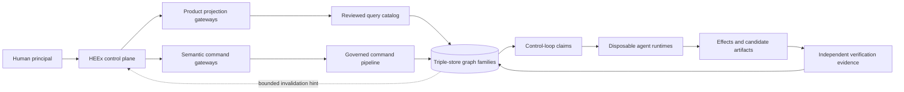

The UI may project and command the factory, but it does not own project state,
agent state, authority, evidence, or governed outcomes. A browser tab, SSE connection,
OTP process, PID, worktree, transcript, and generated artifact can disappear
without changing durable truth.

The following accepted contracts remain valid independent of presentation
technology:

| Existing boundary | UI consequence |
|---|---|
| [Graph-only source of truth](../adr/0001-graph-only-source-of-truth.md) | Browser state is never durable factory state. |
| [Reviewed query catalog](../architecture/reviewed-query-catalog.md) | Every graph lens has a closed query identity and bounded result contract. |
| [Bounded projections and subscriptions](../architecture/bounded-projections-cache-and-subscriptions.md) | Scope, revision, freshness, completeness, and truncation travel with each projection. |
| [Semantic command contract](../architecture/semantic-command-contract.md) | UI actions map to admitted commands, expected state, fences, and idempotency. |
| [Change delivery and recovery](../architecture/change-delivery-and-command-recovery.md) | PubSub/SSE is a lossy refresh hint; the client re-queries graph truth. |
| [Execution lifecycle](../architecture/execution-attempt-lifecycle.md) | Attempt states are `prepared`, `starting`, `running`, `waiting-tool`, `cancelling`, `cancelled`, `completed`, `failed`, `timed-out`, `abandoned`, `recovered`, and `superseded`; verification, decision, publication/application, observation, and satisfaction remain separate downstream domains. |
| [Verification boundary](../architecture/verification-evidence-boundary.md) | Agent success is not independent verification or acceptance. |
| [Product threat model](../architecture/product-security-privacy-and-threat-model.md) | Authentication and graph authorization remain separate and every resource is reauthorized. |
| [Repository wiki contracts](../architecture/repository-wiki-governance-baseline.md) | Wiki pages are revisioned projections with citations, cost, opt-out, and preview isolation. |

### Current Browser Implementation

At the inspected revision, the browser surface is not the requested stack:

| Concern | Current state | Target implication |
|---|---|---|
| Pages | `HomeLive`, `CodingAgentLive`, `ManagedCodingAttemptLive` | Replace with controller-rendered full pages and HEEx fragments. |
| Interaction | LiveView events, assigns, streams, and socket | Replace with ordinary HTTP actions and `dstar` SSE patches. |
| Development dashboard | `/dev/dashboard` is Phoenix LiveDashboard, itself a LiveView route | Remove/replace it for a literal zero-LiveView runtime, or record and qualify a development-only exception. |
| Local islands | LiveVue and Vue components | Remove; keep only bounded Datastar signals for ephemeral UI intent. |
| Components | SaladUI delegates plus local components | Migrate behind `JidoCodeWeb.Components.UI` to ShadcnUI and app composites. |
| Assets | Phoenix Vite, LiveSocket, LiveVue, SaladUI hooks | Self-host pinned Datastar through `app.js`; serve ShadcnUI CSS through `app.css`. |
| Authentication | One configured operator token/session | Introduce human identities, assurance, roles/delegations, and scoped authorization. |
| Agent overview | Offering discovery and individual attempt detail | Add fleet, project, attempt-workspace, attention, capacity, and cost projections. |
| Live updates | No live attempt feed on the detail page | Add authorized, reconnectable, revision-aware SSE delivery. |
| Graph coverage | Repository control, memory, wiki, and limited execution | Add reviewed product lenses for the remaining graph domains. |

`mix.exs` contains `live_vue`, `phoenix_vite`, `phoenix_live_view ~> 1.1.0`, and
`salad_ui`; it contains neither `dstar` nor `pcharbon70/shadcn_ui`. The router
places all authenticated browser pages in a LiveView `live_session`. Existing
accepted documents, especially [Product surface and island
contract](../architecture/product-surface-and-island-contract.md) and
[Repository wiki product and
qualification](../architecture/repository-wiki-product-and-qualification.md),
also make LiveView/LiveVue normative. These statements must be superseded
deliberately; implementation must not silently drift away from accepted
architecture.

### Current Security Limit

The Plug half of `JidoCodeWeb.ProductAuth` already provides browser/API
authentication, session renewal, nonce, timestamp, generation, and trusted
scope reconstruction. Its LiveView `on_mount` and event hook are
presentation-specific and must be replaced. The current product is explicitly
limited to one configured operator principal behind TLS and network controls.
There are no per-human accounts, MFA/passkeys, role-specific routes, project
memberships, or separation of duty.

Controller migration needs more than reusing `fetch_current_scope`. That Plug
currently assigns only `current_scope`; the API Plug builds `product_identity`
and `authority`, while LiveView currently builds them during `on_mount`.
Controller pages, fragments, commands, and streams need one trusted
authority-construction Plug/helper that derives all three consistently and
revalidates them at the appropriate lifetime. `JidoCode.Product.authority/1`
also currently fixes delegation fields to `nil`, so named roles/delegations
require an explicit trusted mapping boundary rather than browser-provided
fields.

The underlying graph authorization model is richer. It already reasons about
exact capabilities, actors, scopes, graph ownership, delegations, and
resources. The new UI should surface that model through understandable roles
and reasons while continuing to enforce exact capability decisions on the
server.

### Accepted Parallelism And Isolation Model

The accepted contracts support parallel work across repositories and within a
repository. Each attempt is bounded by repository scope, task lease, fence,
exact runtime profile, worktree, candidate, verifier, and evidence. Repository
wiki previews are additionally bound to an exact interaction session, attempt,
candidate, fence, and audience. A later active wiki edition cannot rewrite the
context an earlier attempt actually used.

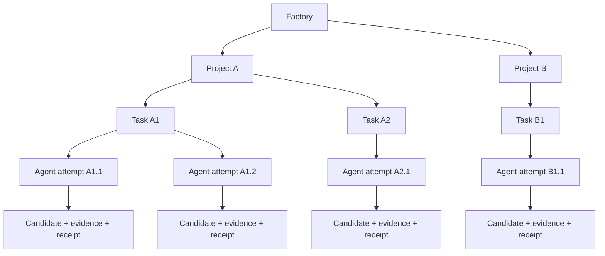

The browser must preserve this hierarchy. An attempt workspace is an authorized
projection of an attempt and its correlated records, not an agent process or a
private in-browser conversation. JidoCode already has a distinct durable
`InteractionSession` resource for bounded human/agent interaction; a follow-on
specification must define its cardinality and links to attempts rather than
collapsing the two concepts. Every open route and stream has independent scope,
cursor, freshness, and authorization.

This describes the accepted isolation model, not a currently runnable default
fleet. At the inspected revision, the general scheduler/reconciler and managed
service are not default-composed, coding product loaders are unset, the DGA1
rollout is disabled, and wiki production gateways remain unwired. The UI must
represent `not configured`, disabled, unavailable, and contract-only posture
honestly; it cannot infer production operability from implemented modules or
accepted implementation receipts.

## Evidence-Based Design Principles

### 1. Orient Around Attention, Not Activity

Operational dashboards should help a person answer a question and act; they
should not require continuous staring. Google SRE recommends separating
symptoms from causes and focusing on a small set of meaningful signals, while
Grafana recommends question-oriented, hierarchical dashboards that control
cognitive load ([Google SRE monitoring](https://sre.google/sre-book/monitoring-distributed-systems/),
[Grafana dashboard guidance](https://grafana.com/docs/grafana/latest/visualizations/dashboards/build-dashboards/best-practices/)).

The default factory page should therefore lead with an ordered **Needs
attention** queue, followed by health and capacity summaries. Routine running
events belong in attempt timelines, not global notifications.

An attention item must contain:

- the affected factory/project/task/attempt/interaction-session scope;
- why it needs a human now;
- severity and age;
- current owner and handoff state;
- the next authorized action;
- evidence or policy that caused the alert; and
- a durable link that restores the exact context.

Approvals, unanswered questions, stalled leases, failed checks, recovery
conflicts, budget thresholds, stale critical projections, security events, and
publication decisions qualify. A mere heartbeat, token, tool call, or process
start does not.

The attention queue itself needs a closed reviewed projection over existing
durable facts; it is not a browser notification store. An acknowledgement,
snooze, assignment, or durable saved view would introduce semantic state and
therefore needs an admitted command/resource contract before it appears. The
first release can keep view filters in the URL or signed session and derive
attention solely from current graph facts. It must not invent durable
acknowledgement by hiding a card locally.

### 2. Support All Four Oversight Stages

A study of experienced developers supervising software agents identifies four
forms of oversight: a priori control, co-planning, real-time monitoring, and
post-hoc review ([Human oversight of software agents](https://doi.org/10.1145/3805689.3812402)).
The factory UI must support all four:

| Oversight stage | Questions the UI must answer | Required product support |
|---|---|---|
| Before execution | What may run, where, with which authority and budget? | Profile/capability preview, source snapshot, task and acceptance criteria, consent, budget, risk, policy. |
| Co-planning | Is the plan aligned, bounded, and testable? | Plan view, assumptions, context manifest, checkpoints, clarification, steering. |
| During execution | Is meaningful progress occurring and is intervention required? | Stage, last effect, waits, lease/fence, budget, timeline, bounded steer/answer/cancel/recovery controls. |
| After execution | What changed, what passed, who verified, and what may proceed next? | Diff/artifacts, checks, independent evidence, contradictions, disposition, draft publication, external application/re-observation, and final receipts. |

Magentic-UI likewise finds value in co-planning, parallel tasking, action
approval, takeover, answer verification, and memory, but it is experimental
research rather than a production security contract
([Magentic-UI report](https://www.microsoft.com/en-us/research/wp-content/uploads/2025/07/magentic-ui-report.pdf)).
JidoCode should implement those outcomes only through its accepted semantic
commands and authority boundaries.

### 3. Preserve Situation Awareness

Automation can cause misuse, disuse, over-reliance, and out-of-the-loop
performance problems. Situation awareness requires perception of current
facts, comprehension of what they mean, and projection of likely next state
([Parasuraman and Riley](https://doi.org/10.1518/001872097778543886),
[Endsley and Kiris](https://doi.org/10.1518/001872095779064555)).

Every agent row and attempt-workspace header should distinguish:

- current lifecycle stage;
- last meaningful effect and when it occurred;
- current wait/blocked reason;
- likely next admitted transition;
- lease/fence and recovery posture;
- budget consumed and remaining;
- verification, decision, source-application, observation, and satisfaction
  state; and
- connection/freshness state of the projection.

"Process alive" or "stream connected" must never be presented as "agent making
progress." Execution, verification, decision, external application, source
observation, and wiki activation remain separate.

### 4. Make Status, Limits, And Recovery Visible

The Microsoft human-AI guidelines recommend setting expectations, making
status clear, explaining behavior, enabling correction and dismissal, and
scoping services when uncertain
([Guidelines for Human-AI Interaction](https://doi.org/10.1145/3290605.3300233)).
Nielsen's heuristics reinforce visibility, match to the real world, user
control, error prevention, recognition, and recovery
([Ten usability heuristics](https://www.nngroup.com/articles/ten-usability-heuristics/)).

JidoCode should show what an agent is allowed to do, what it cannot do, which
facts are incomplete or contradictory, and which recovery actions are actually
available. It must not imply certainty, completion, or control that the server
cannot prove.

Do not reduce this to one global "manual/autonomous" switch. Developer autonomy
preferences vary with task risk, accountability, and context
([Where developers draw the line on AI autonomy](https://www.microsoft.com/en-us/research/publication/you-shall-not-pass-where-and-why-developers-draw-the-line-on-ai-autonomy/)).
JidoCode should express autonomy through exact action capabilities, approval
requirements, budgets, and environment policy for each profile and task.

### 5. Separate Conversation From Evidence

The useful unit of supervision is a causal record, not a transcript. The
attempt timeline should correlate normalized plan changes, questions, human
answers, semantic commands, admitted tool effects, candidate artifacts,
checks, verifier observations, cost records, and disposition receipts. Raw
provider reasoning, private chain-of-thought, credentials, sandbox paths,
unbounded output, and arbitrary tool transcripts are not product data.

The conversation panel can support steering and answering, but it cannot be
the only place that shows an approval, code effect, failure, cost, or recovery
decision. AutoGen Studio demonstrates one possible presentation that places
messages, actions, tool invocations, outputs, status, and costs together; its
system-demo paper does not establish that this improves debugging outcomes
([AutoGen Studio](https://aclanthology.org/2024.emnlp-demo.8/)). JidoCode should
test the hypothesis with redacted, governed records rather than copy a raw
runtime-log view.

### 6. Use Progressive Disclosure And Durable Routes

The information-seeking pattern "overview first, zoom and filter, then details
on demand" remains a useful baseline for large information spaces
([Shneiderman](https://doi.org/10.1109/VL.1996.545307)). Progressive disclosure
keeps common work visible while placing advanced detail at the point of need
([Nielsen Norman Group](https://www.nngroup.com/articles/progressive-disclosure/)).

Factory, project, task, attempt, interaction-session, evidence, wiki page, and
security audit views
should have durable ordinary URLs. Browser back/forward, bookmarks, copied
authorized links, and opening several tabs must work without reconstructing
hidden client state. Datastar enhances those pages; it does not replace the
web's navigation model.

### 7. Match The Visualization To The Question

Graph structure does not imply that every graph-backed feature should be a
node-link diagram. Controlled studies found adjacency matrices more effective
than node-link diagrams for several graph tasks beyond small graphs, while
node-link views retain an advantage for path finding
([Ghoniem et al.](https://doi.org/10.1057/palgrave.ivs.9500092)). A dynamic-graph
study found small multiples faster overall, while animation was more accurate
for two of five tested tasks; neither technique dominates every question
([Archambault et al.](https://doi.org/10.1109/TVCG.2010.78)). JidoCode should
default to stable comparison and qualify animation only for a demonstrated
task, never use it as decoration or the sole carrier of change.

Use:

- tables for inventory, state, ownership, and comparison;
- trees for repository and containment hierarchies;
- timelines for causal and temporal questions;
- matrices for dependency and cross-project relationships;
- small multiples for revisions, costs, and state change;
- bounded node-link views for lineage, paths, neighborhoods, and dependency
  exploration; and
- text/outline alternatives for every graphical view.

### 8. Design For Interruption And Resumption

Parallel-agent work is inherently interruptive. A person returning to an
attempt workspace should see a concise "since you left" summary derived from durable
events: state changes, human decisions, effects, budget change, failed checks,
new evidence, and current next action. The summary must link back to its source
records and state its coverage window; it is not a free-standing model claim.

Early AgentGUI research specifically studies trace visualization and steering
for multiple concurrent, long-running agents and supports making trace location
and cross-attempt navigation first-class rather than forcing serial chat
inspection ([AgentGUI v1](https://arxiv.org/abs/2607.26300v1)). Its initial study is
promising, not sufficient release evidence for JidoCode; the validation program
below repeats the relevant tasks with this factory's authority and graph model.

### 9. Make Consequences More Prominent Than Controls

High-impact operations must communicate target, scope, effect, reversibility,
and policy before the final action. Confirmation is not authorization. The
server must render canonical facts independently of agent-authored prose and
bind approval to the exact action. OWASP documents how an agent can manipulate
a human approval surface if untrusted rationale is allowed to impersonate the
trusted transaction ([Lies in the Loop](https://owasp.org/www-community/attacks/Lies_in_the_Loop),
[Transaction Authorization](https://cheatsheetseries.owasp.org/cheatsheets/Transaction_Authorization_Cheat_Sheet.html)).

### 10. Make The Baseline Work Without Hypermedia Enhancement

Full pages, navigation, content, and essential forms should remain meaningful
as server-rendered HTML. Datastar adds responsive fragments, signals, and SSE;
it should not make the page's semantics or authorization depend on JavaScript.
This aligns with ShadcnUI's native HTML and graceful-fallback contracts and
keeps failure modes understandable.

## Product Mental Model And Vocabulary

Ambiguous words create dangerous controls. The product should use a closed
vocabulary:

| Term | Meaning | Not equivalent to |
|---|---|---|
| Factory | One governed deployment and its enrolled project fleet | A browser dashboard |
| Project | Initial product label for one conceptual repository scope; a separate project identity requires a future ontology/query decision | Git worktree or browser tab |
| Task | Accepted unit of desired work with criteria and priority | Prompt text |
| Logical agent | Cataloged profile/capability identity eligible to perform work | One model conversation or OS process |
| Attempt | One fenced execution claim over one task under an exact profile | Accepted result |
| Attempt workspace | Human-facing route that correlates one attempt's plan, interactions, effects, evidence, and receipts | Interaction session, cookie session, SSE connection, or provider thread |
| Interaction session | Existing graph-native identity for bounded human/agent interaction, with participants, audiences, authority, and lifecycle | Attempt or browser session |
| Runtime | Disposable supervised process realizing an admitted attempt | Durable authority |
| Candidate | Exact proposed artifact/tree produced by an attempt | Merged source revision |
| Verification | Independent evidence about an exact candidate | Agent self-report |
| Decision | Governed disposition over exact evidence | Passing test alone |
| Source application | Human/external merge or application followed by authoritative source re-observation | Draft publication or candidate creation |
| Knowledge adoption | Governed acceptance of an exact claim into the appropriate knowledge lifecycle | Source merge, plan adoption, or wiki activation |
| Wiki edition | Immutable compiled repository-knowledge projection | Mutable notebook or accepted fact graph |

Navigation, labels, documentation, telemetry, and audit records should use
these terms consistently. The first product release should treat `Project` as a
presentation alias for repository scope and derive `project_ref` from that
conceptual repository identity. Introducing a factory project that contains one
or more repositories would require an explicit semantic and migration decision.

## Target Information Architecture

### Global Navigation

```mermaid
flowchart TD
    Shell[Authenticated factory shell]
    Shell --> Attention[Needs attention]
    Shell --> Factory[Factory overview]
    Shell --> Projects[Projects]
    Shell --> Work[Work queue]
    Shell --> Agents[Agents and attempts]
    Shell --> Reviews[Reviews and evidence]
    Shell --> Knowledge[Knowledge]
    Shell --> Operations[Operations and cost]
    Shell --> Governance[Restricted governance]

    Projects --> Project[Project workspace]
    Project --> PO[Overview]
    Project --> PW[Work]
    Project --> PS[Source]
    Project --> PA[Agents and attempts]
    Project --> POut[Outcomes]
    Project --> PK[Knowledge]
    Project --> PWiki[Wiki and dependencies]

    Agents --> Attempt[Attempt workspace]
    Attempt --> SO[Overview]
    Attempt --> ST[Activity timeline]
    Attempt --> SI[Interaction sessions]
    Attempt --> SC[Changes and artifacts]
    Attempt --> SChecks[Checks and evidence]
    Attempt --> SContext[Context and knowledge used]
    Attempt --> SCost[Budget and cost]
    Attempt --> SAudit[Authority and audit]

    Knowledge --> Source[Source lens]
    Knowledge --> Domain[Project-domain lens]
    Knowledge --> Memory[Memory and experience lens]
    Knowledge --> Wiki[Wiki lens]
    Knowledge --> Evidence[Evidence and decision lens]
    Knowledge --> Provenance[Provenance lens]

    Governance --> People[People, roles, and delegations]
    Governance --> Profiles[Agent profiles and rollout]
    Governance --> Policy[Policy and capabilities]
    Governance --> Security[Security and audit]
    Governance --> Retention[Retention and recovery]
```

Navigation entries are filtered for usability, but every destination repeats
server authorization. A user who can emergency-stop a runtime need not receive
project source or complete-memory access. A factory administrator does not
implicitly receive every tenant's classified content.

Suggested route vocabulary uses only opaque, bounded references:

| Route shape | Purpose |
|---|---|
| `/factory` | Scoped command center and attention queue |
| `/projects` | Authorized project catalog |
| `/projects/:project_ref` | Project overview |
| `/projects/:project_ref/work` | Project work queue and task hierarchy |
| `/projects/:project_ref/attempts` | All authorized agent attempts for the repository-backed project |
| `/projects/:project_ref/attempts/:attempt_ref` | One durable attempt workspace, including authorized interaction sessions |
| `/projects/:project_ref/knowledge/:lens` | One closed reviewed knowledge lens |
| `/projects/:project_ref/wiki/...` | Current wiki, search, dependencies, guides, history, and authorized previews |
| `/reviews/:candidate_ref` | Candidate/evidence/disposition workspace |
| `/operations/...` | Capacity, provider, cost, recovery, and service posture |
| `/governance/...` | Separately authorized identity, policy, profile, security, audit, and retention areas |

The project reference in a route does not authorize the attempt reference
beneath it. The server must prove their containment and the principal's access
on every request. A human may open each attempt workspace in its own tab or
window; the attempt URL remains the restorable workspace identity while browser
and interaction sessions and the SSE connection retain their distinct
lifecycles.

### Global Shell

Every authenticated page should include:

- a skip link, landmarks, and one clear page heading;
- factory/tenant context and a project switcher;
- current user, authentication assurance, and effective access summary;
- active/waiting/attention counts scoped to the viewer;
- factory health and connection/freshness status;
- global search over authorized reviewed projections;
- notifications that represent durable attention items, not raw events; and
- a prominent way to leave restricted or impersonated/delegated context.

Scope must be visible before a consequential control. The shell should never
retain a selected project, agent, candidate, or graph lens after a scope switch
unless the server proves it is valid in the new context.

### Factory Command Center

The landing page is a control room with three layers:

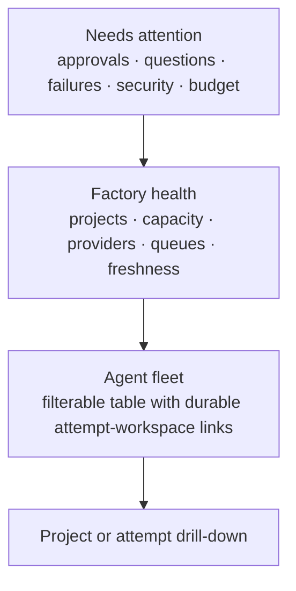

The fleet table should support bounded server-side filtering, sorting,
pagination, and saved role-appropriate views. Suggested columns are:

| Column | Meaning |
|---|---|
| Project | Human project identity and environment |
| Task | Short title, priority, owner, and acceptance status |
| Agent/profile | Logical agent, exact profile digest, provider/runtime posture |
| Stage | Queued, leased, provisioning, running, waiting, verifying, deciding, recovering, closed |
| Progress | Last meaningful admitted effect and its age |
| Attention | Waiting question, approval, failure, conflict, stale state, or none |
| Lease/fence | Safe ownership and expiry/recovery posture |
| Budget | Tokens, cost, time, and remaining threshold |
| Quality | Check/evidence summary, explicitly distinct from execution |
| Source outcome | Candidate, draft publication, externally applied/merged, re-observed, post-change verified, satisfied, superseded, or rejected |
| Owner | Current human/team responsibility and handoff |

Rows must not continuously move as background events arrive. Preserve stable
sort and selection; indicate that newer data exists and refresh or re-rank only
under a documented policy. Highlight exceptions without turning the table into
an alarm wall.

Do not begin with bulk mutation controls. If a future workflow needs a batch
operation, the server must authorize and receipt every target independently,
present partial failure honestly, and provide a bounded preview of the exact
set. A checked row or client-side filter is never authority to affect all
matching agents.

### Project Workspace

The project route provides shared context for parallel work:

- project purpose, repository/source revision, environment, owners, policies,
  enrollment, and wiki posture;
- active, queued, blocked, verifying, and recently closed tasks;
- all attempts grouped under their task, including competing or superseded
  candidates;
- source/change summary and dependency risk;
- current wiki edition, freshness, guide/dependency coverage, maintainer status,
  token cost, and opt-out posture;
- project budget/cost and capacity;
- evidence, contradictions, incidents, and outstanding decisions; and
- durable links to each independent attempt workspace and its authorized
  interaction sessions.

Opening several attempt routes in several browser tabs is a supported primary
workflow. No global client store should cause a project filter, selected
candidate, or private preview in one tab to alter another. Server-derived
scope, opaque resource references, and per-tab stream registration provide
isolation; browser signals only retain harmless view intent.

### Agent Attempt Workspace

The attempt workspace is the main supervision surface:

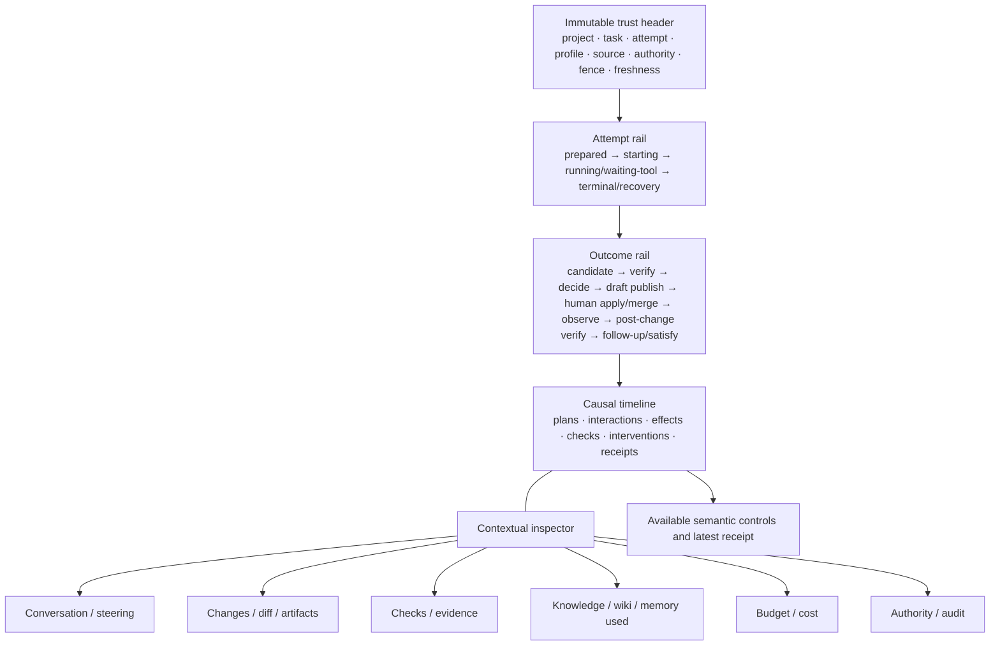

The trust header is generated from canonical server data and remains visible
near controls. It should include project, repository, task, attempt, candidate,
source revision, logical agent/profile, authority summary, environment,
lease/fence, and projection revision/freshness. Internal IRIs, credentials,
provider session IDs, sandbox paths, and OS PIDs remain hidden or separately
privileged.

The timeline uses normalized, redacted event types and stable identifiers. It
must support filtering without breaking causal ordering and show gaps,
truncation, and unavailable event segments explicitly. It should not render
token-by-token generation into an ARIA live region.

The current accepted browser controls are steer, answer, cancel, handoff, and
recovery; retry exists in the gateway but is inconsistently exposed. The UI
must not invent pause/resume or emergency-stop semantics. If those outcomes are
needed, they require ontology, gateway, runtime, recovery, receipt, and test
contracts first.

The friendly control vocabulary also needs an explicit adapter map. In the
current implementation `answer` is encoded through `steer`, while `recovery`
and `retry` use `start`; the stable managed runtime API itself exposes only
`admit`, `start`, `steer`, `cancel`, `status`, and `handoff`. The UI may use
human language, but the specification and receipt must disclose the exact
semantic/runtime operation and consequence.

Draft publication is currently contract-only because no production publication
provider is configured. The outcome rail must continue through external human
application/merge, new source observation, post-change verification, follow-up,
and final satisfaction; it must never stop at an agent's publication request.

### Review And Evidence Workspace

Review should be a first-class cross-project queue, not a tab hidden in the
agent transcript. A review item should present:

- task, acceptance criteria, exact candidate, source base, and competing
  attempts;
- categorized diff and artifact manifest;
- checks and verifier identity/profile;
- evidence completeness, contradictions, stale dependencies, and residual
  risk;
- cost and resource consumption;
- agent rationale clearly marked as untrusted supporting material;
- canonical proposed disposition and exact consequences; and
- separation-of-duty/step-up requirements.

Applying source, publishing a wiki edition, adopting knowledge, changing
policy, restoring data,
or exposing classified memory are different operations and should never share
an ambiguous generic "Approve" button.

### Knowledge Workspace

The Knowledge area is a collection of reviewed domain lenses. It is not a
general graph explorer and does not accept arbitrary SPARQL, graph IRIs, query
names, or authorization scope from the browser.

Every lens should have:

- a human domain name and a one-sentence purpose;
- a stable route and bounded filter vocabulary;
- exact scope, source revision, graph revision, and as-of time;
- completeness, contradiction, truncation, and freshness state;
- citations/derivations and safe graph-family provenance;
- table or outline access independent of visualization;
- export only when separately authorized and bounded; and
- a link back to the task, source, attempt, interaction session, evidence, or
  wiki edition that gave the fact meaning.

RDF datasets use named graphs to retain contextual boundaries, while PROV-O
models derivation among entities, activities, and agents
([RDF 1.1 datasets](https://www.w3.org/TR/rdf11-datasets/),
[PROV-O](https://www.w3.org/TR/prov-o/)). A product lens may combine several
authorized families, but it must not silently flatten away their authority,
revision, provenance, or contradiction boundaries.

## Graph-Domain Presentation Model

The graph registry currently defines seventeen graph families. They should be
grouped into product lenses by user task:

| Product lens | Graph families | Primary questions | Default representation | Privileged detail |
|---|---|---|---|---|
| Factory and capacity | `factory_catalog`, `factory_policy` | What projects, profiles, providers, ceilings, and rollout rules exist? | Tables, status cards, policy matrix | Exact capability and rollout diagnostics |
| Source | `observation_batch`, `source_revision`, `repository_control` | What code/revision exists, how is it structured, and what changed? | Repository tree, symbol/file tables, revision comparison | Safe provenance and analyzer evidence |
| Project domain | `ontology`, accepted repository knowledge | Which concepts, rules, constraints, and relationships define this project? | Glossary, entity table, bounded neighborhood | Shape and ontology version |
| Work and execution | `run_attempt`, `run_event_segment` plus control claims | What is queued/running/waiting, what happened, and who owns it? | Work board/table, stage rail, causal timeline | Lease/fence/recovery diagnostics |
| Evidence and decision | `evidence` plus governed decision facts | What proves or contradicts this candidate and what was decided? | Review queue, evidence matrix, lineage | Verifier and policy provenance |
| Memory and experience | `memory`, `experience`, `content_lifecycle`, `episode_content` | What durable learning applies, with what confidence, freshness, and access? | Proposition/case table, citations, lifecycle timeline | Classified content via separate grant |
| Wiki and dependencies | `repository_wiki` plus source/dependency facts | What should users/developers know about the project and its dependencies? | Page tree, search, dependency table/graph, edition history | Private candidate previews and compilation diagnostics |
| Cross-project learning | `memory_dataset` | Which governed datasets support evaluation or transfer? | Dataset catalog, coverage matrix | Membership/export/admin operations |
| Security and audit | `security_audit`, policy/control facts | Who attempted or performed which authorized action? | Append-only audit table and incident timeline | Sensitive reason/evidence under auditor scope |
| Derived diagnostics | `derived` | Which disposable computed views are stale or rebuilding? | Diagnostic tables and dependency lineage | Rebuild/maintenance controls |

### Visualization Selection Matrix

| User task | Preferred view | Secondary view | Avoid |
|---|---|---|---|
| Find a running or blocked agent | Filterable table | Project grouping | Animated network |
| Understand one attempt over time | Causal timeline | Event table | Transcript-only view |
| Compare candidates or revisions | Side-by-side diff/small multiples | Change table | Repeated animated layout |
| Inspect dependency versions/risks | Sortable table and matrix | Bounded dependency graph | Full transitive hairball by default |
| Trace provenance from claim to source | Small node-link path | Ordered lineage table | Unbounded neighborhood expansion |
| Browse repository structure | Tree | Searchable file/symbol table | Force-directed graph |
| Compare projects/capability coverage | Matrix | Grouped table | Stacked cards with no comparison axis |
| Inspect memory applicability | Proposition/case table | Bounded citation graph | Confidence encoded by color alone |
| Review security events | Append-only table/timeline | Aggregate trend | Raw triple browser |

For node-link views, cap node/edge counts, disclose truncation, keep selected
nodes stable, highlight adjacency, provide search, and render a synchronized
table/outline. The server controls allowed expansion directions and budgets.
Named graph identity may appear as a safe family label and revision in a
provenance drawer; it is never a browser-editable selector.

## Projection Presentation Contract

The accepted product contract defines ten projection states. Every full page
and fragment should use the same visual and semantic treatment:

| Projection state | Required presentation and control posture |
|---|---|
| `ready` | Show bounded data, revision, freshness, and admitted controls. |
| `empty` | Explain that the authorized query returned no items and offer a safe next step. |
| `stale` | Show last valid as-of time; disable or revalidate freshness-sensitive commands. |
| `incomplete` | Identify missing evidence/coverage without implying completeness. |
| `contradicted` | Put conflict ahead of synthesized conclusion and link both sources. |
| `truncated` | Show returned/limit information and bounded refinement controls. |
| `unauthorized` | Use the same concealed exterior presentation as an unknown resource. |
| `unavailable` | Clear projection rows/data; retain only separately authorized shell/resource identity and recovery guidance. Never fall back to stale process state. |
| `maintenance` | State the governed maintenance condition and expected recovery channel. |
| `recovery` | Show fence/reconciliation posture and only recovery-safe controls. |

Connection state is separate from data state:

- `live` means the browser currently receives hints;
- `reconnecting` means updates may be delayed;
- `offline` means no live transport; and
- none of those claims that the last projection is fresh.

Command state is separate again:

- submitting;
- admitted/committed with receipt;
- rejected by policy or state;
- conflict requiring re-query;
- outcome unknown after transport loss; and
- reconciled from durable receipt.

Optimistic navigation or temporary button feedback is acceptable. Optimistic
success for a durable command is not.

## Security-First Product Architecture

### Identity, Roles, And Attribute-Based Scope

NIST's ABAC model evaluates subject, object, requested operation, and
environment attributes rather than relying on a role name alone
([NIST SP 800-162](https://csrc.nist.gov/pubs/sp/800/162/upd2/final)). OWASP
recommends least privilege, deny by default, and authorization validation on
every request
([OWASP Authorization Cheat Sheet](https://cheatsheetseries.owasp.org/cheatsheets/Authorization_Cheat_Sheet.html)).

The effective authorization decision should be modeled as:

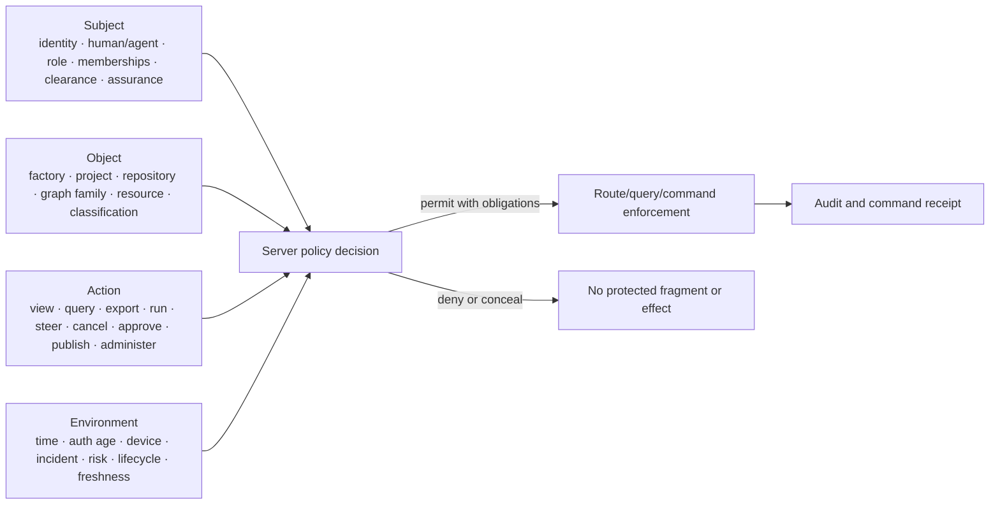

Roles make navigation and responsibility understandable, but exact graph
capabilities and delegations remain authoritative. A proposed starting role
matrix is:

| Capability area | Observer | Project developer | Project maintainer | Independent verifier | Factory operator | Security auditor | Factory administrator |
|---|:---:|:---:|:---:|:---:|:---:|:---:|:---:|
| View assigned project health | ✓ | ✓ | ✓ | scoped | scoped | metadata | scoped |
| Read source/wiki for assigned project | optional | ✓ | ✓ | scoped | metadata | no by default | no by default |
| Start/steer assigned coding work | — | scoped | ✓ | — | delegated | — | policy only |
| Answer agent question | — | scoped | ✓ | — | delegated | — | — |
| Cancel/recover attempt | — | own/scoped | ✓ | — | ✓ | — | emergency policy |
| Verify candidate | — | — | — | ✓ | delegated | — | — |
| Decide/publish/apply source or adopt knowledge | — | — | policy-scoped | separate | delegated | — | policy only |
| View complete memory content | — | explicit grant | explicit grant | explicit grant | no by default | audit metadata | no by default |
| View security audit details | — | own actions | project scope | verification scope | operations scope | ✓ | policy scope |
| Manage roles/policy/profiles | — | — | project membership only | — | rollout subset | audit only | ✓ |

This is a design proposal, not a grant table. Implementations should derive
each cell from capability, delegation, resource, action, and environment facts.
The important separation is that operational stop authority, project-content
access, independent verification, security audit, and policy administration do
not automatically imply one another.

A binding specification must map every route, lens, field, stream topic,
command, and export to the existing exact capability/query vocabulary. Current
authorization requires exactly one matching grant; security audit, episode
content, memory datasets/exports, wiki reads/writes, execution control, and
administration are distinct capabilities. A friendly role cannot union those
grants implicitly or turn a navigation group into authority.

Specialized **knowledge steward** and **cost observer** responsibilities should
also be modeled as narrow capabilities rather than broad super-roles. A
knowledge steward may review wiki editions, citations, retention, and memory
quality without operating agents; a cost observer may inspect aggregated,
redacted accounting without receiving source, prompts, or complete-memory
content.

### Authentication And Step-Up

The target should support named human accounts, phishing-resistant
authentication at appropriate assurance, short and bounded sessions, explicit
reauthentication, session inventory/revocation, and recovery protected against
account takeover. NIST SP 800-63B describes authenticator assurance and session
requirements, including phishing-resistant options at higher assurance
([NIST SP 800-63B](https://pages.nist.gov/800-63-4/sp800-63b/aal/),
[session management](https://pages.nist.gov/800-63-4/sp800-63b/session/)).

Require recent step-up authentication and an exact authorization decision for:

- credentials and identity changes;
- role, delegation, capability, or policy changes;
- production/source publication, application/merge, and knowledge-adoption
  effects;
- sandbox/workspace destruction or irreversible cancellation;
- backup restore, retention, erasure, or export;
- classified/complete-memory access;
- agent-profile/provider rollout changes; and
- security incident or emergency controls.

High-risk actions may also require separation of duty or two-person approval.
Approval authority is an explicit capability and never follows automatically
from administrative UI access.

### Canonical Command And Approval Surface

An approval surface has two visually and semantically separated regions:

1. **Trusted transaction facts**, rendered from server-owned command data:
   action, target, project/environment, parameters, candidate/diff, blast
   radius, reversibility, policy version, expected revisions/fence, expiry, and
   action digest.
2. **Untrusted supporting material**, including escaped agent rationale or
   source excerpts, clearly labeled and unable to alter the trusted controls.

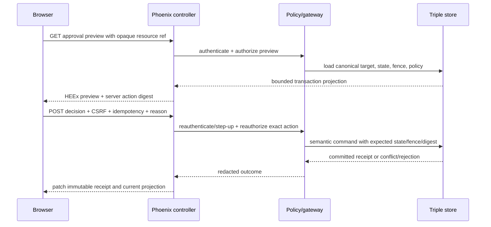

Never use a generic `data-confirm` string containing agent-authored content as
the trusted transaction. Approvals are single-use, expire, bind to the exact
action digest, and fail closed if state or fence changes.

### Data Classification And Non-Disclosure

The server must classify and redact before rendering. Do not send protected
data to the DOM and hide it with CSS, a collapsed accordion, a tooltip, or a
role-based client condition. Particularly sensitive data includes:

- credentials, tokens, model/provider sessions, and signed URLs;
- raw prompts/tool output that may contain secrets or hostile instructions;
- private chain-of-thought or hidden reasoning;
- internal graph IRIs, unrestricted query text, and store handles;
- sandbox paths, environment values, OS PIDs, and raw process output;
- private interaction-session/attempt previews and sibling-candidate existence;
- complete memory/episode content and erasure-protected material; and
- high-cardinality telemetry that can reconstruct source or user content.

Unknown and unauthorized resources retain indistinguishable exterior behavior.
For an authorized known resource, a disabled action may explain which state or
policy condition prevents it only when that explanation does not leak another
scope.

### Hypermedia Threat Boundary

Datastar signals are browser-controlled data. Official Datastar security
guidance says they are visible and modifiable and must not contain secrets or
serve as authorization decisions
([Datastar security](https://data-star.dev/reference/security)). Signals may
carry bounded UI intent; the server derives all authority.

| Signal class | Examples | Rule |
|---|---|---|
| Local-only | `_inspectorOpen`, `_density`, `_expandedSection` | Harmless presentation state; exclude from backend when possible. |
| Request intent | filter, sort, cursor, search term, selected opaque ref | Parse against a closed schema, cap sizes, and reauthorize results. |
| Forbidden authority | actor, role, tenant, graph/query name, capability, command type, profile digest, policy, fence, revision | Ignore/reject; derive from route, server session, catalog, and current graph. |
| Forbidden secret/result | credential, token, hidden content, permission result, command success | Never render into a signal. |

Datastar expressions can execute JavaScript. Never interpolate untrusted data
into `data-*` expression attributes. Use fixed server-authored expressions,
HEEx escaping for content/attributes, and sanitized bounded rendering where
rich user/agent content is explicitly supported. Prohibit the script-appending
`Dstar.Scripts` surface— including `execute_script`, `redirect`, and
`console_log`—in product code by default, and use server-side structured logging.
Native navigations/forms can use an ordinary HTTP redirect. A `30x` followed by
a fetch-backed Datastar action does not navigate the top-level page, so such an
action should patch a receipt plus an ordinary same-origin link, or use a
separately specified fixed allowlisted navigation mechanism. Disable Dstar
`:debug_errors` outside development because formatted exceptions can otherwise
be sent to the browser console.

Dstar `0.2.0` sends every non-local page signal with every backend request by
default. Each page therefore needs a closed signal namespace and aggregate
size budget, not only per-field validation. Mount only signals used by the
current page, prefix/structure them by surface, make presentation-only signals
local, reset obsolete scope selections on navigation, and reject unexpected
keys before product code. CSRF, identity, authorization, secrets, and trusted
scope must not live in that transmitted signal set.

### CSRF, CSP, Cookies, And Browser Headers

Phoenix `protect_from_forgery` must wrap every browser mutation. Dstar `0.2.0`
documents a `RenameCsrfParam` integration, but Datastar requests can serialize
signals into query parameters for methods without bodies. OWASP warns that
CSRF tokens must not leak through URLs, logs, browser history, or referrers
([OWASP CSRF](https://cheatsheetseries.owasp.org/cheatsheets/Cross-Site_Request_Forgery_Prevention_Cheat_Sheet.html)).

Therefore:

- use `POST`, `PUT`, or `PATCH` bodies for every semantic mutation and stream
  connect; never use `GET` for effects;
- avoid a Datastar `DELETE` request if the selected version places signals or
  CSRF material in the URL; prefer a POST to an explicit semantic action route;
- prefer a carefully qualified `X-CSRF-Token` request-header integration; if a
  body-param adapter is used, restrict it to methods with bodies;
- read a header token from the protected page/meta context without placing it
  in a non-local Datastar signal; otherwise Dstar's default serialization can
  still leak it through unrelated `GET` or `DELETE` requests;
- retain secure, HTTP-only, appropriately SameSite cookies;
- validate same-origin expectations and Fetch Metadata/Origin as defense in
  depth;
- use `Cache-Control: no-store` and a strict `Referrer-Policy` for confidential
  pages and streams; and
- scrub query parameters, opaque refs, and sensitive route metadata from proxy
  and application logs.

Datastar's default expression evaluator requires `unsafe-eval`. Its CSP nonce
mode avoids that requirement by using a fresh per-full-page nonce on the HTML
root, but neither mode sanitizes expressions or patched HTML. Self-host and pin the exact client,
enable nonce mode, and qualify the resulting policy before release
([Datastar security](https://data-star.dev/reference/security),
[OWASP CSP](https://cheatsheetseries.owasp.org/cheatsheets/Content_Security_Policy_Cheat_Sheet.html)).
JidoCode permits only the `app.js` and `app.css` bundles, so neither Datastar
nor ShadcnUI assets should be loaded from a CDN or external script tag.

Deliver CSP as an HTTP response header, not only a meta example. Generate a
fresh nonce per full-page response and define at least `default-src`,
`script-src`, same-origin `connect-src` for Datastar/SSE, `style-src`,
`frame-ancestors`, `base-uri`, `object-src`, and `form-action` according to the
qualified asset and route model. CSP and Trusted Types are defense in depth;
they do not sanitize an unsafe HEEx fragment or Datastar expression.

### SSE Authorization And Revocation

An SSE connection is a long-lived projection channel, not a permanent grant.
The stream lifecycle is:

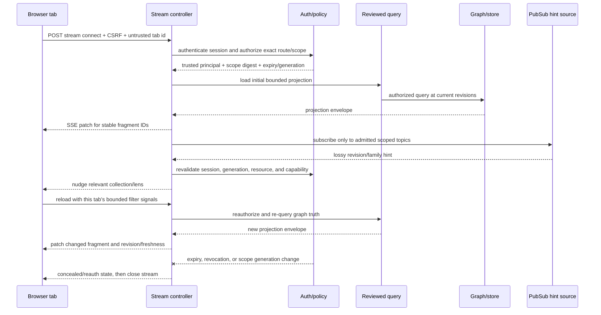

The accepted PubSub rule maps cleanly to Dstar's nudge pattern: a hint says
that a projection family may have changed, then each tab reloads using its own
bounded filter, cursor, and authorized scope. Dropped, duplicate, reordered,
or delayed hints do not change correctness.

Preserve the existing server-side `ProjectionSubscription` responsibilities
behind the SSE coordinator: it tracks the last server-evaluated revision,
coalesces hints, reauthorizes, and runs a refresh callback. When the complete
projection request is server-known, the coordinator can emit the refreshed
fragment directly. When a tab owns harmless filter/cursor intent, it may emit a
nudge and let that tab make a new authorized request. In both cases the browser
is not revision authority, and a client signal must not decide whether a graph
hint is newer or safe.

Prefer one multiplexed stream per page/tab over one connection per agent. A
deduplication key should use a stable trusted browser-session/principal identity
plus the untrusted tab identifier, so a full-page navigation in that tab can
take over the old stream. Route, scope, role/session generation, authorization,
and expiry belong to the claimed stream's trusted state, not the registry key.
A `tabId` is not security. Reconnect loads a current snapshot rather than
assuming replay is complete. `Last-Event-ID`, if used, is opaque and cannot
cross principal, project, interaction session, attempt, or scope boundaries.

Dstar's optional `StreamRegistry` is only a deduplication utility. In `0.2.0`
it can fall back to an undeduplicated stream for a missing/invalid tab ID and a
claim race does not provide an authorization or quota boundary. JidoCode must
enforce stream admission, revocation, limits, and cleanup independently. Pin a
bounded retry/backoff policy as well: the client connection helper can retry
indefinitely by default, which would turn persistent takeover/configuration
errors into a reconnect loop
([pinned `StreamRegistry` source](https://github.com/ricotrevisan/dstar/blob/4bfb9110645f3831cd350f25434493c76a42bfae/lib/dstar/utility/stream_registry.ex)).

Revocation cannot depend on ordinary graph-change hints. Every protected stream
needs an independent hard-expiry timer and a revocation/session-generation
subscription, periodic authorization checks even when no graph hint arrives,
reauthorization before every patch, and a tested terminal response that
prevents the Datastar client from reconnecting indefinitely. On revocation,
replace protected fragments
with a concealed/reauthentication state when the connection is available and
close the stream. An offline browser may retain HTML it already received; the
server cannot remotely erase that DOM, which is why least disclosure, short
sessions, device/browser controls, and no-store policy remain necessary.

Production qualification must cover HTTP/2/TLS, proxy buffering, keepalive,
backpressure, per-principal stream limits, reconnect jitter, queue bounds,
zombie cleanup, session expiry, live revocation, and deploy restart behavior.

### Threat And Control Matrix

| Threat | Failure mode | Required controls |
|---|---|---|
| Cross-project object reference | User changes a route/signal reference and sees another project | Opaque bounded refs plus server ownership/capability checks on page, query, stream, command, and export |
| Signal/DOM tampering | User forges role, graph, command, revision, or successful state | Closed signal schemas; derive authority/action/state from server; never trust hidden/disabled fields |
| Stale command preview | State, policy, candidate, or fence changes before submission | Re-query canonical data and bind command to expected revisions/fence/action digest |
| Agent approval spoofing | Hostile agent text imitates trusted approval facts/buttons | Separate trusted transaction component; escape/label agent text; single-use action-bound approval |
| Content injection | Source, logs, wiki, memory, or graph literals become script/Datastar expressions | HEEx escaping, explicit sanitization for allowed rich text, static expressions, CSP nonce mode, no script execution event |
| CSRF or cross-site stream/action | Attacker causes an authenticated browser to connect or mutate | Phoenix CSRF, body/header token, Origin/Fetch Metadata checks, SameSite cookies, no GET effects |
| Stream survives revocation | Open tab continues receiving protected fragments after role/session change | Generation/expiry checks, reauthorization on hints/refresh, explicit stream termination and concealed replacement |
| Replay/cursor confusion | `Last-Event-ID` or tab ID replays another scope's data | Trusted scope-bound registry/cursor, opaque identifiers, full authorized snapshot on reconnect |
| Cache/proxy disclosure | Confidential fragment is buffered, cached, or logged | `no-store`, disable proxy buffering where required, strict referrer policy, log scrubbing, TLS |
| Graph inference side channel | Counts, labels, timing, or sibling existence reveal concealed data | Scope query before aggregation, identical unknown/unauthorized exterior behavior, bounded response timing/error vocabulary |
| Connection/resource exhaustion | A user opens many agent streams or expensive graph expansions | One multiplexed page stream, per-principal limits, queue/backpressure bounds, query budgets, pagination, cleanup |
| Supply-chain drift | Mutable Datastar/ShadcnUI asset or dependency changes semantics | Exact versions/SHAs/digests, local assets, usage/license record, clean-checkout tests, CSP |
| Clickjacking or unsafe embedding | Sensitive command surface is framed or visually overlaid | CSP `frame-ancestors`, existing secure browser headers, clear scope/consequence, step-up for high risk |

The matrix extends the accepted
[product threat model](../architecture/product-security-privacy-and-threat-model.md);
it does not replace its classification, concealment, credential, or audit
requirements.

### Incident Mode

NIST's AI Risk Management Framework calls for explicit human roles,
monitoring, overrides with rationale, incident handling, recovery, and
decommissioning
([human-AI interaction appendix](https://airc.nist.gov/airmf-resources/airmf/appendices/app-c-ai-risk-management-and-human-ai-interaction/),
[Manage playbook](https://airc.nist.gov/airmf-resources/playbook/manage/)). A
security-first factory needs a separately authorized incident posture that can:

- freeze admission of new starts within an exact factory/project/profile scope;
- revoke or narrow capabilities independently of an agent runtime;
- expose only already admitted stop/cancel/recovery controls;
- correlate security, operational, command, evidence, and source observations;
- assign an incident owner and record human handoff/rationale;
- show containment, reconciliation, recovery, and reopen criteria; and
- preserve immutable receipts and a bounded appeal/post-incident evidence
  bundle.

These outcomes are not current UI buttons. Freeze, revocation, quarantine,
emergency stop, and reopen require semantic resources, state machines,
commands, exact capabilities, separation of duty, and recovery tests before the
interface may make them operative. Until then, an incident view is read-only
and links to documented external operator procedures.

## HEEx + Datastar + Dstar Application Model

### Target Stack

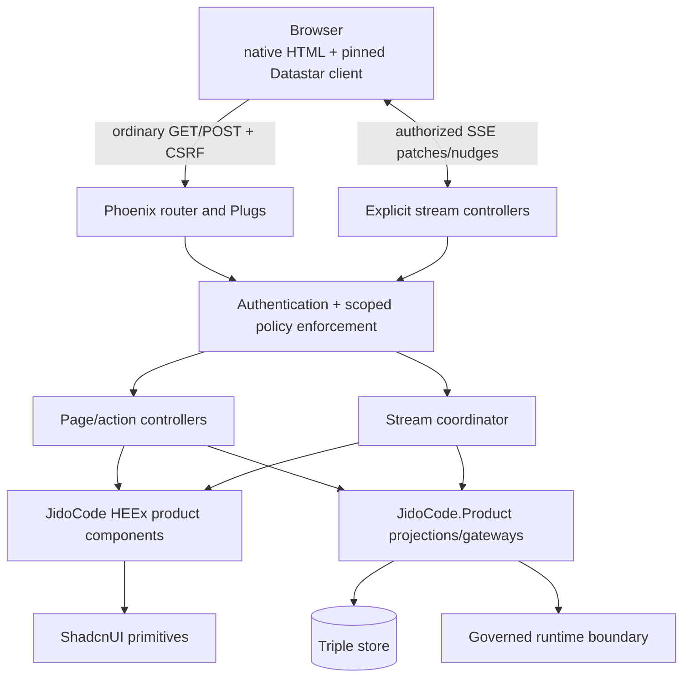

Use explicit Phoenix routes and application-owned controllers for pages,
fragments, streams, and commands. This creates an auditable allowlist and keeps
normal Plug authentication/CSRF/policy boundaries visible. If `Dstar.Page` or
dynamic dispatch helpers are adopted, they must preserve explicit route/action
allowlists and run the same plugs; browser data must never select an arbitrary
server module or function.

This is especially important in Dstar `0.2.0`: `Dstar.Page.Plug` begins an SSE
response before calling `handle_event/3`, and opens a stream before
`handle_connect/2`. Authentication, CSRF, rate limits, exact resource/action
authorization, and concealment that need a normal HTTP error must therefore
finish in preceding Plugs or a custom controller before `Dstar.start`.
High-risk semantic commands should use explicit controllers rather than first
authorizing inside `handle_event/3`. Any permitted page event name is also
path-controlled input and needs a closed allowlist
([pinned `Dstar.Page.Plug` source](https://github.com/ricotrevisan/dstar/blob/4bfb9110645f3831cd350f25434493c76a42bfae/lib/dstar/page/plug.ex#L65-L105)).

### Request Classes

| Request | Method | Response | Authority rule |
|---|---|---|---|
| Full page/navigation | GET | Complete HEEx document | Authenticate, authorize route and each included projection. |
| Filter/paginate/search | GET or POST by sensitivity | HEEx fragment/SSE patch | Closed signal schema; reviewed query; result authorization; bounds. |
| Stream connect | POST | `text/event-stream` | CSRF, origin, principal, exact scope, limits, expiry/revocation. |
| Semantic command | POST/PUT/PATCH | Receipt + fresh fragment patches | Reauthorize current state/fence/profile; idempotency; no optimistic success. |
| Approval preview | GET/POST | Canonical HEEx transaction | Separate authorization; no effect. |
| Export | POST | Bounded generated artifact/receipt | Separate capability, classification, rate/cost limits, audit. |

Ordinary anchors and forms should provide fallback where feasible. Datastar
expressions invoke stable semantic endpoints; they do not encode domain logic.

### Fragment Architecture

Fragment boundaries should align with independently authorized projections and
preserve browser-native state. Examples:

```text
#factory-attention
#factory-health
#agent-fleet
#project-{opaque_ref}-summary
#project-{opaque_ref}-attempts
#attempt-{opaque_ref}-trust-header
#attempt-{opaque_ref}-timeline
#attempt-{opaque_ref}-checks
#attempt-{opaque_ref}-budget
#command-{opaque_receipt_ref}-outcome
#knowledge-{lens_id}-results
```

Opaque references must be DOM-safe, bounded, and non-authoritative. Patch the
smallest coherent region that can express a complete state. Do not replace the
whole page for one agent heartbeat, and do not patch only a number if its
freshness, label, or accessible status would become inconsistent.

Dialogs, drawers, popovers, dropdowns, focused forms, scroll containers, and
selected graph nodes contain browser-native state. Routine SSE updates should
patch a stable child or sibling, not the overlay or form root. Every command
flow must test concurrent patches while the overlay is open and define the
post-action focus destination.

### Signals Versus Durable State

| State | Owner | Examples |
|---|---|---|
| Durable semantic state | Triple store and governed external effects | task state, lease, fence, attempt, evidence, decision, wiki edition |
| Request/navigation state | URL and validated request | filter, sort, cursor, selected view, safe search term |
| Ephemeral presentation state | Local Datastar signal/native browser | inspector open, density, disclosure, local focus |
| Stream delivery state | Server stream coordinator | admitted topics, last loaded revision, expiry, queue pressure |
| Forbidden client authority | None | role, graph scope, command, capability, success, accepted revision |

Durable filters or shareable selections belong in the URL. A later navigation
can reconstruct the page without a hidden signal store. A separate agent
attempt workspace is a durable route backed by graph identity, not a
dynamically created browser component.

### Update And Command Flows

Read refresh:

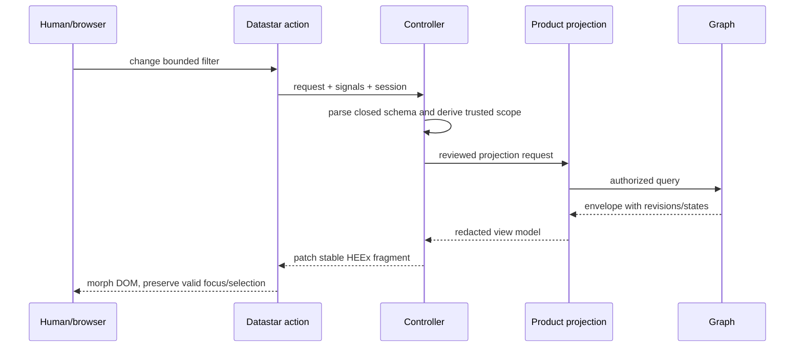

Semantic command:

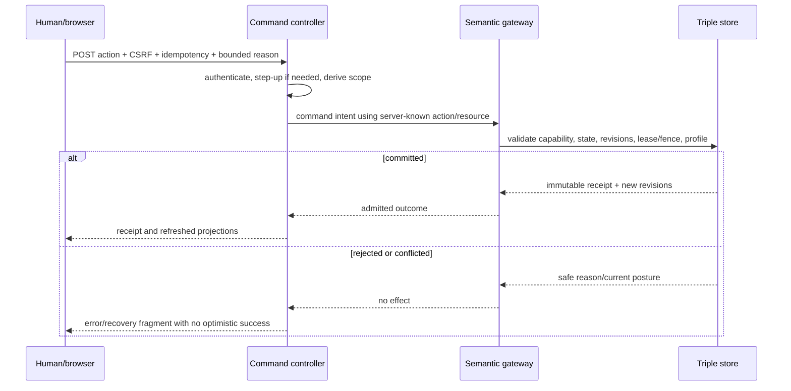

## ShadcnUI Adoption Assessment

### What The Authoritative Repository Is

The selected project is
[`pcharbon70/shadcn_ui`](https://github.com/pcharbon70/shadcn_ui), not the
React/JavaScript shadcn/ui project. At the inspected commit it is a stateless,
transport-neutral Phoenix function-component package with forty-one public
components and a compiled local stylesheet. It contributes no JavaScript,
hooks, routes, sockets, processes, state, authorization, persistence, or
command handling. Its component contract requires semantic native HTML,
deterministic identity, escaped content, protected accessibility
relationships, caller-owned lifecycle, and preservation of appropriate
`data-on-*` attributes.

The repository's [Dstar integration
guidance](https://github.com/pcharbon70/shadcn_ui/blob/78d3dfeb56c269b81a2a74f6c0b7ce056393554d/docs/integrations.md)
explicitly assigns signals, authorization, CSRF, patches, recovery, and state to
the application. Tests demonstrate survival of Dstar-shaped attributes, but
the package has no `dstar` dependency or end-to-end SSE qualification. JidoCode
must supply that evidence.

### Component Mapping

| Factory surface | Existing ShadcnUI primitives | JidoCode-owned composition needed |
|---|---|---|
| Global shell | Header, Navigation Menu, Section Header, Drawer, Separator | App shell, responsive sidebar, breadcrumbs, context switcher, authorized nav |
| Attention/health | Card, Badge, Alert, Progress, Meter, Skeleton | Attention queue, health matrix, status strip, sparklines |
| Fleet | Avatar, Badge, Card, Dropdown Actions | Accessible data table, filters, pagination, lease/budget cells |
| Project workspace | Card, Accordion, Navigation Menu, Scroll Area | Project tree, task/attempt hierarchy, dependency overview |
| Agent attempt | Alert, Progress, Scroll Area, Accordion, Button | Causal timeline/log, stage rail, split inspector, diff/artifact viewer |
| Commands | Button, Field/forms, Dialog, Alert Dialog | Canonical command preview, step-up, idempotency, receipt and recovery |
| Knowledge | Card, Accordion, Input, forms | Graph lens, provenance drawer, table/tree/matrix/node-link views |
| Wiki | Navigation Menu, Card, Accordion, Input | Page tree/search, citations, dependency catalog, edition/preview states |
| Governance | Alert, Alert Dialog, forms, Badge | Role/policy matrix, audit table, credential and incident workflows |

The media and decorative motion components—Carousel, Cover Flow, Image
Gallery, Marquee, and similar effects—should not carry operational state.
Motion should be subtle, suppressible, and never required to notice a failure
or determine whether an agent is running.

Use each primitive according to its semantics. `Progress` is only for genuine
bounded completion, never an inferred guess that an agent is "73% done";
`Meter` represents scalar utilization such as a token/cost budget with
meaningful thresholds; lifecycle uses explicit stage/status text and last
meaningful effect. `Badge` is passive and must not be made clickable. Not every
component forwards Datastar attributes to every internal element, so each
trigger/action wrapper needs a rendered-contract test for its exact `rest`
attribute target.

### Application-Owned Component Inventory

Priority-zero composites are:

- `FactoryShell` and `ProjectContextSwitcher`;
- `AttentionQueue` and `ProjectionStatusStrip`;
- `AgentFleetTable` with server-side filtering/pagination;
- `AgentAttemptWorkspace`, `StageRail`, and `AttemptTimeline`;
- `CodeDiff`/artifact manifest and `EvidenceMatrix`;
- `ScopedCommandDialog` and immutable `CommandReceipt`;
- `GraphLens` with accessible table/outline fallback;
- `ProvenancePanel` and contradiction/freshness treatment; and
- `CostBudgetMeter` spanning attempt, project, wiki maintainer, and factory.

Priority-one composites include breadcrumbs/sidebar, global search/command
surface, dependency matrix, project tree, security audit table, notification
center, charts/sparklines, and large-result pagination/virtualization.

Keep `JidoCodeWeb.Components.UI` as the application boundary. Import a narrow
set of ShadcnUI primitives there and expose JidoCode semantics above it. Do not
scatter `use ShadcnUI` through pages or couple product views to every upstream
component. ShadcnUI is not API-compatible with SaladUI: it lacks Command and
Tabs, combines Card/Alert composition differently, and leaves overlay state to
native HTML.

The facade must also resolve function-name collisions explicitly. Broad
ShadcnUI imports include names such as `input/1` and `button/1` that overlap
JidoCode core components. Give application wrappers stable names/APIs and
preserve the project's `to_form` plus `<.input field={@form[:field]}>` contract
for forms; do not let an import silently select a different input component.

### Styling And Assets

ShadcnUI ships compiled CSS using `sui:`-prefixed utilities and
`--shadcn-ui-*` semantic tokens. Copy the exact pinned stylesheet into the
controlled asset build, fingerprint it, and include it through `app.css` in the
qualified order required by the package. Keep all CSS `@import` directives at
the top, preserve the mandated Tailwind v4 import and `@source` declarations,
and place application token overrides after imported package CSS. Map
JidoCode's color, surface, focus, radius, and motion tokens to the package's
public variables; typography and spacing remain application-owned because they
are not ShadcnUI public token families. Explicitly bridge JidoCode's
`data-theme` to ShadcnUI's `data-shadcn-theme` using the resolved `light` or
`dark` value; `system` is a preference to resolve, not a ShadcnUI theme value.
Keep forced-colors and reduced-motion behavior synchronized.

Self-host the exact Datastar client through `app.js`. No external script or
stylesheet tag, CDN, remote font, or independent bundle is required or allowed.

### Maturity And Adoption Gates

ShadcnUI is promising but not a qualified release at the inspected revision:

- package version is `0.1.0`, with no public Hex release or immutable public
  version tag;
- candidate status reports qualification false, manual accessibility scenarios
  pending, final CI pending, and an open specification gate;
- the inspected GitHub Actions run failed before job startup;
- package metadata, installation examples, and canonical URLs still reference
  `Leco-Industries-Inc` although the user-designated source is
  `pcharbon70/shadcn_ui`;
- the package declares `LicenseRef-LECO-Proprietary`, while the repository has
  no visible root license file; and
- automated browser/accessibility evidence exists, but keyboard, overlay/focus,
  zoom/RTL, native high contrast/reduced motion, physical touch, and screen
  reader scenarios remain manually unqualified.

Its native overlays also depend on modern Dialog/Popover/invoker capabilities
and optionally anchor positioning. Locked Chromium, Firefox, and WebKit runs are
evidence for those exact engines, not a supported-browser promise. JidoCode must
define its actual browser matrix and qualify native/fallback behavior for every
composed route.

Before adoption, reconcile namespace and usage rights, repair CI, record the
manual accessibility risk or close it, and pin a reviewed commit rather than
`main`. Relevant upstream evidence includes the [component
index](https://github.com/pcharbon70/shadcn_ui/blob/78d3dfeb56c269b81a2a74f6c0b7ce056393554d/docs/components.md),
[installation contract](https://github.com/pcharbon70/shadcn_ui/blob/78d3dfeb56c269b81a2a74f6c0b7ce056393554d/docs/installation.md),
[accessibility review](https://github.com/pcharbon70/shadcn_ui/blob/78d3dfeb56c269b81a2a74f6c0b7ce056393554d/docs/accessibility-review.md),
and [release status](https://github.com/pcharbon70/shadcn_ui/blob/78d3dfeb56c269b81a2a74f6c0b7ce056393554d/release/candidate-status.json).
The observed upstream workflow ended in
[`startup_failure`](https://github.com/pcharbon70/shadcn_ui/actions/runs/33190302744)
before jobs ran.

### The Phoenix LiveView Package Nuance

The requested product must not use Phoenix LiveView as its runtime or page
model. However, ShadcnUI `0.1.0` declares `phoenix_live_view ~> 1.2` because
Phoenix.Component, HEEx attributes, and slots are distributed in that package.
The Elixir Dstar HEEx helpers also use Phoenix.Component. Retaining that package
for compilation does not start a LiveView, socket, route, or process.

Current JidoCode pins `phoenix_live_view ~> 1.1.0`, so its constraint does not
intersect ShadcnUI's. The recommended interpretation and path are:

1. prohibit LiveView routes, sockets, event handlers, streams, assigns as
   product state, and LiveVue islands;
2. upgrade the library dependency to the ShadcnUI-qualified `~> 1.2` line solely
   for Phoenix.Component/HEEx infrastructure; and
3. add an architecture fitness test that rejects product `live` routes and
   LiveView modules while allowing the component dependency.

If "no Phoenix LiveView at all" means zero package dependency, the chosen
ShadcnUI implementation cannot be consumed under its current contract. That
would require changing and independently qualifying the component library or
choosing a different HEEx foundation.

## Detailed Screen And Interaction Specification

### Responsive Layout

Desktop should use three stable zones:

```text
┌──────────────────────────────────────────────────────────────────────┐
│ Scope / project      Search     Attention · Health · Identity       │
├──────────────┬──────────────────────────────────────┬────────────────┤
│ Authorized   │ Main page, table, timeline, or diff │ Contextual     │
│ navigation   │                                      │ inspector      │
│              │                                      │ evidence/cost  │
├──────────────┴──────────────────────────────────────┴────────────────┤
│ Projection revision · freshness · connection · command receipt      │
└──────────────────────────────────────────────────────────────────────┘
```

At narrow widths, navigation becomes a native drawer and the inspector becomes
a separately invoked drawer after the main content; essential status and
controls remain in document order. No required action may exist only on hover,
in a tooltip, or off-screen in a horizontally scrolling card wall.

### Status Language

Use plain, specific labels:

- "Running: last applied workspace edit 38 seconds ago" rather than "Active";
- "Waiting for developer answer" rather than "Paused" when no pause command
  exists;
- "Candidate checks passed; independent verification not started" rather than
  "Success";
- "Live connection lost; data last confirmed at 14:32" rather than a green
  stale snapshot; and
- "Cancel request committed; runtime cleanup pending" rather than "Cancelled"
  before reconciliation.

Color, icons, position, and animation reinforce the text but never replace it.

### Filters, Search, And Selection

Filters use closed server-known values and expose active scope as removable
chips/text. Search is bounded by lens and authorization; it never becomes raw
graph query input. Results retain their projection state, provenance, and
scope. Large collections use server-side cursor pagination. Selection uses
opaque references and is cleared when the enclosing project/attempt/candidate
changes.

The global command surface should primarily navigate and find authorized
objects. If it eventually invokes actions, those actions still route through a
canonical preview, exact authorization, and receipt; a palette shortcut cannot
bypass consequence review.

### Cost And Budget

Cost is both an operational and governance concern. Show:

- token/input/output/cache counts and monetary cost where provider accounting
  supports them;
- attempt, task, project, wiki-maintainer, profile/provider, and factory
  aggregation;
- budget, consumed, reserved/in-flight, remaining, and forecast separately;
- data completeness and currency/conversion basis;
- cost per accepted and externally observed source outcome, accepted knowledge
  change, or activated wiki edition—not only cost per run; and
- threshold events and the exact policy response they caused.

Wiki generation is explicitly opt-in and its costs remain separately
attributable as required by
[repository wiki budget/accounting](../architecture/repository-wiki-enrollment-budget-and-accounting.md).
Opt-out is a project policy state, not a hidden UI preference. The project
workspace should show disabled/not-enrolled, enrolled inactive, compiling,
current, stale, budget-paused, and recovery postures truthfully.

### Wiki, Guides, And Dependencies

The wiki surface should preserve the accepted page-source distinctions:

- source-backed authored user, developer, operator, architecture, and
  contributing guides;
- deterministic Mix project and complete direct/transitive dependency facts;
- synthesized explanations with citations, confidence, contradictions, and
  omissions; and
- live operational lenses rendered from current reviewed queries.

Every dependency page/table shows resolved version, direct/transitive role,
scope/environment, lock provenance, package/source/documentation links, license
when known, and the `mix.exs` project relationship. Private candidate previews
remain isolated by attempt/candidate/fence/audience and never appear because a
user can access the repository generally.

Stacey Vetzal's essays frame code as recorded organizational and domain
knowledge and suggest treating codebase archaeology as wiki material
([Code is knowledge](https://stacey.vetzal.ca/2026/2026-04-09-code-is-knowledge/),
[Every codebase is an uncompiled knowledge base](https://stacey.vetzal.ca/2026/2026-04-10-every-codebase-is-an-uncompiled-knowledge-base/)).
The accepted JidoCode wiki architecture appropriately adds revision pinning,
citations, isolation, lint, cost governance, and non-authoritative edition
boundaries rather than presenting generated prose as truth.

## Accessibility And Inclusive Operation

Target WCAG 2.2 AA and test the composed product, not only primitive fixtures
([WCAG 2.2](https://www.w3.org/TR/WCAG22/)). Prefer native HTML and follow ARIA
Authoring Practices only where native semantics cannot express the interaction
([ARIA APG](https://www.w3.org/WAI/ARIA/apg/patterns/)).

Required practices include:

- keyboard access, visible focus, skip links, logical landmarks/headings, and
  predictable focus after navigation or fragment replacement;
- at least WCAG's 24 CSS pixel minimum target-size rule where applicable, with
  a product goal near 44 pixels for primary controls and touch operation;
- text/icon/shape in addition to color for every state;
- 200% zoom, 320 CSS-pixel reflow, RTL, physical touch, screen-reader, forced
  colors, reduced motion, CSS-disabled, and JavaScript-disabled evaluation;
- `role="status"` or a restrained polite live region for discrete command
  results, reconnect changes, and attention-count updates;
- a normally navigable list/table for the event timeline by default; if a
  deliberately bounded `role="log"` region is used, accept that additions are
  live announcements and coalesce only the meaningful events intended for that
  audience;
- pause/stop/hide controls for nonessential auto-updating content that persists
  alongside other content, as required by WCAG 2.2.2; pausing visual updates
  does not pause an agent and the page must show its resulting freshness state;
- alert dialogs only for consequential interruptions, with canonical target
  and consequence in the accessible name/description;
- semantic tables for comparison, with sortable state announced; and
- table/outline equivalents, keyboard selection, and stable reading order for
  every graph visualization.

Authentication and session controls also fall inside the accessibility target.
Support password managers and paste, avoid memory/transcription puzzles, and
offer passkeys or another method that meets Accessible Authentication. Warn
before an inactivity/session timeout when policy permits extension, communicate
the exact consequence, and preserve unsent form/steering work through step-up
or reauthentication where doing so is safe
([Accessible Authentication](https://www.w3.org/WAI/WCAG22/Understanding/accessible-authentication-minimum.html),
[Timing Adjustable](https://www.w3.org/WAI/WCAG22/Understanding/timing-adjustable.html),
[Timeouts](https://www.w3.org/WAI/WCAG22/Understanding/timeouts.html)).

Datastar patches must preserve the active element when it remains valid. If an
action removes it, focus moves to a documented logical successor or the command
receipt. Do not repeatedly replace navigation, headings, open overlays, or
focused forms for unrelated background updates.

## Operational Observability

The product should correlate:

- factory, tenant, project, repository, task, attempt, interaction session, candidate,
  verifier, receipt, and safe trace identifiers;
- queue/capacity, lifecycle, wait, lease/fence, last meaningful effect,
  verification, decision, source-application/observation, satisfaction,
  knowledge-adoption, and wiki states;
- token/cost/time budgets and accounting completeness;
- projection graph/source revisions, freshness, completeness, contradictions,
  and truncation;
- SSE connections, reconnects, dropped/coalesced hints, queue pressure, and
  convergence time; and
- authorization decisions, step-up, control attempts, command receipts, and
  security incidents.

Operational logs, security audit, semantic receipts, and user-facing timelines
serve different purposes. Do not merge them into one unrestricted event dump.
OpenTelemetry GenAI conventions can inform telemetry vocabulary, but prompt,
completion, tool, and token attributes can be sensitive and must follow
classification/redaction
([OpenTelemetry GenAI attributes](https://opentelemetry.io/docs/specs/semconv/registry/attributes/gen-ai/),
[OWASP Logging](https://cheatsheetseries.owasp.org/cheatsheets/Logging_Cheat_Sheet.html)).

## Validation Program

### Test Matrix

| Area | Required scenarios |
|---|---|
| Full-page baseline | Authenticated navigation, ordinary forms/links, server validation, useful no-JS state, error and maintenance pages |
| Projection correctness | All ten projection states, revision/freshness labels, contradiction, truncation, empty, concealment |
| Datastar requests | Closed signal parsing, tampering, oversized input, double submit, response patch target, focus preservation |
| SSE | Initial snapshot, duplicate/reordered/dropped hint, disconnect/reconnect, deploy restart, stale convergence, backpressure, multi-tab, zombie cleanup |
| Parallel isolation | Cross-project/attempt/interaction-session/candidate/preview probes, scope switching, several tabs, copied opaque refs, cursor/replay isolation |
| Authorization | Deny by default, every route/query/command, IDOR, role/delegation change, scope revocation while streaming, step-up expiry |
| Command integrity | Exact action/resource/fence/profile, idempotency, stale preview, canonical approval hash, transport-loss recovery, receipt lookup |
| Concurrent humans | Two authorized users steer/cancel/handoff/decide the same attempt; exactly one conflicting transition commits and the loser receives the current safe receipt/state |
| Injection | Agent text, source/wiki content, graph literals, Markdown/HTML, Datastar expressions, headers, filenames, links |
| Browser security | CSRF, Origin/Fetch Metadata, CSP nonce mode, no inline/external runtime, cookies, referrer/log leakage, caching |
| Accessibility | Keyboard, screen reader, zoom/reflow, touch, RTL, focus, status announcements, reduced motion, forced colors, tables/graphs |
| Load/capacity | Large fleet, long timeline, bounded graph, rapid hints, pagination, many tabs/users, HTTP/2/proxy limits |
| ShadcnUI | Exact SHA/assets, theme mapping, CSS/no-script fallback, overlays during patches, manual accessibility closure |
| Migration | Read and command parity with accepted contracts, no LiveView routes/processes, removal of LiveVue/Salad after equivalence, retained or explicitly replaced asset compiler |

### Usability Scenarios

Test with developers, maintainers, verifiers, operators, and auditors:

1. Identify why a project is stalled without opening every attempt workspace.
2. Resume three parallel attempt workspaces after an interruption and correctly explain
   each one's current state and next action.
3. Detect a dangerous or runaway attempt and select the safest admitted
   control without exposing unrelated project content.
4. Answer a bounded agent question and confirm which task/attempt consumed the
   answer.
5. Review a candidate, distinguish agent claim from verifier evidence, and
   avoid approving a stale or spoofed transaction.
6. Trace a wiki statement or memory proposition back to source/evidence and
   recognize contradiction or stale coverage.
7. Determine direct/transitive Mix dependency posture without interpreting a
   graph hairball.
8. Recover after stream loss and determine whether displayed data has
   converged to current graph truth.
9. Revoke a user's project role during an open attempt workspace and confirm
   the server stops future delivery, terminates reconnect, and replaces a
   connected browser's protected projection without cross-scope disclosure.
10. Operate the essential workflow by keyboard, screen reader, reduced motion,
    and at narrow width/zoom.
11. Have two authorized humans submit conflicting controls or decisions for one
    attempt and verify deterministic compare-and-set behavior rather than
    last-write-wins.

### Outcome Metrics

| Metric | Desired interpretation |
|---|---|
| Time to detect | How quickly a person finds a run requiring attention |
| Time to understand | How quickly they explain cause, scope, and likely next state correctly |
| Time to safe intervention | How quickly they execute the right admitted control |
| Approval correctness | Exact-action decisions without stale, wrong-scope, or spoofed approvals |
| Resume accuracy | Correct reconstruction of several parallel attempt workspaces after interruption |
| Reconnect convergence | Time from reconnect/hint to current authorized graph revision |
| Alert burden | Actionable attention items per accepted outcome; false/duplicate rate |
| Review effort | Time and error rate from candidate to evidence-based disposition |
| Cost efficiency | Token/monetary cost per accepted and externally observed source outcome or activated wiki edition |
| Trust calibration | Alignment between perceived and actual capability/state/evidence |
| Accessibility completion | Equivalent task success across required input/display modes |
| Isolation | Zero cross-project, cross-attempt, cross-interaction-session, cross-graph, or cross-role disclosure |

## Milestone-Based Migration Strategy

The presentation migration should be incremental and preserve the accepted
graph/product contracts throughout:

```mermaid
flowchart LR
    MA[A. ADR and security contracts]
    MB[B. Dependency and asset proof]
    MC[C. Controller/HEEx read-only shell]
    MD[D. Datastar fragments and SSE]
    ME[E. Agent/attempt command workbench]
    MF[F. Knowledge lenses and wiki]
    MG[G. Multi-user security and qualification]
    MH[H. Remove superseded runtime]
    MA --> MB --> MC --> MD --> ME --> MF --> MG --> MH
```

### Milestone A: Architectural Authority

- Accept an ADR replacing LiveView/LiveVue product runtime with
  controller-rendered HEEx and Datastar.
- Revise the product-surface, wiki-product, security, testing, operations, and
  contributor contracts without weakening projection/command invariants.
- Define named human identity, assurance, role/delegation, and separation of
  duty.
- Define explicit page, fragment, stream, signal, command, receipt, and
  revocation contracts.
- Update `AGENTS.md`; its current LiveView-specific implementation rules
  conflict with the requested target and would otherwise recreate migration
  debt.

### Milestone B: Dependency And Consumer Proof

- Reconcile ShadcnUI namespace, proprietary license/usage authority, CI, exact
  SHA, and accessibility status.
- Resolve the `phoenix_live_view ~> 1.1` versus `~> 1.2` component-library
  constraint without adding LiveView routes/processes.
- Pin `dstar`, the Datastar browser asset/digest, and supported protocol
  behaviors.
- Record the Datastar client version, source commit, bundle filename, content
  digest, license, CSP build/mode, and import path. Dstar `0.2.0` examples target
  Datastar `v1.0.0`, but JidoCode must prove the exact selected client rather
  than infer compatibility from versionless web documentation.
- Build a clean consumer spike for HEEx components, Datastar attributes, CSRF,
  CSP nonce mode, SSE, reconnect, and overlay morph behavior.
- Add architecture checks for allowed asset/runtime dependencies and forbidden
  LiveView/LiveVue product constructs.

### Milestone C: Read-Only Hypermedia Shell

- Implement named human accounts, authentication assurance, trusted
  identity/scope/authority construction for controllers and streams,
  roles/delegations, project memberships, restricted routes, session
  generation, and revocation before exposing any multi-user projection.
- Add controller-rendered authenticated shell, project context, ordinary
  routes, projection state components, and durable attempt-workspace URLs.
- Add ShadcnUI CSS/token mapping and application-owned primitives.
- Deliver read-only factory, project, fleet, and attempt projections with
  server pagination and safe provenance.
- Preserve no-JS navigation and qualify responsive/accessibility baselines.

### Milestone D: Datastar Delivery

- Add bounded filters/search/pagination with closed signal schemas.
- Add one authorized multiplexed stream per page/tab, Dstar patches/nudges,
  re-query convergence, reconnect, session expiry, and revocation.
- Add connection/freshness state without conflating it with data truth.
- Qualify HTTP/2/proxy/backpressure/multi-tab behavior.

### Milestone E: Governed Agent Control

- Implement the per-attempt workspace and normalized causal timeline.
- Adapt only already accepted steer, answer, cancel, handoff, recovery, retry,
  and draft-publication commands after resolving existing exposure gaps.
- Add canonical command previews, step-up, idempotency, receipts, conflicts,
  and transport-loss recovery.
- Add review/evidence and cost/budget workspaces.

### Milestone F: Knowledge And Wiki Lenses

- Add source, project-domain, execution, evidence, memory, wiki/dependency,
  audit, dataset, and derived-diagnostic reviewed lenses.
- Provide task-appropriate table/tree/timeline/matrix/small-network views with
  accessible alternatives and hard bounds.
- Add private preview isolation, guide/dependency coverage, wiki opt-out,
  maintainer status, and separately attributed wiki token/cost controls.

### Milestone G: Security And Release Qualification

- Complete and qualify phishing-resistant assurance where required,
  roles/delegations, project memberships, restricted areas, live revocation,
  and separation of duty introduced before the read/control surfaces.
- Run hostile authorization/signal/approval/injection/CSRF/CSP tests.
- Complete cross-browser, manual assistive-technology, usability, load,
  recovery, and real-adapter qualification.
- Record release receipts at a clean merged candidate under the repository's
  normal merged-candidate closure invariants.

### Milestone H: Remove Superseded Product Runtime

- Remove LiveView routes/socket/product modules, LiveVue, SaladUI, and Vue
  assets only after read/command/accessibility/security equivalence is
  evidenced. Vite is an asset compiler rather than a LiveView concern; retain
  it for `app.js`/`app.css` or name and qualify a replacement before removal.
- Remove or replace the LiveDashboard development route, LiveView endpoint
  socket, `fetch_live_flash`, LiveView JavaScript/helpers, dashboard dependency,
  and associated tests. If any development-only exception is retained, narrow
  the zero-LiveView claim and qualify that runtime explicitly.
- Retain `phoenix_live_view` only as the qualified Phoenix.Component/HEEx
  dependency if required by ShadcnUI/Dstar; otherwise remove it after an
  independently qualified replacement exists.
- Update operations, rollback, and disaster-recovery documentation and close
  the migration receipt.

## Gap Register

| Priority | Gap | Why it matters | Required closure evidence |
|---|---|---|---|
| P0 | Accepted UI documents mandate LiveView/LiveVue | Requested implementation would violate accepted authority | Superseding ADR/specs and architecture checks |
| P0 | Current shared operator identity has no human roles/MFA/SoD | Cannot reserve sensitive areas safely for multiple users | Identity/ABAC model, route/query/command tests, live revocation |
| P0 | Browser Plug path does not yet construct the same trusted identity/authority as API and LiveView paths | Controller pages and streams could authorize inconsistently; delegation is currently fixed to nil | One trusted mapping Plug/helper with controller/SSE parity and delegation tests |
| P0 | Scheduler/managed service, coding loaders, DGA1 rollout, publication, and wiki gateways are not default production-composed | A polished UI could falsely imply a runnable factory | Composition/readiness projections, `not configured` states, and real-adapter release evidence |
| P0 | No Dstar/Datastar implementation | Target transport and failure/security behavior is unproven | Pinned dependency/client, real consumer tests, proxy/reconnect evidence |
| P0 | ShadcnUI namespace/license/release/CI ambiguity | Supply-chain and legal/qualification risk | Usage authority, canonical metadata, green pinned CI, accepted risk record |
| P0 | Phoenix component version conflict | Current constraints cannot resolve with selected library | Qualified `~> 1.2` upgrade or qualified ShadcnUI change |
| P0 | No fleet-wide attempt/attention control plane | Developers cannot supervise parallel work efficiently | Factory/project/attempt projections and usability results |
| P0 | No SSE revocation/backpressure/reconnect contract | Long-lived streams can leak or lie after scope change | Stream authorization, expiry, load, and convergence tests |
| P0 | Command surface does not consistently expose gateway controls | UI and semantic capability drift | Closed control vocabulary and parity tests |
| P0 | No canonical high-risk approval/step-up flow | Susceptible to stale/spoofed/wrong-scope action | Action-bound receipt and hostile approval tests |
| P0 | No admitted incident-mode resources/commands | Freeze/revoke/quarantine UI would otherwise be decorative or unsafe | Incident state machine, capabilities, receipts, recovery and two-person tests |
| P1 | Outcomes and several graph domains lack product projections | Factory truth remains fragmented or invisible | Reviewed query/lens contracts and projection-state coverage |
| P1 | Product “Project” and “session” language does not map cleanly to conceptual repository and `InteractionSession` identities | Routes, previews, and audits could conflate scopes | Repository-backed project alias decision and explicit attempt↔interaction-session query/cardinality contract |
| P1 | No data table/timeline/diff/graph components in ShadcnUI | Primitive library cannot supply operational UX alone | Application component specs, browser/a11y/load tests |
| P1 | Raw conceptual IRIs appear in current UI | Leaks implementation concepts and weakens mental model | Opaque references and human label/provenance policy |
| P1 | No complete cost/capacity/provider dashboard | Token/cost risk, including wiki generation, is hard to govern | Complete accounting projections, budgets, alerts, cost/outcome metrics |
| P1 | No attempt-workspace resume/since-you-left model | Parallel attempts increase confusion and oversight burden | Durable summary with source links and user-study evidence |
| P1 | No graph visualization selection/accessibility contract | Likely hairball, overload, and inaccessible knowledge | Lens/task matrix, hard bounds, synchronized table alternatives |
| P1 | Current browser tests are LiveView-centric | They cannot qualify the target stack | Controller/HEEx/Dstar test harness and real-browser matrix |
| P1 | LiveDashboard remains a LiveView development route | Literal zero-LiveView runtime cannot retain it silently | Remove/replace it or explicitly narrow and qualify the exception |
| P2 | Historical accessibility evidence predates new agent/wiki UI | Primitive evidence does not cover factory compositions | Manual AT, zoom, touch, RTL, forced-colors, reduced-motion results |
| P2 | Product docs and operator handbook contain stale UI terms | Humans and agents will implement conflicting patterns | Documentation migration and drift checks |

## Required Follow-On Decisions And Specifications

Before implementation, produce at least:

1. **ADR: Server-rendered HEEx and Datastar product runtime** — supersede the
   LiveView/LiveVue ownership decision; define allowed Phoenix.Component
   dependency and prohibited runtime constructs.
2. **ADR: Human identity, scoped authorization, and separation of duty** —
   replace the single-operator release limit with named principals, assurance,
   roles/delegations, ABAC attributes, step-up, and revocation.
3. **Product shell and information-architecture specification** — routes,
   scopes, global/project/attempt navigation, attention queue, responsive
   behavior, durable URLs, and the boundary between derived attention,
   URL/signed-browser-session preferences, and any proposed durable
   acknowledgement resource.
4. **Datastar request, signal, patch, and stream specification** — exact client
   and Dstar versions, CSRF/CSP, request schemas, fragment identity, nudge,
   reconnect, revocation, queue/connection bounds, and forbidden APIs.
5. **Agent attempt workspace and command specification** — interaction-session
   mapping, timeline vocabulary, trust
   header, admitted controls, canonical previews, idempotency, receipts,
   conflicts, and recovery.
6. **Graph-lens and visualization specification** — reviewed queries, graph
   family grouping, projection states, safe provenance, visualization/task
   selection, truncation, and accessible alternatives.
7. **ShadcnUI adoption and component specification** — exact provenance,
   license, dependency constraints, assets/tokens, facade, app composites,
   overlays, and upstream qualification.
8. **UI security, privacy, and threat-model amendment** — cross-project IDOR,
   signal tampering, SSE lifetime, approval spoofing, injection, telemetry,
   caching, and concealed resources.
9. **Accessibility and usability qualification specification** — WCAG 2.2 AA,
   assistive technology, parallel-attempt tasks, attention burden, and outcome
   metrics.
10. **Incident control-plane specification** — read posture, freeze/revoke/stop
    command admission, exact scopes, handoff, evidence, separation of duty,
    recovery, and reopen criteria.
11. **Milestone-based migration and rollback plan** —
    milestone/section/task/subtask checklists, clean-checkout gates, milestone
    receipts, dependency removal, and rollback.

## Recommended Architecture In One View

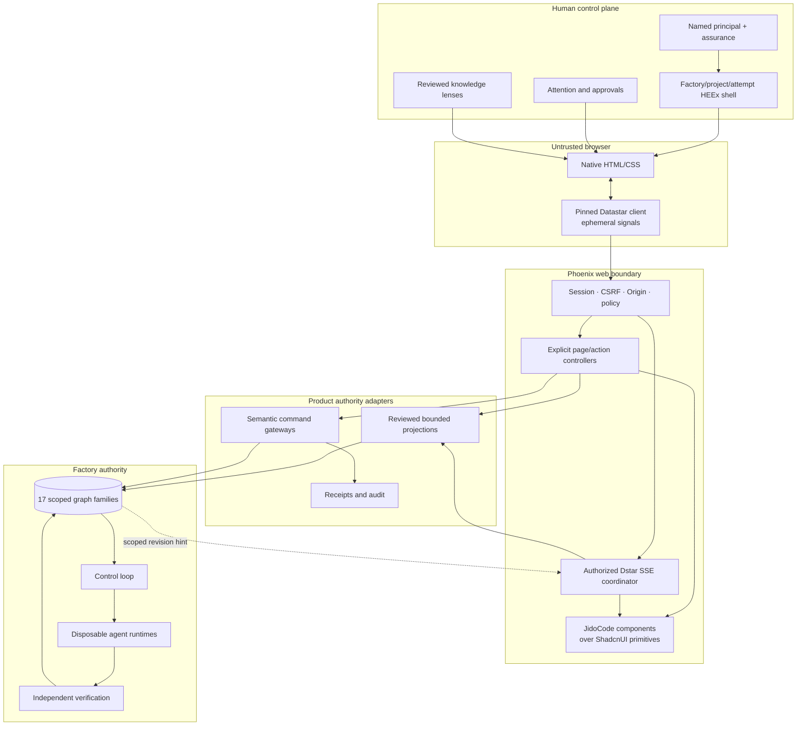

## Sources

### JidoCode Architecture And Plans

- [Current coding factory architecture and agent flows](../architecture/current-coding-factory-architecture-and-agent-flows.md)
- [Product surface and island contract](../architecture/product-surface-and-island-contract.md)
- [Product security, privacy, and threat model](../architecture/product-security-privacy-and-threat-model.md)
- [Bounded projections, cache, and subscriptions](../architecture/bounded-projections-cache-and-subscriptions.md)
- [Change delivery and command recovery](../architecture/change-delivery-and-command-recovery.md)
- [Delegated agent product and qualification](../architecture/delegated-agent-product-and-qualification.md)
- [Repository wiki product and qualification](../architecture/repository-wiki-product-and-qualification.md)
- [Repository wiki enrollment, budget, and accounting](../architecture/repository-wiki-enrollment-budget-and-accounting.md)
- [Repository wiki research](./11-repository-wikis-as-compiled-knowledge-projections.md)

### ShadcnUI, Datastar, And Dstar

- [`pcharbon70/shadcn_ui` pinned source](https://github.com/pcharbon70/shadcn_ui/tree/78d3dfeb56c269b81a2a74f6c0b7ce056393554d)
- [ShadcnUI components](https://github.com/pcharbon70/shadcn_ui/blob/78d3dfeb56c269b81a2a74f6c0b7ce056393554d/docs/components.md)
- [ShadcnUI integration guidance](https://github.com/pcharbon70/shadcn_ui/blob/78d3dfeb56c269b81a2a74f6c0b7ce056393554d/docs/integrations.md)
- [ShadcnUI installation and CSP](https://github.com/pcharbon70/shadcn_ui/blob/78d3dfeb56c269b81a2a74f6c0b7ce056393554d/docs/installation.md)
- [ShadcnUI accessibility review](https://github.com/pcharbon70/shadcn_ui/blob/78d3dfeb56c269b81a2a74f6c0b7ce056393554d/docs/accessibility-review.md)
- [Dstar Hex package](https://hex.pm/packages/dstar)
- [Dstar `0.2.0` documentation](https://hexdocs.pm/dstar/0.2.0/readme.html)
- [Dstar `v0.2.0` pinned source](https://github.com/ricotrevisan/dstar/tree/4bfb9110645f3831cd350f25434493c76a42bfae)
- [Datastar backend requests](https://data-star.dev/guide/backend_requests)
- [Datastar reactive signals](https://data-star.dev/guide/reactive_signals)
- [Datastar SSE events](https://data-star.dev/reference/sse_events)
- [Datastar security](https://data-star.dev/reference/security)
- [WHATWG server-sent events](https://html.spec.whatwg.org/dev/server-sent-events.html)

### Human-Agent Interaction And Operations

- [Human oversight of software agents](https://doi.org/10.1145/3805689.3812402)
- [Guidelines for Human-AI Interaction](https://doi.org/10.1145/3290605.3300233)
- [Magentic-UI report](https://www.microsoft.com/en-us/research/wp-content/uploads/2025/07/magentic-ui-report.pdf)
- [AgentGUI v1](https://arxiv.org/abs/2607.26300v1)
- [AutoGen Studio](https://aclanthology.org/2024.emnlp-demo.8/)
- [Parasuraman and Riley on automation use, misuse, disuse, and abuse](https://doi.org/10.1518/001872097778543886)
- [Endsley and Kiris on out-of-the-loop performance](https://doi.org/10.1518/001872095779064555)
- [Where developers draw the line on AI autonomy](https://www.microsoft.com/en-us/research/publication/you-shall-not-pass-where-and-why-developers-draw-the-line-on-ai-autonomy/)
- [NIST AI RMF human-AI interaction appendix](https://airc.nist.gov/airmf-resources/airmf/appendices/app-c-ai-risk-management-and-human-ai-interaction/)
- [NIST AI RMF Manage playbook](https://airc.nist.gov/airmf-resources/playbook/manage/)
- [Nielsen's usability heuristics](https://www.nngroup.com/articles/ten-usability-heuristics/)
- [Google SRE monitoring distributed systems](https://sre.google/sre-book/monitoring-distributed-systems/)
- [Grafana dashboard design guidance](https://grafana.com/docs/grafana/latest/visualizations/dashboards/build-dashboards/best-practices/)

### Visualization, Accessibility, And Security

- [Shneiderman's information-seeking mantra](https://doi.org/10.1109/VL.1996.545307)
- [Ghoniem et al. on graph readability](https://doi.org/10.1057/palgrave.ivs.9500092)
- [Archambault et al. on dynamic graphs](https://doi.org/10.1109/TVCG.2010.78)
- [RDF 1.1 Concepts](https://www.w3.org/TR/rdf-concepts/)
- [RDF 1.1 datasets](https://www.w3.org/TR/rdf11-datasets/)
- [PROV-O](https://www.w3.org/TR/prov-o/)
- [WCAG 2.2](https://www.w3.org/TR/WCAG22/)
- [WCAG Accessible Authentication](https://www.w3.org/WAI/WCAG22/Understanding/accessible-authentication-minimum.html)
- [WCAG Timing Adjustable](https://www.w3.org/WAI/WCAG22/Understanding/timing-adjustable.html)
- [WCAG Timeouts](https://www.w3.org/WAI/WCAG22/Understanding/timeouts.html)
- [WAI-ARIA Authoring Practices](https://www.w3.org/WAI/ARIA/apg/patterns/)
- [NIST SP 800-162 ABAC](https://csrc.nist.gov/pubs/sp/800/162/upd2/final)
- [NIST SP 800-207 Zero Trust](https://csrc.nist.gov/pubs/sp/800/207/final)
- [NIST SP 800-63B authentication and session guidance](https://pages.nist.gov/800-63-4/sp800-63b.html)
- [OWASP Authorization Cheat Sheet](https://cheatsheetseries.owasp.org/cheatsheets/Authorization_Cheat_Sheet.html)
- [OWASP CSRF Prevention Cheat Sheet](https://cheatsheetseries.owasp.org/cheatsheets/Cross-Site_Request_Forgery_Prevention_Cheat_Sheet.html)
- [OWASP CSP Cheat Sheet](https://cheatsheetseries.owasp.org/cheatsheets/Content_Security_Policy_Cheat_Sheet.html)
- [OWASP AI Agent Security Cheat Sheet](https://cheatsheetseries.owasp.org/cheatsheets/AI_Agent_Security_Cheat_Sheet.html)
- [OWASP Transaction Authorization Cheat Sheet](https://cheatsheetseries.owasp.org/cheatsheets/Transaction_Authorization_Cheat_Sheet.html)

## Final Recommendation

Adopt the following product posture:

> JidoCode is a scoped factory control plane. It presents authoritative,
> revisioned projections; directs attention to exceptions; gives each parallel
> attempt a durable workspace; exposes knowledge through bounded domain
> lenses; and admits only explicit, server-authorized semantic commands whose
> outcomes are proven by receipts.

Use `pcharbon70/shadcn_ui` for semantic presentation primitives, application-
owned HEEx components for factory workflows, Datastar/Dstar for progressive
hypermedia delivery, and the triple-store query/command boundaries for truth
and authority. Resolve the governance, identity, dependency, streaming, and
component gaps before implementation. The safest next step is to translate
this proposal into the eleven ADR/specification artifacts above and then create
a milestone/section/task/subtask implementation plan with clean
merged-candidate gates.
