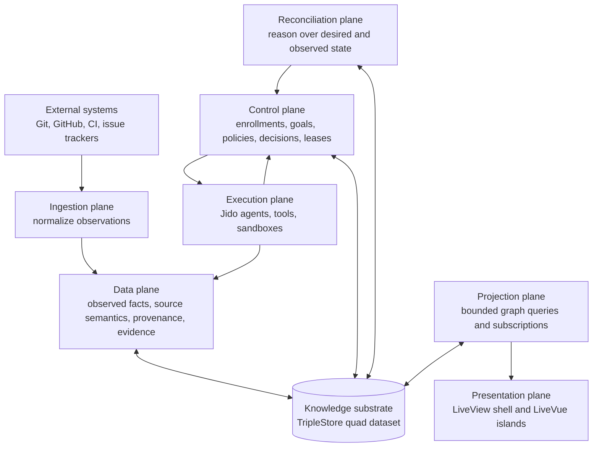
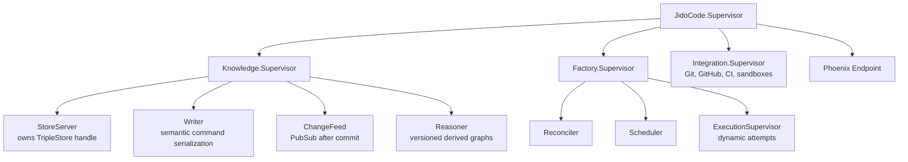

# Graph-Native Managed Repository Factory

Status: proposed research architecture

Date: 2026-07-31

## Purpose

This document proposes an architecture for JidoCode as a managed repository
factory whose only application-owned system of record is an embedded RDF
knowledge graph in `TripleStore`.

It deliberately does not carry forward the route surface from the older
`mikehostetler/jido_code` implementation. The route and workbench surface in
this repository remains authoritative and may evolve independently. This
proposal defines the semantic, persistence, control, runtime, and projection
boundaries that those surfaces consume.

The useful idea from the older architecture is retained:

```text
repository -> observation -> interpretation -> work -> execution -> evidence -> decision
```

The important change is that none of those concepts is a canonical Elixir
record. They are resources and relationships in one knowledge graph. Elixir
modules execute semantic commands and produce bounded projections; they do not
own durable domain objects.

## Executive Recommendation

Build JidoCode around one persistent quad store and a graph-native
reconciliation loop:


The factory continuously compares desired repository outcomes with observed
repository reality. The difference is represented as goals, obligations,
constraints, and dependency edges, not as rows in a task table. Runtime agents
claim eligible work, produce provenance and evidence, and never directly
declare their own output to be accepted truth.

The primary architectural decisions are:

1. `TripleStore`, opened in quad mode, is the only application-owned durable
   store.
2. RDF resources and predicates are the domain model. Elixir structs are
   temporary command envelopes or query projections only.
3. Named graphs separate authority, provenance, lifecycle, and retention. They
   are not tables and should not be divided merely by Elixir module.
4. Important changes are append-first. New assertions, state transitions, and
   supersession relationships preserve history instead of replacing a subject
   in place.
5. Every accepted fact is traceable to an actor, source, activity, time, and,
   where applicable, supporting evidence.
6. Desired state and observed state are distinct. Reconciliation produces
   proposed or eligible work from their difference.
7. Runtime state, UI state, caches, schedulers, and projections are disposable
   and rebuildable from the graph.
8. Inference is useful but never silently upgrades an inferred statement into
   an accepted fact.

## Scope Of The Source-Of-Truth Rule

The precise invariant should be:

> All durable application-owned knowledge, control state, workflow state,
> user-authored state, and factory history is represented in the TripleStore
> dataset.

This means JidoCode does not introduce Ecto tables, Ash records, DETS, Mnesia,
JSON snapshots, a separate conversation database, or filesystem metadata as a
second source of truth.

There are three necessary boundary qualifications:

- Git providers, Git repositories, CI systems, and issue trackers are external
  systems. They are observed sources, not hidden JidoCode persistence. A local
  clone or sandbox checkout is disposable working material. The graph records
  its identity, revision, provenance, and observations.
- Secret bytes should remain in an operating-system keychain, environment, or
  dedicated secret provider. The graph stores a secret reference, scope,
  policy, fingerprint, and lifecycle audit, never the credential value.
- Process logs and metrics are operational telemetry. If an output must affect
  a later factory decision, the relevant bounded result must be adopted into
  the graph as evidence or knowledge.

Small durable text artifacts can be RDF literals. Large or binary artifacts
should initially remain provider-owned and be represented by an immutable URI,
digest, media type, size, and verification result. Introducing an
application-owned blob store later would weaken the single-store invariant and
requires a separate architectural decision.

## Architectural Planes

The planes are logical authority boundaries over one graph dataset, not
separate databases.



### Knowledge Substrate

The knowledge substrate owns the embedded `TripleStore` lifecycle, named graph
topology, transactions, ontology versions, validation, reasoning profiles,
backup, restore, export, and change notifications.

It is the only layer allowed to hold the raw store handle. Every other layer
uses semantic command or bounded query APIs.

### Data Plane

The data plane describes what has been observed or produced:

- repository and provider identities
- repository snapshots and source-code semantics
- webhook, Git, issue, dependency, CI, and policy-scan observations
- claims and assessments, including confidence and contradictions
- execution attempts, tool invocations, patches, artifacts, and test results
- evidence and workflow provenance
- adopted repository knowledge

Data-plane writers may report what happened. They may not authorize work,
accept evidence, or mutate desired state.

### Control Plane

The control plane describes what the factory intends and permits:

- repository management enrollments
- desired capabilities and repository posture
- goals, constraints, policies, obligations, plans, and dependencies
- approval requirements and authorization grants
- work eligibility, claims, leases, cancellation, and retry decisions
- acceptance, rejection, waiver, and supersession decisions

Control changes pass through an authorized semantic command boundary. An agent
cannot mark its own goal complete merely by emitting a success value.

### Reconciliation Plane

The reconciliation plane compares control-plane intent with data-plane facts.
It runs bounded, versioned rules and queries that can:

- detect a desired/observed-state gap
- identify a policy obligation
- connect related findings across repositories
- decompose a goal into a dependency graph
- find work whose prerequisites are satisfied
- propose follow-up work when evidence is insufficient

Its output is a proposal or a derived assertion with provenance. Policy
determines whether that proposal can become eligible work automatically or
requires a human decision.

### Execution Plane

The execution plane contains ephemeral OTP and Jido processes, capability
workers, tools, and sandbox adapters. It receives a goal, an execution lease,
and a bounded context projection. It writes execution provenance, artifacts,
claims, and evidence through the knowledge boundary.

Runtime topology is an implementation concern. One warm runtime per repository
may be useful, but it must not become a persistence or domain invariant. After
a restart, runtimes are reconstructed from graph state rather than restored
from a second snapshot format.

### Projection Plane

The projection plane owns a catalog of reviewed, parameterized queries. It
returns bounded subgraphs or JSON-safe view models for the UI, agents, and
integrations. A projection may be cached, but the cache is disposable and is
never accepted as truth.

### Presentation Plane

Phoenix LiveView remains the authoritative routed shell and semantic session
owner. LiveVue islands own only local interaction state. Neither LiveViews nor
Vue components receive a raw store handle or arbitrary write-capable SPARQL.

This architecture intentionally does not prescribe product route names. The
current JidoCode route and workbench specification remains the route contract.

## Knowledge Graph Topology

Use a quad dataset with an intentionally empty default graph. All application
statements belong to an explicit named graph.

Suggested IRI roots:

```text
https://jido.run/id/...       canonical resources
https://jido.run/ontology/... ontology terms and shapes
https://jido.run/graph/...    named graphs
```

The exact public namespace can change before implementation, but graph IRIs
and resource IRIs must never be conflated.

### Named Graph Families

| Graph family | Contents | Lifecycle | Primary writer |
| --- | --- | --- | --- |
| `ontology/{version}` | Classes, properties, controlled concepts, validation shapes, rule metadata | Immutable by version | Ontology release process |
| `factory/catalog` | Repository identities, locators, actors, organizations, management enrollments | Append and supersede | Enrollment commands |
| `factory/policy` | Desired capabilities, policies, constraints, grants, cohorts | Append and supersede | Authorized control commands |
| `repo/{repo}/observation/{batch}` | Normalized external observations and batch provenance | Immutable | Ingestion adapters |
| `repo/{repo}/source/{revision}` | Source-code and dependency semantics for one repository snapshot | Immutable | Source analyzer |
| `repo/{repo}/control` | Goals, obligations, plans, transitions, work dependencies, leases | Append-first | Control and reconciliation commands |
| `run/{attempt}` | Execution activity, tool calls, generated artifacts, raw bounded outcomes | Immutable after close | Execution plane |
| `repo/{repo}/evidence` | Evaluated evidence bundles and links to claims, goals, and runs | Append and supersede | Evaluation commands |
| `repo/{repo}/memory` | Explicitly adopted knowledge assertions, conventions, lessons, open questions | Append and supersede | Learning/adoption commands |
| `security/audit/{period}` | Authorization and lifecycle audit activities without secret values | Append-only | Knowledge command boundary |
| `derived/{rule-set}/{revision}` | Rebuildable inferred statements or materialized projections | Replaceable and disposable | Reasoner/projector |

Batch- or revision-scoped graphs provide useful provenance without creating one
named graph for every ordinary resource. Repository source snapshots and
execution attempts are naturally immutable envelopes. Evolving control state
uses explicit transition and supersession resources inside the repository
control graph.

### Graph Rules

1. Ontology schema is not mixed into repository instance graphs.
2. An immutable graph is written once and closed. Corrections are new graphs or
   new claims that invalidate or supersede prior assertions.
3. The default graph contains no unscoped product data.
4. Every graph has metadata identifying its kind, owner scope, ontology
   version, creation activity, and lifecycle state.
5. Derived graphs name the rules and source graph revisions used to build
   them. They can always be deleted and regenerated.
6. Cross-graph links use canonical resource IRIs. Data is not copied merely to
   satisfy a view.
7. Destructive deletion is reserved for retention, legal erasure, failed
   uncommitted writes, and administrative repair. Ordinary domain evolution is
   represented semantically.

## Graph-Native Domain Vocabulary

The ontology should model facts, activities, and relationships. It should not
mirror a set of `%Struct{}` modules.

Reuse established vocabularies where they fit:

- RDF, RDFS, and OWL for graph semantics
- PROV-O for entities, activities, agents, derivation, generation, and use
- SKOS for controlled state, classification, priority, and outcome concepts
- Dublin Core Terms for common labels, descriptions, and timestamps
- SPDX terms where package, license, and software artifact semantics apply
- SHACL-compatible shapes for operational validation, even if the first
  validator is implemented in Elixir

Project-specific terms should live in a small Jido Factory ontology rather
than redefining those vocabularies.

### Identity And Scope

| Resource | Meaning |
| --- | --- |
| `RepositoryFactory` | The accountable factory authority that enrolls and manages repositories |
| `SoftwareRepository` | The conceptual Git repository, independent of a provider account or local checkout |
| `RepositoryLocator` | A provider, host, owner/name, remote URL, or local discovery route for a repository |
| `ManagementEnrollment` | The time-bounded relationship in which this factory manages a repository under policies |
| `RepositorySnapshot` | An immutable observed commit/tree state used by analysis or execution |
| `SourceArtifact` | A file, package, manifest, branch, commit, issue, pull request, or CI artifact |
| `CodeSymbol` | A semantic code entity such as a module, function, callback, or dependency |
| `Scope` | A repository, cohort, organization, branch, path, package, or symbol boundary |

`SourceRepo` and `ManagedRepo` should not be two object-shaped copies of the
same repository. A repository has one conceptual identity, any number of
locators, and a management enrollment that expresses factory ownership,
policy, and time. This supports provider migration, mirrors, forks, temporary
enrollment, and one policy applying to a graph-defined cohort.

### Knowledge And Epistemic State

| Resource | Meaning |
| --- | --- |
| `ObservationActivity` | An activity that sampled an external source or runtime |
| `ObservationBatch` | The immutable envelope generated by one observation activity |
| `Claim` | A proposition with source, confidence, validity, and epistemic state |
| `AssessmentActivity` | An analysis that used observations or claims and generated findings |
| `Finding` | A classified claim relevant to repository intent or policy |
| `Contradiction` | An explicit relationship between incompatible claims |
| `KnowledgeAssertion` | A claim intentionally accepted for durable reuse |
| `AdoptionActivity` | The governed act that promotes a claim into durable knowledge |

A direct RDF statement inside an immutable observation graph is appropriate
when graph-level provenance is sufficient. A fact whose confidence, validity,
or disagreement matters should be represented as a first-class `Claim` using
standard RDF statement terms or an equivalent project proposition vocabulary.
This avoids pretending that all triples have equal authority.

### Intent And Work

| Resource | Meaning |
| --- | --- |
| `DesiredOutcome` | A declarative repository condition the factory should make true |
| `Goal` | A scoped, governable objective that addresses a desired outcome or finding |
| `Constraint` | A condition that limits acceptable plans or execution |
| `Policy` | A rule that derives obligations, authorization, or acceptance requirements |
| `Obligation` | Work required because a policy applies to a scope |
| `Task` | A bounded executable or evaluable part of a goal |
| `Plan` | A proposed graph of tasks, dependencies, capabilities, and checks |
| `Capability` | A semantic description of an actor, agent, or tool ability |
| `Lease` | A time-bounded exclusive claim to execute eligible work |

The durable work model is a graph, not a `WorkItem` aggregate. A goal can be
decomposed into tasks, share prerequisites with other goals, address multiple
findings, span repositories, and be satisfied by evidence generated elsewhere.

`WorkItem` may remain useful language in the interface. In that case it is a
projection anchored at a goal or task and assembled from its neighborhood. It
is not a separately persisted record.

### Execution And Verification

| Resource | Meaning |
| --- | --- |
| `ExecutionAttempt` | A PROV activity attempting a goal or task against a known snapshot |
| `ToolInvocation` | A bounded sub-activity with inputs, outputs, actor, timing, and outcome |
| `Patch` | A generated change artifact linked to base and proposed revisions |
| `VerificationActivity` | A test, review, policy check, or comparison activity |
| `Artifact` | A content-addressed or externally identified entity used or generated by work |
| `EvidenceBundle` | A governed collection that supports or contradicts one or more claims |
| `Decision` | An activity and outcome that accepts, rejects, defers, waives, or supersedes |

An execution attempt can finish successfully without satisfying a goal. Goal
satisfaction is a later decision supported by evidence and policy. This
separation prevents runtime success from becoming product truth by accident.

### Interaction And Actors

| Resource | Meaning |
| --- | --- |
| `Actor` | A human, service identity, or accountable organization |
| `Agent` | A software actor with declared capabilities and a versioned configuration |
| `InteractionSession` | A bounded human/agent collaboration activity |
| `Message` | An interaction entity with sender, audience, chronology, and provenance |
| `AuthorizationGrant` | A scoped capability granted to an actor under policy |
| `CredentialReference` | Metadata and lookup reference for secret material held outside the graph |

Conversation content is durable only when represented in the graph. It does
not become a parallel work or memory system. A message may propose a goal,
clarify a constraint, support a claim, or trigger a decision through explicit
relationships.

### Important Relationships

The initial ontology should make these relationships first class:

```text
enrolls                  factory -> management enrollment
manages                  management enrollment -> software repository
hasLocator               repository -> repository locator
observedSnapshot         observation activity -> repository snapshot
generatedClaim           activity -> claim
about                    claim/finding/goal -> any scoped resource
derivedFrom              claim/artifact/plan -> source entity
supports                 evidence/claim -> claim/decision
contradicts              claim/evidence -> claim
addresses                goal -> finding/claim/desired outcome
decomposesInto           goal/plan -> task
dependsOn                goal/task -> goal/task/artifact
blocks                   goal/task/constraint -> goal/task
requiresCapability       task -> capability
governedBy               enrollment/goal/task/decision -> policy
appliesTo                policy/constraint -> scope or graph-defined class
attempts                 execution attempt -> goal/task
used                     activity -> snapshot/artifact/plan/claim
generated                activity -> artifact/claim/evidence
evaluates                verification activity -> artifact/claim/goal
accepts/rejects/waives   decision -> claim/evidence/goal
satisfies                decision -> goal/obligation
supersedes               assertion/decision/policy -> earlier resource
claimedBy                lease -> actor/agent
leasedUntil              lease -> timestamp
```

Relationships point to resources directly. Properties such as
`managed_repo_id`, `work_item_id`, or `run_id` are not used as graph foreign
keys. IDs may exist as display or interoperability literals, but identity and
joins use IRIs.

### Illustrative Dataset Slice

The following TriG is illustrative rather than a final ontology contract. It
shows how identity, observation, control, execution, evidence, and decision
resources remain independently governed while linking through canonical IRIs.

```trig
@prefix jf:   <https://jido.run/ontology/factory#> .
@prefix prov: <http://www.w3.org/ns/prov#> .
@prefix rdf:  <http://www.w3.org/1999/02/22-rdf-syntax-ns#> .
@prefix xsd:  <http://www.w3.org/2001/XMLSchema#> .

<https://jido.run/graph/factory/catalog> {
  <https://jido.run/id/factory/local> a jf:RepositoryFactory ;
    jf:enrolls <https://jido.run/id/enrollment/01JXYZ> .

  <https://jido.run/id/repository/acme-api> a jf:SoftwareRepository .

  <https://jido.run/id/actor/operator> a jf:Actor .

  <https://jido.run/id/enrollment/01JXYZ> a jf:ManagementEnrollment ;
    jf:manages <https://jido.run/id/repository/acme-api> ;
    jf:governedBy <https://jido.run/id/policy/protected-main> .
}

<https://jido.run/graph/factory/policy> {
  <https://jido.run/id/policy/protected-main> a jf:Policy ;
    jf:appliesTo <https://jido.run/id/enrollment/01JXYZ> .
}

<https://jido.run/graph/repo/acme-api/observation/01JABC> {
  <https://jido.run/id/observation/01JABC> a jf:ObservationActivity ;
    prov:used <https://jido.run/id/repository/acme-api> ;
    prov:generated <https://jido.run/id/claim/01JDEF> ;
    prov:generatedAtTime "2026-07-31T12:00:00Z"^^xsd:dateTime .

  <https://jido.run/id/claim/01JDEF> a jf:Claim, rdf:Statement ;
    rdf:subject <https://jido.run/id/repository/acme-api> ;
    rdf:predicate jf:hasProtectedMainBranch ;
    rdf:object false ;
    prov:wasGeneratedBy <https://jido.run/id/observation/01JABC> .
}

<https://jido.run/graph/repo/acme-api/control> {
  <https://jido.run/id/goal/01JGHI> a jf:Goal ;
    jf:addresses <https://jido.run/id/claim/01JDEF> ;
    jf:governedBy <https://jido.run/id/policy/protected-main> ;
    jf:requiresCapability jf:RepositorySettingsWrite .
}

<https://jido.run/graph/run/01JKLM> {
  <https://jido.run/id/attempt/01JKLM> a jf:ExecutionAttempt ;
    jf:attempts <https://jido.run/id/goal/01JGHI> ;
    prov:used <https://jido.run/id/snapshot/acme-api/abc123> ;
    prov:generated <https://jido.run/id/evidence/01JNOP> .
}

<https://jido.run/graph/repo/acme-api/evidence> {
  <https://jido.run/id/evidence/01JNOP> a jf:EvidenceBundle ;
    prov:wasGeneratedBy <https://jido.run/id/attempt/01JKLM> ;
    jf:supports <https://jido.run/id/claim/01JQRS> .

  <https://jido.run/id/claim/01JQRS> a jf:Claim, rdf:Statement ;
    rdf:subject <https://jido.run/id/repository/acme-api> ;
    rdf:predicate jf:hasProtectedMainBranch ;
    rdf:object true ;
    prov:wasGeneratedBy <https://jido.run/id/attempt/01JKLM> .

  <https://jido.run/id/decision/01JTUV> a jf:Decision ;
    prov:used <https://jido.run/id/evidence/01JNOP> ;
    prov:wasAssociatedWith <https://jido.run/id/actor/operator> ;
    jf:accepts <https://jido.run/id/claim/01JQRS> ;
    jf:satisfies <https://jido.run/id/goal/01JGHI> .
}
```

This shape lets the factory ask questions that are awkward in a record model:
which policy caused an execution, which observation justified it, which exact
snapshot the attempt used, which evidence supported the accepted claim, and
whether the same policy creates obligations in related repositories.

## From Record Model To Knowledge Model

| Older record-shaped concept | Recommended graph-native model |
| --- | --- |
| `SourceRepo` | `SoftwareRepository` plus one or more `RepositoryLocator` resources |
| `ManagedRepo` | `ManagementEnrollment` relating the factory, repository, policies, and validity interval |
| `Observation` | `ObservationActivity` and immutable batch that generated sourced claims |
| `Assessment` | PROV activity that used claims and generated findings or confidence changes |
| `WorkItem` | A bounded lens over a goal/task/dependency neighborhood |
| `Run` | `ExecutionAttempt` activity with nested tool and verification activities |
| `Evidence` | Evidence bundle and support/contradiction edges to precise claims and goals |
| `Decision` | Governed activity with an outcome concept and explicit affected resources |
| `status` field | Append-only state transition activity with prior state, next state, actor, reason, and time |
| `memory` record | Adopted knowledge assertion linked to its source claims, evidence, and adoption decision |
| record codec | Ontology-aware command builder and shape validator |
| record store CRUD | Semantic change sets and purpose-specific graph queries |

This is more than serializing structs as triples. The graph structure itself
must carry meaning that can be queried across repository, work, provenance,
policy, and source-code boundaries.

## State, Time, And Truth

### State Transitions

Mutable enum fields lose history and make concurrent actions hard to explain.
Represent operational changes as transition activities:

```text
transition-123 a StateTransition
transition-123 subject goal-456
transition-123 priorState work:Eligible
transition-123 nextState work:Leased
transition-123 wasAssociatedWith agent-7
transition-123 wasInformedBy lease-789
transition-123 generatedAtTime 2026-07-31T12:00:00Z
```

The current state is the endpoint of the unique valid, non-superseded
transition chain. A transition names its expected predecessor and carries a
monotonic revision or fencing token; wall-clock recency alone never resolves
concurrent transitions. For frequently used states, a derived graph may
materialize the current answer, but that graph remains rebuildable.

### Transaction Time And Valid Time

The ontology should distinguish:

- when JidoCode learned or recorded a statement
- when the statement was valid in the external world
- when an assertion was superseded or invalidated

This matters for delayed webhooks, force pushes, retroactive policy changes,
and evidence generated against an older repository snapshot.

### Epistemic States

At minimum, claims should distinguish:

- observed
- asserted by an actor
- inferred by a named rule set
- proposed
- accepted
- rejected
- contradicted
- superseded
- invalidated

Confidence is not acceptance. Inference is not acceptance. A high-confidence
agent finding remains a sourced claim until policy or a decision adopts it.

### Open-World And Closed-World Semantics

RDF is open-world: an absent fact is normally unknown, not false. Factory
operations sometimes need closed-world answers such as "all required checks
passed" or "no active lease exists."

Every operational query must therefore declare its local completeness
boundary. Validation shapes, eligible-work queries, and policy rules may use
closed-world semantics over a named set of complete graphs and revisions. The
system must not accidentally treat absence across the whole dataset as proof.

### Inference

`TripleStore` supports OWL 2 RL reasoning. Use it for classification and stable
relationship entailment, such as policy cohort membership or capability
hierarchies. Materialized inferences belong in a derived named graph annotated
with:

- rule-set and ontology version
- input graph revisions
- generation activity and time
- invalidation or refresh state

Rules that authorize execution or accept evidence should remain explicit,
versioned control-plane policies rather than opaque ontology side effects.

## Semantic Change Boundary

Avoid generic CRUD APIs such as `create_work_item/1` or
`update_managed_repo/2`. Expose commands named for factory intent:

```text
EnrollRepository
RecordObservationBatch
AssertDesiredOutcome
ProposeGoal
AdoptPlan
AcquireExecutionLease
RecordExecutionAttempt
RecordVerificationEvidence
DecideGoalOutcome
AdoptKnowledge
SupersedeClaim
RetireEnrollment
```

Each command produces one semantic change set containing:

- command and change-set IRI
- actor and delegated authority
- idempotency key
- correlation and causation IRIs
- target scope and expected graph revision
- ontology and shape version
- assertions to add
- explicit supersession or invalidation relationships
- command reason and source
- transaction timestamp

### Write Pipeline

```mermaid
flowchart LR
  CMD["Semantic command"] --> NORMALIZE["Normalize IRIs and RDF terms"]
  NORMALIZE --> SHAPE["Validate ontology shapes"]
  SHAPE --> AUTH["Authorize actor and scope"]
  AUTH --> GUARD["Evaluate graph preconditions"]
  GUARD --> ENVELOPE["Assemble provenance and audit"]
  ENVELOPE --> COMMIT["Commit atomic graph change"]
  COMMIT --> EVENT["Publish disposable change notification"]
```



The knowledge writer is a single, supervised serialization boundary initially.
That gives deterministic idempotency, optimistic concurrency, and recovery
while the embedded store is local to one BEAM node.

The domain assertions, change-set metadata, provenance, and audit outcome are
one atomic semantic commit. A successful domain write without its provenance
must never become visible.

Use `TripleStore` transactions or one atomic SPARQL Update for a change set
where supported. If a multi-graph operation cannot be committed atomically,
write it under a unique change-set graph and expose it to readers only after a
committed marker exists. Recovery can then discard or finish uncommitted
change sets without guessing which statements were visible.

PubSub events are wake-up hints, not durable messages. A subscriber that misses
an event re-queries from the last known graph revision.

### Idempotency And Concurrency

- External delivery IDs and command idempotency keys map to stable IRIs.
- A repeated command returns the already committed change set.
- Leases use graph-visible owner, acquisition time, expiry, and fencing token.
- Commands that depend on current state include expected revisions or explicit
  precondition queries.
- Conflicts preserve both claims when they represent genuine disagreement;
  they are not resolved by last-write-wins.

## Reconciliation And Scheduling

The managed repository factory should be driven by reconciliation, not by a
queue table.

For each active management enrollment:

1. Select the latest complete observation and source snapshot graphs.
2. Select applicable desired outcomes, policies, constraints, and accepted
   knowledge.
3. Derive gaps, obligations, contradictions, and stale evidence.
4. Reuse an existing non-superseded goal when it addresses the same semantic
   gap; otherwise propose a goal.
5. Expand approved goals into a dependency graph of tasks and verification
   requirements.
6. Query for tasks whose prerequisites, authorization, and capacity constraints
   are satisfied and which have no valid lease.
7. Grant a fenced lease to a compatible capability provider.
8. Evaluate the resulting evidence against the goal and policy.
9. Record a decision, update desired state when appropriate, and trigger the
   next reconciliation.

An eligible-work query should be able to explain every result: which goal it
serves, which policy applies, which prerequisites are satisfied, which
capability is required, and why no conflicting lease exists.

This model naturally supports fleet-wide work. A single policy can apply to a
cohort selected by graph relationships, and one remediation campaign can link
goals across repositories without copying policy records into each repository.

## Execution Boundary

The execution API should be centered on semantic identity:

```text
enrollment IRI + goal/task IRI + lease IRI + snapshot IRI + options
```

The runtime receives a bounded context package built by reviewed queries. It
does not receive an arbitrary dump of the repository graph. The package should
identify every source graph revision so generated claims remain reproducible.

An execution attempt records:

- responsible actor and agent configuration/version
- goal, task, plan, lease, and repository snapshot used
- prompt or instruction entities that must be durable
- tool invocations and their bounded inputs/outputs
- generated patch and artifact identities
- verification activities and outcomes
- start, heartbeat, completion, cancellation, and failure transitions
- resource usage needed for policy or audit

Tool output is not automatically evidence. A verification or evaluation
activity classifies the useful portion and links it to the claims or goals it
supports or contradicts.

## OTP Component Boundaries

A practical initial supervision topology is:



Only `StoreServer` owns the store handle. `Writer` coordinates validated writes
through it. Read concurrency may be widened later if `TripleStore` ownership
and snapshot semantics permit it.

`Reconciler`, `Scheduler`, and execution processes may keep local working state
for performance. On restart they reconstruct that state by querying active
enrollments, unsatisfied goals, valid leases, and incomplete attempts. No OTP
snapshot is required for correctness.

## Elixir Code Organization

Organize modules by capability and boundary rather than one context per noun:

```text
lib/jido_code/
  knowledge/
    store_server.ex
    writer.ex
    change_set.ex
    identity.ex
    graph_topology.ex
    ontology.ex
    validation.ex
    query.ex
    query_catalog.ex
    reasoning.ex
    backup.ex
  factory/
    enrollment.ex
    observation.ex
    reconciliation.ex
    scheduling.ex
    execution.ex
    evaluation.ex
    learning.ex
    projections.ex
  integrations/
    git/
    github/
    ci/
    sandbox/
    llm/
  runtime/
    supervisor.ex
    attempt.ex
  jido_code_web/
    live/
    components/
    projections/

priv/ontology/
  factory.ttl
  factory-shapes.ttl
  work-states.ttl
  policy.ttl
```

These modules may define small structs for validated command envelopes,
projection results, or adapter payloads. Such structs must be reconstructable,
must not be serialized as the primary model, and must not acquire behavior that
makes them aggregate roots.

The desired API style is:

```elixir
Knowledge.execute(%Commands.EnrollRepository{...})
Knowledge.execute(%Commands.RecordObservationBatch{...})
Factory.eligible_work(enrollment_iri, query_opts)
Factory.goal_context(goal_iri, query_opts)
Factory.decide_goal(command_attrs)
```

The undesired API style is:

```elixir
ManagedRepoStore.update(repo, attrs)
WorkItemStore.list_by_status(:open)
RecordCodec.encode(%WorkItem{})
```

## Query And Projection Architecture

All product reads go through a query catalog. Catalog entries define:

- stable query name and version
- allowed parameters and RDF term conversion
- named graph scope
- authorization and maximum result size
- completeness assumptions
- expected ontology version
- freshness and truncation metadata
- projection decoder

Prefer `CONSTRUCT` for bounded semantic neighborhoods and `SELECT` for
tabular/scalar projections. SPARQL strings stay in the knowledge/query layer;
UI modules do not concatenate queries.

Examples of useful projections are:

- factory posture by repository cohort
- repository enrollment and current observed snapshot
- unsatisfied goals and the reasons they are eligible or blocked
- a goal neighborhood with dependencies, attempts, evidence, and decisions
- execution timeline with tool and verification activities
- source-symbol impact neighborhood at an exact snapshot
- accepted knowledge relevant to a goal, with provenance
- contradictions or stale claims requiring review

LiveView subscribes to low-cardinality change topics such as an enrollment or
goal IRI. A change notification causes a bounded re-query. LiveVue islands
receive only the resulting view model and may emit semantic UI events back to
LiveView.

## Ontology Governance

The ontology is application code and needs the same rigor as executable code.

### Versioning

- Every immutable graph records the ontology version under which it was
  produced.
- Ontology versions are immutable resources.
- Breaking vocabulary changes use a new term or explicit migration activity.
- Migration output records source graph, target graph, transformation version,
  actor, counts, and validation report.

### Validation

Operational shapes should enforce at least:

- required types and relationships
- IRI scope and identity rules
- cardinality for command-critical properties
- datatype and controlled-concept membership
- valid state transitions
- lease and fencing invariants
- provenance requirements
- graph-family write rules
- no secret literal in protected predicates

SHACL-compatible shape files should be canonical even if validation initially
uses project-owned Elixir functions. The validator reports graph-native
validation results that can be persisted for failed imports without exposing
sensitive payloads.

### Vocabulary Discipline

Avoid the opposite failure mode of object modeling: an unconstrained pile of
triples. New predicates require a documented meaning, domain/range guidance,
ownership, expected cardinality, provenance policy, and query use. Controlled
concepts should be IRIs, not dynamically created atoms or free-form status
strings.

## Security And Governance Boundary

Every semantic command includes an authenticated actor and scope. Authorization
is evaluated before a graph mutation and is itself explainable through grants,
roles, policies, enrollment scope, and delegation relationships.

Recommended controls:

- capabilities distinguish observation, proposal, control, execution,
  evidence, decision, ontology, and administrative writes
- agents receive the least graph-write capability needed for their role
- raw SPARQL Update is private to the knowledge layer
- ad hoc SPARQL exploration is read-only, bounded, authorized, timed out, and
  restricted to allowed named graphs
- audit resources record actor, delegated actor, command, scope, outcome, and
  correlation without storing credentials or confidential prompt bodies
- sandbox and tool access is authorized from the lease and task constraints,
  not from process identity alone
- UI route authorization remains separate from graph resource and command
  authorization

## Failure And Recovery Semantics

The graph-only rule simplifies recovery if it is enforced consistently:

- If TripleStore is unavailable, durable mutations fail closed. There is no
  fallback record store.
- On boot, the application opens and verifies the quad store before starting
  reconcilers or accepting mutating requests.
- Schedulers re-query active leases and eligible work. Expired leases can be
  superseded with a recovery decision and new fencing token.
- Incomplete execution attempts are reconciled against sandbox/provider state
  and marked recovered, abandoned, or resumed through semantic transitions.
- Derived graphs and in-memory caches can be removed and regenerated.
- Backups preserve the complete quad dataset and ontology metadata. Exports use
  N-Quads or TriG so named graph identity survives.
- Integrity checks verify graph metadata, ontology compatibility, dangling
  critical references, invalid state histories, duplicate idempotency keys,
  and uncommitted change sets.

Retention should compact immutable observation and run graphs only under an
explicit policy. A retained summary must identify what was removed and preserve
the provenance needed for accepted decisions. Legal erasure is an explicit
administrative activity, not an ordinary domain update.

## What To Reuse And What To Replace

Useful ideas from the older implementation:

- embedded `TripleStore` with named graphs, SPARQL, backup, and export
- one supervised process responsible for store lifecycle
- repository source-code ontology and semantic analysis
- distinction between workflow provenance and adopted durable knowledge
- bounded query services between graph internals and browser surfaces
- LiveView as the authoritative shell with bounded LiveVue islands

Ideas that should not be ported as the architectural center:

- Ash or Elixir records as canonical product truth
- one codec and CRUD store per record type
- replacing all triples for a subject on ordinary updates
- foreign-key-shaped literals as the primary relationship model
- a single mutable `status` property with no transition history
- a fixed global source graph that mixes ontology schema and current instances
- runtime pod topology encoded as the durable product model
- prompt memory, conversation state, or task state in a separate persistence
  system
- the older application's route surface

## Incremental Delivery Plan

### Phase 1: Knowledge Kernel

- Add pinned `TripleStore`, SPARQL, RDF, and RocksDB dependencies compatible
  with the project toolchain.
- Open one persistent quad store under a supervised `StoreServer`.
- Implement graph topology, resource identity, transaction wrapper, backup,
  restore, export, and health checks.
- Establish the invariant that application code cannot open a second store.

### Phase 2: Core Ontology And Commands

- Define ontology terms for repository identity, enrollment, snapshots, claims,
  goals, tasks, attempts, evidence, decisions, policy, and adoption.
- Define controlled concepts and validation shapes.
- Implement semantic change sets, idempotency, optimistic guards, provenance,
  and audit.
- Add query-catalog infrastructure and ontology conformance tests.

### Phase 3: Enrollment And Observation

- Enroll a repository through a locator and management policy.
- Observe provider and Git state into immutable batch graphs.
- Analyze one repository snapshot into a revision-scoped source graph.
- Project repository posture and observation provenance to the existing UI
  shell without adding a second persistence path.

### Phase 4: Intent And Reconciliation

- Express desired outcomes, policies, constraints, goals, and dependencies.
- Implement closed-world gap and eligible-work queries.
- Add proposal, approval, lease, expiry, and fencing semantics.
- Demonstrate one policy applying to multiple graph-selected repositories.

### Phase 5: Execution, Evidence, And Decision

- Start bounded execution attempts from leases.
- Record tool and verification provenance in run graphs.
- Build evidence bundles and decision commands.
- Prove that runtime success alone cannot satisfy a goal.

### Phase 6: Learning And Reasoning

- Add governed adoption and supersession of repository knowledge.
- Materialize safe OWL 2 RL classifications into derived graphs.
- Feed accepted knowledge into bounded future execution contexts.
- Add contradiction and stale-knowledge review projections.

### Phase 7: Product Projections

- Drive the currently defined route/workbench surface from bounded graph
  projections.
- Add LiveView subscriptions based on graph revisions.
- Keep LiveVue islands projection-only and interaction-focused.
- Add operator explanations for eligibility, blocks, evidence, and decisions.

## Verification Strategy

The architecture should be considered real only when tests prove these
invariants:

1. Starting with the TripleStore dataset and required external credentials is
   sufficient to reconstruct all application-owned durable state.
2. Deleting caches, temporary checkouts, and restarting every OTP worker loses
   no product state.
3. Every semantic command is idempotent and records actor, causation, ontology
   version, and outcome.
4. Invalid graph shapes and unauthorized graph-family writes are rejected
   before visibility.
5. Every current operational state is derivable from transition history.
6. Every eligible task has an explainable path to a goal, policy, satisfied
   prerequisites, capability, and lease state.
7. Every accepted claim or satisfied goal has a path to evidence and a
   decision, or to an explicit policy permitting automatic acceptance.
8. Inferred graphs can be deleted and rebuilt without changing asserted truth.
9. Duplicate webhook deliveries and retried commands do not duplicate semantic
   effects.
10. Backup and N-Quads/TriG export preserve named graph identity and can restore
    an equivalent dataset.
11. No production module persists domain state outside the knowledge boundary.
12. UI projections remain bounded and cannot issue arbitrary graph mutations.

## Architectural Fitness Questions

As implementation proceeds, every feature should answer:

- What resource or relationship does this add to the knowledge graph?
- Is it observed, asserted, inferred, proposed, or accepted?
- Who or what generated it, from which graph revision, and when was it valid?
- Which plane is allowed to write it?
- Which shape and policy validate it?
- What supersedes or invalidates it?
- Can the current state be rebuilt from the graph after a full process restart?
- Can the system explain why this work was selected and why its result was
  accepted?
- Is an Elixir struct merely carrying a projection, or is it accidentally
  becoming a second domain model?

These questions preserve the central design: JidoCode is not an object system
stored in RDF. It is a repository factory whose knowledge, intent, execution
history, and learning are natively connected in one governed graph.
