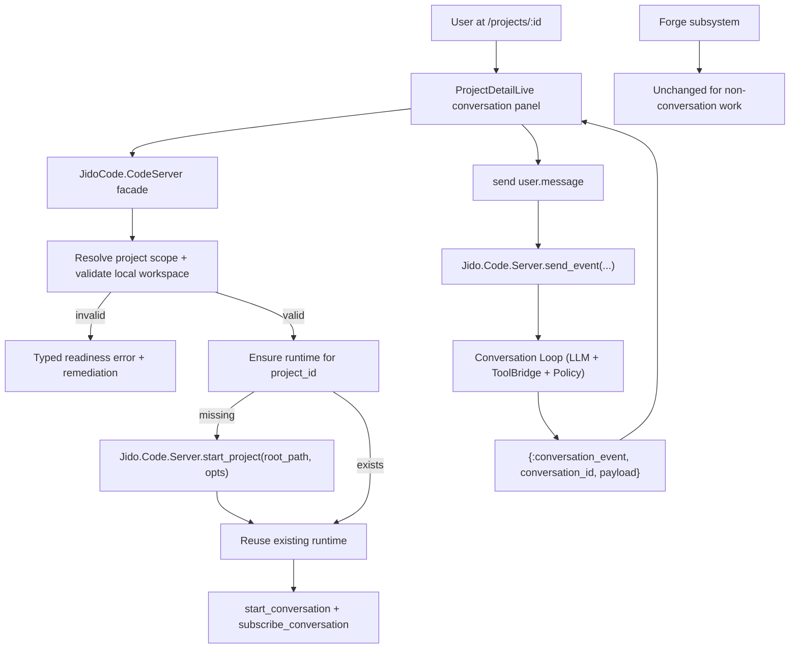

# JidoCode + `jido_code_server` Integration Plan (Detailed Phases)

## 1. Context and Goal

JidoCode currently has:
- a Forge runtime used for isolated execution sessions
- project/workflow UI and orchestration flows under Phoenix LiveView + Ash
- `jido_code_server` as a dependency, but not yet integrated into app runtime paths

Integration goal:
- Use `jido_code_server` as the project-scoped conversation runtime.
- Keep Forge available for non-conversation work.

This plan intentionally scopes the first implementation to an internal integration path and one user-facing entrypoint (`/projects/:id`), with no external protocol endpoints.

## 2. Locked Product/Architecture Decisions

- Conversation runtime ownership:
  - `jido_code_server` handles project + conversation isolation.
  - Forge is not used for conversations.
- Runtime lifecycle:
  - Lazy startup (start project runtime only when first needed).
- First UI surface:
  - Conversation panel in project detail (`/projects/:id`).
- Workspace policy:
  - Local workspace required for conversation runtime.
  - Block sprite/missing-path projects with typed remediation.
- Durability:
  - In-memory conversation state only for this phase.
- Protocol surface:
  - Internal adapter only (no MCP/A2A endpoint exposure in JidoCode app).
- LLM adapter policy:
  - Dev/Prod: `:jido_ai`
  - Test: `:deterministic`

## 3. Current vs Target Runtime Boundary

### Current
- Forge is globally supervised in `JidoCode.Application`.
- Project data exists in Ash resources, but no `jido_code_server` runtime orchestration path exists in app code.

### Target
- Conversation flow in project detail calls a JidoCode-owned facade.
- Facade resolves project workspace scope, ensures `jido_code_server` project runtime, starts/controls conversation, and relays events to LiveView.
- Forge remains unchanged and independent.

## 4. Target Flow

## 5. Phase Plan

## Phase 0: Prep and Documentation Baseline

### Scope
- Create planning artifact and establish terminology/ownership.

### Changes
- Add this plan under `notes/planning/integration/`.
- Add a short README reference (optional but recommended) to this integration plan.

### Exit Criteria
- Plan file committed and discoverable.

## Phase 1: Introduce JidoCode Conversation Integration Facade

### Scope
- Create internal adapter layer so LiveViews and workflows do not call dependency modules directly.

### New Modules
- `lib/jido_code/code_server.ex`
- `lib/jido_code/code_server/project_scope.ex`
- `lib/jido_code/code_server/error.ex`

### Responsibilities
- `ProjectScope`:
  - Load project by `project_id` from `JidoCode.Projects.Project`.
  - Extract and validate workspace settings from `project.settings["workspace"]`.
  - Return `%{project_id: ..., root_path: ..., project: ...}` or typed error.
- `CodeServer`:
  - `ensure_project_runtime/1`
  - `start_conversation/2`
  - `send_user_message/4`
  - `subscribe/3`
  - `unsubscribe/3`
  - `stop_conversation/2`
  - Optional diagnostics helper wrappers.
- `Error`:
  - Normalize all errors to a typed map contract.

### Typed Error Contract
- Shape:
  - `%{error_type: String.t(), detail: String.t(), remediation: String.t(), project_id: String.t() | nil, conversation_id: String.t() | nil}`

### Initial Error Types
- `code_server_project_not_found`
- `code_server_workspace_unavailable`
- `code_server_workspace_environment_unsupported`
- `code_server_runtime_start_failed`
- `code_server_conversation_start_failed`
- `code_server_message_send_failed`
- `code_server_subscription_failed`
- `code_server_unexpected_error`

### Exit Criteria
- All planned conversation consumers can use the facade without direct dependency calls.

## Phase 2: Runtime Startup + Config Mapping

### Scope
- Add runtime config and lazy startup behavior.

### Config Additions
- `:jido_code, :code_server` defaults:
  - `data_dir: ".jido"`
  - `conversation_orchestration: true`
  - optional pass-throughs: `llm_model`, `llm_system_prompt`, timeout/concurrency overrides
- Adapter policy:
  - `config/dev.exs`: `config :jido_code_server, :llm_adapter, :jido_ai`
  - `config/test.exs`: `config :jido_code_server, :llm_adapter, :deterministic`
  - `config/runtime.exs` (prod path): `:jido_ai` by default

### Runtime Ensure Logic
1. Resolve scope with `ProjectScope`.
2. Check `Jido.Code.Server.Engine.whereis_project(project_id)`.
3. If not found:
  - Call `Jido.Code.Server.start_project(root_path, opts)` with `project_id`.
4. Return a normalized runtime handle map.

### Exit Criteria
- First conversation call starts runtime lazily.
- Subsequent calls reuse existing runtime.

## Phase 3: Project Detail LiveView Conversation Panel

### Scope
- Add first user-facing conversation UI to `ProjectDetailLive`.

### Target File
- `lib/jido_code_web/live/project_detail_live.ex`

### New Assigns
- `conversation_ready?`
- `conversation_id`
- `conversation_messages`
- `conversation_input`
- `conversation_status`
- `conversation_error`

### New UI Controls
- Start conversation
- Send message
- Stop conversation

### Event Handlers
- `handle_event("start_conversation", ...)`
- `handle_event("send_conversation_message", ...)`
- `handle_event("stop_conversation", ...)`

### Stream Handling
- `handle_info({:conversation_event, conversation_id, payload}, socket)`
- Event mapping:
  - `user.message`: append user bubble
  - `assistant.delta`: append/update in-flight assistant bubble
  - `assistant.message`: finalize assistant bubble
  - `tool.failed`, `llm.failed`: system warning row
- Ignore non-matching conversation IDs.

### Lifecycle Safety
- On terminate/unmount:
  - best-effort unsubscribe
  - optional best-effort stop conversation

### Exit Criteria
- `/projects/:id` supports end-to-end project conversation with typed error handling.

## Phase 4: Workspace Gating and Readiness Integration

### Scope
- Integrate conversation availability with existing project readiness semantics.

### Policy
- Conversation runtime allowed only when:
  - workspace environment resolves to local
  - workspace clone status is ready
  - workspace initialized
  - baseline synced
  - absolute existing workspace path

### UI Behavior
- Show launch-disabled style guidance when conversation is blocked.
- Reuse existing typed remediation pattern used elsewhere in `ProjectDetailLive`.

### Exit Criteria
- Users cannot start conversation on unsupported project scope.
- All blocked paths produce actionable remediation.

## Phase 5: Test Coverage

### New Tests
- `test/jido_code/code_server/project_scope_test.exs`
- `test/jido_code/code_server_test.exs`

### Updated Tests
- `test/jido_code_web/live/project_detail_live_test.exs`

### Required Scenarios
- Valid local workspace path passes scope checks.
- Sprite/missing/invalid workspace path is blocked.
- Runtime lazy start + reuse behavior.
- Conversation starts, message sends, assistant output appears.
- Conversation stop resets active state.
- Typed errors surface in UI with expected selectors.
- Existing workflow kickoff behavior in project detail remains unchanged.
- Existing Forge test suite remains unaffected.

### Exit Criteria
- All new tests pass.
- No regressions in existing project detail/forge flows.

## Phase 6: Observability and Rollout Controls

### Scope
- Ensure operational transparency for first rollout.

### Observability
- Structured logs from facade on:
  - runtime ensure start/success/failure
  - conversation start/stop
  - message send fail
  - subscription fail
- Include `project_id`, optional `conversation_id`, `error_type`.
- No sensitive payload logging.

### Rollout
1. Enable only in `/projects/:id`.
2. Monitor logs and error rates.
3. Expand to additional surfaces only after stabilization.

### Exit Criteria
- Operators can diagnose failures from logs.
- No user-visible instability on first surface.

## 6. Interface Changes (Decision-Complete)

### New Internal API (Facade)
- `JidoCode.CodeServer.ensure_project_runtime(project_id)`
- `JidoCode.CodeServer.start_conversation(project_id, opts \\ [])`
- `JidoCode.CodeServer.send_user_message(project_id, conversation_id, content, opts \\ [])`
- `JidoCode.CodeServer.subscribe(project_id, conversation_id, pid \\ self())`
- `JidoCode.CodeServer.unsubscribe(project_id, conversation_id, pid \\ self())`
- `JidoCode.CodeServer.stop_conversation(project_id, conversation_id)`

### No External API Additions in This Plan
- No router endpoint changes for MCP/A2A.
- No JSON API additions for conversation endpoints.

## 7. Non-Goals (This Iteration)

- Persisting conversation transcripts/events in DB.
- Runtime restoration/resume across node restarts.
- Public MCP/A2A endpoint exposure from JidoCode app.
- Replacing Forge execution paths.
- Extending upstream dependency behavior (e.g., command/workflow execution bridge internals).

## 8. Risk Register and Mitigations

- Risk: workspace metadata drift vs actual filesystem path.
  - Mitigation: strict `ProjectScope` validation at runtime ensure time.
- Risk: UI message duplication from delta + final assistant events.
  - Mitigation: deterministic reducer rules and selector-based tests.
- Risk: runtime churn from repeated start attempts.
  - Mitigation: `whereis_project` guard and idempotent ensure path.
- Risk: hard-to-debug failures.
  - Mitigation: typed errors + structured logs + diagnostics hooks.

## 9. Implementation Checklist

- [ ] Add facade modules under `lib/jido_code/code_server/`.
- [ ] Add/adjust config for adapter policy and runtime defaults.
- [ ] Integrate conversation panel into `ProjectDetailLive`.
- [ ] Add typed error rendering for conversation states.
- [ ] Add/extend unit and LiveView tests.
- [ ] Run `mix test` and `mix precommit`.
- [ ] Update README reference to this integration path.

## 10. Final Acceptance Criteria

1. Conversations on `/projects/:id` run through `jido_code_server`.
2. Runtime starts lazily and is reused per project.
3. Only local-ready workspaces are accepted.
4. Typed errors with remediation are shown for blocked/failure states.
5. Forge remains available and unchanged for non-conversation work.
6. New and existing tests pass.

