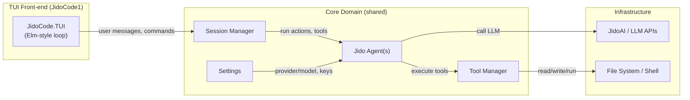
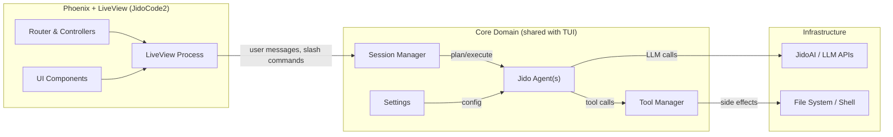

Here’s a structured way to think about porting JidoCode1’s architecture to JidoCode2 with Phoenix + LiveView.

---

## 1. High‑level conclusion

You can keep **almost all of JidoCode1’s backend logic (agents, tools, sessions, security, settings)** and replace only the front‑end:

- **TUI** → **Phoenix + LiveView Web UI**
- **Single Elixir node TUI process** → **Per‑user LiveView process + per‑conversation agent process**
- **Terminal events** → **LiveView UI events + WebSocket/HTTP calls**

The key is to separate:

- **Core domain** (agents, tools, sessions, config) into a library that both TUI and LiveView can use.
- **Front‑ends** into thin layers that call into the core.

---

## 2. How JidoCode1 is structured (TUI + core)

From the README and repo layout, JidoCode1 is:

- A **TUI app** built on an Elm‑style architecture in Elixir (`JidoCode.TUI.run/0`)【turn5fetch0】【turn6fetch0】.
- Powered by **Jido** (agent framework) and **JidoAI** (LLM integration)【turn5fetch0】.
- Features:
  - Interactive TUI with conversation, slash commands, status indicators【turn6fetch0】.
  - LLM integration via JidoAI, with provider/model config in env and `runtime.exs`【turn6fetch0】.
  - Tool system: file, search, and shell tools with a security model (path validation, command allowlist, Lua sandbox via Luerl)【turn6fetch0】.
  - Two‑level settings (global + project) and environment overrides【turn6fetch0】.

Conceptually, it looks like this:



The **core domain** (Session, Agent, Tools, Settings) is what you want to **re‑use in JidoCode2**.

---

## 3. Target architecture for JidoCode2 (Phoenix + LiveView)

At a high level, JidoCode2 should:

- Reuse the **same core domain** as JidoCode1.
- Add a **Phoenix + LiveView web layer** instead of the TUI.
- Introduce **per‑user/session LiveView processes** that talk to agents and stream responses back to the browser.

### 3.1 Conceptual architecture



Key differences from JidoCode1:

- **UI is in the browser**, not the terminal.
- **Multiple concurrent users**, so you need:
  - Per‑user **LiveView process** (one per connected user/tab).
  - Per‑conversation **agent process** or at least per‑conversation state.
- **Streaming** is done over WebSocket via LiveView, not printed to a terminal.

---

## 4. Mapping JidoCode1 concepts to LiveView

### 4.1 Entry point

**JidoCode1 (TUI):**
- Starts in IEx via `JidoCode.TUI.run/0`【turn6fetch0】.
- Likely runs a TUI loop using something like Ratatouille or a custom Elm‑style loop.

**JidoCode2 (LiveView):**
- Starts via `mix phx.server`.
- Entry points are:
  - `JidoCodeWeb.Endpoint` (Phoenix endpoint).
  - `JidoCodeWeb.Router` → `live "/conversation", ConversationLive`.

**Migration step:**
- Keep the **same core modules** (Session, Agent, Tools).
- Change the **entry module** to start the Phoenix endpoint instead of the TUI loop.

### 4.2 UI model & state

**JidoCode1:**
- TUI model is an Elixir struct holding:
  - Conversation history.
  - Current status (`idle`, `processing`, `error`, `unconfigured`)【turn6fetch0】.
  - Current reasoning panel state.
  - Settings / provider / model.

**JidoCode2:**
- LiveView `assigns` hold the same data:
  - `:messages` – list of conversation turns (user/assistant/tool).
  - `:status` – `:idle | :processing | :error | :unconfigured`.
  - `:settings` – current provider/model, etc.
  - `:reasoning_panel_visible` – boolean.

You can reuse the **same message structs** and status enums as JidoCode1.

### 4.3 Events → Commands

**JidoCode1:**
- TUI events: keypresses, text input, `/` commands【turn6fetch0】.
- Translated into actions like:
  - Change provider/model.
  - Submit message.
  - Run tool directly.

**JidoCode2:**
- LiveView events: `phx-submit`, `phx-click`, `phx-hook` for JS interactions.
- Events map to similar handlers:
  - `"submit"` → send message to agent.
  - `"set_provider"` → change provider.
  - `"run_tool"` → run a tool directly (if you keep that UX).

---

## 5. Detailed component design

### 5.1 Core domain library (shared)

To make this clean, I’d strongly recommend:

1. Extract the **non‑UI parts** of JidoCode1 into a separate library package:
   - `JidoCode.Core` or similar.
   - Modules:
     - `JidoCode.Core.Session` – conversation state, history.
     - `JidoCode.Core.Agent` – Jido agent definition and execution.
     - `JidoCode.Core.Tools` – tool definitions and sandbox.
     - `JidoCode.Core.Settings` – global/project settings loading.

2. Both JidoCode1 and JidoCode2 depend on this library:
   - JidoCode1: `mix.exs` deps → `:jido_code_core`.
   - JidoCode2: same dependency.

This way:

- LiveView can be a thin wrapper around the core.
- You can later add more front‑ends (desktop, VS Code extension, etc.) without rewriting the core.

### 5.2 Agent & tool integration

**JidoCode1:**
- Uses Jido agents and actions; tools are implemented as Jido tools/actions.
- Tools are sandboxed (path validation, command allowlist, Lua sandbox)【turn6fetch0】.

**JidoCode2:**
- Reuse the **same agent definitions** and **same tool modules**.
- Wire them into your Phoenix supervision tree:

```elixir
# lib/jido_code/application.ex
children = [
  # ... existing Phoenix children (endpoint, etc.)
  JidoCode.Core.AgentSupervisor,
  # or a dynamic supervisor for per‑conversation agents
]
```

Use Jido’s `child_spec/1` to put agents under a supervisor. (From Jido docs, agents are started with `Jido.Agent.start_link/1` and provide a `child_spec/1` for this purpose.)

### 5.3 Sessions & concurrency model

**JidoCode1:**
- Single user, single conversation.
- TUI process holds the session state.

**JidoCode2:**
- Multi‑user; each LiveView process holds a **session identifier** (e.g. conversation ID).
- Backend choices:

  **Option A – Agent per conversation (recommended):**
  - Each conversation has its own Jido agent process.
  - LiveView process talks to its agent via `GenServer.call/2` or `Jido.Agent.call/2`.

  **Option B – Agent per user:**
  - Each user has one agent process; multiple conversations are handled internally.
  - More complex; I’d start with Option A.

LiveView `mount/3` would:

- Look up or create a conversation ID.
- Start or connect to an agent process for that conversation.
- Load initial state (messages, settings) from DB or in‑memory store.

### 5.4 Streaming responses

**JidoCode1:**
- Streams LLM output into the TUI, with progress indicators【turn6fetch0】.

**JidoCode2:**
- Use LiveView’s **streaming** support:

```elixir
# In your LiveView
def handle_info({:llm_chunk, chunk}, socket) do
  {:noreply, update(socket, :messages, fn messages ->
    # append or update last assistant message with chunk
  end)}
end
```

JidoAI (or your LLM client) can send chunks to the LiveView process:

```elixir
# In your agent / LLM integration
def handle_info({:llm_chunk, chunk}, state) do
  send(state.live_view_pid, {:llm_chunk, chunk})
  {:noreply, state}
end
```

You can also use **Phoenix PubSub** to decouple:

- Agent publishes chunks to a topic per conversation.
- LiveView subscribes to that topic and updates UI.

### 5.5 Settings & configuration

**JidoCode1:**
- Environment variables (`JIDO_CODE_PROVIDER`, `JIDO_CODE_MODEL`, etc.).
- `config/runtime.exs` for LLM config【turn6fetch0】.
- Two‑level settings files (`~/.jido_code/settings.json`, `./jido_code/settings.json`)【turn6fetch0】.

**JidoCode2:**
- Reuse the same logic:
  - Environment variables for secrets (API keys).
  - `config/runtime.exs` for Phoenix + LLM config.
  - Settings files for user/project preferences.
- In LiveView:
  - Read/write settings via `JidoCode.Core.Settings`.
  - Expose a settings UI (similar to `/config` in TUI) as a LiveView modal or separate live route.

### 5.6 Security model

**JidoCode1:**
- Path validation, command allowlist, Lua sandbox【turn6fetch0】.

**JidoCode2:**
- Reuse **exactly the same tool manager and security logic**.
- Add Phoenix‑specific concerns:
  - Ensure file paths are still constrained to a project root.
  - Use Phoenix’s `action_fallback` and error handlers to return good errors to the UI.

---

## 6. Implementation roadmap for JidoCode2

Here’s a practical sequence to evolve JidoCode2 while staying close to JidoCode1.

### Phase 0 – Prepare core

1. Extract core domain:
   - Create `JidoCode.Core` library with:
     - `Session`, `Agent`, `Tools`, `Settings`.
2. Refactor JidoCode1 to use `JidoCode.Core`:
   - Ensure tests still pass.
3. Add `:jido_code_core` as a dependency in JidoCode2’s `mix.exs`.

### Phase 1 – Minimal LiveView shell

1. Generate Phoenix LiveView:
   - `mix phx.new jido_code_web --no-ecto` (or similar) if not already created.
   - Add `live "/conversation", ConversationLive` route.
2. Implement `ConversationLive`:
   - `mount/3`: load settings, create/restore conversation ID.
   - `render/1`: basic chat UI (input + message list).
   - `handle_event("submit", ..., socket)`: send message to core agent.

### Phase 2 – Wire agents & tools

1. Start agent supervisor in your app supervision tree.
2. In LiveView:
   - Start/lookup agent process for the conversation.
   - Forward user messages to agent.
3. Reuse JidoCode1’s tool definitions:
   - Ensure they’re registered with the agent.
   - Keep security rules.

### Phase 3 – Streaming & UI polish

1. Implement streaming LLM responses via LiveView.
2. Implement:
   - Slash commands as UI controls or separate live routes.
   - Status indicators (`idle`, `processing`, `error`) in the UI.
   - Reasoning panel toggle (similar to TUI’s reasoning panel).

### Phase 4 – Persistence & multi‑user

1. Add Ecto/Postgres for:
   - Persisting conversations.
   - Storing user preferences.
2. Implement user authentication if needed.
3. Ensure each user only accesses their own conversations.

---

## 7. Concrete code sketches

To make this more tangible, here are minimal examples of how the LiveView side might look.

### 7.1 Core domain API (shared)

```elixir
defmodule JidoCode.Core.Session do
  defstruct [:id, :messages, :status, :settings]

  def new(attrs \\ %{}) do
    %__MODULE__{
      id: Map.get(attrs, :id, generate_id()),
      messages: [],
      status: :idle,
      settings: JidoCode.Core.Settings.load()
    }
  end

  def add_message(session, role, content) do
    update_in(session.messages, &(&1 ++ [{role, content}]))
  end
end

defmodule JidoCode.Core.Agent do
  use Jido.Agent,
    # actions, skills, tools configuration here
    actions: [JidoCode.Actions.Chat, JidoCode.Actions.RunTool]

  # Custom execution logic, tool calls, etc.
end
```

### 7.2 LiveView module

```elixir
defmodule JidoCodeWeb.ConversationLive do
  use JidoCodeWeb, :live_view

  alias JidoCode.Core.Session
  alias JidoCode.Core.Agent

  @impl true
  def mount(_params, _session, socket) do
    # Load or create session
    session = Session.new()
    # Maybe start or lookup agent process for this conversation
    {:ok, assign(socket, session: session, input: "")}
  end

  @impl true
  def render(assigns) do
    ~H"""
    <div>
      <h1>JidoCode LiveView</h1>
      <.conversation_messages messages={@session.messages} />
      <.status_indicator status={@session.status} />
      <.input_form input={@input} />
    </div>
    """
  end

  @impl true
  def handle_event("submit", %{"input" => input}, socket) do
    session = socket.assigns.session
    # Add user message
    session = Session.add_message(session, :user, input)

    # Call agent (synchronous for now, later streaming)
    {:ok, response} = Agent.run(session.id, input)

    session = Session.add_message(session, :assistant, response)
    {:noreply, assign(socket, session: session, input: "")}
  end

  @impl true
  def handle_info({:llm_chunk, chunk}, socket) do
    # For streaming: update last assistant message or append
    session = update_in(socket.assigns.session.messages, fn messages ->
      # update last assistant message with new chunk
    end)

    {:noreply, assign(socket, session: session)}
  end
end
```

### 7.3 Router

```elixir
defmodule JidoCodeWeb.Router do
  use JidoCodeWeb, :router

  pipeline :browser do
    plug :accepts, ["html"]
    plug :fetch_session
    plug :protect_from_forgery
  end

  scope "/", JidoCodeWeb do
    pipe_through :browser

    live "/conversation", ConversationLive
  end
end
```

---

## 8. Summary of key changes

| Aspect | JidoCode1 (TUI) | JidoCode2 (LiveView) |
|-------|-----------------|----------------------|
| Entry point | `iex -S mix` then `JidoCode.TUI.run()`【turn6fetch0】 | `mix phx.server` + Phoenix endpoint |
| UI model | TUI loop (Elm architecture) | LiveView process + `assigns` |
| Concurrency | Single user, single process | Multi‑user, per‑user LiveView + per‑conversation agent |
| Streaming | Print to terminal | LiveView streaming over WebSocket |
| Settings | Env vars + `runtime.exs` + JSON files【turn6fetch0】 | Same, plus optional DB-backed user prefs |
| Tools & security | Same tool manager and security model【turn6fetch0】 | Reuse identical tool layer |

If you want, next step I can help design a concrete module breakdown for `JidoCode.Core` and a matching supervision tree for JidoCode2, or sketch a minimal “hello world” LiveView that wires into an existing Jido agent from JidoCode1.
